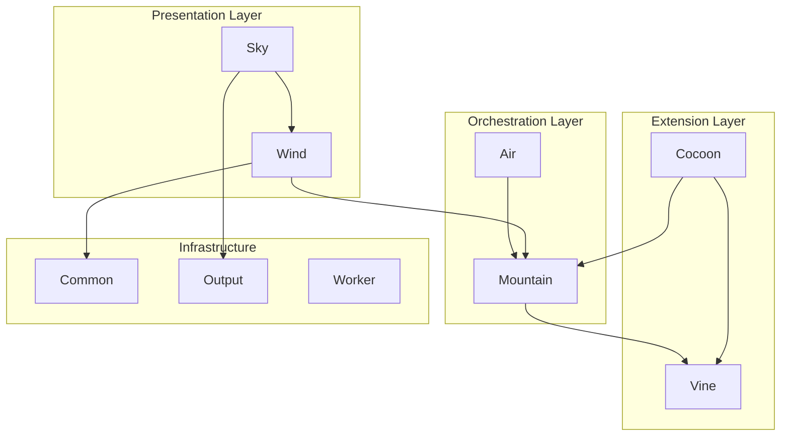
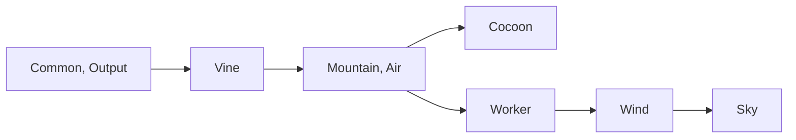

# Elements - Architecture Components

## Table of Contents

- [Overview](#overview)
- [Element Structure](#element-structure)
- [Core Elements](#core-elements)
- [Supporting Elements](#supporting-elements)
- [Inter-Element Dependencies](#inter-element-dependencies)
- [Installation Order](#installation-order)
- [Package Structure](#package-structure)
- [Build System](#build-system)

---

## Overview

**Elements** are the modular components that make up Code Editor Land. Each
Element is a self-contained package with specific responsibilities, following a
clear separation of concerns. Elements are organized into three layers:
Presentation, Orchestration, and Extension.

### Element Philosophy

- **Modularity**: Each Element has a single, well-defined responsibility
- **Independence**: Elements can be developed, tested, and built independently
- **Cooperation**: Elements work together through well-defined interfaces
- **Scalability**: New Elements can be added without disrupting existing ones

### Technology Distribution

| Layer              | Elements                                                 | Primary Technology           |
| ------------------ | -------------------------------------------------------- | ---------------------------- |
| **Presentation**   | Sky, Wind                                                | TypeScript, Astro, Effect-TS |
| **Orchestration**  | Mountain, Air                                            | Rust, Tauri                  |
| **Extension**      | Cocoon, Vine                                             | Node.js, ProtoBuf            |
| **Infrastructure** | Common, Output, Worker, Grove, Echo, Mist, Rest, SideCar | Various                      |

---

## Element Structure

### Root Structure

```
Element/
├── Air/              # Background daemon
├── Cocoon/           # Extension host
├── Common/           # Shared utilities
├── Echo/             # Echo service
├── Grove/            # Grove service
├── Mist/             # Mist service
├── Mountain/         # Native backend
├── Output/           # VSCode workbench assets
├── Rest/             # Rest service
├── SideCar/          # SideCar service
├── Sky/              # UI components
├── Vine/             # gRPC protocol
├── Wind/             # Service layer
└── Worker/           # Web worker
```

### File Organization

Each Element follows this structure:

```
Element/<Name>/
├── Source/           # Source code
│   ├── ...           # Implementation
│   └── Target/       # Build output (if applicable)
├── Target/           # Build artifacts / Distribution
├── tests/            # Tests (if applicable)
├── README.md         # Element documentation
├── package.json      # Package configuration
└── tsconfig.json     # TypeScript config (if applicable)
```

---

## Core Elements

### Sky - UI Component Layer

**Element**: [`Sky/`](https://github.com/CodeEditorLand/Sky/tree/main/)

**Purpose**: Declarative UI components built with Astro framework

**Technology**:

- Framework: Astro
- Language: TypeScript
- Styling: CSS

**Key Responsibilities**:

- Render UI components
- Manage page routing
- Provide workbench variants (A1-A4)
- Display application state
- Handle user interactions

**Structure**:

```
Element/Sky/
├── Source/
│   ├── Function/         # Utility functions
│   ├── pages/            # Page routes
│   ├── Workbench/        # Workbench variants
│   │   ├── Default.astro         # Deprecated entry
│   │   ├── BrowserProxy.astro    # A1: Browser + proxy
│   │   ├── Mountain.astro        # A2: Browser + providers
│   │   ├── Electron.astro        # A3: Electron + polyfills
│   │   └── Native/               # A4: Native workbench
│   └── env.d.ts
├── Target/               # Built static files
├── astro.config.ts
└── package.json
```

**Dependencies**:

- `@codeeditorland/wind` - Service layer
- `@codeeditorland/output` - VSCode workbench assets
- `@codeeditorland/common` - Shared utilities

**See**: [`Documentation/Architecture/components/Sky.md`](https://github.com/CodeEditorLand/Land/tree/main/Documentation/Architecture/components/Sky.md)

---

### Wind - Service Layer

**Element**: [`Wind/`](https://github.com/CodeEditorLand/Wind/tree/main/)

**Purpose**: UI service layer implementing VS Code workbench services using
Effect-TS

**Technology**:

- Framework: Effect-TS
- Language: TypeScript
- Build: ESBuild
- IPC: Tauri

**Key Responsibilities**:

- Implement VS Code workbench services
- Manage UI state via services
- Provide Electron API polyfills
- Handle VS Code protocol shims
- Bootstrap and initialize services

**Structure**:

```
Element/Wind/
├── Source/
│   ├── Bootstrap/           # Bootstrap system
│   ├── Configuration/       # Service configuration
│   ├── Effect/              # Effect-TS services
│   │   ├── ActivityBar/     # Activity bar service
│   │   ├── StatusBar/       # Status bar service
│   │   ├── Sidebar/         # Sidebar service
│   │   ├── Panel/           # Panel service
│   │   ├── IPC/             # IPC service
│   │   ├── Bootstrap/       # Bootstrap service
│   │   └── ...
│   ├── FileSystem/          # File system abstraction
│   ├── Function/            # Utility functions
│   │   └── Install/         # Installation function
│   ├── Polyfills/           # VSCode/Electron polyfills
│   │   ├── ProcessPolyfill.ts
│   │   ├── FileProtocolShim.ts
│   │   ├── FileSystemPolyfill.ts
│   │   ├── IPCRendererShim.ts
│   │   ├── ChildProcessPolyfill.ts
│   │   ├── NativeModulePolyfill.ts
│   │   └── SharedProcessProxy.ts
│   ├── Types/               # Shared types
│   ├── Workbench/           # Workbench implementations
│   ├── Preload.ts           # Tauri preload script
│   ├── ESBuild.js
│   └── ESBuild.ts
├── Target/                  # Build output
└── package.json
```

**Dependencies**:

- `@codeeditorland/mountain` - Backend integration
- `effect` - Effect-TS framework
- Tauri APIs

**See**: [`Documentation/Architecture/components/Wind.md`](https://github.com/CodeEditorLand/Land/tree/main/Documentation/Architecture/components/Wind.md)

---

### Mountain - Native Backend

**Element**: [`Mountain/`](https://github.com/CodeEditorLand/Mountain/tree/main/)

**Purpose**: Native backend implementing core platform functionality

**Technology**:

- Framework: Tauri
- Language: Rust
- IPC: Tauri, gRPC

**Key Responsibilities**:

- Tauri application framework
- gRPC server for inter-process communication
- File system operations
- Terminal management
- Command registry and execution
- Process orchestration

**Structure**:

```
Element/Mountain/
├── src/
│   ├── main.rs              # Application entry point
│   ├── vine/                # gRPC server
│   │   └── server/          # Server implementation
│   ├── ProcessManagement/   # Process orchestration
│   ├── RunTime/             # Application runtime
│   ├── Track/               # Event handling
│   ├── FileSystem/          # File operations
│   ├── Command/             # Command execution
│   └── ...
├── Cargo.toml
└── ...
```

**Dependencies**:

- Tauri
- gRPC (Vine protocol)
- System libraries

**See**:
[`Documentation/Architecture/components/Mountain.md`](https://github.com/CodeEditorLand/Land/tree/main/Documentation/Architecture/components/Mountain.md)

---

### Air - Background Daemon

**Element**: [`Air/`](https://github.com/CodeEditorLand/Air/tree/main/)

**Purpose**: Background daemon for long-running operations

**Technology**:

- Language: Rust
- Communication: gRPC

**Key Responsibilities**:

- Background task execution
- Process isolation
- Resource management
- Reports to Mountain via gRPC

**Structure**:

```
Element/Air/
├── src/
│   └── ...
├── Cargo.toml
└── ...
```

**Dependencies**:

- gRPC client for Mountain communication

**See**: [`Documentation/Architecture/components/Air.md`](https://github.com/CodeEditorLand/Land/tree/main/Documentation/Architecture/components/Air.md)

---

### Cocoon - Extension Host

**Element**: [`Cocoon/`](https://github.com/CodeEditorLand/Cocoon/tree/main/)

**Purpose**: Extension host that runs extensions and provides VS Code API
compatibility

**Technology**:

- Framework: Node.js
- Language: TypeScript, Effect-TS
- Communication: gRPC

**Key Responsibilities**:

- Extension activation and lifecycle
- VS Code API shimming
- gRPC client for Mountain
- Module interception and security

**Structure**:

```
Element/Cocoon/
├── Source/
│   ├── Bootstrap/
│   │   └── Implementation/
│   │       └── CocoonMain.ts
│   ├── Services/
│   │   └── GRPCServerService.ts
│   └── ...
└── package.json
```

**Dependencies**:

- `@codeeditorland/vine` - gRPC protocol
- Effect-TS
- VSCode extension API (shimmed)

**See**:
[`Documentation/Architecture/components/Cocoon.md`](https://github.com/CodeEditorLand/Land/tree/main/Documentation/Architecture/components/Cocoon.md)

---

### Vine - gRPC Protocol

**Element**: [`Vine/`](https://github.com/CodeEditorLand/Vine/tree/main/)

**Purpose**: gRPC protocol definitions for communication

**Technology**:

- Language: Protocol Buffers (ProtoBuf)
- Schema: gRPC

**Key Responsibilities**:

- Define message structures
- Specify service methods
- Serialization contracts

**Structure**:

```
Element/Vine/
├── proto/                  # Protocol definitions
│   └── ...
├── Generated/              # Generated code
│   └── ...
└── ...
```

**Dependencies**:

- ProtoBuf compiler

**See**: [`Documentation/Architecture/components/Vine.md`](https://github.com/CodeEditorLand/Land/tree/main/Documentation/Architecture/components/Vine.md)

---

## Supporting Elements

### Common - Shared Utilities

**Element**: [`Common/`](https://github.com/CodeEditorLand/Common/tree/main/)

**Purpose**: Shared utilities and common types

**Technology**: TypeScript

**Key Responsibilities**:

- Shared type definitions
- Utility functions
- Common constants
- Helper modules

**Dependencies**: None (base Element)

---

### Output - VSCode Workbench Assets

**Element**: [`Output/`](https://github.com/CodeEditorLand/Output/tree/main/)

**Purpose**: VSCode workbench assets and bundled resources

**Technology**: JavaScript (bundled)

**Key Responsibilities**:

- Browser workbench
- Electron workbench
- Monaco Editor
- VSCode modules

**Structure**:

```
Element/Output/
├── vs/
│   └── code/
│       ├── browser/        # Browser workbench
│       │   └── workbench/
│       ├── electron-browser/ # Electron workbench
│       │   └── workbench/
│       ├── base/           # Base modules
│       ├── editor/         # Monaco editor
│       └── ...
└── package.json
```

**Dependencies**: None (bundled assets)

---

### Worker - Web Worker

**Element**: [`Worker/`](https://github.com/CodeEditorLand/Worker/tree/main/)

**Purpose**: Web worker for offloading computations

**Technology**: TypeScript, Web Workers

**Key Responsibilities**:

- Background computations
- Parallel processing
- Worker message handling

---

### Echo - Echo Service

**Element**: [`Echo/`](https://github.com/CodeEditorLand/Echo/tree/main/)

**Purpose**: Echo service for testing and diagnostics

**Technology**: TypeScript

---

### Grove - Grove Service

**Element**: [`Grove/`](https://github.com/CodeEditorLand/Land/tree/main/Element/Grove)

**Purpose**: Grove service implementation

**Technology**: TypeScript

---

### Mist - Mist Service

**Element**: [`Mist/`](https://github.com/CodeEditorLand/Land/tree/main/Element/Mist)

**Purpose**: Mist service implementation

**Technology**: TypeScript

---

### Rest - Rest Service

**Element**: [`Rest/`](https://github.com/CodeEditorLand/Rest/tree/main/)

**Purpose**: REST API service

**Technology**: TypeScript

---

### SideCar - SideCar Service

**Element**: [`SideCar/`](https://github.com/CodeEditorLand/SideCar/tree/main/)

**Purpose**: SideCar service implementation

**Technology**: TypeScript

---

## Inter-Element Dependencies

### Dependency Graph



### Communication Matrix

| From     | To       | Protocol     | Direction |
| -------- | -------- | ------------ | --------- |
| Sky      | Wind     | Direct calls | ←→        |
| Wind     | Mountain | Tauri IPC    | ←→        |
| Cocoon   | Mountain | gRPC (Vine)  | ←→        |
| Air      | Mountain | gRPC (Vine)  | →         |
| Mountain | Air      | gRPC (Vine)  | →         |

### Package Dependencies

| Element      | Direct Dependencies                                                        |
| ------------ | -------------------------------------------------------------------------- |
| **Sky**      | `@codeeditorland/wind`, `@codeeditorland/output`, `@codeeditorland/common` |
| **Wind**     | `@codeeditorland/mountain`, `@codeeditorland/common`                       |
| **Mountain** | `@codeeditorland/vine` (gRPC)                                              |
| **Cocoon**   | `@codeeditorland/vine`, `@codeeditorland/common`                           |
| **Air**      | `@codeeditorland/vine` (gRPC client)                                       |
| **Vine**     | None (proto definitions)                                                   |
| **Common**   | None (base package)                                                        |
| **Output**   | None (bundled assets)                                                      |

---

## Installation Order

### Development Installation

Elements should be installed in this order for development:

1. **Base Infrastructure**

    ```
    cd Element/Common && pnpm install
    cd ../Output && pnpm install
    ```

2. **Orchestration Layer**

    ```
    cd Element/Vine && pnpm install
    cd ../Air && pnpm install
    cd ../Mountain && pnpm install
    ```

3. **Extension Layer**

    ```
    cd Element/Cocoon && pnpm install
    ```

4. **Presentation Layer**
    ```
    cd Element/Worker && pnpm install
    cd ../Wind && pnpm install
    cd ../Sky && pnpm install
    ```

### Build Order

Elements must be built in dependency order:



### Workspace Installation

In the root workspace, use:

```bash
# Install all workspace packages
pnpm install

# Bootstrap all Elements
pnpm run bootstrap

# Build all Elements
pnpm run build
```

---

## Package Structure

### Package Naming Convention

All packages follow the `@codeeditorland/<element>` naming convention:

```
@codeeditorland/common
@codeeditorland/wind
@codeeditorland/sky
@codeeditorland/mountain
@codeeditorland/air
@codeeditorland/cocoon
@codeeditorland/vine
@codeeditorland/output
@codeeditorland/worker
```

### Version Management

All Elements share a common version managed from the root:

- Root `package.json` contains workspace version
- Element packages inherit version via configuration
- Semantic versioning follows `<major>.<minor>.<patch>`

### Publishing

Elements are published to npm during release:

```bash
# From root
pnpm run publish:all

# Individual Element
cd Element/<name>
pnpm publish
```

---

## Build System

### Element-Specific Builds

Each Element has its own build process:

| Element  | Build Tool         | Output                             |
| -------- | ------------------ | ---------------------------------- |
| Sky      | Astro              | `Target/` (static assets)          |
| Wind     | ESBuild            | `Target/` (JavaScript)             |
| Mountain | Cargo              | `target/debug/`, `target/release/` |
| Air      | Cargo              | `target/debug/`, `target/release/` |
| Cocoon   | TypeScript/esbuild | `Target/`                          |
| Vine     | protoc             | Generated code                     |
| Common   | TypeScript/esbuild | `Target/`                          |
| Output   | (Pre-bundled)      | `vs/`                              |
| Worker   | esbuild            | `Target/`                          |

### Build Scripts

Located in `Element/<Name>/package.json`:

```json
{
	"scripts": {
		"build": "...",
		"watch": "...",
		"test": "...",
		"prepublishOnly": "..."
	}
}
```

### Root Build Commands

```bash
# Build all Elements
pnpm run build

# Watch all Elements
pnpm run dev

# Test all Elements
pnpm run test
```

---

## See Also

- [Architecture Overview](https://github.com/CodeEditorLand/Land/tree/main/Documentation/Architecture/README.md) - Main architecture documentation
- [Component Documentation](https://github.com/CodeEditorLand/Land/tree/main/Documentation/Architecture/components) - Individual component details
- [Communication Flows](https://github.com/CodeEditorLand/Land/tree/main/Documentation/Architecture/integration/CommunicationFlows.md) - Inter-component
  communication
- [Build Process](https://github.com/CodeEditorLand/Land/tree/main/Documentation/Architecture/components/BuildProcess.md) - Detailed build information
- [Wind Distribution Fix](https://github.com/CodeEditorLand/Land/tree/main/Documentation/Architecture/integration/WindDistributionFix.md) - Module
  distribution
