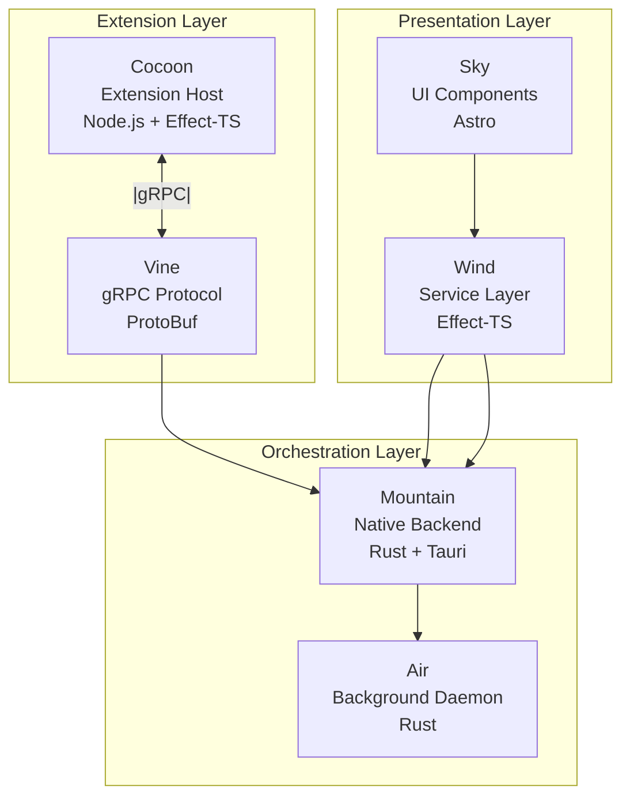
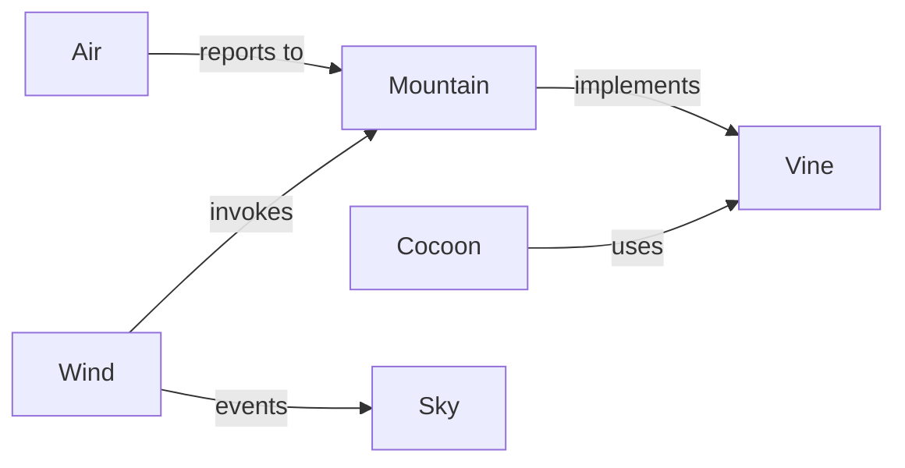

# Code Editor Land Architecture Documentation

Welcome to the comprehensive architecture documentation for **Code Editor
Land**. This documentation provides an in-depth overview of all components,
their interactions, and integration patterns.

## Table of Contents

- [Architecture Overview](#architecture-overview)
- [Component Architecture](#component-architecture)
- [Communication Patterns](#communication-patterns)
- [Integration Flows](#integration-flows)
- [Recommendations](#recommendations)

---

## Architecture Overview

Code Editor Land is a modular, multi-process code editor built with a focus on
extensibility, performance, and developer experience. It consists of six main
components organized into three layers:

### System Layers

### Component Summary

| Component    | Technology            | Primary Responsibility                                                          |
| ------------ | --------------------- | ------------------------------------------------------------------------------- |
| **Cocoon**   | Node.js, Effect-TS    | Extension host that runs extensions and provides VS Code API compatibility      |
| **Mountain** | Rust, Tauri           | Native backend managing OS interactions, gRPC server, and process orchestration |
| **Vine**     | ProtoBuf              | gRPC protocol definitions and message serialization contract                    |
| **Air**      | Rust                  | Background daemon for long-running operations and task management               |
| **Wind**     | TypeScript, Effect-TS | UI service layer implementing VS Code workbench services                        |
| **Sky**      | Astro                 | Declarative UI component layer rendering the user interface                     |

---

## Component Architecture

Detailed documentation for each component:

### [Cocoon](./components/cocoon.md)

Extension Host that manages the extension lifecycle, provides sandboxed
execution, and implements VS Code API compatibility.

**Key Features:**

- Extension activation and lifecycle management
- VS Code API shimming and implementation
- gRPC client for Mountain communication
- Module interception and security

**Key Files:**

- [`Element/Cocoon/Source/Bootstrap/Implementation/CocoonMain.ts`](../../Element/Cocoon/Source/Bootstrap/Implementation/CocoonMain.ts) -
  Main entry point
- [`Element/Cocoon/Source/Services/GRPCServerService.ts`](../../Element/Cocoon/Source/Services/GRPCServerService.ts) -
  gRPC server implementation

### [Mountain](./components/mountain.md)

Native backend implementing core platform functionality and serving as the
central orchestrator.

**Key Features:**

- Tauri application framework
- gRPC server for inter-process communication
- File system operations
- Terminal management
- Command registry and execution

**Key Files:**

- [`Element/Mountain/src/main.rs`](../../Element/Mountain/src/main.rs) -
  Application entry point
- [`Element/Mountain/src/vine/server/`](../../Element/Mountain/src/vine/server/) -
  gRPC server

### [Vine](./components/vine.md)

gRPC protocol definitions that define the communication contract between
components.

**Key Features:**

- ProtoBuf message definitions
- Service method signatures
- Serialization/deserialization contracts

**Key Files:**

- [`Element/Vine/`](../../Element/Vine/) - Protocol definitions directory

### [Air](./components/air.md)

Background daemon for handling long-running operations and task management.

**Key Features:**

- Background task execution
- Process isolation
- Resource management

**Integration Points:**

- Communicates with Mountain via gRPC
- Manages worker processes

### [Wind](./components/wind.md)

UI service layer implementing VS Code workbench services using Effect-TS.

**Key Features:**

- Editor service
- File system service
- Command service
- Language features service
- Tauri IPC integration

**Key Files:**

- [`Element/Wind/Source/`](../../Element/Wind/Source/) - Service implementations

### [Sky](./components/sky.md)

Declarative UI component layer built with Astro framework.

**Key Features:**

- Astro-based component architecture
- Multiple workbench variants
- Page routing
- Direct browser integration

**Key Files:**

- [`Element/Sky/Source/pages/`](../../Element/Sky/Source/pages/) - Page
  definitions
- [`Element/Sky/Source/Workbench/`](../../Element/Sky/Source/Workbench/) -
  Workbench variants

---

## Communication Patterns

Detailed documentation of how components communicate:

### [Communication Flows](./integration/communication-flows.md)

Complete request/response flows, event patterns, and data flow diagrams.

**Key Patterns:**

- Request-Response via gRPC (Cocoon ↔ Mountain)
- Event-driven via Tauri Events (Mountain → Wind/Sky)
- Command-Invoke via Tauri IPC (Wind → Mountain)

### [Spine Contract](./integration/spine-contract.md)

The central gRPC contract specification (Vine) that defines service interfaces
between components.

**Key Features:**

- Method catalog
- Error handling conventions
- Message format specifications

---

## Component Relationships

### Dependency Graph

### Communication Matrix

| From     | To       | Protocol     | Direction      |
| -------- | -------- | ------------ | -------------- |
| Cocoon   | Mountain | gRPC         | Bidirectional  |
| Wind     | Mountain | Tauri IPC    | Bidirectional  |
| Mountain | Sky      | Tauri Events | Unidirectional |
| Air      | Mountain | gRPC         | Unidirectional |

---

## Workflows

Key application workflows documented in
[../GitHub/Workflow/](../GitHub/Workflow/):

1. [Application Startup & Handshake](../GitHub/Workflow/Application%20Startup%20%26%20Handshake.md) -
   Complete startup sequence
2. [Opening a File from the UI](../GitHub/Workflow/Opening%20a%20File%20from%20the%20UI.md) -
   File system operations
3. [Invoking a Language Feature (Hover Provider)](<../GitHub/Workflow/Invoking%20a%20Language%20Feature%20(Hover%20Provider).md>) -
   Language features
4. [Saving a File with Save Participants](../GitHub/Workflow/Saving%20a%20File%20with%20Save%20Participants.md) -
   Extension hooks
5. [Executing a Command from the Command Palette](../GitHub/Workflow/Executing%20a%20Command%20from%20the%20Command%20Palette.md) -
   Command system
6. [Creating and Interacting with a Webview Panel](../GitHub/Workflow/Creating%20and%20Interacting%20with%20a%20Webview%20Panel.md) -
   Webview management
7. [Creating and Interacting with an Integrated Terminal](../GitHub/Workflow/Creating%20and%20Interacting%20with%20an%20Integrated%20Terminal.md) -
   Terminal I/O
8. [Source Control Management (SCM)](<../GitHub/Workflow/Source%20Control%20Management%20(SCM).md>) -
   Git integration
9. [Running Extension Tests](../GitHub/Workflow/Running%20Extension%20Tests.md) -
   Test isolation
10. [User Data Synchronization](../GitHub/Workflow/User%20Data%20Synchronization.md) -
    Settings sync

---

## Technology Stack

### Core Technologies

| Layer          | Technology            |
| -------------- | --------------------- |
| UI Framework   | Astro                 |
| UI Services    | Effect-TS, TypeScript |
| Backend        | Rust, Tauri           |
| Extension Host | Node.js, Effect-TS    |
| IPC Protocol   | gRPC, ProtoBuf        |
| Build System   | ESBuild, Cargo        |

### Dependencies

- **Effect-TS**: Functional programming framework for TypeScript
- **Tauri**: Cross-platform desktop application framework
- **ProtoBuf**: Protocol Buffers for serialization
- **Astro**: Web framework for building fast content sites

---

## Architecture Principles

1. **Separation of Concerns**: Each component has a single, well-defined
   responsibility
2. **Process Isolation**: Extensions run in a separate process (Cocoon) for
   security and stability
3. **Type Safety**: Strong typing throughout with TypeScript and Rust
4. **Functional Programming**: Effect-TS for predictable, composable code
5. **Platform Native**: Rust backend for direct OS access and performance

---

## Recommendations

See [Refactoring Priorities](./recommendations/refactoring-priorities.md) for
identified issues and improvement opportunities.

---

## Quick Navigation

- **Component Documentation**: [components/](./components/)
- **Integration Documentation**: [integration/](./integration/)
- **Recommendations**: [recommendations/](./recommendations/)
- **Workflow Examples**: [../GitHub/Workflow/](../GitHub/Workflow/)

---

## Contributing

When contributing to the architecture, please:

1. Update the relevant component documentation
2. Document new workflows in the Workflow directory
3. Update this README for major architectural changes
4. Include cross-references between related components

---

## License

This documentation is part of the Code Editor Land project. See the main
[`LICENSE`](../../LICENSE) file for details.
