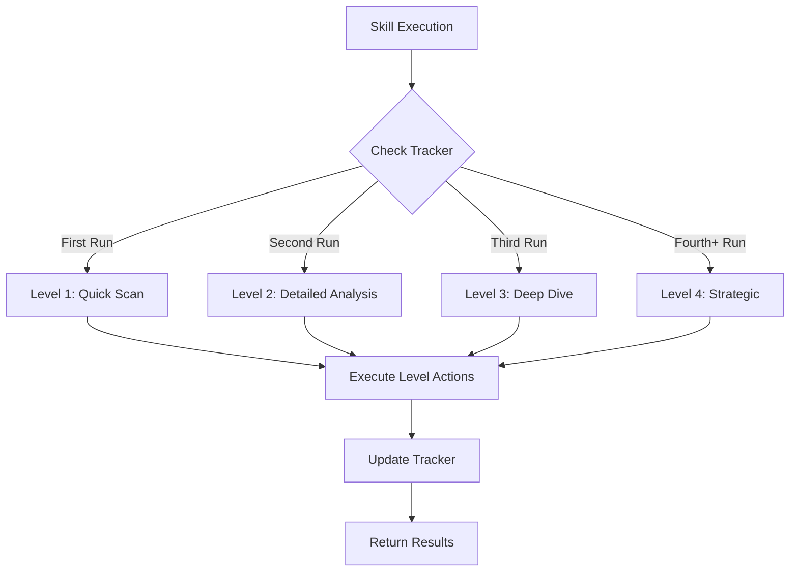

# Depth-Aware Skill System

**Version:** 1.0  
**Last Updated:** 2026-03-06  
**Status:** Production Ready

---

## Overview

The **Depth-Aware Skill System** is an intelligent framework that adapts skill behavior based on how many times a skill has been executed. This system enables progressive disclosure of complexity, allowing users to start with quick, focused actions and gradually access more comprehensive functionality as they work with the system.

### Key Benefits

- **Progressive Complexity**: Start simple, grow sophisticated
- **Context Awareness**: Skills adapt to usage patterns
- **Performance Optimization**: Quick initial scans, thorough deep dives
- **Learning Curve Management**: Gentle onboarding with powerful advanced features

---

## System Architecture

### Depth Levels

The system supports four depth levels, each with progressively broader scope and more comprehensive actions:

| Level | Name | Scope | Max Files | Typical Use Case |
|-------|------|-------|-----------|------------------|
| **Level 1** | Quick Scan | Single file or root README | 1 | First encounter, initial check |
| **Level 2** | Detailed Analysis | Project root documentation | 20 | Secondary use, focused analysis |
| **Level 3** | Deep Dive | Recursive documentation tree | Unlimited | Comprehensive review |
| **Level 4** | Strategic | System-wide pattern analysis | All | Architecture review, guideline creation |

### Core Components

1. **`.roo/skill-depth-tracker.json`**: Tracks execution history and current depth per skill
2. **`.roo/skills/*/SKILL.md`**: Individual skill definitions with depth metadata
3. **`.roo/scripts/`**: Management scripts for depth operations
4. **Skill Loader**: Runtime system that evaluates depth and applies appropriate behavior

---

## How Depth Works

### Depth Progression Flow



### Depth Configuration in Skills

Each skill file contains depth configuration in its YAML frontmatter:

```yaml
---
name: skill-name
description: Brief description
category: category-name
tags: [tag1, tag2]

# Depth Configuration
depth: level-1
depth-description: First encounter behavior
secondary-depth: level-2
tertiary-depth: level-3

# Depth-Specific Behaviors
depth-behaviors:
  level-1:
    scope: root_readme_only
    max-files: 1
    actions: [scan-title, verify-emoji]
    description: Quick title emoji check
  level-2:
    scope: all_root_md
    max-files: 20
    actions: [scan-sections, fix-lists]
    description: Analyze all section headers
  level-3:
    scope: recursive_docs
    max-files: unlimited
    actions: [full-scan, cross-reference]
    description: Comprehensive documentation analysis
  level-4:
    scope: system-wide
    actions: [pattern-analysis, guideline-creation]
    description: Create usage guidelines and standards
---
```

---

## Usage Guide

### When to Use Each Depth Level

#### Level 1 - Quick Scan
**Use when:**
- You're new to the system
- You need a fast check on a single file
- You're doing initial reconnaissance
- Time is limited

**Example:** Checking if the main README has the correct element emoji

#### Level 2 - Detailed Analysis
**Use when:**
- You've run the skill before
- You need to check multiple files in the root
- You want more thorough verification
- You're preparing for a review

**Example:** Verifying emoji consistency across all root-level Markdown files

#### Level 3 - Deep Dive
**Use when:**
- You need comprehensive analysis
- You're doing a full documentation audit
- You want to find edge cases
- You're preparing release documentation

**Example:** Full recursive scan of all documentation for consistency issues

#### Level 4 - Strategic
**Use when:**
- You're creating new guidelines
- You need system-wide pattern analysis
- You're doing architecture reviews
- You want to optimize skill behavior

**Example:** Analyzing all README files to create emoji usage standards

---

## Management Scripts

The system includes four management scripts in `.roo/scripts/`:

### 1. List Depth Categories

```bash
./.roo/scripts/list-depth-categories.sh
```

Shows all skills organized by their current depth level.

**Example Output:**
```
LEVEL 1 (Quick Scan):
  - preformat-readme-emoji

LEVEL 2 (Detailed Analysis):
  (no skills configured)

LEVEL 3 (Deep Dive):
  (no skills configured)

LEVEL 4 (Strategic):
  (no skills configured)

UNCATEGORIZED:
  - 48 skills awaiting depth configuration
```

### 2. View History

```bash
./.roo/scripts/view-history.sh <skill-name>
```

Shows execution history for a specific skill, including depth progression.

**Example:**
```bash
./.roo/scripts/view-history.sh preformat-readme-emoji
```

### 3. Reset Depth

```bash
./.roo/scripts/reset-depth.sh <skill-name>
```

Resets a skill's depth counter to level-1. Useful for testing or when skill behavior has changed.

**Example:**
```bash
./.roo/scripts/reset-depth.sh preformat-readme-emoji
```

### 4. Force Depth

```bash
./.roo/scripts/force-depth.sh <skill-name> <depth-level>
```

Forces a skill to run at a specific depth level regardless of history.

**Example:**
```bash
./.roo/scripts/force-depth.sh preformat-readme-emoji level-3
```

---

## Global Settings

The `skill-depth-tracker.json` file contains global settings:

```json
{
  "version": "1.0",
  "skills": {
    "skill-name": {
      "currentDepth": "level-2",
      "executionCount": 2,
      "lastExecuted": "2026-03-06T12:00:00Z",
      "history": [
        { "depth": "level-1", "timestamp": "2026-03-05T10:00:00Z" },
        { "depth": "level-2", "timestamp": "2026-03-06T12:00:00Z" }
      ]
    }
  },
  "globalSettings": {
    "autoIncrementDepth": true,
    "maxDepth": "level-4",
    "resetAfterDays": 90,
    "defaultDepthProgression": ["level-1", "level-2", "level-3", "level-4"]
  }
}
```

### Global Setting Explanations

| Setting | Default | Description |
|---------|---------|-------------|
| `autoIncrementDepth` | `true` | Automatically increase depth on each execution |
| `maxDepth` | `"level-4"` | Maximum depth level allowed |
| `resetAfterDays` | `90` | Days before inactive skills reset to level-1 |
| `defaultDepthProgression` | `[level-1, ..., level-4]` | Default progression order |

---

## Best Practices

### For Skill Authors

1. **Define All Four Levels**: Every skill should have behavior defined for all depth levels
2. **Start Simple**: Level 1 should be fast and focused (under 5 seconds)
3. **Progressive Disclosure**: Each level should add meaningful value, not just more of the same
4. **Clear Descriptions**: Document what each level does in `depth-description` fields
5. **Set Appropriate Limits**: Use `max-files` to prevent level 1 from scanning too much

### For Users

1. **Let Auto-Increment Work**: Allow the system to naturally progress through depths
2. **Use Reset for Changes**: When a skill updates, reset its depth to relearn
3. **Force Depth for Testing**: Use `force-depth.sh` to test specific level behavior
4. **Monitor History**: Check execution history to understand skill behavior patterns

---

## Troubleshooting

### Skill Not Progressing Through Depths

**Problem:** Skill stays at level-1 even after multiple executions

**Solution:**
1. Check `.roo/skill-depth-tracker.json` for the skill entry
2. Verify `autoIncrementDepth` is set to `true`
3. Run `reset-depth.sh` and try again

### Want to Skip to Advanced Depth

**Problem:** Need level-4 behavior immediately

**Solution:**
```bash
./.roo/scripts/force-depth.sh <skill-name> level-4
```

### Depth Tracker Corrupted

**Problem:** JSON is invalid or contains errors

**Solution:**
1. Backup the current tracker: `cp .roo/skill-depth-tracker.json .roo/skill-depth-tracker.json.bak`
2. Reset to default: Run any skill - it will recreate the tracker
3. Restore individual entries from backup if needed

---

## Future Enhancements

Planned improvements to the depth-aware skill system:

1. **Dynamic Depth Adjustment**: Skills that automatically adjust depth based on task complexity
2. **Parallel Depth Execution**: Run multiple depth levels simultaneously for faster results
3. **Depth-Based Caching**: Cache results per depth level for even faster subsequent runs
4. **Custom Depth Progressions**: Allow skills to define non-linear progression paths
5. **Depth Analytics**: Dashboard showing depth usage patterns across all skills

---

## Related Documentation

- [DEPTH-MANAGEMENT.md](../.roo/skills/DEPTH-MANAGEMENT.md) - Detailed technical guide
- [DEPTH-AWARE-TEMPLATE.md](../.roo/skills/DEPTH-AWARE-TEMPLATE.md) - Template for creating depth-aware skills
- [Project Structure](../README.md#project-structure) - Overall project organization

---

*Document generated as part of Phase 5: Documentation Update*  
*For questions or issues, contact: Source/Open@Editor.Land*
