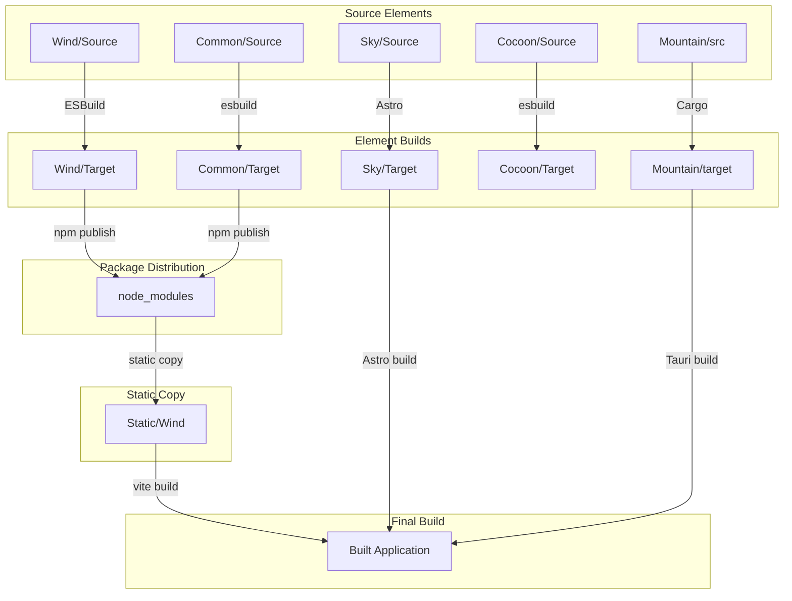
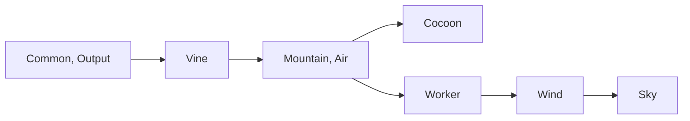

# Build Process

## Table of Contents

- [Overview](#overview)
- [Build Architecture](#build-architecture)
- [Element Build Processes](#element-build-processes)
- [Static Asset Copy](#static-asset-copy)
- [Module Resolution](#module-resolution)
- [Build Order](#build-order)
- [Development vs Production](#development-vs-production)
- [Troubleshooting](#troubleshooting)

---

## Overview

The Code Editor Land build process orchestrates the compilation and bundling of
multiple Elements (components) into a cohesive application. Each Element has its
own build process, and the overall build ensures that all dependencies are
satisfied.

### Build Goals

1. **TypeScript Compilation**: Compile TypeScript to JavaScript
2. **Bundling**: Bundle modules for production
3. **Static Asset Copy**: Copy Element outputs to dependent packages
4. **Module Resolution**: Ensure proper imports across Elements
5. **Optimization**: Minimize and optimize for production

### Build Technologies

| Element      | Build Tool  | Purpose                         |
| ------------ | ----------- | ------------------------------- |
| **Sky**      | Astro       | Static site generation          |
| **Wind**     | ESBuild     | TypeScript bundling             |
| **Mountain** | Cargo       | Rust compilation                |
| **Air**      | Cargo       | Rust compilation                |
| **Cocoon**   | esbuild/tsc | TypeScript compilation          |
| **Common**   | esbuild/tsc | TypeScript compilation          |
| **Worker**   | esbuild     | Web worker bundling             |
| **Vine**     | protoc      | Protocol buffer code generation |

---

## Build Architecture

### Build Flow Diagram



### Workspace Structure

```
Land/                             # Workspace root
├── Element/                       # All Elements
│   ├── Sky/                       # UI components
│   │   ├── Source/
│   │   ├── Target/                # Built static files
│   │   ├── node_modules/          # Dependencies
│   │   ├── astro.config.ts
│   │   └── package.json
│   │
│   ├── Wind/                      # Service layer
│   │   ├── Source/
│   │   ├── Target/                # Built JS files
│   │   ├── node_modules/
│   │   ├── ESBuild.ts
│   │   └── package.json
│   │
│   ├── Common/                    # Shared utilities
│   │   ├── Source/
│   │   ├── Target/
│   │   └── package.json
│   │
│   └── ...                        # Other Elements
│
├── package.json                   # Workspace config
├── pnpm-workspace.yaml            # Workspace definition
└── ...
```

---

## Element Build Processes

### Sky Build Process

**Element**:
[`Element/Sky/`](https://github.com/CodeEditorLand/Sky/tree/Current)

**Build Tool**: Astro

**Build Command**:

```bash
cd Element/Sky
pnpm run build
```

**Build Steps**:

1. **TypeScript Compilation**: Astro compiles `.astro` and `.ts` files
2. **Static File Generation**: Generates static HTML/CSS/JS
3. **Asset Processing**: Processes and optimizes assets
4. **Static Copy**: Copies Wind and other dependencies to static directory

**Configuration**:
[`Source/astro.config.ts`](https://github.com/CodeEditorLand/Sky/tree/Current/astro.config.ts)

**Static Copy Configuration**:
[`Source/Function/Debug.ts`](https://github.com/CodeEditorLand/Sky/tree/Current/Source/Function/Debug.ts)

```typescript
// Static targets for Wind
{
  src: "node_modules/@codeeditorland/wind/Target/*.js",
  dest: "Static/Wind/",
},
{
  src: "node_modules/@codeeditorland/wind/Target/Bootstrap/*",
  dest: "Static/Wind/Bootstrap/",
},
{
  src: "node_modules/@codeeditorland/wind/Target/Effect/*",
  dest: "Static/Wind/Effect/",
},
{
  src: "node_modules/@codeeditorland/wind/Target/Function/*",
  dest: "Static/Wind/Function/",
}
```

**Output**: `Element/Sky/Target/`

- Static HTML pages
- Bundled JavaScript
- CSS files
- Static assets (`Static/` directory)

---

### Wind Build Process

**Element**:
[`Element/Wind/`](https://github.com/CodeEditorLand/Wind/tree/Current)

**Build Tool**: ESBuild

**Build Command**:

```bash
cd Element/Wind
pnpm run build
# or
node Source/ESBuild.js
```

**Build Steps**:

1. **TypeScript Compilation**: ESBuild compiles TypeScript to JavaScript
2. **Bundling**: Creates bundled output
3. **Module Resolution**: Resolves all imports
4. **Source Maps**: Generates source maps for debugging

**Configuration**:
[`Source/ESBuild.ts`](https://github.com/CodeEditorLand/Wind/tree/Current/Source/ESBuild.ts)

```typescript
// Example ESBuild configuration
const Build = {
  entryPoints GlobPatterns: Array<[Input Pattern, Output File]>
  = [
    ["Source/**/index.ts", "Target/"],
    ["Source/Preload.ts", "Target/Preload.js"],
    // ... other entry points
  ],

  options: {
    bundle: true,
    sourcemap: true,
    minify: true,
    platform: 'browser',
    target: 'es2020',
    external: ['effect', '@effect/schema', 'monaco-editor'],
  }
}
```

**Output**: `Element/Wind/Target/`

- `Preload.js` - Bundled preload script
- `Bootstrap/` - Bootstrap system
- `Effect/` - Effect-TS services
- `FileSystem/` - File system abstraction
- `Function/` - Utility functions
- `Types/` - Type definitions

---

### Mountain Build Process

**Element**:
[`Element/Mountain/`](https://github.com/CodeEditorLand/Mountain/tree/Current)

**Build Tool**: Cargo (Rust)

**Build Command**:

```bash
cd Element/Mountain
cargo build           # Debug build
cargo build --release # Release build
```

**Build Steps**:

1. **Dependency Resolution**: Cargo resolves Rust dependencies
2. **Compilation**: Compiles Rust source code
3. **Linking**: Links with dependencies
4. **Binary Generation**: Creates executable binary

**Configuration**: `Cargo.toml`

**Output**: `Element/Mountain/target/`

- `debug/` - Debug builds (unoptimized)
- `release/` - Release builds (optimized)

---

### Cocoon Build Process

**Element**:
[`Element/Cocoon/`](https://github.com/CodeEditorLand/Cocoon/tree/Current)

**Build Tool**: esbuild / TypeScript compiler

**Build Command**:

```bash
cd Element/Cocoon
pnpm run build
```

**Build Steps**:

1. **TypeScript Compilation**: Compile TypeScript to JavaScript
2. **Bundling**: Bundle with esbuild
3. **Source Maps**: Generate source maps

**Output**: `Element/Cocoon/Target/`

- JavaScript bundles
- Source maps

---

### Common Build Process

**Element**:
[`Element/Common/`](https://github.com/CodeEditorLand/Common/tree/Current)

**Build Tool**: esbuild / TypeScript compiler

**Build Command**:

```bash
cd Element/Common
pnpm run build
```

**Output**: `Element/Common/Target/`

- Shared utility modules

---

---

## Static Asset Copy

### Purpose

Static asset copy is required for production builds to make Element outputs
available in the final application bundle.

### VSCode Workbench Assets

The `@codeeditorland/output` package contains pre-built VSCode workbench assets:

```
Element/Output/
└── vs/
    └── code/
        ├── browser/
        │   └── workbench/
        │       └── workbench.js          # Browser workbench
        ├── electron-browser/
        │   └── workbench/
        │       └── workbench.js          # Electron workbench
        ├── base/
        ├── editor/
        │   └── editor.main.js           # Monaco Editor
        └── ...
```

### Wind Static Copy

Wind's build output is copied to Sky's static directory:

**Source**: `node_modules/@codeeditorland/wind/Target/`

**Destination**: `Element/Sky/Target/Static/Wind/`

**Files copied**:

```
Static/Wind/
├── Preload.js
├── Bootstrap/
│   └── index.js
├── Effect/
│   └── index.js
├── Function/
│   └── Install.js
└── Types/
```

**See**:
[`WindDistributionFix.md`](https://github.com/CodeEditorLand/Land/tree/main/Documentation/Architecture/integration/WindDistributionFix.md)
for detailed implementation notes.

### Other Static Copies

Similar patterns are used for other Elements:

| Source                           | Destination      | Purpose          |
| -------------------------------- | ---------------- | ---------------- |
| `@codeeditorland/output/vs/`     | `Static/vs/`     | VSCode modules   |
| `@codeeditorland/worker/Target/` | `Static/Worker/` | Web worker       |
| `@codeeditorland/common/Target/` | `Static/Common/` | Common utilities |

---

## Module Resolution

### Development Mode

In development, modules are resolved from `node_modules/` using package names:

```typescript
import { Install } from "@codeeditorland/wind"
import { runBootstrap } from "@codeeditorland/wind/Effect"
import * as vscode from "@codeeditorland/output/vscode"
```

Vite resolves these imports during development using the workspace symlinks.

### Production Mode

In production, modules resolve to static file URLs:

```typescript
import { Install } from "/Static/Wind/Function/Install.js"
import { runBootstrap } from "/Static/Wind/Effect/index.js"
import * as monaco from "/Static/Monaco/editor.main.js"
```

This is required because:

1. Browser ES modules need absolute URLs
2. No `node_modules/` in production bundle
3. All dependencies are bundled locally

### Resolution Aliases

Vite resolve aliases can be used to maintain package-style imports:

```typescript
// astro.config.ts
resolve: {
  alias: {
    "@codeeditorland/wind": "/Static/Wind",
    "@codeeditorland/wind/Effect": "/Static/Wind/Effect",
  },
}
```

This allows:

```typescript
import { Install } from "@codeeditorland/wind/Function/Install.js"
```

Instead of:

```typescript
import { Install } from "/Static/Wind/Function/Install.js"
```

### TypeScript Errors

During development, TypeScript may show errors for static file imports:

```
Cannot find module '/Static/Wind/Function/Install.js' or its corresponding type declarations.
```

These are **expected and harmless**. The static files don't exist during
development but will be available after build.

**Workaround**: Add declarations in `env.d.ts`:

```typescript
declare module "/Static/Wind/Function/Install.js" {
  export { Install } from "@codeeditorland/wind/Function/Install";
}

declare module "/Static/Wind/Effect/index.js" {
  export * from "@codeeditorland/wind/Effect";
}
```

---

## Build Order

### Dependency Analysis

Elements must be built in dependency order:



### Automated Build Order

The workspace `pnpm run build` command handles the correct order:

```bash
# Build all Elements in correct order
pnpm run build
```

### Manual Build Order

To build manually, follow this order:

1. **Base Infrastructure**

    ```bash
    cd Element/Common && pnpm run build
    ```

2. **Protocol Layer**

    ```bash
    # Vine generates code via protoc, no build step needed
    ```

3. **Orchestration Layer**

    ```bash
    cd Element/Air && cargo build
    cd ../Mountain && cargo build
    ```

4. **Extension Layer**

    ```bash
    cd Element/Cocoon && pnpm run build
    ```

5. **Supporting Infrastructure**

    ```bash
    cd Element/Worker && pnpm run build
    ```

6. **Presentation Layer**
    ```bash
    cd Element/Wind && pnpm run build
    cd Element/Sky && pnpm run build
    ```

---

## Development vs Production

### Development

**Features**:

- Hot Module Replacement (HMR)
- Package name imports work
- Source maps for debugging
- Fast incremental builds
- No static file copying

**Import pattern**:

```typescript
import { Install } from "@codeeditorland/wind"
```

**Build command**:

```bash
cd Element/Sky
pnpm run dev # Astro dev server with HMR
```

### Production

**Features**:

- Optimized bundles
- Static file URLs
- Minified output
- All dependencies bundled
- Static assets copied

**Import pattern**:

```typescript
import { Install } from "/Static/Wind/Function/Install.js"
```

**Build command**:

```bash
cd Element/Sky
pnpm run build # Production build
```

---

## Troubleshooting

### Common Issues

#### Issue: Module not found at runtime

**Error**:

```
TypeError: Module name, '@codeeditorland/wind' does not resolve to a valid URL.
```

**Cause**: Using package imports in production without static file setup.

**Solution**:

1. Ensure Wind is in `Link` array in
   [`Debug.ts`](https://github.com/CodeEditorLand/Sky/tree/Current/Source/Function/Debug.ts)
2. Ensure static copy targets are configured
3. Use static file URLs in production

**Reference**:
[`WindDistributionFix.md`](https://github.com/CodeEditorLand/Land/tree/main/Documentation/Architecture/integration/WindDistributionFix.md)

#### Issue: Static files not found after build

**Error**:

```
404 Not Found: /Static/Wind/Preload.js
```

**Cause**: Wind build output not copied to static directory.

**Solution**:

1. Ensure Wind is built: `cd Element/Wind && pnpm run build`
2. Ensure Wind is published/linked: `pnpm install` from workspace root
3. Check static copy configuration in
   [`Debug.ts`](https://github.com/CodeEditorLand/Sky/tree/Current/Source/Function/Debug.ts)

#### Issue: TypeScript errors for static imports

**Error**:

```
Cannot find module '/Static/Wind/Effect/index.js'
```

**Cause**: Static files don't exist during development.

**Solution**:

1. These errors are expected and harmless
2. Files will exist after production build
3. Or add type declarations in `env.d.ts` (see Module Resolution)

#### Issue: Build order problems

**Error**:

```
Error: Cannot find module '@codeeditorland/wind'
```

**Cause**: Dependency built after dependent package.

**Solution**:

1. Use `pnpm run build` from workspace root
2. Or manually build in correct order (see Build Order)

#### Issue: Vite resolution conflicts

**Error**:

```
[vite] Rollup failed to resolve import "@codeeditorland/wind"
```

**Cause**:

1. Package not in `Link` array
2. Package not installed
3. Symlink issues in workspace

**Solution**:

1. Add to `Link` array in
   [`Debug.ts`](https://github.com/CodeEditorLand/Sky/tree/Current/Source/Function/Debug.ts)
2. Run `pnpm install` from workspace root
3. Check `pnpm-workspace.yaml` configuration

### Debugging Build Issues

1. **Clean build artifacts**:

    ```bash
    rm -rf Element/*/Target
    rm -rf Element/*/dist
    rm -rf Element/*/node_modules/.vite
    ```

2. **Rebuild specific Element**:

    ```bash
    cd Element/<name>
    rm -rf Target
    pnpm run build
    ```

3. **Check static file existence**:

    ```bash
    ls -la Element/Sky/Target/Static/Wind/
    ```

4. **Debug Vite resolution**:

    ```bash
    cd Element/Sky
    pnpm run dev --debug
    ```

5. **Check workspace links**:
    ```bash
    pnpm list --depth=0
    ```

---

## Key Files Reference

| File                                                                                                                  | Purpose                        |
| --------------------------------------------------------------------------------------------------------------------- | ------------------------------ |
| [`Element/Sky/Source/astro.config.ts`](https://github.com/CodeEditorLand/Sky/tree/Current/astro.config.ts)            | Astro build configuration      |
| [`Element/Sky/Source/Function/Debug.ts`](https://github.com/CodeEditorLand/Sky/tree/Current/Source/Function/Debug.ts) | Static file copy configuration |
| [`Element/Wind/Source/ESBuild.ts`](https://github.com/CodeEditorLand/Wind/tree/Current/Source/ESBuild.ts)             | Wind ESBuild configuration     |
| [`Element/Wind/Source/ESBuild.js`](https://github.com/CodeEditorLand/Wind/tree/Current/Source/ESBuild.js)             | Wind build script              |
| [`pnpm-workspace.yaml`](https://github.com/CodeEditorLand/Land/tree/Current/pnpm-workspace.yaml)                      | Workspace configuration        |
| [`package.json`](https://github.com/CodeEditorLand/Land/tree/Current/package.json)                                    | Root package configuration     |

---

## See Also

- [Wind Distribution Fix](https://github.com/CodeEditorLand/Land/tree/main/Documentation/Architecture/integration/WindDistributionFix.md) -
  Module distribution implementation
- [Elements Documentation](https://github.com/CodeEditorLand/Land/tree/Current/Documentation/Architecture/Elements.md) -
  Element structure overview
- [Sky Component](https://github.com/CodeEditorLand/Land/tree/Current/Documentation/Architecture/components/Sky.md) -
  Sky build process details
- [Wind Component](https://github.com/CodeEditorLand/Land/tree/Current/Documentation/Architecture/components/Wind.md) -
  Wind build process details
