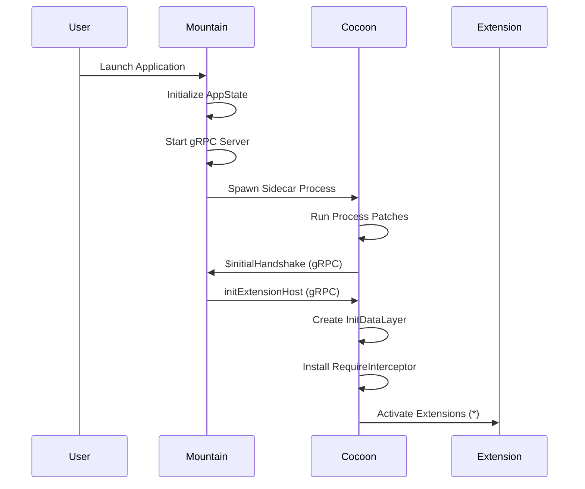
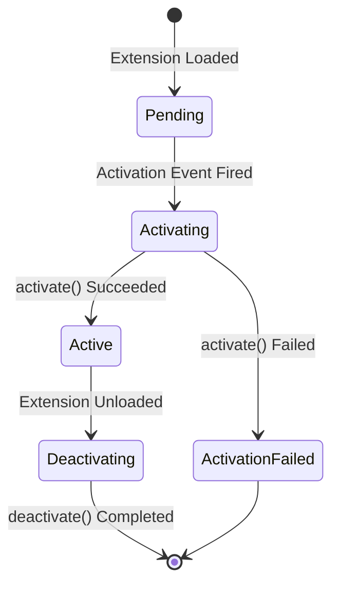
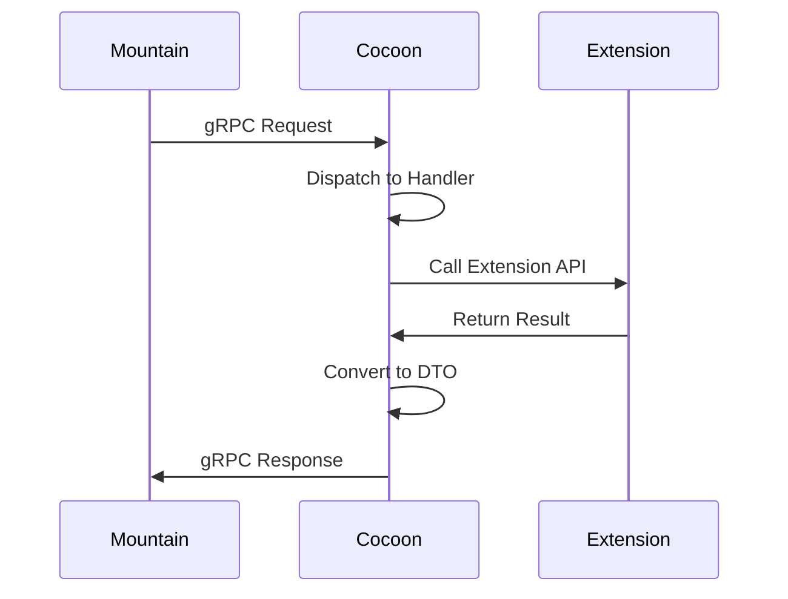

# Cocoon - Extension Host

## Table of Contents

- [Overview](#overview)
- [Architecture](#architecture)
- [Core Services](#core-services)
- [Extension Lifecycle](#extension-lifecycle)
- [VS Code API Implementation](#vs-code-api-implementation)
- [Communication](#communication)
- [Security](#security)
- [Integration Points](#integration-points)
- [Known Issues and TODOs](#known-issues-and-todos)

---

## Overview

**Cocoon** is the Extension Host for Code Editor Land. It runs as a separate
Node.js sidecar process managed by Mountain, providing a sandboxed environment
for running VS Code extensions with full API compatibility.

### Key Responsibilities

- Extension activation and lifecycle management
- VS Code API shimming and implementation
- gRPC client for communication with Mountain
- Module interception for extension isolation
- Process patching for console output redirection

### Technology Stack

- **Runtime**: Node.js
- **Framework**: Effect-TS
- **Communication**: gRPC (ProtoBuf)
- **Build**: ESBuild

---

## Architecture

### Process Lifecycle



### Directory Structure

```
Element/Cocoon/
├── Source/
│   ├── Bootstrap/
│   │   ├── Implementation/
│   │   │   └── CocoonMain.ts          # Main entry point
│   │   └── Documentation/
│   │       └── ExtensionHostAnalysis.md
│   ├── Services/
│   │   ├── ExtensionHostService.ts     # Extension lifecycle
│   │   ├── GRPCServerService.ts        # gRPC server
│   │   ├── IPCService.ts               # IPC handling
│   │   ├── Command.ts                  # Command service
│   │   ├── Configuration.ts            # Configuration service
│   │   ├── FileSystemService.ts        # File system implementation
│   │   ├── Workspace.ts                # Workspace management
│   │   └── Window.ts                   # Window management
│   ├── IPC/
│   │   ├── Channel.ts                  # IPC channel definitions
│   │   ├── Handler.ts                  # IPC request handlers
│   │   ├── Message.ts                  # Message types
│   │   └── TypeConverter.ts            # Type conversions
│   ├── PatchProcess/
│   │   ├── Loader.ts                   # Patch loader
│   │   ├── Patcher.ts                  # Process patcher
│   │   ├── Security.ts                 # Security utilities
│   │   └── Validator.ts                # Validation utilities
│   └── Platform/
│       ├── Environment.ts              # Environment utilities
│       ├── OS.ts                       # OS detection
│       ├── Process.ts                  # Process utilities
│       └── Service.ts                  # Service utilities
├── Scripts/
│   └── cocoon/
│       └── bootstrap-fork.js           # Bootstrap script
├── Generated/
│   ├── grpc.d.ts                       # gRPC type definitions
│   └── Vine_pb.d.ts                    # ProtoBuf definitions
└── package.json
```

---

## Core Services

### ExtensionHostService

**Location**:
[`Element/Cocoon/Source/Services/ExtensionHostService.ts`](https://github.com/CodeEditorLand/Cocoon/tree/Current/Source/Services/ExtensionHostService.ts)

Manages the complete lifecycle of extensions:

- **Extension Activation**: Loads and activates extensions based on activation
  events
- **Extension Deactivation**: Cleanly shuts down extensions
- **Extension State**: Tracks active extensions and their state
- **Extension Context**: Provides context to extensions

### GRPCServerService

**Location**:
[`Element/Cocoon/Source/Services/GRPCServerService.ts`](https://github.com/CodeEditorLand/Cocoon/tree/Current/Source/Services/GRPCServerService.ts)

Handles gRPC communication with Mountain:

- **Client Management**: Manages gRPC client connection to Mountain
- **Request Handling**: Processes incoming gRPC requests from Mountain
- **Response Generation**: Generates appropriate responses for Mountain requests
- **Event Notification**: Sends notifications to Mountain for state changes

### IPCService

**Location**:
[`Element/Cocoon/Source/Services/IPCService.ts`](https://github.com/CodeEditorLand/Cocoon/tree/Current/Source/Services/IPCService.ts)

Provides IPC abstraction and routing:

- **Channel Management**: Manages IPC channels
- **Message Routing**: Routes messages to appropriate handlers
- **Type Conversion**: Converts between Coco and Mountain data types

### Command Service

**Location**:
[`Element/Cocoon/Source/Services/Command.ts`](https://github.com/CodeEditorLand/Cocoon/tree/Current/Source/Services/Command.ts)

Implements command execution:

- **Command Registration**: Registers extension-contributed commands
- **Command Execution**: Executes commands and returns results
- **Command Discovery**: Provides list of available commands

### Configuration Service

**Location**:
[`Element/Cocoon/Source/Services/Configuration.ts`](https://github.com/CodeEditorLand/Cocoon/tree/Current/Source/Services/Configuration.ts)

Manages configuration and settings:

- **Configuration Storage**: Stores extension-specific configuration
- **Configuration Retrieval**: Retrieves configuration values
- **Configuration Change Events**: Emits events when configuration changes

### FileSystem Service

**Location**:
[`Element/Cocoon/Source/Services/FileSystemService.ts`](https://github.com/CodeEditorLand/Cocoon/tree/Current/Source/Services/FileSystemService.ts)

Implements file system API:

- **File Operations**: Read, write, delete files
- **Directory Operations**: List, create, delete directories
- **File Watching**: Watch for file changes
- **URI Handling**: Converts between VS Code URIs and file paths

### Workspace Service

**Location**:
[`Element/Cocoon/Source/Services/Workspace.ts`](https://github.com/CodeEditorLand/Cocoon/tree/Current/Source/Services/Workspace.ts)

Provides workspace management:

- **WorkspaceFolders**: Manages workspace folders
- **Text Documents**: Tracks open text documents
- **File System Provider**: Custom file system provider implementation
- **Workspace Events**: Emits workspace-related events

---

## Extension Lifecycle

### Activation Flow



### Activation Events

Extensions are activated based on the following events:

| Event                   | Description            | Example                                            |
| ----------------------- | ---------------------- | -------------------------------------------------- |
| `*`                     | Startup activation     | All extensions with this event activate on startup |
| `onCommand:commandId`   | Command activation     | `onCommand:extension.sayHello`                     |
| `onLanguage:languageId` | Language activation    | `onLanguage:javascript`                            |
| `onView:viewId`         | View activation        | `onView:extension.myView`                          |
| `onFileSystem:scheme`   | File scheme activation | `onFileSystem:ftp`                                 |
| `onUri:uriPattern`      | URI pattern activation | `onUri:vscode.github.*`                            |

---

## VS Code API Implementation

### API Categories

#### Core APIs

- [`vscode.workspace`](https://github.com/CodeEditorLand/Cocoon/tree/Current/Source/Services/Workspace.ts) -
  Workspace management
- [`vscode.window`](https://github.com/CodeEditorLand/Cocoon/tree/Current/Source/Services/Window.ts) -
  Window and UI management
- [`vscode.commands`](https://github.com/CodeEditorLand/Cocoon/tree/Current/Source/Services/Command.ts) -
  Command registration and execution
- [`vscode.extensions`](https://github.com/CodeEditorLand/Cocoon/tree/Current/Source/Services/Extension.ts) -
  Extension API

#### Language Features

- [`vscode.languages.registerCompletionItemProvider()`](https://github.com/CodeEditorLand/Cocoon/tree/Current/Source/Services/LanguageFeatures.ts) -
  Code completion
- [`vscode.languages.registerHoverProvider()`](https://github.com/CodeEditorLand/Cocoon/tree/Current/Source/Services/LanguageFeatures.ts) -
  Hover tooltips
- [`vscode.languages.registerDefinitionProvider()`](https://github.com/CodeEditorLand/Cocoon/tree/Current/Source/Services/LanguageFeatures.ts) -
  Go to definition
- [`vscode.languages.registerReferenceProvider()`](https://github.com/CodeEditorLand/Cocoon/tree/Current/Source/Services/LanguageFeatures.ts) -
  Find references
- [`vscode.languages.registerDocumentSymbolProvider()`](https://github.com/CodeEditorLand/Cocoon/tree/Current/Source/Services/LanguageFeatures.ts) -
  Document symbols
- [`vscode.languages.registerCodeActionsProvider()`](https://github.com/CodeEditorLand/Cocoon/tree/Current/Source/Services/LanguageFeatures.ts) -
  Code actions
- [`vscode.languages.registerDocumentFormattingEditProvider()`](https://github.com/CodeEditorLand/Cocoon/tree/Current/Source/Services/LanguageFeatures.ts) -
  Document formatting

#### Data APIs

- [`vscode.Configuration`](https://github.com/CodeEditorLand/Cocoon/tree/Current/Source/Services/Configuration.ts) -
  Configuration access
- [`vscode.SecretStorage`](https://github.com/CodeEditorLand/Cocoon/tree/Current/Source/Services/SecretStorage.ts) -
  Secure storage
- [`vscode.env`](https://github.com/CodeEditorLand/Cocoon/tree/Current/Source/Platform/Environment.ts) -
  Environment variables

#### UI APIs

- [`vscode.window.createStatusBarItem()`](https://github.com/CodeEditorLand/Cocoon/tree/Current/Source/Services/StatusBar.ts) -
  Status bar items
- [`vscode.window.createQuickPick()`](https://github.com/CodeEditorLand/Cocoon/tree/Current/Source/Services/QuickInput.ts) -
  Quick pick UI
- [`vscode.window.createInputBox()`](https://github.com/CodeEditorLand/Cocoon/tree/Current/Source/Services/QuickInput.ts) -
  Input box UI
- [`vscode.window.createWebviewPanel()`](https://github.com/CodeEditorLand/Cocoon/tree/Current/Source/WebviewPanel/Factory.ts) -
  Webview panels

### API Parity Status

| API Category      | Status             | Notes                               |
| ----------------- | ------------------ | ----------------------------------- |
| Workspace         | ✅ Implemented     | Core functionality complete         |
| Window            | ✅ Implemented     | Basic window operations complete    |
| Commands          | ✅ Implemented     | Registration and execution complete |
| Language Features | ⚠️ Partial         | Basic providers implemented         |
| Configuration     | ✅ Implemented     | Complete                            |
| FileSystem        | ✅ Implemented     | Core operations complete            |
| Terminal          | ⚠️ Partial         | Basic terminal support              |
| Debug             | ❌ Not Implemented | Future work                         |
| Tasks             | ⚠️ Partial         | Basic task support                  |
| Test              | ❌ Not Implemented | Future work                         |

---

## Communication

### gRPC Methods

Cocoon implements the following gRPC methods (defined via Vine protocol):

#### Initialization

- `$initialHandshake` - Signal readiness to receive initialization data
- `initExtensionHost` - Receive initial data from Mountain

#### Commands

- `$executeContributedCommand` - Execute an extension-contributed command
- `$registerCommand` - Register a new command with Mountain

#### Language Features

- `$registerHoverProvider` - Register a hover provider
- `$registerCompletionItemProvider` - Register a completion provider
- `$provideHover` - Request hover information
- `$provideCompletionItems` - Request completion items

#### File System

- `$readFile` - Read file contents
- `$writeFile` - Write file contents
- `$stat` - Get file metadata
- `$readdir` - List directory contents

#### Workspace

- `$updateConfiguration` - Notify of configuration changes
- `$updateWorkspaceFolders` - Update workspace folders

#### Webview

- `$createWebviewPanel` - Create a new webview panel
- `$setWebviewHtml` - Update webview HTML content
- `$onDidReceiveMessage` - Receive message from webview

#### Terminal

- `$openTerminal` - Open a new terminal
- `$terminalInput` - Send input to terminal
- `$closeTerminal` - Close a terminal

### Message Flow



---

## Security

### Module Interception

Cocoon uses a Require Interceptor to:

1. **Isolate Extensions**: Restrict which modules extensions can access
2. **Provide Shim APIs**: Replace Node.js module with VS Code API
3. **Prevent Unsafe Access**: Block access to sensitive Node.js APIs

### Security Mechanisms

| Mechanism           | Purpose                                 |
| ------------------- | --------------------------------------- |
| Require Interceptor | Module access control                   |
| Process Patching    | Console output redirection              |
| gRPC Only           | No direct file system access            |
| Isolated Process    | Extension crashes don't affect main app |

### Sandbox Limitations

Extensions in Cocoon are subject to these limitations:

- No direct file system access (must go through API)
- No direct network access (must use provided APIs)
- No access to process manipulation
- Limited access to Node.js modules (whitelist only)

---

## Integration Points

### Mountain Integration

| Integration Point         | Method                                    | Direction         |
| ------------------------- | ----------------------------------------- | ----------------- |
| Process Spawn             | `node ./scripts/cocoon/bootstrap-fork.js` | Mountain → Cocoon |
| Initial Handshake         | `$initialHandshake` gRPC                  | Cocoon → Mountain |
| Initialization Data       | `initExtensionHost` gRPC                  | Mountain → Cocoon |
| Command Execution         | `$executeContributedCommand` gRPC         | Mountain → Cocoon |
| Language Feature Requests | `$provide*` gRPC                          | Mountain → Cocoon |
| Provider Registration     | `$register*` gRPC                         | Cocoon → Mountain |

### Extension Integration

Extensions interact with Cocoon through:

1. **Activation API**: `activate()` function called on startup
2. **VS Code API**: `vscode` global object provided by Cocoon
3. **Module System**: Require interceptor for module access
4. **Events**: Event emitters for various editor events

### Wind/Sky Integration

Cocoon indirectly integrates with Wind/Sky through:

1. **Provider Registration**: Language feature providers registered with
   Mountain
2. **State Updates**: Configuration and workspace state changes
3. **UI Events**: Webview panel creation and updates

---

## Known Issues and TODOs

### Documentation References

See the following documentation for detailed analysis:

- [Cocoon Implementation Plan](https://github.com/CodeEditorLand/Cocoon/tree/Current/Documentation/GitHub/CocoonImplementationPlan.md)
- [Cocoon Implementation Summary](https://github.com/CodeEditorLand/Cocoon/tree/Current/Documentation/GitHub/CocoonImplementationSummary.md)
- [Extension Host Analysis](https://github.com/CodeEditorLand/Cocoon/tree/Current/Source/Bootstrap/Documentation/ExtensionHostAnalysis.md)
- [Refactoring Priorities](https://github.com/CodeEditorLand/Land/tree/Current/Documentation/Architecture/recommendations/RefactoringPriorities.md)
- [Deep Dive](https://github.com/CodeEditorLand/Cocoon/tree/Current/Documentation/GitHub/DeepDive.md)

---

### Critical Issues (Priority: Highest)

#### Debug API Implementation

**Impact**: Users cannot debug extensions within Code Editor Land, significantly
limiting developer experience and productivity.

**User Experience**: Extensions that rely on debugging capabilities (e.g.,
debugger for Python, C++, JavaScript) will not function, forcing users to switch
to VS Code for debugging workflows.

**Tasks**:

- [ ] Implement Debug Adapter Protocol (DAP) client in Cocoon
- [ ] Add `$registerDebugAdapterProvider` gRPC method to Vine protocol
- [ ] Create `DebugService.ts` in Element/Cocoon/Source/Services/
- [ ] Implement `vscode.debug.registerDebugAdapterProvider()` API
- [ ] Support for breakpoints (set, remove, enable, disable)
- [ ] Support for stepping (step over, step into, step out, continue)
- [ ] Support for variable inspection and watch expressions
- [ ] Support for call stack navigation
- [ ] Implement debug session management (start, terminate, restart)
- [ ] Add debug configuration support (launch.json)
- [ ] Implement debug console integration
- [ ] Add debug protocol streaming for real-time data

**Estimated Effort**: 4 weeks

**Dependencies**:

- Vine protocol updates for DAP methods
- Mountain integration for debug UI

---

#### Test API Implementation

**Impact**: Users cannot run extension tests within the editor, requiring
external test runners and disrupting the development workflow.

**User Experience**: Extensions that provide testing frameworks (e.g., Jest,
Mocha, Python unittest) cannot execute tests in-editor, forcing users to use
command-line tools and switch contexts.

**Tasks**:

- [ ] Implement test runner integration in Cocoon
- [ ] Add `$registerTestProvider` gRPC method to Vine protocol
- [ ] Create `TestService.ts` in Element/Cocoon/Source/Services/
- [ ] Implement `vscode.tests.registerTestProvider()` API
- [ ] Support for test discovery across workspaces
- [ ] Support for test execution (run all, run failed, run specific tests)
- [ ] Implement test result reporting (pass, fail, skip, error)
- [ ] Add test output capture and display
- [ ] Support for test profiles (configuration sets)
- [ ] Implement test coverage reporting integration
- [ ] Add test debugging support (when Debug API is available)

**Estimated Effort**: 2 weeks

**Dependencies**:

- Vine protocol updates for Test API methods
- Mountain integration for test UI

---

### High Priority Issues

#### Module Interceptor Optimization

**Impact**: Module interception creates significant performance overhead,
slowing down extension activation and runtime operations.

**User Experience**: Extensions may load slowly, and operations requiring module
resolution (e.g., language features) may have noticeable latency, affecting
overall editor responsiveness.

**Tasks**:

- [ ] Profile interceptor performance with representative extensions
- [ ] Implement caching for resolved module paths
- [ ] Optimize module lookup algorithms (consider Map/Set instead of linear
      search)
- [ ] Evaluate lazy loading for infrequently accessed modules
- [ ] Consider alternative approaches for frequently accessed modules
- [ ] Add performance metrics and monitoring
- [ ] Benchmark against baseline VS Code performance
- [ ] Document interceptor architecture for future optimizations

**Target**: Reduce module interception overhead by 50%

**Estimated Effort**: 1-2 weeks

**Dependencies**:

- Performance profiling tools
- Test extensions for benchmarking

---

#### Security Enhancement

**Impact**: Current security validation is incomplete, potentially allowing
extensions to access unauthorized Node.js modules or APIs.

**User Experience**: While extensions currently function, there's a risk of
security vulnerabilities if malicious extensions attempt to access sensitive
system resources or bypass sandbox restrictions.

**Tasks**:

- [ ] Conduct comprehensive audit of all Node.js module usage in extensions
- [ ] Create comprehensive module whitelist based on VS Code's allowed modules
- [ ] Implement sandbox enforcement verification for all module access
- [ ] Add security testing to CI/CD pipeline
- [ ] Document security model and threat vectors
- [ ] Implement module access logging for security auditing
- [ ] Review and update module interceptor for edge cases
- [ ] Add runtime validation for forbidden module access attempts

**Estimated Effort**: 2 weeks

**Dependencies**:

- Security audit tools
- Threat modeling documentation

---

### Medium Priority Issues

#### Extension Crash Recovery

**Impact**: When an extension crashes, it cannot automatically recover,
requiring manual intervention or full editor restart.

**User Experience**: Extension crashes force users to restart the editor or
manually disable problematic extensions, disrupting workflow and potentially
losing unsaved state.

**Tasks**:

- [ ] Implement extension isolation using worker processes
- [ ] Add crash detection and monitoring mechanisms
- [ ] Implement automatic restart for crashed extensions
- [ ] Add crash rate limiting (prevent infinite restart loops)
- [ ] Implement crash reporting and metrics collection
- [ ] Add user notification for extension crashes
- [ ] Preserve extension state across restarts where possible
- [ ] Implement graceful degradation when extensions fail to start
- [ ] Add crash dump generation for debugging

**Estimated Effort**: 2-3 weeks

**Dependencies**:

- Error handling infrastructure
- Metrics collection system

---

#### Advanced Language Features

**Impact**: Advanced language features enhance code editing experience but are
not fully implemented, limiting the capabilities of language extensions.

**User Experience**: Extensions that provide advanced features like multi-file
refactoring, semantic highlighting, or code insights cannot fully function,
reducing the editing experience compared to VS Code.

**Tasks**:

- [ ] Implement multi-file language features (find references across files,
      rename across files)
- [ ] Add semantic token providers for semantic highlighting
- [ ] Implement inlay hints (type hints, parameter hints)
- [ ] Add code lens support (references count, test run buttons)
- [ ] Implement call hierarchy providers
- [ ] Add type hierarchy providers
- [ ] Implement document link providers
- [ ] Add folding range providers
- [ ] Implement selection range providers
- [ ] Add semantic tokens delta support for performance

**Estimated Effort**: 3-4 weeks

**Dependencies**:

- Vine protocol updates for new provider types
- Mountain integration for new feature UI

---

### Related Documentation

For additional context on Cocoon's implementation status and priorities, see:

- [Refactoring Priorities - Cocoon Section](https://github.com/CodeEditorLand/Land/tree/Current/Documentation/Architecture/recommendations/RefactoringPriorities.md)
- [Implementation Roadmap](https://github.com/CodeEditorLand/Land/tree/Current/Documentation/Architecture/IMPLEMENTATION_ROADMAP.md)
- [Extension Host Analysis](https://github.com/CodeEditorLand/Cocoon/tree/Current/Source/Bootstrap/Documentation/ExtensionHostAnalysis.md)

---

## Key Files Reference

| File                                                                                                                                                                  | Purpose             |
| --------------------------------------------------------------------------------------------------------------------------------------------------------------------- | ------------------- |
| [`Element/Cocoon/Source/Bootstrap/Implementation/CocoonMain.ts`](https://github.com/CodeEditorLand/Cocoon/tree/Current/Source/Bootstrap/Implementation/CocoonMain.ts) | Main entry point    |
| [`Element/Cocoon/Source/Services/ExtensionHostService.ts`](https://github.com/CodeEditorLand/Cocoon/tree/Current/Source/Services/ExtensionHostService.ts)             | Extension lifecycle |
| [`Element/Cocoon/Source/Services/GRPCServerService.ts`](https://github.com/CodeEditorLand/Cocoon/tree/Current/Source/Services/GRPCServerService.ts)                   | gRPC server         |
| [`Element/Cocoon/Source/Services/Command.ts`](https://github.com/CodeEditorLand/Cocoon/tree/Current/Source/Services/Command.ts)                                       | Command service     |
| [`Element/Cocoon/Source/IPC/Handler.ts`](https://github.com/CodeEditorLand/Cocoon/tree/Current/Source/IPC/Handler.ts)                                                 | IPC handlers        |

---

## See Also

- [Mountain Component](https://github.com/CodeEditorLand/Land/tree/Current/Documentation/Architecture/components/Mountain.md) -
  Native backend
- [Vine Component](https://github.com/CodeEditorLand/Land/tree/Current/Documentation/Architecture/components/Vine.md) -
  gRPC protocol
- [Communication Flows](https://github.com/CodeEditorLand/Land/tree/Current/Documentation/Architecture/integration/CommunicationFlows.md) -
  Detailed communication patterns
- [Application Startup Workflow](https://github.com/CodeEditorLand/Land/tree/Current/Documentation/GitHub/Workflow/ApplicationStartupAndHandshake.md) -
  Startup sequence
