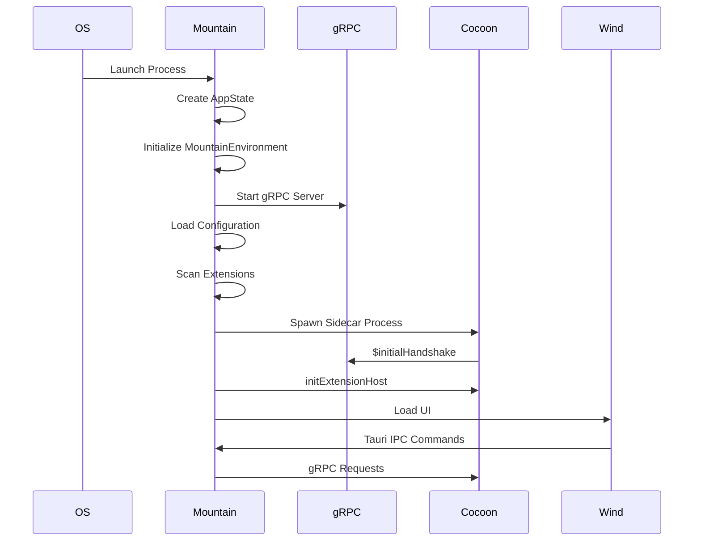
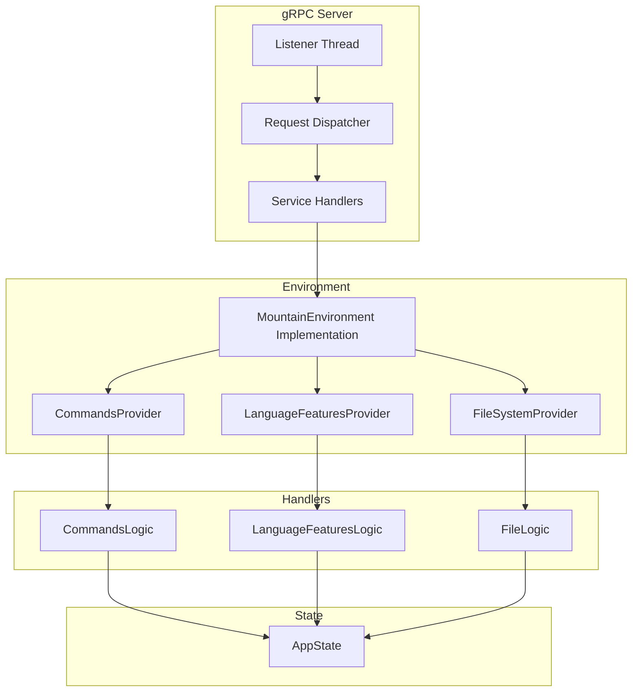
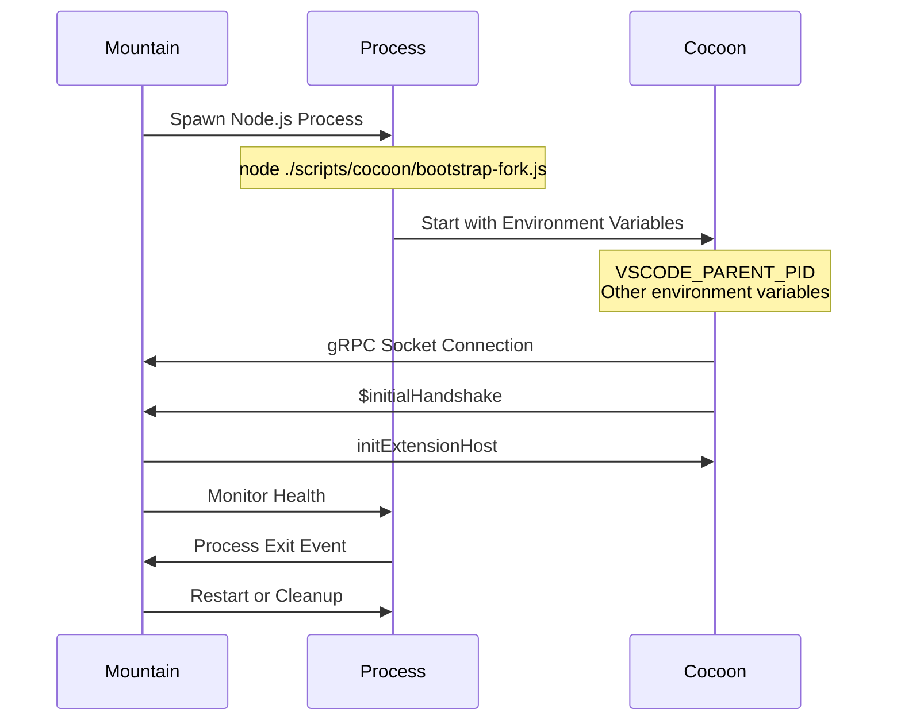
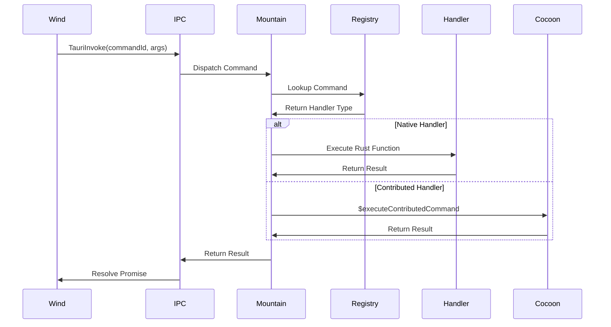
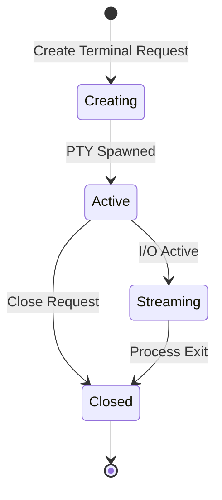
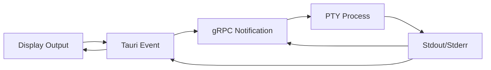

# Mountain - Native Backend

## Table of Contents

- [Overview](#overview)
- [Architecture](#architecture)
- [Core Modules](#core-modules)
- [gRPC Server](#grpc-server)
- [Process Management](#process-management)
- [Command System](#command-system)
- [File System](#file-system)
- [Terminal Management](#terminal-management)
- [IPC Integration](#ipc-integration)
- [Integration Points](#integration-points)
- [Known Issues and TODOs](#known-issues-and-todos)

---

## Overview

**Mountain** is the native backend of Code Editor Land, built with Rust and the
Tauri framework. It serves as the central orchestrator, managing OS
interactions, running the gRPC server, coordinating process communication, and
providing core platform functionality to other components.

### Key Responsibilities

- Native OS interactions (file system, processes, clipboard)
- gRPC server for inter-process communication
- Extension host (Cocoon) process management
- Command registry and execution
- Terminal PTY management
- File system operations
- UI window management via Tauri
- Configuration and state management

### Technology Stack

- **Language**: Rust
- **Framework**: Tauri
- **RPC**: gRPC (tonic)
- **Async Runtime**: tokio
- **Serialization**: ProtoBuf, serde

---

## Architecture

### Application Lifecycle



### Directory Structure

```
Element/Mountain/
├── Source/
│   ├── main.rs                        # Application entry point
│   ├── Library.rs                     # Core library exports
│   ├── Air/                           # Air daemon integration
│   │   ├── AirClient.rs               # Air client
│   │   ├── AirServiceProvider.rs      # Air service provider
│   │   └── mod.rs
│   ├── Binary/                        # Binary-specific code
│   │   ├── Main/
│   │   │   ├── AppLifecycle.rs        # App lifecycle management
│   │   │   ├── Entry.rs               # Binary entry point
│   │   │   ├── IPCCommands.rs         # IPC command definitions
│   │   │   └── Tray.rs                # System tray integration
│   │   └── Register/                  # Component registration
│   │       ├── AdvancedFeaturesRegister.rs
│   │       ├── CommandRegister.rs
│   │       ├── IPCServerRegister.rs
│   │       ├── StatusReporterRegister.rs
│   │       └── WindSyncRegister.rs
│   ├── Command/                       # Command implementations
│   │   ├── Bootstrap.rs               # Bootstrap commands
│   │   ├── Keybinding.rs              # Keybinding commands
│   │   ├── LanguageFeature/           # Language feature commands
│   │   │   ├── code_actions.rs
│   │   │   ├── completions.rs
│   │   │   ├── definition.rs
│   │   │   ├── highlights.rs
│   │   │   ├── hover.rs
│   │   │   ├── invoke_provider.rs
│   │   │   ├── references.rs
│   │   │   └── validation.rs
│   │   ├── SourceControlManagement.rs # SCM commands
│   │   ├── TreeView.rs                # Tree view commands
│   │   └── mod.rs
│   ├── Environment/                   # Environment trait implementations
│   │   ├── SourceControlManagementProvider.rs
│   │   ├── UserInterfaceProvider.rs
│   │   ├── DocumentProvider/
│   │   │   ├── ApplyChanges.rs
│   │   │   ├── mod.rs
│   │   │   ├── Notifications.rs
│   │   │   ├── OpenDocument.rs
│   │   │   └── SaveOperations.rs
│   │   ├── TreeViewProvider/
│   │   │   ├── DataAccess.rs
│   │   │   ├── Events.rs
│   │   │   ├── mod.rs
│   │   │   ├── Registration.rs
│   │   │   ├── StatePersistence.rs
│   │   │   ├── UIState.rs
│   │   │   └── Visibility.rs
│   │   └── Utility/
│   │       ├── ErrorMapping.rs
│   │       ├── LanguageDetection.rs
│   │       ├── PathSecurity.rs
│   │       ├── UriParsing.rs
│   │       └── mod.rs
│   ├── ExtensionManagement/           # Extension management
│   │   ├── Scanner.rs                 # Extension scanner
│   │   └── mod.rs
│   ├── FileSystem/                    # File system operations
│   │   ├── FileExplorerViewProvider.rs
│   │   └── mod.rs
│   ├── IPC/                           # IPC layer
│   │   ├── AdvancedFeatures.rs
│   │   ├── ConfigurationBridge.rs
│   │   ├── StatusReporter.rs
│   │   ├── TauriIPCServer.rs
│   │   ├── WindAdvancedSync.rs
│   │   ├── WindAirCommands.rs
│   │   ├── WindServiceAdapters.rs
│   │   ├── WindServiceHandlers.rs
│   │   ├── Connection/               # Connection management
│   │   │   ├── Health.rs
│   │   │   ├── Manager.rs
│   │   │   ├── mod.rs
│   │   │   ├── Types.rs
│   │   │   └── Pool/
│   │   ├── Encryption/               # IPC encryption
│   │   │   ├── MessageCompressor.rs
│   │   │   ├── mod.rs
│   │   │   └── SecureChannel.rs
│   │   ├── Permission/               # IPC permissions
│   │   │   ├── Audit/
│   │   │   ├── Role/
│   │   │   └── Validate/
│   │   ├── Security/                 # IPC security
│   │   ├── TauriIPCServer/
│   │   └── WindAdvancedSync/
│   ├── ProcessManagement/             # Process lifecycle
│   │   ├── CocoonManagement.rs        # Cocoon sidecar management
│   │   ├── InitializationData.rs      # Initialization data construction
│   │   └── mod.rs
│   ├── RunTime/                       # Runtime management
│   │   ├── ApplicationRunTime/
│   │   │   ├── mod.rs
│   │   │   └── RuntimeStruct.rs
│   │   ├── Execute/
│   │   │   ├── Fn.rs
│   │   │   └── mod.rs
│   │   ├── Shutdown/
│   │   │   ├── Shutdown.rs
│   │   │   └── mod.rs
│   │   └── mod.rs
│   ├── Track/                         # Request dispatcher
│   │   ├── Effect/
│   │   │   ├── CreateEffectForRequest.rs
│   │   │   ├── MappedEffectType.rs
│   │   │   └── mod.rs
│   │   ├── FrontendCommand/
│   │   ├── SideCarRequest/
│   │   │   ├── DispatchSideCarRequest.rs
│   │   │   └── mod.rs
│   │   ├── UIRequest/
│   │   ├── Webview/
│   │   └── mod.rs
│   ├── Update/                        # Update service
│   │   ├── UpdateService.rs
│   │   └── mod.rs
│   └── Vine/                          # gRPC client/server
│       ├── Client.rs
│       ├── Error.rs
│       ├── Generated/
│       │   ├── mod.rs
│       │   └── vine.rs
│       ├── mod.rs
│       └── Server/
│           ├── CocoonServiceImpl.rs
│           └── CocoonServiceServer.rs
├── capabilities/
│   └── default.json
├── Cargo.toml
└── build.rs
```

---

## Core Modules

### AppState

Central application state managed by Tauri, containing:

- **CommandRegistry**: Map of command ID to handler
- **LanguageProviders**: Registered language feature providers
- **ActiveWebviews**: Active webview panels
- **Terminals**: Active terminal instances
- **Configuration**: Application configuration
- **Extensions**: Loaded extension manifests

### MountainEnvironment

Implements all `Common` traits, providing:

- **File System**: Native file operations
- **Process**: Process spawning and management
- **IPC**: gRPC communication capabilities
- **Commands**: Command execution
- **Configuration**: Configuration management
- **Extensions**: Extension API implementations

### AppRuntime

Effect execution engine:

- **Effect Execution**: Runs ActionEffects from the Common library
- **Error Handling**: Centralized error handling and propagation
- **Context Management**: Manages execution context for effects

---

## gRPC Server

### Server Architecture



### gRPC Services

#### CocoonServiceImpl

**Location**:
[`Element/Mountain/Source/Vine/Server/CocoonServiceImpl.rs`](https://github.com/CodeEditorLand/Mountain/tree/Current/Source/Vine/Server/MountainVinegRPCService.rs)

Implements gRPC service methods for Cocoon communication:

| Method                            | Purpose                            | Direction         |
| --------------------------------- | ---------------------------------- | ----------------- |
| `$initialHandshake`               | Receive handshake from Cocoon      | Cocoon → Mountain |
| `initExtensionHost`               | Send initialization data to Cocoon | Mountain → Cocoon |
| `$registerCommand`                | Register extension command         | Cocoon → Mountain |
| `$executeContributedCommand`      | Execute extension command          | Mountain → Cocoon |
| `$registerHoverProvider`          | Register hover provider            | Cocoon → Mountain |
| `$provideHover`                   | Request hover information          | Mountain → Cocoon |
| `$registerCompletionItemProvider` | Register completion provider       | Cocoon → Mountain |
| `$provideCompletionItems`         | Request completion items           | Mountain → Cocoon |

### Request Dispatching

The `Track` module handles request routing:

1. **FrontendCommand**: Commands from Wind via Tauri IPC
2. **SideCarRequest**: Requests from Cocoon via gRPC
3. **UIRequest**: UI-related requests
4. **Webview**: Webview-related operations

---

## Process Management

### Cocoon Management

**Location**:
[`Element/Mountain/Source/ProcessManagement/CocoonManagement.rs`](https://github.com/CodeEditorLand/Mountain/tree/Current/Source/ProcessManagement/CocoonManagement.rs)

Manages the Cocoon sidecar process:



### Process Spawning

Key aspects of process spawning:

- **Environment Setup**: Sets `VSCODE_PARENT_PID` for auto-shutdown
- **Command Construction**: `node ./scripts/cocoon/bootstrap-fork.js`
- **Health Monitoring**: Monitors process health and restarts if needed
- **Cleanup**: Properly terminates processes on shutdown

### Initialization Data

**Location**:
[`Element/Mountain/Source/ProcessManagement/InitializationData.rs`](https://github.com/CodeEditorLand/Mountain/tree/Current/Source/ProcessManagement/InitializationData.rs)

Constructs initialization data for Cocoon:

- **Workspace Information**: Folder paths, workspace files
- **Extension List**: Available extensions and their activation events
- **Configuration**: Settings and configuration
- **Environment**: Environment variables and paths

---

## Command System

### Command Registry

Mountain maintains a centralized command registry:

```rust
AppState.CommandRegistry: HashMap<CommandId, CommandHandler>
```

### Command Types

| Handler Type | Description           | Example                         |
| ------------ | --------------------- | ------------------------------- |
| Native       | Rust function pointer | `workbench.action.save`         |
| Contributed  | Proxied to Cocoon     | `extension.yourCommand`         |
| UI           | Handled by Wind       | `workbench.action.showCommands` |

### Command Execution Flow



### Command Registration

**Location**:
[`Element/Mountain/Source/Binary/Register/CommandRegister.rs`](https://github.com/CodeEditorLand/Mountain/tree/Current/Source/Binary/Register/CommandRegister.rs)

Registers native commands on startup:

```rust
// Example command registration
register_command!(
    registry,
    "workbench.action.save",
    CommandHandler::Native(save_document_handler)
);
```

---

## File System

### File Operations

Mountain provides native file system operations through Tauri plugins:

| Operation      | Tauri Plugin | Method       |
| -------------- | ------------ | ------------ |
| Read File      | `plugin:fs`  | `read_file`  |
| Write File     | `plugin:fs`  | `write_file` |
| File Metadata  | `plugin:fs`  | `metadata`   |
| List Directory | `plugin:fs`  | `read_dir`   |
| Watch Files    | `plugin:fs`  | `watch`      |

### File Explorer Provider

**Location**:
[`Element/Mountain/Source/FileSystem/FileExplorerViewProvider.rs`](https://github.com/CodeEditorLand/Mountain/tree/Current/Source/FileSystem/FileExplorerViewProvider.rs)

Provides file explorer functionality:

- **Tree Data Provider**: Supplies tree data for explorer
- **State Management**: Tracks expanded folders and selection
- **Event Emission**: Emits events for file changes

### Document Operations

**Location**:
[`Element/Mountain/Source/Environment/DocumentProvider/`](https://github.com/CodeEditorLand/Mountain/tree/Current/Source/Environment/DocumentProvider)

Document-related operations:

- **Save Operations**:
  [`SaveOperations.rs`](https://github.com/CodeEditorLand/Mountain/tree/Current/Source/Environment/DocumentProvider/SaveOperations.rs) -
  Save and apply edits
- **Open Document**:
  [`OpenDocument.rs`](https://github.com/CodeEditorLand/Mountain/tree/Current/Source/Environment/DocumentProvider/OpenDocument.rs) -
  Open and parse documents
- **Apply Changes**:
  [`ApplyChanges.rs`](https://github.com/CodeEditorLand/Mountain/tree/Current/Source/Environment/DocumentProvider/ApplyChanges.rs) -
  Apply text edits
- **Notifications**:
  [`Notifications.rs`](https://github.com/CodeEditorLand/Mountain/tree/Current/Source/Environment/DocumentProvider/Notifications.rs) -
  Document-related events

---

## Terminal Management

### Terminal Lifecycle



### Terminal Features

- **PTY Spawning**: Spawns native pseudo-terminal processes
- **I/O Streaming**: Streams input and output to terminal
- **Multi-Target**: Sends output to both Cocoon and Wind/Sky
- **Process Management**: Manages terminal process lifecycle

### Terminal I/O Flow



---

## IPC Integration

### Tauri IPC Server

**Location**:
[`Element/Mountain/Source/IPC/TauriIPCServer.rs`](https://github.com/CodeEditorLand/Mountain/tree/Current/Source/IPC/TauriIPCServer.rs)

Handles Tauri IPC communication with Wind:

- **Command Invocations**: Receive and process commands from Wind
- **Event Emissions**: Send events to Wind/Sky
- **Bridge Pattern**: Bridges Wind requests to backend services

### IPC Connection Pool

**Location**:
[`Element/Mountain/Source/IPC/Connection/Pool/`](https://github.com/CodeEditorLand/Mountain/tree/Current/Source/IPC/Connection/Pool)

Connection pool management:

- **Reusable Connections**: Maintains pool of connections
- **Health Monitoring**: Monitors connection health
- **Automatic Reconnection**: Reconnects on failure

### IPC Security

**Location**:
[`Element/Mountain/Source/IPC/Security/`](https://github.com/CodeEditorLand/Mountain/tree/Current/Source/IPC/Security)

Security features:

- **Permission System**: Role-based access control
- **Audit Logging**: Logs all IPC requests
- **Secure Channels**: Encrypted IPC communication

### Wind Service Handlers

**Location**:
[`Element/Mountain/Source/IPC/WindServiceHandlers.rs`](https://github.com/CodeEditorLand/Mountain/tree/Current/Source/IPC/WindServiceHandlers.rs)

Handles Wind service requests:

```rust
// Wind -> Mountain IPC handlers
mountain://command/get-all           // Get all commands
mountain://command/execute           // Execute command
mountain://language-feature/provide-hover  // Provide hover
mountain://file/read                 // Read file
mountain://file/write                // Write file
```

---

## Integration Points

### Cocoon Integration

| Integration Point         | Method                | Direction         |
| ------------------------- | --------------------- | ----------------- |
| Process Spawn             | Node.js child process | Mountain → Cocoon |
| gRPC Server               | gRPC/ProtoBuf         | Bidirectional     |
| Initial Handshake         | `$initialHandshake`   | Cocoon → Mountain |
| Extension Initialization  | `initExtensionHost`   | Mountain → Cocoon |
| Language Feature Requests | `$provide*` methods   | Mountain → Cocoon |
| Provider Registration     | `$register*` methods  | Cocoon → Mountain |

### Wind Integration

| Integration Point | Method            | Direction       |
| ----------------- | ----------------- | --------------- |
| IPC Commands      | Tauri `invoke`    | Wind → Mountain |
| Events            | Tauri `emit`      | Mountain → Wind |
| File Operations   | Tauri FS plugin   | Wind → Mountain |
| Command Execution | Custom URI scheme | Wind → Mountain |

### Sky Integration

| Integration Point | Method       | Direction      |
| ----------------- | ------------ | -------------- |
| Webview Events    | Tauri events | Mountain → Sky |
| Terminal Events   | Tauri events | Mountain → Sky |
| SCM Events        | Tauri events | Mountain → Sky |

### Air Integration

**Location**:
[`Element/Mountain/Source/Air/`](https://github.com/CodeEditorLand/Mountain/tree/Current/Source/Air)

Air daemon integration:

- **Air Client**:
  [`AirClient.rs`](https://github.com/CodeEditorLand/Mountain/tree/Current/Source/Air/AirClient.rs) -
  Communicates with Air
- **Service Provider**:
  [`AirServiceProvider.rs`](https://github.com/CodeEditorLand/Mountain/tree/Current/Source/Air/AirServiceProvider.rs) -
  Provides Air services

---

## Known Issues and TODOs

This section outlines the critical issues that Mountain currently faces,
organized by priority and estimated effort. For comprehensive refactoring
recommendations, see
[`Documentation/Architecture/recommendations/RefactoringPriorities.md`](https://github.com/CodeEditorLand/Land/tree/main/Documentation/Architecture/recommendations/RefactoringPriorities.md).

### 1. Critical Issues (Priority: Highest - 1-2 weeks)

#### IPC Layer Refactoring

**User Impact**: Code duplication in IPC modules leads to inconsistent behavior,
harder maintenance, and increased bug risk. This affects all frontend-backend
communication paths.

**Estimated Effort**: 2 weeks

**Tasks**:

- [ ] Consolidate common IPC logic into shared modules
- [ ] Create `Element/Mountain/Source/IPC/Common/` directory with:
    - [ ] `RequestHandler.rs` - Common request handling logic
    - [ ] `ResponseBuilder.rs` - Common response building
    - [ ] `ErrorMapper.rs` - Common error mapping
- [ ] Eliminate code duplication across IPC modules
- [ ] Ensure consistent behavior across all IPC operations
- [ ] Add unit tests for common IPC utilities
- [ ] Update documentation with new structure

**Details**: The current IPC layer has significant duplication between different
IPC handlers. Common patterns for request validation, response formatting, and
error handling are repeated across multiple modules. This refactoring will:

- Reduce code duplication by ~40%
- Improve maintainability and testability
- Ensure consistent error messages and response formats
- Make it easier to add new IPC operations

---

#### Error Handling Standardization

**User Impact**: Inconsistent error handling makes debugging difficult, provides
poor user feedback, and hinders error recovery mechanisms.

**Estimated Effort**: 1-2 weeks

**Tasks**:

- [ ] Establish consistent error types for all services
- [ ] Create common error hierarchy in `Element/Mountain/Source/Error/`:
    - [ ] MountainError.rs - Base error type
    - [ ] IpcError.rs - IPC-specific errors
    - [ ] GrpcError.rs - gRPC-specific errors
    - [ ] ProcessError.rs - Process management errors
- [ ] Implement error recovery mechanisms (retry, fallback, graceful
      degradation)
- [ ] Add comprehensive error logging with structured logs
- [ ] Create error documentation with examples
- [ ] Add error mapping from internal errors to user-facing messages
- [ ] Implement error metrics collection

**Details**: Currently, error handling varies significantly across services.
Some services return simple strings, others use custom error types, and error
context is often lost. Standardization will:

- Provide detailed, actionable error messages to users
- Enable automatic error recovery where possible
- Improve debugging with stack traces and context
- Support error analytics and monitoring

---

### 2. High Priority Issues

#### Connection Pool Completion

**User Impact**: Incomplete connection pool implementation leads to connection
leaks, degraded performance, and resource exhaustion under load.

**Estimated Effort**: 2 weeks

**Tasks**:

- [ ] Complete `Element/Mountain/Source/IPC/Connection/Pool/` implementation:
    - [ ] Implement connection lifecycle management (acquire, release, idle
          timeout)
    - [ ] Add pool statistics (active connections, idle connections, total
          connections)
    - [ ] Implement health monitoring with periodic health checks
    - [ ] Add automatic recovery for failed connections
    - [ ] Implement connection reuse and cleanup
    - [ ] Add pool configuration (min/max connections, timeout settings)
- [ ] Add connection pool metrics
- [ ] Implement pool warmup on startup
- [ ] Add unit and integration tests
- [ ] Document pool behavior and configuration options

**Details**: The connection pool infrastructure exists but lacks critical
features. Under current conditions:

- New connections are created for each request (performance overhead)
- Failed connections are not automatically recovered
- No visibility into pool health or utilization
- Risk of connection leaks exhausting system resources

---

#### Command System Consolidation

**User Impact**: Multiple command execution paths cause confusion, inconsistent
command behavior, and make adding new commands error-prone.

**Estimated Effort**: 1-2 weeks

**Tasks**:

- [ ] Unify command registration logic in `Element/Mountain/Source/Command/`
- [ ] Consolidate command execution paths (currently split across multiple entry
      points)
- [ ] Simplify command dispatch mechanism:
    - [ ] Create unified CommandRouter.rs
    - [ ] Implement command middleware pipeline
    - [ ] Add command validation layer
    - [ ] Standardize command request/response format
- [ ] Add command middleware pipeline for:
    - [ ] Authentication/authorization
    - [ ] Input validation
    - [ ] Logging
    - [ ] Rate limiting
- [ ] Implement command documentation generator
- [ ] Add command metrics (execution time, success rate, etc.)

**Details**: The command system currently has multiple ways to register and
execute commands, leading to:

- Inconsistent command interfaces
- Duplicate validation logic
- No centralized logging or metrics
- Difficult to add cross-cutting concerns (auth, rate limiting)

---

### 3. Medium Priority Issues

#### Message Compression

**User Impact**: Large messages consume excessive bandwidth and memory,
affecting performance on slow connections or memory-constrained environments.

**Estimated Effort**: 1 week

**Tasks**:

- [ ] Enable compression for large messages (> 1MB by default)
- [ ] Implement adaptive compression based on message size and content type
- [ ] Add compression statistics (bytes saved, compression ratio, time spent)
- [ ] Tune compression levels for optimal performance (CPU vs. bandwidth
      trade-off)
- [ ] Benchmark compression impact on typical workloads
- [ ] Add configuration options for compression threshold and level
- [ ] Document compression behavior and recommendations

**Details**: Current implementation supports compression but it's not actively
used. Enabling compression will:

- Reduce bandwidth usage by 60-80% for text content
- Improve performance on slow connections
- Increase CPU load (measured overhead: ~1-3%)
- Configurable based on deployment constraints

---

#### Performance Monitoring

**User Impact**: Lack of performance visibility makes it difficult to identify
bottlenecks, optimize critical paths, and ensure service level objectives.

**Estimated Effort**: 2 weeks

**Tasks**:

- [ ] Add performance metrics collection:
    - [ ] gRPC request latency (p50, p95, p99)
    - [ ] IPC operation duration
    - [ ] Command execution time
    - [ ] Connection pool utilization
    - [ ] Memory usage by component
- [ ] Implement performance profiling endpoints:
    - [ ] `/metrics` - Prometheus-compatible metrics
    - [ ] `/profile` - CPU profiling snapshot
    - [ ] `/health` - Service health check with timing
- [ ] Add benchmarking for critical paths:
    - [ ] gRPC message serialization/deserialization
    - [ ] File system operations
    - [ ] Process spawning and management
    - [ ] IPC communication overhead
- [ ] Create performance dashboards and alerts
- [ ] Add performance regression tests
- [ ] Document performance baselines and targets

**Details**: Without performance monitoring, it's difficult to:

- Identify performance regressions in real-time
- Optimize bottlenecks effectively
- Ensure service level objectives are met
- Make data-driven optimization decisions

---

### 4. Future Enhancements (Lower Priority)

These items are important but not urgent. They can be addressed after critical
and high-priority issues are resolved.

#### Feature Enhancements

- [ ] Webview navigation history tracking
- [ ] Split terminal support (multiple terminals in one window)
- [ ] Multiple workspace support (simultaneous projects)
- [ ] Command history and replay functionality
- [ ] Plugin system for extending Mountain capabilities

#### Developer Experience

- [ ] Enhanced logging with structured log levels (debug, info, warn, error)
- [ ] Integrated performance profiling tools
- [ ] Debugging diagnostics and trace collection
- [ ] Hot-reload for development
- [ ] Developer API documentation

#### Security Enhancements

- [ ] Comprehensive permission system audit
- [ ] Secure channel implementation completion
- [ ] Certificate-based authentication
- [ ] Request signing and verification
- [ ] Security compliance documentation

#### Testing Improvements

- [ ] Increase test coverage to >80%
- [ ] Add integration test suite for end-to-end scenarios
- [ ] Implement property-based testing
- [ ] Add contract tests for gRPC interfaces
- [ ] Create load testing infrastructure

---

**Implementation Notes**:

- Tasks are ordered by priority and dependency
- Some tasks can be completed in parallel
- Estimated efforts assume full-time focused work
- Regular sync meetings recommended for tracking progress
- Consider creating separate tasks for each sub-item for better tracking

**Related Documentation**:

- [`Documentation/Architecture/recommendations/RefactoringPriorities.md`](https://github.com/CodeEditorLand/Land/tree/main/Documentation/Architecture/recommendations/RefactoringPriorities.md) -
  Detailed refactoring analysis
- [`Element/Mountain/Source/IPC/RefactoringSummary.md`](https://github.com/CodeEditorLand/Mountain/tree/Current/Source/IPC/RefactoringSummary.md) -
  IPC-specific refactoring plan
- [`Documentation/IMPLEMENTATION_ROADMAP.md`](https://github.com/CodeEditorLand/Land/tree/main/Documentation/IMPLEMENTATION_ROADMAP.md) -
  Overall project roadmap

---

## Key Files Reference

| File                                                                                                                                                                    | Purpose                 |
| ----------------------------------------------------------------------------------------------------------------------------------------------------------------------- | ----------------------- |
| [`Element/Mountain/Source/main.rs`](https://github.com/CodeEditorLand/Mountain/tree/Current/Source/main.rs)                                                             | Application entry point |
| [`Element/Mountain/Source/Vine/Server/CocoonServiceServer.rs`](https://github.com/CodeEditorLand/Mountain/tree/Current/Source/Vine/Server/MountainVinegRPCService.rs)   | gRPC server             |
| [`Element/Mountain/Source/ProcessManagement/CocoonManagement.rs`](https://github.com/CodeEditorLand/Mountain/tree/Current/Source/ProcessManagement/CocoonManagement.rs) | Cocoon management       |
| [`Element/Mountain/Source/IPC/TauriIPCServer.rs`](https://github.com/CodeEditorLand/Mountain/tree/Current/Source/IPC/TauriIPCServer.rs)                                 | IPC server              |
| [`Element/Mountain/Source/Command/mod.rs`](https://github.com/CodeEditorLand/Mountain/tree/Current/Source/Command/mod.rs)                                               | Command implementations |

---

## See Also

- [Cocoon Component](https://github.com/CodeEditorLand/Land/tree/main/Documentation/Architecture/components/Cocoon.md) -
  Extension host
- [Vine Component](https://github.com/CodeEditorLand/Land/tree/main/Documentation/Architecture/components/Vine.md) -
  gRPC protocol
- [Air Component](https://github.com/CodeEditorLand/Land/tree/main/Documentation/Architecture/components/Air.md) -
  Background daemon
- [Communication Flows](https://github.com/CodeEditorLand/Land/tree/main/Documentation/Architecture/integration/CommunicationFlows.md) -
  Detailed communication patterns
- [Application Startup Workflow](https://github.com/CodeEditorLand/Land/tree/main/Documentation/GitHub/Workflow/ApplicationStartupAndHandshake.md) -
  Startup sequence
