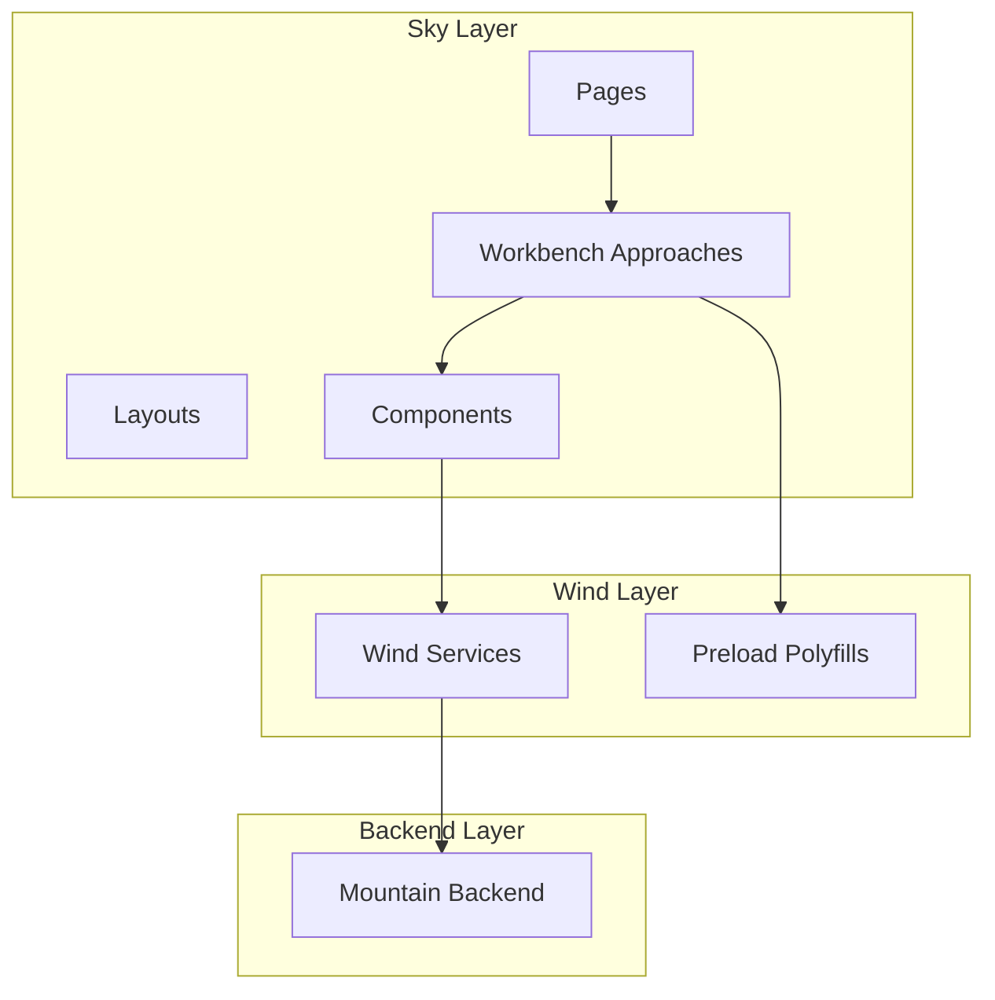
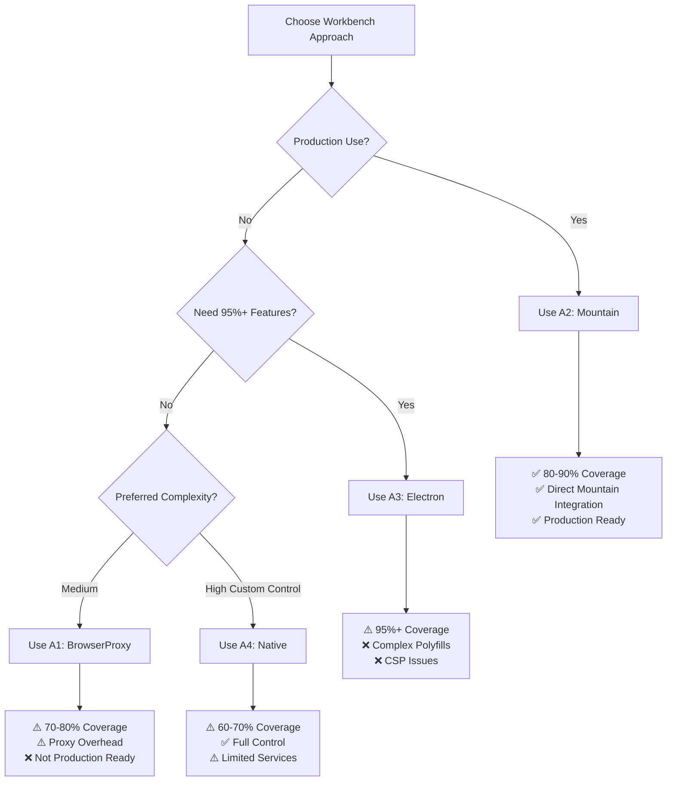
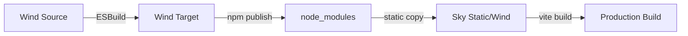
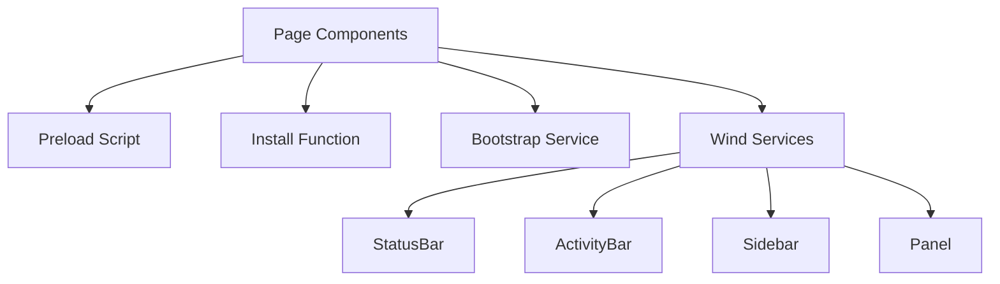

# Sky - UI Components

## Table of Contents

- [Overview](#overview)
- [Architecture](#architecture)
- [Astro Framework](#astro-framework)
- [Page Routing](#page-routing)
- [Workbench Approaches](#workbench-approaches)
- [Workbench Comparison](#workbench-comparison)
- [Core Components](#core-components)
- [Build Process](#build-process)
- [Integration Points](#integration-points)

---

## Overview

**Sky** is the declarative UI component layer of Code Editor Land, built with
the Astro framework. It renders the user interface, manages page routing, and
provides multiple workbench variants for different deployment scenarios.

### Key Responsibilities

- Render UI components
- Manage page routing
- Provide workbench variants (A1, A2, A3, A4)
- Display application state
- Handle user interactions
- Integrate with Wind services

### Technology Stack

- **Framework**: Astro
- **Language**: TypeScript
- **Styling**: CSS
- **Build**: Astro build system
- **Integration**: Effect-TS, Tauri events

---

## Architecture

### Component Hierarchy



### Directory Structure

```
Element/Sky/
├── Source/
│   ├── Function/                     # Utility functions
│   │   ├── Debug.ts                  # Debug utilities
│   │   ├── Meta.astro                # Meta component
│   │   ├── Markup/
│   │   │   └── Base.astro            # Base markup
│   │   └── ...
│   ├── pages/                        # Page routes
│   │   ├── index.astro               # Home page
│   │   ├── Application.astro         # Main application page
│   │   ├── Isolation.astro           # Isolated page
│   │   └── ...
│   ├── Workbench/                    # Workbench variants
│   │   ├── Default.astro             # Deprecated entry point (shows approach list)
│   │   ├── BrowserProxy.astro        # A1: Browser + services proxy
│   │   ├── Mountain.astro            # A2: Browser + Mountain providers (RECOMMENDED)
│   │   ├── Electron.astro            # A3: Electron + polyfills
│   │   ├── NLS.astro                 # Natural Language Support
│   │   ├── Native/                   # Native workbench variants
│   │   │   ├── ActivityBar.astro
│   │   │   ├── Editor.astro
│   │   │   ├── Panel.astro
│   │   │   ├── Sidebar.astro
│   │   │   ├── StatusBar.astro
│   │   │   └── WindWorkbench.astro   # A4: Native Wind implementation
│   │   ├── BrowserTest.astro         # Browser testing variant
│   │   └── BrowserProxy.astro        # A1 implementation
│   └── env.d.ts                      # TypeScript definitions
├── .env.example                      # Environment variables template
├── astro.config.ts                   # Astro configuration
├── tsconfig.json                     # TypeScript configuration
└── package.json
```

---

## Astro Framework

### Why Astro?

Astro provides key benefits for Code Editor Land:

| Feature                | Benefit                               |
| ---------------------- | ------------------------------------- |
| **Component Islands**  | Hydrate only interactive components   |
| **Zero JS by Default** | Minimal JavaScript shipped to browser |
| **Framework Agnostic** | Use any UI framework                  |
| **Fast Build**         | Quick build times for development     |
| **Static Generation**  | Pre-render pages for performance      |

### Configuration

**Location**:
[`astro.config.ts`](https://github.com/CodeEditorLand/Sky/tree/Current/astro.config.ts)

Astro configuration sets up:

- Integration frameworks
- Build options
- Development server
- Static asset handling
- Vite resolve aliases for Wind

---

## Page Routing

### Route Structure

| Route        | Purpose          | File                |
| ------------ | ---------------- | ------------------- |
| `/`          | Home page        | `index.astro`       |
| `/app`       | Main application | `Application.astro` |
| `/isolation` | Isolated mode    | `Isolation.astro`   |

### Page Components

#### Index Page

**Location**:
[`Source/pages/index.astro`](https://github.com/CodeEditorLand/Sky/tree/Current/Source/pages/index.astro)

Home page with:

- Welcome message
- Quick start guide
- Links to key features

#### Application Page

**Location**:
[`Source/pages/Application.astro`](https://github.com/CodeEditorLand/Sky/tree/Current/Source/pages/Application.astro)

Main application page that:

- Loads the workbench
- Initializes Wind services
- Sets up event listeners

---

## Workbench Approaches

Sky provides four distinct workbench approaches (A1-A4) for different use cases:

### Approach A1: BrowserProxy - Browser + Services Proxy

**File**:
[`Source/Workbench/BrowserProxy.astro`](https://github.com/CodeEditorLand/Sky/tree/Current/Source/Workbench/BrowserProxy.astro)

**Description**: Uses browser workbench with a Mountain services proxy layer
that intercepts VSCode API calls and routes them through Mountain.

| Attribute            | Value                                              |
| -------------------- | -------------------------------------------------- |
| **Workbench**        | Browser (`vs/code/browser/workbench/workbench.js`) |
| **Complexity**       | Medium                                             |
| **Feature Coverage** | 70-80%                                             |
| **Polyfills**        | Wind preload only                                  |
| **Integration**      | Services proxy layer                               |

**Trade-offs**:

- ✅ Good for proof-of-concept
- ✅ Easier to implement than full Electron polyfills
- ❌ Remote agent overhead from proxy layer
- ❌ Less direct integration than Mountain providers

**How it works**:

1. Loads browser VSCode workbench
2. Installs Wind preload with VSCode-compatible globals
3. Initializes services proxy layer
4. Proxy intercepts window.vscode API calls
5. Routes calls through Mountain services via IPC

**When to use**:

- Early development/prototyping
- Testing proxy architecture
- Learning VSCode API integration patterns

---

### Approach A2: Mountain - Browser + Mountain Providers (RECOMMENDED)

**File**:
[`Source/Workbench/Mountain.astro`](https://github.com/CodeEditorLand/Sky/tree/Current/Source/Workbench/Mountain.astro)

**Description**: Uses browser workbench with direct Tauri IPC to Mountain
providers for file operations (no proxy overhead). This is the RECOMMENDED
production approach.

| Attribute            | Value                                              |
| -------------------- | -------------------------------------------------- |
| **Workbench**        | Browser (`vs/code/browser/workbench/workbench.js`) |
| **Complexity**       | Medium                                             |
| **Feature Coverage** | 80-90%                                             |
| **Polyfills**        | Wind preload only                                  |
| **Integration**      | Direct Mountain providers                          |
| **Status**           | ✅ RECOMMENDED                                     |

**Trade-offs**:

- ✅ **RECOMMENDED approach for production use**
- ✅ Direct Tauri IPC to Mountain providers (no proxy overhead)
- ✅ Uses browser workbench (no vscode-file:// CSP errors)
- ✅ 80-90% VSCode functionality
- ✅ Lower complexity than Electron polyfills (A3)
- ✅ Better maintainability than A1 proxy approach
- ❌ Still missing some Electron-only features

**Implementation Status**: Batches 1-3 COMPLETE

- **Batch 1**: Get browser workbench to load successfully ✅
- **Batch 2**: Create Mountain file system provider ✅
- **Batch 3**: Create workbench integration ✅

**How it works**:

1. Loads browser VSCode workbench (NOT Electron)
2. Installs Wind preload with VSCode-compatible globals
3. Runs Effect-TS bootstrap for Wind services
4. Integrates Mountain file system provider
5. File operations route directly through Mountain (no proxy)

**Features implemented**:

- File system operations via Mountain provider
- Direct Tauri IPC communication
- Wind Effect-TS services
- Workspace context management
- 80-90% VSCode features

**When to use**:

- ⭐ **Production default**
- Most deployment scenarios
- When you need 80-90% VSCode functionality
- When maintainability is important

---

### Approach A3: Electron - Electron Workbench + Complete Polyfills

**File**:
[`Source/Workbench/Electron.astro`](https://github.com/CodeEditorLand/Sky/tree/Current/Source/Workbench/Electron.astro)

**Description**: Uses Electron workbench with comprehensive Electron API
polyfills to make the browser act like Electron.

| Attribute            | Value                                                        |
| -------------------- | ------------------------------------------------------------ |
| **Workbench**        | Electron (`vs/code/electron-browser/workbench/workbench.js`) |
| **Complexity**       | High                                                         |
| **Feature Coverage** | 95%+                                                         |
| **Polyfills**        | 7+ Electron API polyfills                                    |
| **Integration**      | Full Electron compatibility                                  |

**Polyfills Loaded**:

1. `ProcessPolyfill` - Node.js process object
2. `FileProtocolShim` - vscode-file:// protocol handling
3. `FileSystemPolyfill` - fs module polyfill
4. `IPCRendererShim` - Electron IPC communication
5. `ChildProcessPolyfill` - child_process module
6. `NativeModulePolyfill` - Native module loading
7. `SharedProcessProxy` - Shared process communication

**Trade-offs**:

- ✅ Maximum VSCode functionality (if polyfills work correctly)
- ✅ Uses actual Electron workbench
- ❌ High complexity with 7+ polyfills to maintain
- ❌ May have CSP issues with vscode-file:// protocol
- ❌ High maintenance burden as VSCode evolves

**How it works**:

1. Loads all 7 Electron API polyfills
2. Installs Wind preload with VSCode-compatible globals
3. Runs Effect-TS bootstrap for Wind services
4. Loads Electron VSCode workbench
5. Polyfills provide Electron APIs in browser

**Known issues**:

- CSP errors with vscode-file:// protocol
- Some polyfills may not be fully functional
- Browser environment limitations

**When to use**:

- When you Electron-only features are critical
- As reference for Electron API polyfills
- For experimental/testing purposes

---

### Approach A4: Native - Native Wind Implementation

**File**:
[`Source/Workbench/Native/WindWorkbench.astro`](https://github.com/CodeEditorLand/Sky/tree/Current/Source/Workbench/Native/WindWorkbench.astro)

**Description**: Custom implementation using Wind's Effect-TS services without
Electron workbench dependency.

| Attribute            | Value                            |
| -------------------- | -------------------------------- |
| **Workbench**        | Custom Wind-based implementation |
| **Complexity**       | High                             |
| **Feature Coverage** | 60-70%                           |
| **Polyfills**        | Wind preload only                |
| **Integration**      | Wind services directly           |

**Components**:

- **ActivityBar**: Left-side navigation icons
  ([`ActivityBar.astro`](https://github.com/CodeEditorLand/Sky/tree/Current/Source/Workbench/Native/ActivityBar.astro))
- **Sidebar**: File explorer, search, etc.
  ([`Sidebar.astro`](https://github.com/CodeEditorLand/Sky/tree/Current/Source/Workbench/Native/Sidebar.astro))
- **Editor**: Monaco-based text editor
  ([`Editor.astro`](https://github.com/CodeEditorLand/Sky/tree/Current/Source/Workbench/Native/Editor.astro))
- **Panel**: Bottom panel for output/terminal
  ([`Panel.astro`](https://github.com/CodeEditorLand/Sky/tree/Current/Source/Workbench/Native/Panel.astro))
- **StatusBar**: Status information bar
  ([`StatusBar.astro`](https://github.com/CodeEditorLand/Sky/tree/Current/Source/Workbench/Native/StatusBar.astro))

**Trade-offs**:

- ✅ Custom implementation using Wind Effect-TS services
- ✅ Full control over implementation
- ✅ No dependency on Electron workbench
- ✅ Long-term sustainability if Wind services expand
- ❌ Limited to available Wind services
- ❌ Requires building custom VSCode-like features
- ❌ Lowest feature coverage

**How it works**:

1. Installs Wind preload
2. Runs Effect-TS bootstrap
3. Renders custom workbench components
4. Components use Wind services directly
5. No Electron workbench dependency

**When to use**:

- When you need full control over implementation
- For long-term custom workbench development
- As foundation for custom feature development

---

## Workbench Comparison

### Feature Matrix

| Feature                   | A1: BrowserProxy | A2: Mountain ⭐ | A3: Electron | A4: Native |
| ------------------------- | ---------------- | --------------- | ------------ | ---------- |
| **VSCode Workbench**      | Browser          | Browser         | Electron     | Custom     |
| **File System**           | Proxy            | Direct          | Full         | Wind       |
| **Polyfills**             | 1 (Wind)         | 1 (Wind)        | 7+           | 1 (Wind)   |
| **Feature Coverage**      | 70-80%           | 80-90%          | 95%+         | 60-70%     |
| **Complexity**            | Medium           | Medium          | High         | High       |
| **Maintainability**       | Medium           | High            | Low          | Medium     |
| **Production Ready**      | ⚠️               | ✅ YES          | ❌           | ⚠️         |
| **Remote Agent Overhead** | Yes              | No              | No           | No         |
| **CSP Issues**            | No               | No              | Yes          | No         |
| **Mountain Integration**  | Proxy            | Direct          | Full         | Wind       |

### Decision Guide



### Summary Recommendation

| Goal                      | Approach                          |
| ------------------------- | --------------------------------- |
| **Production deployment** | 🌟 **A2: Mountain** (RECOMMENDED) |
| **Maximum features**      | A3: Electron (with caveats)       |
| **Quick prototype**       | A1: BrowserProxy                  |
| **Full custom control**   | A4: Native                        |

For detailed guidance on selecting a workbench approach, see
[`Workbench Selection Guide`](https://github.com/CodeEditorLand/Land/tree/Current/Documentation/GitHub/workbench-selection.md).

---

## Core Components

### Base Components

#### NLS Component

**Location**:
[`Source/Workbench/NLS.astro`](https://github.com/CodeEditorLand/Sky/tree/Current/Source/Workbench/NLS.astro)

Provides Natural Language Support:

- Language loading
- Localization strings
- i18n infrastructure

#### Meta Component

**Location**:
[`Source/Function/Meta.astro`](https://github.com/CodeEditorLand/Sky/tree/Current/Source/Function/Meta.astro)

Provides metadata handling:

- Page titles
- Meta tags
- SEO metadata

#### Base Markup

**Location**:
[`Source/Function/Markup/Base.astro`](https://github.com/CodeEditorLand/Sky/tree/Current/Source/Function/Markup/Base.astro)

Base HTML structure:

- HTML5 boilerplate
- Common scripts
- Shared styles

### Native Workbench Components

#### Activity Bar Component

**Location**:
[`Source/Workbench/Native/ActivityBar.astro`](https://github.com/CodeEditorLand/Sky/tree/Current/Source/Workbench/Native/ActivityBar.astro)

Left-side navigation with icons and badges:

- Activity bar items
- Navigation actions
- Active item state
- Badge notifications

#### Sidebar Component

**Location**:
[`Source/Workbench/Native/Sidebar.astro`](https://github.com/CodeEditorLand/Sky/tree/Current/Source/Workbench/Native/Sidebar.astro)

Panel for file explorer, search, etc.:

- Sidebar view management
- Panel state (collapsed/expanded)
- Active panel selection
- View content rendering

#### Editor Component

**Location**:
[`Source/Workbench/Native/Editor.astro`](https://github.com/CodeEditorLand/Sky/tree/Current/Source/Workbench/Native/Editor.astro)

Monaco-based text editor:

- Editor instance management
- File tab management
- Editor layout
- Text operations

#### Panel Component

**Location**:
[`Source/Workbench/Native/Panel.astro`](https://github.com/CodeEditorLand/Sky/tree/Current/Source/Workbench/Native/Panel.astro)

Bottom panel for output/terminal:

- Panel view management
- View visibility
- Panel maximization
- Output rendering

#### Status Bar Component

**Location**:
[`Source/Workbench/Native/StatusBar.astro`](https://github.com/CodeEditorLand/Sky/tree/Current/Source/Workbench/Native/StatusBar.astro)

Status information bar:

- Status bar items
- Item alignment (left/right)
- Item priority
- Status updates

---

## Build Process

### Static File Copy

**Location**:
[`Source/Function/Debug.ts`](https://github.com/CodeEditorLand/Sky/tree/Current/Source/Function/Debug.ts)

For production builds, Wind modules are copied to Sky's static directory:

```typescript
// Static targets configuration
{
  src: "node_modules/@codeeditorland/wind/Target/*.js",
  dest: "Static/Wind/",
},
{
  src: "node_modules/@codeeditorland/wind/Target/Bootstrap/*",
  dest: "Static/Wind/Bootstrap/",
},
{
  src: "node_modules/@codeeditorland/wind/Target/Effect/*",
  dest: "Static/Wind/Effect/",
},
{
  src: "node_modules/@codeeditorland/wind/Target/Function/*",
  dest: "Static/Wind/Function/",
},
```

### Build Flow



### Module Resolution

Development uses package names:

```typescript
import { Install } from "@codeeditorland/wind"
```

Production uses static URLs:

```typescript
import { Install } from "/Static/Wind/Function/Install.js"
```

For details on the module distribution fix, see
[`WindDistributionFix.md`](https://github.com/CodeEditorLand/Land/tree/main/Documentation/Architecture/integration/WindDistributionFix.md).

---

## Integration Points

### Wind Integration

Sky components consume Wind services:



### Event Handling

#### Tauri Events

Sky listens for events from Mountain:

| Event                         | Purpose         | Source   |
| ----------------------------- | --------------- | -------- |
| `sky://terminal/data`         | Terminal output | Mountain |
| `sky://webview/create`        | Create webview  | Mountain |
| `sky://scm/update-group`      | SCM update      | Mountain |
| `sky://configuration/changed` | Config change   | Mountain |

#### Bootstrap Events

| Event                     | Purpose                  |
| ------------------------- | ------------------------ |
| `wind-bootstrap-complete` | Wind bootstrap completed |

### State Management

State is managed through:

1. **Wind Services**: Shared state via services
2. **Component State**: Local component state
3. **URL State**: Query parameters and hash

---

## Key Files Reference

| File                                                                                                                                            | Purpose                               |
| ----------------------------------------------------------------------------------------------------------------------------------------------- | ------------------------------------- |
| [`Source/astro.config.ts`](https://github.com/CodeEditorLand/Sky/tree/Current/astro.config.ts)                                                  | Astro configuration                   |
| [`Source/Function/Debug.ts`](https://github.com/CodeEditorLand/Sky/tree/Current/Source/Function/Debug.ts)                                       | Static file configuration             |
| [`Source/pages/Application.astro`](https://github.com/CodeEditorLand/Sky/tree/Current/Source/pages/Application.astro)                           | Main application page                 |
| [`Source/pages/index.astro`](https://github.com/CodeEditorLand/Sky/tree/Current/Source/pages/index.astro)                                       | Home page                             |
| [`Source/Workbench/Default.astro`](https://github.com/CodeEditorLand/Sky/tree/Current/Source/Workbench/Default.astro)                           | Deprecated entry point                |
| [`Source/Workbench/BrowserProxy.astro`](https://github.com/CodeEditorLand/Sky/tree/Current/Source/Workbench/BrowserProxy.astro)                 | A1: Browser + proxy                   |
| [`Source/Workbench/Mountain.astro`](https://github.com/CodeEditorLand/Sky/tree/Current/Source/Workbench/Mountain.astro)                         | A2: Browser + providers (RECOMMENDED) |
| [`Source/Workbench/Electron.astro`](https://github.com/CodeEditorLand/Sky/tree/Current/Source/Workbench/Electron.astro)                         | A3: Electron + polyfills              |
| [`Source/Workbench/Native/WindWorkbench.astro`](https://github.com/CodeEditorLand/Sky/tree/Current/Source/Workbench/Native/WindWorkbench.astro) | A4: Native Wind implementation        |

---

## See Also

- [Wind Component](https://github.com/CodeEditorLand/Land/tree/main/Documentation/Architecture/components/Wind.md) -
  Service layer
- [Mountain Component](https://github.com/CodeEditorLand/Land/tree/main/Documentation/Architecture/components/Mountain.md) -
  Native backend
- [Cocoon Component](https://github.com/CodeEditorLand/Land/tree/main/Documentation/Architecture/components/Cocoon.md) -
  Extension host
- [Wind Distribution Fix](https://github.com/CodeEditorLand/Land/tree/main/Documentation/Architecture/integration/WindDistributionFix.md) -
  Module distribution
- [Electron Workbench Polyfills](https://github.com/CodeEditorLand/Land/tree/Current/Documentation/Architecture/integration/ElectronWorkbenchPolyfills.md) -
  Polyfill documentation
- [Workbench Selection Guide](https://github.com/CodeEditorLand/Land/tree/Current/Documentation/GitHub/workbench-selection.md) -
  Choosing the right approach
- [Communication Flows](https://github.com/CodeEditorLand/Land/tree/main/Documentation/Architecture/integration/CommunicationFlows.md) -
  Detailed communication patterns
