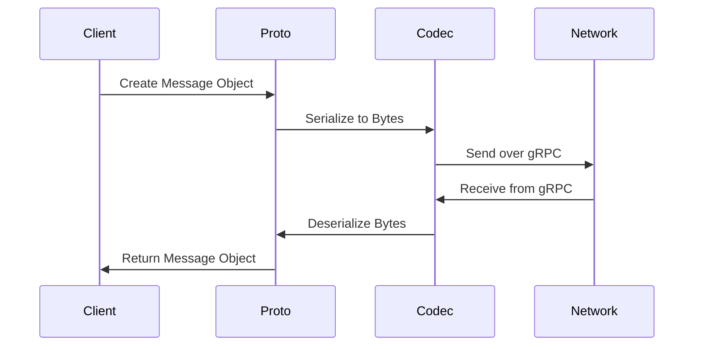
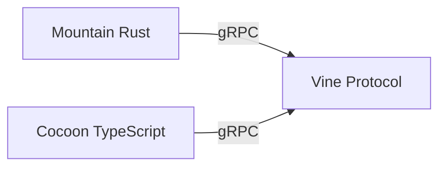

# Vine - gRPC Protocol

## Table of Contents

- [Overview](#overview)
- [Protocol Definition](#protocol-definition)
- [Service Contracts](#service-contracts)
- [Message Serialization](#message-serialization)
- [Generated Code](#generated-code)
- [Error Handling](#error-handling)
- [Versioning](#versioning)
- [Integration Points](#integration-points)

---

## Overview

**Vine** is the gRPC protocol definition for inter-process communication between
Mountain and Cocoon. It uses Protocol Buffers (ProtoBuf) to define service
contracts and message formats, ensuring type-safe, efficient communication.

### Key Responsibilities

- Define service interfaces between components
- Specify message formats and data types
- Provide type-safe serialization/deserialization
- Enable code generation for multiple languages (Rust, TypeScript)

### Technology Stack

- **Protocol**: gRPC
- **Serialization**: Protocol Buffers (ProtoBuf)
- **Language Support**: Rust, TypeScript
- **Code Generation**: protoc, tonic, gRPC-Web

---

## Protocol Definition

### Vine.proto

**Location**:
[`Element/Mountain/Proto/Vine.proto`](https://github.com/CodeEditorLand/Mountain/tree/Current/Proto/Vine.proto)

The core protocol definition file:

```protobuf
syntax = "proto3";

package vine;

// Main gRPC service for Mountain-Cocoon communication
service CocoonService {
  // Initialization
  rpc $initialHandshake(Empty) returns (Empty);
  rpc initExtensionHost(InitExtensionHostRequest) returns (Empty);

  // Commands
  rpc $registerCommand(RegisterCommandRequest) returns (Empty);
  rpc $executeContributedCommand(ExecuteCommandRequest) returns (ExecuteCommandResponse);

  // Language Features
  rpc $registerHoverProvider(RegisterProviderRequest) returns (Empty);
  rpc $provideHover(ProvideHoverRequest) returns (ProvideHoverResponse);
  rpc $registerCompletionItemProvider(RegisterProviderRequest) returns (Empty);
  rpc $provideCompletionItems(ProvideCompletionItemsRequest) returns (ProvideCompletionItemsResponse);

  // File System
  rpc $readFile(ReadFileRequest) returns (ReadFileResponse);
  rpc $writeFile(WriteFileRequest) returns (Empty);
  rpc $stat(StatRequest) returns (StatResponse);
  rpc $readdir(ReaddirRequest) returns (ReaddirResponse);

  // Workspace
  rpc $updateConfiguration(UpdateConfigurationRequest) returns (Empty);
  rpc $updateWorkspaceFolders(UpdateWorkspaceFoldersRequest) returns (Empty);

  // Webview
  rpc $createWebviewPanel(CreateWebviewPanelRequest) returns (CreateWebviewPanelResponse);
  rpc $setWebviewHtml(SetWebviewHtmlRequest) returns (Empty);
  rpc $onDidReceiveMessage(OnDidReceiveMessageRequest) returns (Empty);

  // Terminal
  rpc $openTerminal(OpenTerminalRequest) returns (Empty);
  rpc $terminalInput(TerminalInputRequest) returns (Empty);
  rpc $closeTerminal(CloseTerminalRequest) returns (Empty);
}
```

### Message Types

The protocol defines various message types for different operations:

#### Primitive Types

| Proto Type | Rust Type | TypeScript Type |
| ---------- | --------- | --------------- |
| `string`   | `String`  | `string`        |
| `int32`    | `i32`     | `number`        |
| `int64`    | `i64`     | `bigint`        |
| `uint32`   | `u32`     | `number`        |
| `uint64`   | `u64`     | `bigint`        |
| `bool`     | `bool`    | `boolean`       |
| `bytes`    | `Vec<u8>` | `Uint8Array`    |

#### Common Messages

```protobuf
// Empty message for requests/responses with no payload
message Empty {}

// Position in a text document
message Position {
  uint32 line = 1;
  uint32 character = 2;
}

// Range in a text document
message Range {
  Position start = 1;
  Position end = 2;
}

// URI for resources
message Uri {
  string value = 1;
}
```

---

## Service Contracts

### Initialization Services

#### `$initialHandshake`

Establishes initial connection from Cocoon to Mountain.

**Request**: `Empty`  
**Response**: `Empty`  
**Direction**: Cocoon → Mountain

**Purpose**: Signal that Cocoon is ready to receive initialization data

#### `initExtensionHost`

Sends initialization data to Cocoon.

**Request**:

```protobuf
message InitExtensionHostRequest {
  repeated WorkspaceFolder workspaceFolders = 1;
  repeated ExtensionInfo extensions = 2;
  ConfigurationData configuration = 3;
  EnvironmentData environment = 4;
}
```

**Response**: `Empty`  
**Direction**: Mountain → Cocoon

**Purpose**: Provide Cocoon with workspace, extension, and configuration data

### Command Services

#### `$registerCommand`

Registers a new command from an extension.

**Request**:

```protobuf
message RegisterCommandRequest {
  string commandId = 1;
  string extensionId = 2;
  string title = 3;
}
```

**Response**: `Empty`  
**Direction**: Cocoon → Mountain

**Purpose**: Register an extension-contributed command with Mountain

#### `$executeContributedCommand`

Executes a command in an extension.

**Request**:

```protobuf
message ExecuteCommandRequest {
  string commandId = 1;
  repeated Argument arguments = 2;
}

message Argument {
  oneof value {
    string string_value = 1;
    int32 int_value = 2;
    bool bool_value = 3;
  }
}
```

**Response**:

```protobuf
message ExecuteCommandResponse {
  oneof result {
    string string_result = 1;
    int32 int_result = 2;
    bool bool_result = 3;
  }
}
```

**Direction**: Mountain → Cocoon

**Purpose**: Execute a command in an extension and return the result

### Language Feature Services

#### `$registerHoverProvider`

Registers a hover provider.

**Request**:

```protobuf
message RegisterProviderRequest {
  string languageSelector = 1;
  uint32 handle = 2;
  string extensionId = 3;
}
```

**Response**: `Empty`  
**Direction**: Cocoon → Mountain

**Purpose**: Register a hover provider for a specific language

#### `$provideHover`

Requests hover information.

**Request**:

```protobuf
message ProvideHoverRequest {
  Uri uri = 1;
  Position position = 2;
  uint32 provider_handle = 3;
}
```

**Response**:

```protobuf
message ProvideHoverResponse {
  repeated MarkedString contents = 1;
  Range range = 2;
}

message MarkedString {
  string language = 1;
  string value = 2;
}
```

**Direction**: Mountain → Cocoon

**Purpose**: Request hover information from a registered provider

#### `$registerCompletionItemProvider`

Registers a completion provider.

**Request**: Same as `RegisterProviderRequest`  
**Response**: `Empty`  
**Direction**: Cocoon → Mountain

**Purpose**: Register a completion provider for a specific language

#### `$provideCompletionItems`

Requests completion items.

**Request**:

```protobuf
message ProvideCompletionItemsRequest {
  Uri uri = 1;
  Position position = 2;
  uint32 provider_handle = 3;
}
```

**Response**:

```protobuf
message ProvideCompletionItemsResponse {
  repeated CompletionItem items = 1;
}

message CompletionItem {
  string label = 1;
  CompletionItemKind kind = 2;
  string detail = 3;
  string documentation = 4;
  TextEdit text_edit = 5;
}

enum CompletionItemKind {
  TEXT = 0;
  METHOD = 1;
  FUNCTION = 2;
  CONSTRUCTOR = 3;
  FIELD = 4;
  VARIABLE = 5;
  CLASS = 6;
  INTERFACE = 7;
  MODULE = 8;
  // ... more kinds
}
```

**Direction**: Mountain → Cocoon

**Purpose**: Request completion items from a registered provider

### File System Services

#### `$readFile`

Reads file contents.

**Request**:

```protobuf
message ReadFileRequest {
  Uri uri = 1;
}
```

**Response**:

```protobuf
message ReadFileResponse {
  bytes content = 1;
  string encoding = 2;
}
```

**Direction**: Mountain → Cocoon

**Purpose**: Read the contents of a file

#### `$writeFile`

Writes file contents.

**Request**:

```protobuf
message WriteFileRequest {
  Uri uri = 1;
  bytes content = 2;
  string encoding = 3;
}
```

**Response**: `Empty`  
**Direction**: Mountain → Cocoon

**Purpose**: Write contents to a file

#### `$stat`

Gets file metadata.

**Request**:

```protobuf
message StatRequest {
  Uri uri = 1;
}
```

**Response**:

```protobuf
message StatResponse {
  FileType type = 1;
  int64 size = 2;
  int64 mtime = 3;
  bool readonly = 4;
}

enum FileType {
  UNKNOWN = 0;
  FILE = 1;
  DIRECTORY = 2;
  SYMBOLIC_LINK = 3;
}
```

**Direction**: Mountain → Cocoon

**Purpose**: Get metadata about a file or directory

#### `$readdir`

Lists directory contents.

**Request**:

```protobuf
message ReaddirRequest {
  Uri uri = 1;
}
```

**Response**:

```protobuf
message ReaddirResponse {
  repeated DirectoryEntry entries = 1;
}

message DirectoryEntry {
  string name = 1;
  FileType type = 2;
}
```

**Direction**: Mountain → Cocoon

**Purpose**: List the contents of a directory

### Workspace Services

#### `$updateConfiguration`

Notifies of configuration changes.

**Request**:

```protobuf
message UpdateConfigurationRequest {
  repeated string changed_keys = 1;
}
```

**Response**: `Empty`  
**Direction**: Mountain → Cocoon

**Purpose**: Notify Cocoon of configuration changes

#### `$updateWorkspaceFolders`

Updates workspace folders.

**Request**:

```protobuf
message UpdateWorkspaceFoldersRequest {
  repeated WorkspaceFolder additions = 1;
  repeated WorkspaceFolder removals = 2;
}

message WorkspaceFolder {
  Uri uri = 1;
  string name = 2;
}
```

**Response**: `Empty`  
**Direction**: Mountain → Cocoon

**Purpose**: Update the list of workspace folders

### Webview Services

#### `$createWebviewPanel`

Creates a new webview panel.

**Request**:

```protobuf
message CreateWebviewPanelRequest {
  string view_type = 1;
  string title = 2;
  string icon_path = 3;
  ViewColumn view_column = 4;
  bool preserve_focus = 5;
  bool enable_find_widget = 6;
  bool retain_context_when_hidden = 7;
  repeated string local_resource_roots = 8;
}
```

**Response**:

```protobuf
message CreateWebviewPanelResponse {
  uint32 handle = 1;
}
```

**Direction**: Cocoon → Mountain

**Purpose**: Create a new webview panel in the UI

#### `$setWebviewHtml`

Updates webview HTML content.

**Request**:

```protobuf
message SetWebviewHtmlRequest {
  uint32 handle = 1;
  string html = 2;
}
```

**Response**: `Empty`  
**Direction**: Cocoon → Mountain

**Purpose**: Update the HTML content of a webview

#### `$onDidReceiveMessage`

Receives message from webview.

**Request**:

```protobuf
message OnDidReceiveMessageRequest {
  uint32 handle = 1;
  oneof message {
    string string_message = 2;
    bytes bytes_message = 3;
  }
}
```

**Response**: `Empty`  
**Direction**: Mountain → Cocoon

**Purpose**: Receive a message from a webview panel

### Terminal Services

#### `$openTerminal`

Opens a new terminal.

**Request**:

```protobuf
message OpenTerminalRequest {
  string name = 1;
  string shell_path = 2;
  repeated string shell_args = 3;
  string cwd = 4;
}
```

**Response**: `Empty`  
**Direction**: Cocoon → Mountain

**Purpose**: Open a new terminal instance

#### `$terminalInput`

Sends input to terminal.

**Request**:

```protobuf
message TerminalInputRequest {
  uint32 terminal_id = 1;
  bytes data = 2;
}
```

**Response**: `Empty`  
**Direction**: Cocoon → Mountain

**Purpose**: Send input to a terminal

#### `$closeTerminal`

Closes a terminal.

**Request**:

```protobuf
message CloseTerminalRequest {
  uint32 terminal_id = 1;
}
```

**Response**: `Empty`  
**Direction**: Cocoon → Mountain

**Purpose**: Close a terminal instance

---

## Message Serialization

### Serialization Flow



### Binary Format

Protocol Buffers use a compact binary format:

- **Variable-width integers**: Smaller values use fewer bytes
- **Field tags**: Each field has a unique tag for identification
- **Oneof fields**: Efficiently handle mutually exclusive fields
- **Repeated fields**: Efficient encoding for arrays

### Performance Characteristics

| Operation                   | Approximate Cost |
| --------------------------- | ---------------- |
| Serialize (small message)   | < 1μs            |
| Deserialize (small message) | < 1μs            |
| Serialize (large message)   | 10-100μs         |
| Deserialize (large message) | 10-100μs         |

---

## Generated Code

### Rust Code Generation

**Location**:
[`Element/Mountain/Source/Vine/Generated/`](https://github.com/CodeEditorLand/Mountain/tree/Current/Source/Vine/Generated)

Generated using `tonic-build`:

**Key files**:

- [`vine.rs`](https://github.com/CodeEditorLand/Mountain/tree/Current/Source/Vine/Generated/vine.rs) -
  Main generated code
- [`mod.rs`](https://github.com/CodeEditorLand/Mountain/tree/Current/Source/Vine/Generated/mod.rs) -
  Module exports

**Generated components**:

```rust
// Generated service trait
pub trait CocoonService: Send + Sync + 'static {
    fn $initial_handshake(
        &self,
        request: tonic::Request<Empty>,
    ) -> Result<tonic::Response<Empty>, tonic::Status>;

    fn init_extension_host(
        &self,
        request: tonic::Request<InitExtensionHostRequest>,
    ) -> Result<tonic::Response<Empty>, tonic::Status>;

    // ... other methods
}

// Generated types
#[derive(Clone, PartialEq, ::prost::Message)]
pub struct Empty {}

#[derive(Clone, PartialEq, ::prost::Message)]
pub struct Position {
    #[prost(uint32, tag = "1")]
    pub line: u32,
    #[prost(uint32, tag = "2")]
    pub character: u32,
}
```

### TypeScript Code Generation

**Location**:
[`Element/Cocoon/Source/Generated/`](https://github.com/CodeEditorLand/Cocoon/tree/Current/Source/Generated)

Generated using `protoc-gen-ts`:

**Key files**:

- [`Vine.ts`](https://github.com/CodeEditorLand/Cocoon/tree/Current/Source/Generated/Vine.ts) -
  Main generated code
- [`Vine_pb.d.ts`](https://github.com/CodeEditorLand/Cocoon/tree/Current/Source/Generated/Vine_pb.d.ts) -
  TypeScript definitions
- [`grpc.d.ts`](https://github.com/CodeEditorLand/Cocoon/tree/Current/Source/Generated/grpc.d.ts) -
  gRPC definitions

**Generated components**:

```typescript
// Generated service client
export class CocoonServiceClient {
	$initialHandshake(
		request: Empty,
		callback: (error: Error, response: Empty) => void,
	): void;

	initExtensionHost(
		request: InitExtensionHostRequest,
		callback: (error: Error, response: Empty) => void,
	): void;

	// ... other methods
}

// Generated types
export interface Empty {}

export interface Position {
	line: number;
	character: number;
}
```

### Build Process

Rust code is generated during Cargo build:

```toml
fn main() {
tonic_build::compile_protos("Proto/Vine.proto")
        .expect("Failed to compile proto");
}# Element/Mountain/build.rs
```

TypeScript code is generated via npm script:

```json
// Element/Mountain/package.json
{
	"scripts": {
		"generate:ts": "protoc --ts_out=Element/Cocoon/Source/Generated --plugin=protoc-gen-ts=./node_modules/.bin/protoc-gen-ts Proto/Vine.proto"
	}
}
```

---

## Error Handling

### gRPC Status Codes

The protocol uses standard gRPC status codes:

| Code | Name                | Usage                         |
| ---- | ------------------- | ----------------------------- |
| 0    | OK                  | Success                       |
| 1    | CANCELLED           | Operation cancelled by client |
| 2    | UNKNOWN             | Unknown error                 |
| 3    | INVALID_ARGUMENT    | Invalid argument              |
| 4    | DEADLINE_EXCEEDED   | Operation timed out           |
| 5    | NOT_FOUND           | Resource not found            |
| 6    | ALREADY_EXISTS      | Resource already exists       |
| 7    | PERMISSION_DENIED   | Permission denied             |
| 8    | RESOURCE_EXHAUSTED  | Out of resources              |
| 9    | UNAUTHENTICATED     | Not authenticated             |
| 10   | FAILED_PRECONDITION | Failed precondition           |
| 11   | ABORTED             | Operation aborted             |
| 12   | OUT_OF_RANGE        | Out of range                  |
| 13   | UNIMPLEMENTED       | Not implemented               |
| 14   | INTERNAL            | Internal error                |
| 15   | UNAVAILABLE         | Service unavailable           |
| 16   | DATA_LOSS           | Data loss                     |
| 17   | UNAUTHENTICATED     | Not authenticated             |

### Error Message Format

Errors include:

- **Status Code**: Standard gRPC status code
- **Message**: Human-readable error message
- **Details**: Structured error details (optional)

### Client-Side Error Handling

Rust example:

```rust
match client.provide_hover(request).await {
    Ok(response) => {
        // Handle success
    }
    Err(status) => {
        match status.code() {
            Code::NotFound => println!("Provider not found"),
            Code::InvalidArgument => println!("Invalid position"),
            Code::Internal => println!("Internal error: {}", status.message()),
            _ => println!("Unknown error: {}", status.code()),
        }
    }
}
```

TypeScript example:

```typescript
client.provideHover(request, (error, response) => {
	if (error) {
		console.error("Error:", error.code, error.message);
		return;
	}
	// Handle response
});
```

---

## Versioning

### Protocol Versioning Strategy

Vine follows semantic versioning:

- **Major version**: Breaking changes to protocol
- **Minor version**: Non-breaking additions
- **Patch version**: Bug fixes

### Version Compatibility Rules

| Client Version | Protocol Version | Server Version | Compatible?                         |
| -------------- | ---------------- | -------------- | ----------------------------------- |
| v1.0           | v1.0             | v1.0           | ✅ Yes                              |
| v1.0           | v1.0             | v1.1           | ✅ Yes (server new features)        |
| v1.1           | v1.1             | v1.0           | ❌ No (client expects new features) |
| v1.0           | v1.1             | v1.1           | ❌ No (mismatch)                    |

### Breaking Changes

Changes that require a major version update:

- Adding or removing RPC methods
- Changing parameter or return types
- Renaming fields or methods
- Changing field numbers

### Non-Breaking Changes

Changes that only require a minor version update:

- Adding new values to enums
- Adding new fields to messages
- Adding new RPC methods (optional parameters only)

---

## Integration Points

### Mountain Integration

**Server Implementation**:
[`Element/Mountain/Source/Vine/Server/`](https://github.com/CodeEditorLand/Mountain/tree/Current/Source/Vine/Server)

- **CocoonServiceServer**: gRPC server implementation
- **CocoonServiceImpl**: Service handler implementation

### Cocoon Integration

**Client Implementation**:
[`Element/Cocoon/Source/Integration/`](https://github.com/CodeEditorLand/Cocoon/tree/Current/Source/Integration)

- **MountainClient**: gRPC client for communication with Mountain
- **Generated Code**:
  [Element/Cocoon/Source/Generated/](https://github.com/CodeEditorLand/Cocoon/tree/Current/Source/Generated)

### Cross-Language Communication

Vine enables seamless communication between Rust and TypeScript:



---

## Key Files Reference

| File                                                                                                                                                                  | Purpose                   |
| --------------------------------------------------------------------------------------------------------------------------------------------------------------------- | ------------------------- |
| [`Element/Mountain/Proto/Vine.proto`](https://github.com/CodeEditorLand/Mountain/tree/Current/Proto/Vine.proto)                                                       | Protocol definition       |
| [`Element/Mountain/Source/Vine/Generated/vine.rs`](https://github.com/CodeEditorLand/Mountain/tree/Current/Source/Vine/Generated/vine.rs)                             | Generated Rust code       |
| [`Element/Cocoon/Source/Generated/Vine.ts`](https://github.com/CodeEditorLand/Cocoon/tree/Current/Source/Generated/Vine.ts)                                           | Generated TypeScript code |
| [`Element/Mountain/Source/Vine/Server/CocoonServiceServer.rs`](https://github.com/CodeEditorLand/Mountain/tree/Current/Source/Vine/Server/MountainVinegRPCService.rs) | Server implementation     |
| [`Element/Cocoon/Source/Integration/MountainClient.ts`](https://github.com/CodeEditorLand/Cocoon/tree/Current/Source/Integration/MountainClient.ts)                   | Client implementation     |
| [`Element/Mountain/build.rs`](https://github.com/CodeEditorLand/Mountain/tree/Current/build.rs)                                                                       | Rust code generation      |

---

## Known Issues and TODOs

> **Reference**: See
> [`../recommendations/RefactoringPriorities.md`](https://github.com/CodeEditorLand/Land/tree/main/Documentation/Architecture/recommendations/RefactoringPriorities.md)
> for complete prioritization details and impact analysis.

---

### High Priority Issues

#### Protocol Version Compatibility

**Impact**: The protocol versioning strategy needs clear implementation to
ensure backward and forward compatibility when introducing new features or
breaking changes.

**User Experience**: Users may experience communication failures between
Mountain and Cocoon if protocol versions are mismatched, requiring manual
intervention.

**Tasks**:

- [ ] Implement protocol version negotiation
    - Add version field to all gRPC messages
    - Implement version checking on connection establishment
    - Add graceful degradation for version mismatches
- [ ] Define version compatibility rules
    - Document which protocol versions are compatible
    - Create version compatibility matrix
    - Define upgrade path for breaking changes
- [ ] Add version migration tools
    - Create tools to migrate between protocol versions
    - Implement automatic message conversion for compatible changes
    - Document migration procedures for manual updates
- [ ] Implement version testing
    - Test communication between different protocol versions
    - Verify backward compatibility with older clients
    - Test forward compatibility with newer servers

**Estimated Effort**: 2 weeks

**Dependencies**:

- Both Mountain and Cocoon implementation
- Testing infrastructure for version compatibility

---

#### Error Handling and Recovery

**Impact**: Insufficient error handling details in the protocol make it
difficult to provide meaningful error messages and implement proper recovery
mechanisms.

**User Experience**: Errors may be reported generically without sufficient
context, making it difficult for users to understand and resolve issues.

**Tasks**:

- [ ] Enhance error message format
    - Add detailed error context to all gRPC errors
    - Include error codes for programmatic handling
    - Add stack traces in development mode
- [ ] Define error recovery patterns
    - Document which errors are retryable
    - Specify recovery mechanisms for each error type
    - Add error categories (transient, permanent, retryable)
- [ ] Implement error tracking
    - Add error logging with correlation IDs
    - Track error rates and patterns
    - Create error dashboards for monitoring
- [ ] Create error documentation
    - Document all possible error codes
    - Provide troubleshooting guides for common errors
    - Add examples of error handling in client code

**Estimated Effort**: 1-2 weeks

---

### Medium Priority Issues

#### Protocol Validation and Testing

**Impact**: Lack of comprehensive protocol validation and automated tests may
lead to bugs that are only discovered at runtime.

**User Experience**: Users may encounter unexpected failures due to protocol
violations that could have been caught during development.

**Tasks**:

- [ ] Add protocol validation tools
    - Create validators for proto file structure
    - Implement message format validators
    - Add semantic validation for protocol contracts
- [ ] Expand automated testing
    - Add unit tests for all gRPC methods
    - Create integration tests for full communication flows
    - Add fuzz testing for message serialization/deserialization
- [ ] Implement contract tests
    - Create contract tests for protocol compliance
    - Test generated code against protocol specification
    - Verify behavior matches protocol documentation
- [ ] Add protocol compliance checks to CI/CD
    - Integrate protocol validation in build pipeline
    - Run contract tests on every commit
    - Automatically reject protocol-breaking changes

**Estimated Effort**: 2 weeks

---

#### Performance Optimization

**Impact**: Large payloads and inefficient serialization may affect
communication performance, especially for operations like file operations or
search results.

**User Experience**: Users may experience slow response times for certain
operations, particularly those involving large data transfers.

**Tasks**:

- [ ] Profile message serialization performance
    - Measure serialization/deserialization times for common messages
    - Identify bottlenecks in protocol buffers
    - Profile with realistic workload sizes
- [ ] Optimize large message handling
    - Implement streaming for large payloads (e.g., file contents)
    - Add message compression for suitable types
    - Consider chunking for very large messages
- [ ] Add performance monitoring
    - Track message sizes and processing times
    - Monitor gRPC call latency
    - Create performance baselines and alerts
- [ ] Document performance characteristics
    - Document expected performance for each operation
    - Provide recommendations for optimizing gRPC usage
    - Include performance considerations in protocol design

**Estimated Effort**: 1-2 weeks

---

### Low Priority Issues

#### Protocol Documentation Enhancement

**Impact**: Protocol documentation could be more detailed with examples, making
it easier for developers to understand and extend the protocol.

**User Experience**: Developers may struggle to understand protocol details or
implement new features, slowing down development.

**Tasks**:

- [ ] Add usage examples
    - Provide example requests/responses for each RPC method
    - Include common usage patterns
    - Add example code for client implementations
- [ ] Create protocol design documentation
    - Document design decisions and rationale
    - Explain protocol evolution strategy
    - Include architecture diagrams
- [ ] Add migration guide
    - Guide for adding new RPC methods
    - Process for breaking changes
    - Version update procedures
- [ ] Create troubleshooting guide
    - Common protocol issues and solutions
    - Debugging tips for gRPC communication
    - Performance tuning guidelines

**Estimated Effort**: 1 week

---

#### Code Generation Improvements

**Impact**: Generated code could be more ergonomic and better integrated with
the development workflow, improving developer productivity.

**User Experience**: Developers may find working with generated code cumbersome,
requiring additional boilerplate or manual adjustments.

**Tasks**:

- [ ] Improve generated code ergonomics
    - Add helper methods for common operations
    - Improve TypeScript type definitions
    - Generate idiomatic code for each language
- [ ] Automate code generation workflow
    - Integrate code generation into build process
    - Add watch mode for proto file changes
    - Automatically regenerate on proto updates
- [ ] Add code generation validation
    - Verify generated code compiles without errors
    - Check generated code quality metrics
    - Validate generated code against protocol
- [ ] Create code generation documentation
    - Document code generation process
    - Explain customizing generated code
    - Provide troubleshooting for generation issues

**Estimated Effort**: 1 week

---

## See Also

- [Mountain Component](https://github.com/CodeEditorLand/Land/tree/main/Documentation/Architecture/components/Mountain.md) -
  Native backend (server)
- [Cocoon Component](https://github.com/CodeEditorLand/Land/tree/main/Documentation/Architecture/components/Cocoon.md) -
  Extension host (client)
- [Spine Contract](https://github.com/CodeEditorLand/Land/tree/main/Documentation/Architecture/integration/SpineContract.md) -
  Detailed contract specification
- [Communication Flows](https://github.com/CodeEditorLand/Land/tree/main/Documentation/Architecture/integration/CommunicationFlows.md) -
  Communication patterns
