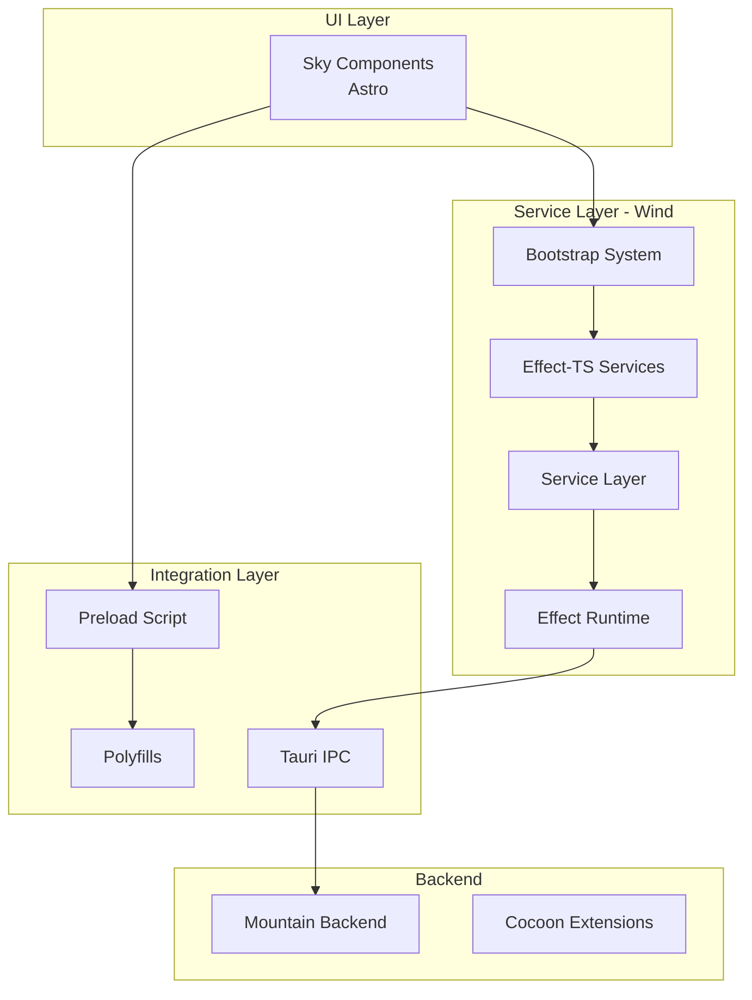
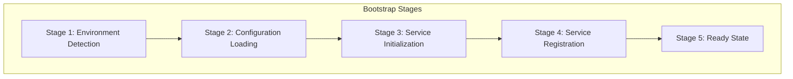
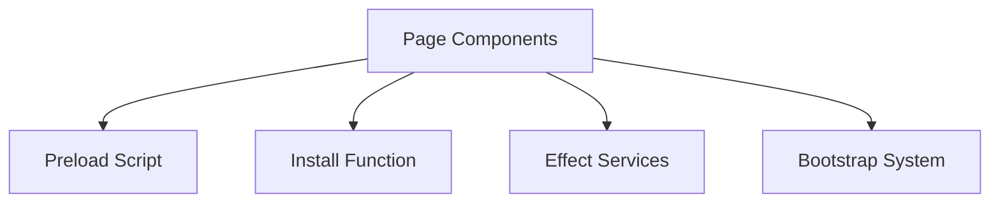

# Wind - UI Service Layer

## Table of Contents

- [Overview](#overview)
- [Architecture](#architecture)
- [Service Catalog](#service-catalog)
- [Effect-TS Architecture](#effect-ts-architecture)
- [Tauri IPC Integration](#tauri-ipc-integration)
- [Preload Script & Polyfills](#preload-script--polyfills)
- [Bootstrap System](#bootstrap-system)
- [Module Distribution](#module-distribution)
- [Integration Points](#integration-points)

---

## Overview

**Wind** is the UI service layer of Code Editor Land, re-implementing VS Code's
workbench services using Effect-TS. It provides the application logic that
bridges the UI components (Sky) with the native backend (Mountain) and extension
host (Cocoon).

### Key Responsibilities

- Implement VS Code workbench services
- Manage editor state and operations
- Coordinate file system operations
- Handle language features
- Manage UI state and events via services (StatusBar, ActivityBar, Sidebar,
  Panel)
- Integrate with Tauri for IPC
- Provide Electron API polyfills for workbench compatibility
- Handle VS Code protocol shims (vscode://, vscode-webview://, etc.)
- Bootstrap and initialize services at startup

### Technology Stack

- **Language**: TypeScript
- **Framework**: Effect-TS
- **Build**: ESBuild
- **IPC**: Tauri
- **Polyfills**: VSCode/Electron APIs

---

## Architecture

### Layer Architecture



### Directory Structure

```
Element/Wind/
├── Source/
│   ├── Bootstrap/                   # Bootstrap system for service initialization
│   │   ├── Types/                   # Bootstrap type definitions
│   │   │   ├── BootstrapTypes.ts    # Core bootstrap types
│   │   │   ├── VSCodeTypes.ts       # VSCode protocol types
│   │   │   └── Type/                # Specific type files
│   ├── Configuration/               # Service configuration
│   │   └── ESBuild/                 # ESBuild configuration
│   ├── Effect/                      # Effect-TS service implementations
│   │   ├── ActivityBar/             # Activity bar service ✅
│   │   ├── Bootstrap/               # Bootstrap service
│   │   ├── Clipboard/               # Clipboard service
│   │   ├── Configuration/           # Configuration service
│   │   ├── Environment/             # Environment service
│   │   ├── Health/                  # Health monitoring service
│   │   ├── IPC/                     # IPC service (Tauri integration)
│   │   ├── Layers/                  # Service layers (Tauri, Electron, Test)
│   │   ├── Mountain/                # Mountain service wrapper
│   │   ├── MountainSync/            # Mountain sync service
│   │   ├── NetworkRestrictions/     # Network restrictions service
│   │   ├── Panel/                   # Panel service ✅
│   │   ├── Sandbox/                 # Sandbox service
│   │   ├── Sidebar/                 # Sidebar service ✅
│   │   ├── StatusBar/               # Status bar service ✅
│   │   ├── Telemetry/               # Telemetry service
│   │   └── index.ts                 # Main exports
│   ├── FileSystem/                  # File system abstraction layer
│   │   ├── Implementation/          # File system implementation
│   │   ├── Interface/               # File system interfaces
│   │   └── Type/                    # File system types
│   ├── Function/                    # Utility functions
│   │   └── Install/                 # Installation function
│   ├── Polyfills/                   # VSCode/Electron API polyfills
│   │   ├── ChildProcessPolyfill.ts  # Child process polyfill
│   │   ├── FileProtocolShim.ts      # File protocol shim
│   │   ├── FileSystemPolyfill.ts    # File system polyfill
│   │   ├── IPCRendererShim.ts       # IPC renderer shim
│   │   ├── NativeModulePolyfill.ts  # Native module polyfill
│   │   ├── ProcessPolyfill.ts       # Process polyfill
│   │   └── SharedProcessProxy.ts    # Shared process proxy
│   ├── Types/                       # Shared type definitions
│   │   ├── Error/                   # Error types
│   │   ├── Interface/               # Common interfaces
│   │   └── index.ts
│   ├── Workbench/                   # Workbench-specific implementations
│   ├── Preload.ts                   # Tauri preload script
│   ├── ESBuild.js                   # ESBuild configuration
│   └── ESBuild.ts
├── Target/                          # Build output directory
│   ├── Bootstrap/
│   ├── Effect/
│   ├── FileSystem/
│   ├── Function/
│   ├── Polyfills/
│   ├── Types/
│   └── Preload.js
└── package.json
```

---

## Service Catalog

### Core Platform Services

| Service                   | Location                | Purpose                              | Status      |
| ------------------------- | ----------------------- | ------------------------------------ | ----------- |
| **Bootstrap Service**     | `Effect/Bootstrap/`     | Service initialization and lifecycle | ✅ Complete |
| **IPC Service**           | `Effect/IPC/`           | Tauri IPC communication              | ✅ Complete |
| **Configuration Service** | `Effect/Configuration/` | Configuration management             | ✅ Complete |
| **Environment Service**   | `Effect/Environment/`   | Environment detection                | ✅ Complete |
| **Health Service**        | `Effect/Health/`        | Health monitoring                    | ✅ Complete |
| **Telemetry Service**     | `Effect/Telemetry/`     | Telemetry collection                 | ✅ Complete |

### UI Services

| Service                  | Location              | Purpose                   | Status      |
| ------------------------ | --------------------- | ------------------------- | ----------- |
| **Status Bar Service**   | `Effect/StatusBar/`   | Manage status bar items   | ✅ Complete |
| **Activity Bar Service** | `Effect/ActivityBar/` | Manage activity bar items | ✅ Complete |
| **Sidebar Service**      | `Effect/Sidebar/`     | Manage sidebar panels     | ✅ Complete |
| **Panel Service**        | `Effect/Panel/`       | Manage bottom panel views | ✅ Complete |

| Service                  | Location                      | Purpose              | Status      |
| ------------------------ | ----------------------------- | -------------------- | ----------- |
| **Clipboard Service**    | `Effect/Clipboard/`           | Clipboard operations | ✅ Complete |
| **Sandbox Service**      | `Effect/Sandbox/`             | Sandbox management   | ✅ Complete |
| **Network Restrictions** | `Effect/NetworkRestrictions/` | Network control      | ✅ Complete |

### Backend Integration Services

| Service                  | Location               | Purpose                        | Status      |
| ------------------------ | ---------------------- | ------------------------------ | ----------- |
| **Mountain Service**     | `Effect/Mountain/`     | Mountain backend communication | ✅ Complete |
| **MountainSync Service** | `Effect/MountainSync/` | Synchronous operations         | ✅ Complete |

### File System

| Service                 | Location      | Purpose                 | Status      |
| ----------------------- | ------------- | ----------------------- | ----------- |
| **FileSystem Provider** | `FileSystem/` | File system abstraction | ✅ Complete |

---

## Effect-TS Architecture

### Service Pattern

Wind services follow a consistent Effect-TS pattern:

```typescript
// Service interface definition
export interface ServiceService {
  readonly operation: (input: Input) => Effect.Effect<Output, Error, Context>
}

// Live implementation
export const ServiceLive = Layer.effect(
  ServiceService,
  Effect.gen(function* () {
    return {
      operation: (input) => Effect.gen(function* () {
        // Implementation using Effect
        const result = yield* someOperation(input)
        return result
      })
    }
  })
)

// Mock implementation for testing
export const ServiceMock = Layer.effect(
  ServiceService,
  Effect.gen(function* () {
    return {
      operation: (input) => Effect.succeed(mockOutput)
    }
  })
)
```

### Error Handling

Each service includes typed error handling:

```typescript
// Error types
export class ServiceOperationError extends Data.TaggedError("ServiceOperationError")<{
  readonly message: string
  readonly cause: unknown
}> {}

export class ServiceNotFoundError extends Data.TaggedError("ServiceNotFoundError")<{
  readonly message: string
}> {}

// Error handling in service
operation: (input) => Effect.tryPromise({
  try: () => riskyOperation(input),
  catch: (cause) => new ServiceOperationError({ message: "Operation failed", cause })
})
```

### Service Layers

Services are composed into layers:

```typescript
// Platform-specific layers
export const TauriLiveLayer = Layer.mergeAll(
  IPC.IPCServiceLive,
  Mountain.MountainServiceLive,
  Configuration.ConfigurationServiceLive
)

export const ElectronLiveLayer = Layer.mergeAll(
  // Electron-specific implementations
)

// Test layer
export const TestLiveLayer = Layer.mergeAll(
  IPC.IPCServiceMock,
  Mountain.MountainServiceMock,
  Configuration.ConfigurationServiceMock
)

// Complete application layer
export const AppLiveLayer = Layer.mergeAll(
  TauriLiveLayer,
  StatusBar.StatusBarServiceLive,
  ActivityBar.ActivityBarServiceLive,
  Sidebar.SidebarServiceLive,
  Panel.PanelServiceLive,
  // ... other services
)
```

---

## Tauri IPC Integration

### Preload Script

**Location**:
[`../Element/Wind/Source/Preload.ts`](https://github.com/CodeEditorLand/Wind/tree/main/Source/Preload.ts)

The preload script provides minimal IPC functionality and VSCode API shims:

```typescript
// VSCode API shim
const vscode = {
  postMessage: (message: unknown) => {
    ipcRenderer.send('vscode-message', message)
  },
  onMessage: (callback: Function) => {
    ipcRenderer.on('vscode-message', callback)
  }
}

// Expose to window
window.vscode = vscode
```

### IPC Service

**Location**: `Effect/IPC/Live.ts`

The IPC service wraps Tauri's invoke API with Effect-TS:

```typescript
export const IPCServiceLive = Layer.effect(
  IPCService,
  Effect.gen(function* () {
    return {
      invoke: <T>(command: string, args?: unknown) =>
        Effect.tryPromise({
          try: async () => {
            return await window.__TAURI_INVOKE__(command, args) as T
          },
          catch: (cause) => new IPCError({ message: `IPC invoke failed: ${command}`, cause })
        }),
      on: (channel: string, listener: Function) =>
        Effect.tryPromise({
          try: async () => {
            return await window.__TAURI_LISTEN__(channel, listener)
          },
          catch: (cause) => new IPCError({ message: `IPC listen failed: ${channel}`, cause })
        })
    }
  })
)
```

---

## Preload Script & Polyfills

### Preload Script Structure

The preload script provides VSCode and Electron API compatibility:

```typescript
// Main components:
1. IPC renderer shim - Tauri compatibility layer
2. Module global polyfills - Node.js environment
3. VSCode protocol shims - Custom protocol handling
```

### Polyfills provided:

| Polyfill                   | Purpose                            | File                                                                                               |
| -------------------------- | ---------------------------------- | -------------------------------------------------------------------------------------------------- |
| **Child Process Polyfill** | Child process API compatibility    | [`Polyfills/ChildProcessPolyfill.ts`](https://github.com/CodeEditorLand/Wind/tree/main/Source/Polyfills/ChildProcessPolyfill.ts) |
| **File Protocol Shim**     | File URL resolution                | [`Polyfills/FileProtocolShim.ts`](https://github.com/CodeEditorLand/Wind/tree/main/Source/Polyfills/FileProtocolShim.ts)         |
| **File System Polyfill**   | fs module compatibility            | [`Polyfills/FileSystemPolyfill.ts`](https://github.com/CodeEditorLand/Wind/tree/main/Source/Polyfills/FileSystemPolyfill.ts)     |
| **IPC Renderer Shim**      | Electron ipcRenderer compatibility | [`Polyfills/IPCRendererShim.ts`](https://github.com/CodeEditorLand/Wind/tree/main/Source/Polyfills/IPCRendererShim.ts)           |
| **Native Module Polyfill** | Native module loading              | [`Polyfills/NativeModulePolyfill.ts`](https://github.com/CodeEditorLand/Wind/tree/main/Source/Polyfills/NativeModulePolyfill.ts) |
| **Process Polyfill**       | Node.js process object             | [`Polyfills/ProcessPolyfill.ts`](https://github.com/CodeEditorLand/Wind/tree/main/Source/Polyfills/ProcessPolyfill.ts)           |
| **Shared Process Proxy**   | VSCode shared process              | [`Polyfills/SharedProcessProxy.ts`](https://github.com/CodeEditorLand/Wind/tree/main/Source/Polyfills/SharedProcessProxy.ts)     |

### VSCode Protocols Supported

The polyfills support these VSCode protocols:

| Protocol            | Purpose                                        |
| ------------------- | ---------------------------------------------- |
| `vscode://`         | Main VSCode protocol for internal resources    |
| `vscode-webview://` | Webview communication protocol                 |
| `file://`           | Local file access (with security restrictions) |

See
[`electron-workbench-polyfills.md`](https://github.com/CodeEditorLand/Land/tree/main/Documentation/Architecture/integration/electron-workbench-polyfills.md)
for detailed polyfill documentation.

---

## Bootstrap System

### Bootstrap Architecture

The bootstrap system initializes services in the correct order:



### Bootstrap Types

**Location**: `Bootstrap/Types/`

| Type File                 | Purpose                           |
| ------------------------- | --------------------------------- |
| `BootstrapTypes.ts`       | Core bootstrap type definitions   |
| `VSCodeTypes.ts`          | VSCode protocol type definitions  |
| `Type/BootstrapConfig.ts` | Bootstrap configuration structure |
| `Type/BootstrapResult.ts` | Bootstrap result structure        |
| `Type/EnvironmentData.ts` | Environment detection data        |
| `Type/StageResult.ts`     | Individual stage results          |
| `Type/WorkbenchData.ts`   | Workbench-specific data           |

### Bootstrap Service

**Location**: `Effect/Bootstrap/`

The bootstrap service manages the initialization sequence:

```typescript
export const BootstrapService = {
  run: Effect.gen(function* () {
    // Stage 1: Environment detection
    const env = yield* BootstrapService.detectEnvironment()

    // Stage 2: Configuration loading
    const config = yield* BootstrapService.loadConfiguration()

    // Stage 3: Service initialization
    const services = yield* BootstrapService.initializeServices(config)

    // Stage 4: Service registration
    yield* BootstrapService.registerServices(services)

    // Stage 5: Ready state
    return { env, config, services, status: 'ready' }
  })
}
```

---

## Module Distribution

### Build Process

Wind modules are built using ESBuild and distributed for use by Sky:


### Build Output Structure

Wind builds to the `Target/` directory:

```
Element/Wind/Target/
├── Preload.js                    # Preload script (bundled)
├── Bootstrap/                    # Bootstrap system
│   ├── index.js
│   └── ...
├── Effect/                       # Effect-TS services
│   ├── index.js                  # Main exports
│   └── ...
├── FileSystem/                   # File system
│   └── ...
├── Function/                     # Utilities
│   └── Install.js
└── Types/                        # Type definitions
    └── ...
```

### Static File Copy to Sky

For production builds, Wind's output is copied to Sky's static directory:

**See**: [`WindDistributionFix.md`](https://github.com/CodeEditorLand/Land/tree/main/Documentation/Architecture/integration/WindDistributionFix.md)
for details on the distribution fix implementation.

```
Element/Sky/Target/Static/Wind/     # Copied from wind/Target
├── Preload.js
├── Bootstrap/
├── Effect/
├── FileSystem/
├── Function/
└── Types/
```

### Import Patterns

Development uses npm package imports:

```typescript
import { Install } from "@codeeditorland/wind"
```

Production uses static file URLs:

```typescript
import { Install } from "/Static/Wind/Function/Install.js"
```

---

## Integration Points

### With Sky

Wind provides services that Sky components consume:



### With Mountain

| Integration   | Method         | Direction       |
| ------------- | -------------- | --------------- |
| IPC Commands  | Tauri invoke   | Wind → Mountain |
| Event Updates | Tauri events   | Mountain → Wind |
| Health Checks | Health service | Wind ↔ Mountain |

### VSCode API Compatibility

Wind provides VSCode API compatibility through polyfills and services:

| VSCode API                             | Wind Equivalent       |
| -------------------------------------- | --------------------- |
| `vscode.window.createStatusBarItem()`  | StatusBar service     |
| `vscode.window.createActivityBar()`    | ActivityBar service   |
| `vscode.window.registerViewProvider()` | Sidebar service       |
| `vscode.window.createOutputChannel()`  | Panel service         |
| `vscode.workspace.getConfiguration()`  | Configuration service |
| `vscode.env`                           | Environment service   |

---

## Key Files Reference

| File                                                                                                                                          | Purpose                                |
| --------------------------------------------------------------------------------------------------------------------------------------------- | -------------------------------------- |
| [`../Element/Wind/Source/Preload.ts`](https://github.com/CodeEditorLand/Wind/tree/main/Source/Preload.ts)                                                                   | Tauri preload script with VSCode shims |
| [`../Element/Wind/Source/ESBuild.ts`](https://github.com/CodeEditorLand/Wind/tree/main/Source/ESBuild.ts)                                                                   | ESBuild configuration                  |
| [`../Element/Wind/Source/Effect/index.ts`](https://github.com/CodeEditorLand/Wind/tree/main/Source/Effect/index.ts)                                                         | Main service exports                   |
| [`../Element/Wind/Source/Effect/Bootstrap/index.ts`](https://github.com/CodeEditorLand/Wind/tree/main/Source/Effect/Bootstrap/index.ts)                                     | Bootstrap service                      |
| [`../Element/Wind/Source/Effect/IPC/Live.ts`](https://github.com/CodeEditorLand/Wind/tree/main/Source/Effect/IPC/Live.ts)                                                   | IPC implementation                     |
| [`../Element/Wind/Source/Effect/StatusBar/Layer/StatusBarLive.ts`](https://github.com/CodeEditorLand/Wind/tree/main/Source/Effect/StatusBar/Layer/StatusBarLive.ts)         | Status bar implementation              |
| [`../Element/Wind/Source/Effect/ActivityBar/Layer/ActivityBarMock.ts`](https://github.com/CodeEditorLand/Wind/tree/main/Source/Effect/ActivityBar/Layer/ActivityBarMock.ts) | Activity bar mock                      |
| [`../Element/Wind/Source/Effect/Sidebar/Layer/SidebarLive.ts`](https://github.com/CodeEditorLand/Wind/tree/main/Source/Effect/Sidebar/Layer/SidebarLive.ts)                 | Sidebar implementation                 |
| [`../Element/Wind/Source/Effect/Panel/Layer/PanelLive.ts`](https://github.com/CodeEditorLand/Wind/tree/main/Source/Effect/Panel/Layer/PanelLive.ts)                         | Panel implementation                   |
| [`../Element/Wind/Source/Function/Install/Function/Install.ts`](https://github.com/CodeEditorLand/Wind/tree/main/Source/Function/Install/Function/Install.ts)               | Installation function                  |

---

## See Also

- [Sky Component](https://github.com/CodeEditorLand/Land/tree/main/Documentation/Architecture/components/Sky.md) - UI component layer
- [Mountain Component](https://github.com/CodeEditorLand/Land/tree/main/Documentation/Architecture/components/Mountain.md) - Native backend
- [Cocoon Component](https://github.com/CodeEditorLand/Land/tree/main/Documentation/Architecture/components/Cocoon.md) - Extension host
- [Wind Distribution Fix](https://github.com/CodeEditorLand/Land/tree/main/Documentation/Architecture/integration/WindDistributionFix.md) - Module
  distribution implementation
- [Electron Workbench Polyfills](https://github.com/CodeEditorLand/Land/tree/main/Documentation/Architecture/integration/electron-workbench-polyfills.md) -
  Polyfill documentation
- [Communication Flows](https://github.com/CodeEditorLand/Land/tree/main/Documentation/Architecture/integration/CommunicationFlows.md) - Detailed
  communication patterns
- [Workbench Selection Guide](https://github.com/CodeEditorLand/Land/tree/main/Documentation/UserGuides/workbench-selection.md) -
  Choosing the right workbench variant
