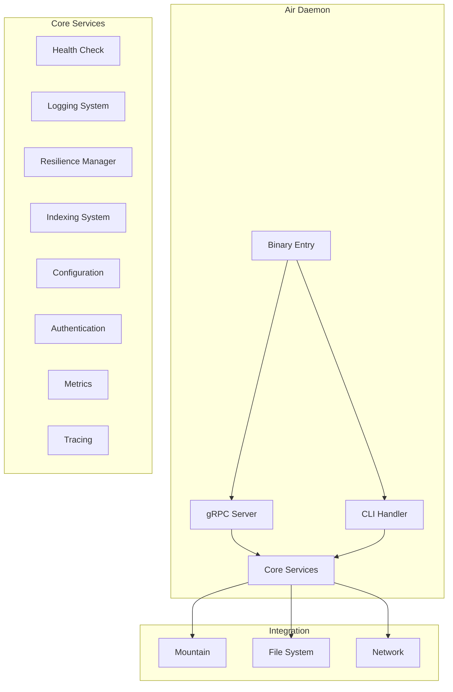
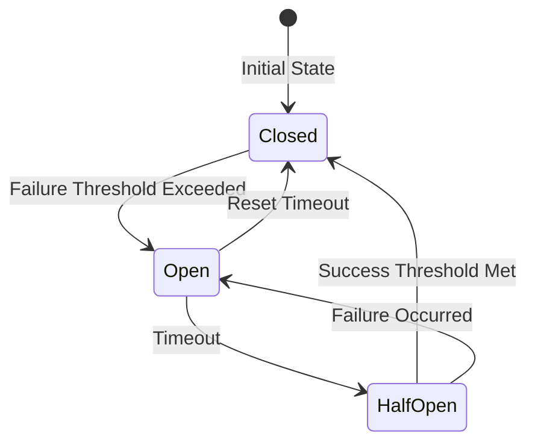
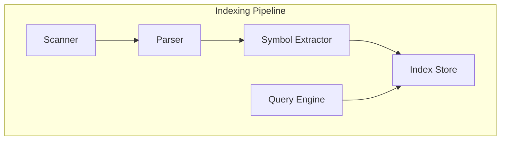
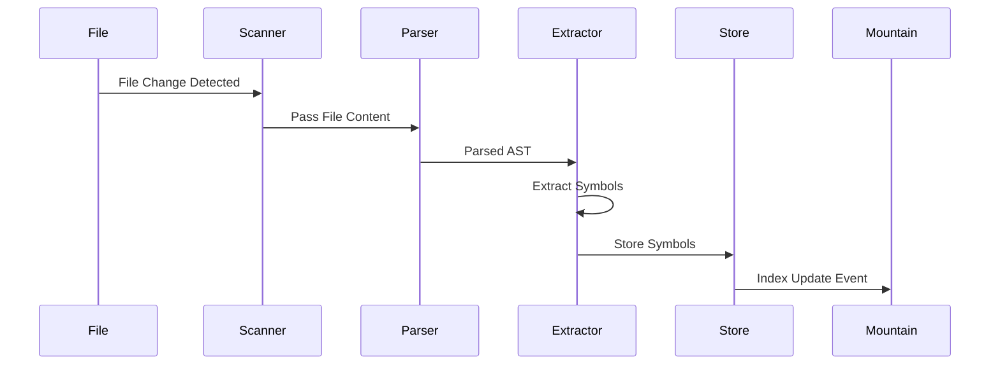
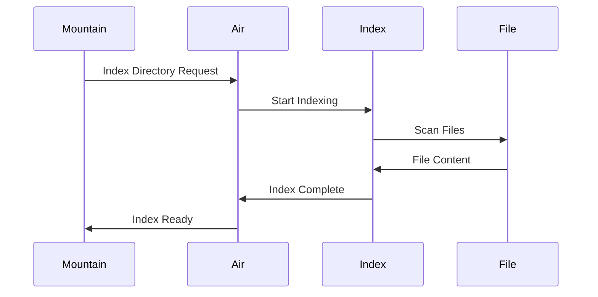

# Air - Background Daemon

## Table of Contents

- [Overview](#overview)
- [Architecture](#architecture)
- [Core Modules](#core-modules)
- [Health Checking](#health-checking)
- [Logging System](#logging-system)
- [Resilience Features](#resilience-features)
- [Indexing System](#indexing-system)
- [Configuration Management](#configuration-management)
- [gRPC Server](#grpc-server)
- [Integration Points](#integration-points)
- [Known Issues and TODOs](#known-issues-and-todos)

---

## Overview

**Air** is the background daemon of Code Editor Land, built with Rust. It provides long-running services, background task management, health monitoring, and indexing capabilities. Air runs independently and communicates with Mountain via gRPC.

### Key Responsibilities

- Background task execution and management
- Health monitoring and reporting
- Structured logging with rotation
- Code indexing for symbol navigation
- Resilience features (circuit breaker, retry, timeout)
- Configuration hot-reload
- Authentication and security
- Metrics collection and tracing

### Technology Stack

- **Language**: Rust
- **Runtime**: tokio
- **RPC**: gRPC (tonic)
- **Logging**: structured logging
- **Async**: tokio async runtime

---

## Architecture

### System Architecture



### Directory Structure

```
Element/Air/
├── Source/
│   ├── Binary.rs                      # Binary entry point
│   ├── Library.rs                     # Core library exports
│   ├── Binary/
│   │   ├── Binary.rs                  # Binary-specific code
│   │   ├── Monitor/                   # Process monitoring
│   │   │   └── StartMonitoring.rs
│   │   ├── Shutdown/                  # Shutdown handling
│   │   │   └── WaitForShutdownSignal.rs
│   │   └── mod.rs
│   ├── CLI/
│   │   └── mod.rs                     # Command-line interface
│   ├── Initialize/
│   │   ├── Command/                   # Command processing
│   │   │   ├── HandleCommand.rs
│   │   │   ├── ParseArguments.rs
│   │   │   ├── ValidateCommand.rs
│   │   │   └── mod.rs
│   │   ├── Configure/                 # Configuration setup
│   │   │   ├── Log/ConfigureLog.rs
│   │   │   ├── Port/SelectPort.rs
│   │   │   └── mod.rs
│   │   ├── Connect/                   # Connection management
│   │   │   ├── ConnectDaemon.rs
│   │   │   └── mod.rs
│   │   ├── Service/                   # Service initialization
│   │   │   ├── Auth/StartAuth.rs
│   │   │   ├── Download/StartDownload.rs
│   │   │   ├── Echo/StartEcho.rs
│   │   │   ├── Health/StartHealthCheck.rs
│   │   │   ├── Index/StartIndex.rs
│   │   │   ├── State/CreateState.rs
│   │   │   ├── Update/StartUpdate.rs
│   │   │   ├── Vine/StartService.rs
│   │   │   └── mod.rs
│   │   ├── Build/
│   │   │   ├── BuildServer.rs
│   │   │   └── mod.rs
│   │   └── mod.rs
│   ├── HealthCheck/
│   │   └── mod.rs                     # Health check system
│   ├── Logging/
│   │   └── mod.rs                     # Logging system
│   ├── Resilience/
│   │   └── mod.rs                     # Resilience features
│   ├── Indexing/
│   │   ├── Background/                # Background indexing
│   │   │   └── StartWatcher.rs
│   │   ├── Language/                  # Language parsers
│   │   │   ├── ParseRust.rs
│   │   │   ├── ParseTypeScript.rs
│   │   │   └── mod.rs
│   │   ├── Process/                   # Index processing
│   │   │   ├── ExtractSymbols.rs
│   │   │   ├── ProcessContent.rs
│   │   │   └── mod.rs
│   │   ├── Scan/                      # File scanning
│   │   │   ├── ScanDirectory.rs
│   │   │   ├── ScanFile.rs
│   │   │   └── mod.rs
│   │   ├── State/                     # Index state management
│   │   │   ├── CreateState.rs
│   │   │   ├── UpdateState.rs
│   │   │   └── mod.rs
│   │   ├── Store/                     # Index storage
│   │   │   ├── QueryIndex.rs
│   │   │   ├── StoreEntry.rs
│   │   │   ├── UpdateIndex.rs
│   │   │   └── mod.rs
│   │   ├── Watch/                     # File watching
│   │   │   └── WatchFile.rs
│   │   └── mod.rs
│   ├── Configuration/
│   │   ├── HotReload.rs               # Hot-reload functionality
│   │   └── mod.rs
│   ├── Authentication/
│   │   └── mod.rs                     # Authentication system
│   ├── Daemon/
│   │   └── mod.rs                     # Daemon management
│   ├── Downloader/
│   │   └── mod.rs                     # Download service
│   ├── Metrics/
│   │   └── mod.rs                     # Metrics collection
│   ├── Security/
│   │   └── mod.rs                     # Security features
│   ├── Tracing/
│   │   └── mod.rs                     # Distributed tracing
│   ├── Updates/
│   │   └── mod.rs                     # Update service
│   ├── Vine/
│   │   ├── Error.rs                   # gRPC errors
│   │   ├── Generated/
│   │   │   ├── air.rs                 # Generated gRPC code
│   │   │   └── mod.rs
│   │   ├── mod.rs
│   │   └── Server/
│   │       └── AirVinegRPCService.rs  # gRPC server
│   ├── ApplicationState/
│   │   └── mod.rs                     # Application state
│   └── Plugins/
│       └── mod.rs                     # Plugin system
├── Proto/
│   └── Air.proto                      # gRPC protocol definition
├── build.rs                           # Build script
└── Cargo.toml
```

---

## Core Modules

### Health Check System

**Location**: [`Element/Air/Source/HealthCheck/mod.rs`](../../Element/Air/Source/HealthCheck/mod.rs)

Provides comprehensive health monitoring:

#### Health Check Levels

| Level | Description | Frequency |
|-------|-------------|-----------|
| **Critical** | System essential services | Every 5 seconds |
| **Warning** | Degraded functionality | Every 30 seconds |
| **Info** | Informational metrics | Every 60 seconds |

#### Health Components

```rust
pub struct HealthCheckManager {
    checks: Vec<Box<dyn HealthCheck>>,
    config: HealthCheckConfig,
    records: Vec<HealthCheckRecord>,
}
```

#### Health Status Types

- **Healthy**: All checks passing
- **Degraded**: Some non-essential checks failing
- **Unhealthy**: Critical checks failing
- **Unknown**: Unable to determine health

#### Key Features

- **Periodic Checks**: Runs health checks on configured intervals
- **Degradation Detection**: Detects system performance degradation
- **Recovery Actions**: Automatic recovery actions when possible
- **Health Statistics**: Tracks health over time
- **Resource Warnings**: Monitors CPU, memory, disk usage

### Logging System

**Location**: [`Element/Air/Source/Logging/mod.rs`](../../Element/Air/Source/Logging/mod.rs)

Provides structured logging with advanced features:

#### Log Levels

| Level | Severity | Use Case |
|-------|----------|----------|
| **ERROR** | Highest | Errors that need immediate attention |
| **WARN** | High | Warning conditions |
| **INFO** | Medium | Informational messages |
| **DEBUG** | Low | Debug information |
| **TRACE** | Lowest | Very detailed trace information |

#### Log Rotation

```rust
pub struct LogRotationConfig {
    pub max_size_mb: u64,
    pub max_files: u32,
    pub compression: bool,
}
```

#### Key Features

- **Structured Logging**: JSON-formatted log entries
- **Log Context**: Request-scoped context for correlated logs
- **Sensitive Data Filtering**: Automatic filtering of sensitive data
- **Log Rotation**: Automatic log file rotation
- **Context Logger**: Thread-local context propagation

#### Example Log Entry

```json
{
  "timestamp": "2024-01-01T12:00:00Z",
  "level": "INFO",
  "message": "Index operation completed",
  "context": {
    "request_id": "abc123",
    "file_count": 42
  },
  "source": "Indexing"
}
```

### Resilience Features

**Location**: [`Element/Air/Source/Resilience/mod.rs`](../../Element/Air/Source/Resilience/mod.rs)

Provides resilience patterns for fault tolerance:

#### Circuit Breaker



**Circuit Breaker States**:

| State | Behavior | Transitions |
|-------|----------|-------------|
| **Closed** | Normal operation, tracking failures | → Open on too many failures |
| **Open** | Fail fast, don't attempt requests | → HalfOpen after timeout |
| **HalfOpen** | Limited requests to test recovery | → Closed on success, → Open on failure |

#### Retry Manager

 configurable retry policies with exponential backoff:

| Config Parameter | Description | Default |
|------------------|-------------|---------|
| Max Attempts | Maximum retry attempts | 3 |
| Initial Delay | Initial delay between retries | 100ms |
| Max Delay | Maximum delay between retries | 5s |
| Backoff Multiplier | Multiplier for exponential backoff | 2.0 |

#### Timeout Manager

Manages operation timeouts:

- **Per-operation timeouts**
- **Timeout cancellation**
- **Timeout statistics tracking**

#### Bulkhead

Limits concurrent operations:

```rust
pub struct BulkheadConfig {
    pub max_concurrent: usize,
    pub max_wait: Duration,
}
```

#### Resilience Orchestrator

Combines all resilience features:

```rust
pub struct ResilienceOrchestrator {
    circuit_breaker: CircuitBreaker,
    retry_manager: RetryManager,
    timeout_manager: TimeoutManager,
}
```

---

## Indexing System

**Location**: [`Element/Air/Source/Indexing/mod.rs`](../../Element/Air/Source/Indexing/mod.rs)

Provides code indexing for symbol navigation and search.

### Index Architecture



### Supported Languages

| Language | Parser | Status |
|----------|--------|--------|
| **Rust** | [`ParseRust.rs`](../../Element/Air/Source/Indexing/Language/ParseRust.rs) | ✅ Implemented |
| **TypeScript** | [`ParseTypeScript.rs`](../../Element/Air/Source/Indexing/Language/ParseTypeScript.rs) | ✅ Implemented |
| **JavaScript** | Reuses TypeScript parser | ✅ Implemented |
| **C#** | Not implemented | ❌ Future |
| **Python** | Not implemented | ❌ Future |

### Index Components

#### Scanner

**Location**: [`Element/Air/Source/Indexing/Scan/`](../../Element/Air/Source/Indexing/Scan/)

Scans files and directories:

- [`ScanDirectory.rs`](../../Element/Air/Source/Indexing/Scan/ScanDirectory.rs) - Directory scanning
- [`ScanFile.rs`](../../Element/Air/Source/Indexing/Scan/ScanFile.rs) - File scanning

#### Parser

**Location**: [`Element/Air/Source/Indexing/Language/`](../../Element/Air/Source/Indexing/Language/)

Language-specific parsers:

- [`ParseRust.rs`](../../Element/Air/Source/Indexing/Language/ParseRust.ts) - Rust source parsing
- [`ParseTypeScript.ts`](../../Element/Air/Source/Indexing/Language/ParseTypeScript.ts) - TypeScript/JavaScript parsing

#### Symbol Extractor

**Location**: [`Element/Air/Source/Indexing/Process/ExtractSymbols.rs`](../../Element/Air/Source/Indexing/Process/ExtractSymbols.rs)

Extracts symbols from parsed code:

Extracted Symbols:
- Functions
- Classes
- Interfaces
- Variables
- Constants
- Types

#### Index Store

**Location**: [`Element/Air/Source/Indexing/Store/`](../../Element/Air/Source/Indexing/Store/)

Stores and queries indexed data:

- [`StoreEntry.rs`](../../Element/Air/Source/Indexing/Store/StoreEntry.rs) - Index entries
- [`QueryIndex.rs`](../../Element/Air/Source/Indexing/Store/QueryIndex.ts) - Query functionality
- [`UpdateIndex.rs`](../../Element/Air/Source/Indexing/Store/UpdateIndex.rs) - Index updates

#### Background Indexer

**Location**: [`Element/Air/Source/Indexing/Background/`](../../Element/Air/Source/Indexing/Background/)

Background indexing:

- [`StartWatcher.rs`](../../Element/Air/Source/Indexing/Background/StartWatcher.rs) - File watching for incremental indexing

### Index Lifecycle



---

## Configuration Management

**Location**: [`Element/Air/Source/Configuration/mod.rs`](../../Element/Air/Source/Configuration/mod.rs)

Provides configuration management with hot-reload.

### Configuration Sources

| Source | Priority | Format |
|--------|----------|--------|
| **File** | Low | TOML/YAML |
| **Environment Variables** | Medium | Key-Value pairs |
| **Command Line** | High | Flags and arguments |

### Hot Reload

**Location**: [`Element/Air/Source/Configuration/HotReload.rs`](../../Element/Air/Source/Configuration/HotReload.rs)

Features:

- **Automatic detection** of configuration file changes
- **Validation** of new configuration before applying
- **Rollback** on validation failure
- **Notification** of configuration changes

---

## Metrics and Tracing

### Metrics Collection

**Location**: [`Element/Air/Source/Metrics/mod.rs`](../../Element/Air/Source/Metrics/mod.rs)

Tracks operational metrics:

- **Counters**: Event counts
- **Gauges**: Current values
- **Histograms**: Distribution of values
- **Timers**: Duration measurements

### Distributed Tracing

**Location**: [`Element/Air/Source/Tracing/mod.rs`](../../Element/Air/Source/Tracing/mod.rs)

Provides request tracing:

- **Trace ID**: Correlates related operations
- **Span ID**: Identifies individual operations
- **Parent Span**: Establishes operation hierarchy
- **Tags**: Additional metadata for spans

---

## gRPC Server

### Protocol Definition

**Location**: [`Element/Air/Proto/Air.proto`](../../Element/Air/Proto/Air.proto)

Defines the gRPC service contract:

```protobuf
syntax = "proto3";

package air;

service AirService {
  // Health Check
  rpc CheckHealth(HealthCheckRequest) returns (HealthCheckResponse);
  
  // Indexing
  rpc IndexDirectory(IndexDirectoryRequest) returns (IndexDirectoryResponse);
  rpc QueryIndex(QueryIndexRequest) returns (QueryIndexResponse);
  
  // Configuration
  rpc GetConfiguration(GetConfigurationRequest) returns (GetConfigurationResponse);
  rpc UpdateConfiguration(UpdateConfigurationRequest) returns (UpdateConfigurationResponse);
  
  // Metrics
  rpc GetMetrics(GetMetricsRequest) returns (GetMetricsResponse);
}
```

### Server Implementation

**Location**: [`Element/Air/Source/Vine/Server/AirVinegRPCService.rs`](../../Element/Air/Source/Vine/Server/AirVinegRPCService.rs)

Implements the gRPC service:

- Service handler implementation
- Request routing
- Response generation
- Error handling

---

## Integration Points

### Mountain Integration

**Location**: [`Element/Mountain/Source/Air/`](../../Element/Mountain/Source/Air/)

Mountain integrates with Air through:

- **Air Client**: [`AirClient.rs`](../../Element/Mountain/Source/Air/AirClient.ts) - gRPC client
- **Service Provider**: [`AirServiceProvider.rs`](../../Element/Mountain/Source/Air/AirServiceProvider.ts) - Service wrapper

### Communication Flow



### CLI Integration

**Location**: [`Element/Air/Source/CLI/mod.rs`](../../Element/Air/Source/CLI/mod.rs)

Provides command-line interface:

- Start/stop daemon
- Run health checks
- Trigger indexing
- Query state
- View logs

---

## Known Issues and TODOs

> **Reference**: See [`../recommendations/refactoring-priorities.md`](../recommendations/refactoring-priorities.md) for complete prioritization details and impact analysis.

---

### Critical Issues (Priority: High - 3-4 weeks)

#### Indexing Performance Optimization

**Impact**: Poor indexing performance causes long wait times for users, especially with large projects (1000+ files), significantly impacting developer productivity and user experience.

**Tasks**:
- [ ] Implement incremental indexing for faster updates
  - Track file modification times to avoid re-indexing unchanged files
  - Maintain differential index for partial updates
  - Reduce re-indexing time from ~30s to <10s for 1000 files
- [ ] Add indexing progress indicators for better UX
  - Implement progress callbacks through gRPC to Mountain
  - Show percentage complete and estimated time remaining
  - Display currently processing file in UI
- [ ] Optimize symbol extraction algorithms
  - Profile current [`ExtractSymbols`](../../Element/Air/Source/Indexing/Process/ExtractSymbols.rs) performance
  - Implement memoization for expensive parsing operations
  - Use efficient data structures for symbol storage (e.g., hash maps, tries)
- [ ] Add LSP integration for language-agnostic indexing
  - Integrate with Language Server Protocol for accurate semantic indexing
  - Support standard LSP features: go-to-definition, references, completion
  - Create [`LspClient`](../../Element/Air/Source/Indexing/Language/) module for LSP communication
- [ ] Implement parallel indexing for multiple files
  - Use [`tokio::spawn`](https://docs.rs/tokio) for concurrent file processing
  - Implement work-stealing queue for load balancing
  - Add configurable concurrency limits based on system resources
- [ ] Add caching for parsed symbols
  - Implement in-memory cache with [`lru`](https://docs.rs/lru) crate
  - Persist cache to disk for faster startup
  - Implement cache invalidation on file changes
- [ ] **Performance Target**: Reduce indexing time for 1000 files from ~30s to <10s

**Estimated Effort**: 3-4 weeks

---

#### Language Support Expansion

**Impact**: Limited language support (only Rust and TypeScript) restricts Air's usefulness to multi-language projects and reduces adoption among developers using other languages.

**Tasks**:
- [ ] Add C# parser module in `Element/Air/Source/Indexing/Language/`
  - Create [`ParseCSharp.rs`](../../Element/Air/Source/Indexing/Language/ParseCSharp.rs) for C# syntax parsing
  - Implement symbol extraction for classes, methods, properties, interfaces
  - Support .NET-specific constructs (namespaces, generics, attributes)
- [ ] Add Python parser module
  - Create [`ParsePython.rs`](../../Element/Air/Source/Indexing/Language/ParsePython.rs) for Python syntax parsing
  - Extract functions, classes, methods, module-level variables
  - Handle Python-specific features (decorators, async/await, type hints)
- [ ] Support for more languages as needed
  - Add [`ParseGo.rs`](../../Element/Air/Source/Indexing/Language/ParseGo.rs) for Go
  - Add [`ParseJava.rs`](../../Element/Air/Source/Indexing/Language/ParseJava.rs) for Java
  - Consider adding JavaScript, C++, PHP based on user demand
- [ ] Create parser plugin system for extensibility
  - Define [`ParserPlugin`](../../Element/Air/Source/Indexing/Language/) trait for language parsers
  - Implement plugin discovery and registration mechanism
  - Allow third-party parsers to be loaded dynamically
- [ ] Implement language detection
  - Create [`DetectLanguage.rs`](../../Element/Air/Source/Indexing/Language/DetectLanguage.rs) for file type identification
  - Use file extensions and shebang lines for detection
  - Support `.editorconfig` and `.gitattributes` for overrides

**Estimated Effort**: 3-4 weeks

---

### High Priority Issues

#### Metrics and Tracing Enhancement

**Impact**: Basic metrics implementation provides limited visibility into Air's performance and health, making it difficult to detect issues, optimize performance, and monitor production deployments.

**Tasks**:
- [ ] Add Prometheus metrics export endpoint
  - Integrate [`prometheus`](https://docs.rs/prometheus) crate for metrics collection
  - Expose HTTP endpoint at `/metrics` for Prometheus scraping
  - Track: indexing duration, request latency, error rates, memory usage
- [ ] Implement OpenTelemetry tracing integration
  - Use [`opentelemetry`](https://docs.rs/opentelemetry) crate for distributed tracing
  - Configure tracing context propagation through gRPC calls
  - Export traces to Jaeger or OTel Collector
- [ ] Create Grafana dashboards for monitoring
  - Design dashboards for: indexing performance, request throughput, error rates
  - Include system metrics: CPU, memory, disk I/O, network
  - Set up alert thresholds for critical metrics
- [ ] Add alert integration for critical issues
  - Configure Prometheus AlertManager for notifications
  - Alert on: failed indexing, high memory usage, long-running operations
  - Integrate with notification channels: PagerDuty, Slack, email
- [ ] Track indexing performance metrics
  - Record per-file indexing duration
  - Track symbol extraction and storage times
  - Monitor cache hit/miss ratios

**Estimated Effort**: 2-3 weeks

---

#### Configuration Hot Reload Testing

**Impact**: Un tested hot-reload functionality increases risk of configuration changes causing runtime errors, service disruption, or data loss in production environments.

**Tasks**:
- [ ] Add comprehensive hot-reload tests
  - Test valid configuration changes applied successfully
  - Test invalid configuration handling and error messages
  - Verify no service interruption during reload
  - Test concurrent configuration requests
- [ ] Test rollback mechanism thoroughly
  - Verify rollback triggered on invalid configuration
  - Test rollback preserves old configuration state
  - Ensure all services use updated/rolled-back configuration
  - Test rollback after service restart
- [ ] Test edge cases and error scenarios
  - Test configuration file corruption handling
  - Test file permission issues
  - Test rapid consecutive configuration changes
  - Test configuration validation for all parameters
- [ ] Validate configuration persistence
  - Verify configuration changes saved to disk
  - Test configuration survives daemon restart
  - Validate configuration backup and restore

**Estimated Effort**: 1 week

---

### Medium Priority Issues

#### Search Performance

**Impact**: Basic search implementation lacks advanced features, making it difficult to find symbols quickly and reducing the effectiveness of the indexing system for large codebases.

**Tasks**:
- [ ] Implement full-text search optimization
  - Integrate [`tantivy`](https://docs.rs/tantivy) for efficient full-text indexing
  - Enable fast substring and regex search across code
  - Implement search result scoring and relevance ranking
- [ ] Add fuzzy search capabilities
  - Use [`fuzzy-matcher`](https://docs.rs/fuzzy-matcher) crate for approximate matching
  - Handle typos and partial symbol names
  - Implement fuzzy search for file names and symbol names
- [ ] Implement search result ranking
  - Rank results by: relevance, recency, popularity
  - Consider file context and symbol type in ranking
  - Allow users to customize ranking preferences
- [ ] Add search query suggestions
  - Implement autocomplete for search queries
  - Suggest similar symbols based on typing
  - Show common search patterns

**Estimated Effort**: 2 weeks

---

#### Cache Management

**Impact**: Unbounded cache growth can lead to memory exhaustion and system instability, while lack of cache management reduces efficiency and performance.

**Tasks**:
- [ ] Implement cache size limits
  - Define maximum memory usage for caches
  - Use [`lru`](https://docs.rs/lru) crate for LRU cache implementation
  - Set sensible defaults (e.g., 100MB index cache, 50MB symbol cache)
- [ ] Add cache eviction policies (LRU, TTL)
  - Implement Least Recently Used (LRU) eviction for symbol cache
  - Add Time-To-Live (TTL) for transient cache entries
  - Allow configuration of eviction thresholds
- [ ] Add cache statistics and monitoring
  - Track: cache size, hit rate, miss rate, eviction count
  - Expose cache metrics through Prometheus endpoint
  - Provide commands to clear or warm caches manually
- [ ] Implement cache warming on startup
  - Load frequently accessed symbols into cache at startup
  - Persist cache to disk for faster subsequent launches
  - Implement background cache preloading during idle periods

**Estimated Effort**: 2 weeks

---

## Key Files Reference

| File | Purpose |
|------|---------|
| [`Element/Air/Source/Binary.rs`](../../Element/Air/Source/Binary.rs) | Binary entry point |
| [`Element/Air/Source/Vine/Server/AirVinegRPCService.rs`](../../Element/Air/Source/Vine/Server/AirVinegRPCService.rs) | gRPC server |
| [`Element/Air/Source/HealthCheck/mod.rs`](../../Element/Air/Source/HealthCheck/mod.rs) | Health check system |
| [`Element/Air/Source/Logging/mod.rs`](../../Element/Air/Source/Logging/mod.rs) | Logging system |
| [`Element/Air/Source/Resilience/mod.rs`](../../Element/Air/Source/Resilience/mod.rs) | Resilience features |
| [`Element/Air/Source/Indexing/mod.rs`](../../Element/Air/Source/Indexing/mod.rs) | Indexing system |
| [`Element/Air/Source/Configuration/HotReload.rs`](../../Element/Air/Source/Configuration/HotReload.rs) | Configuration hot-reload |

---

## See Also

- [Mountain Component](./mountain.md) - Native backend
- [Vine Component](./vine.md) - gRPC protocol
- [Communication Flows](../integration/communication-flows.md) - Detailed communication patterns
