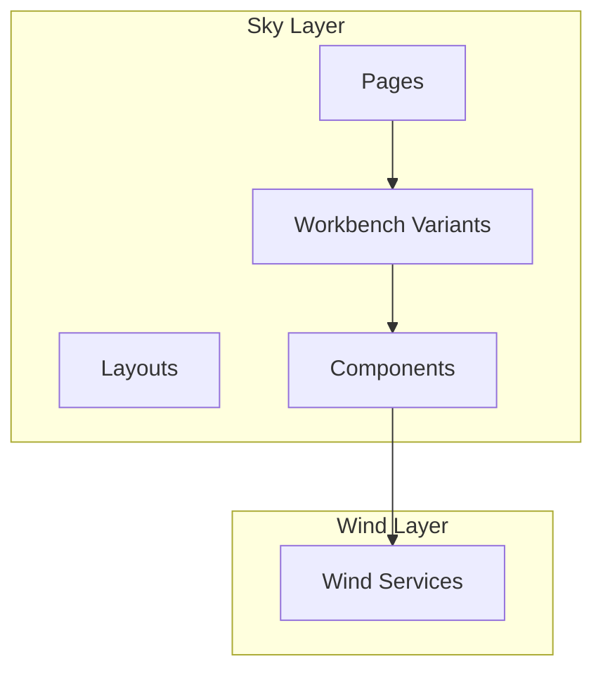
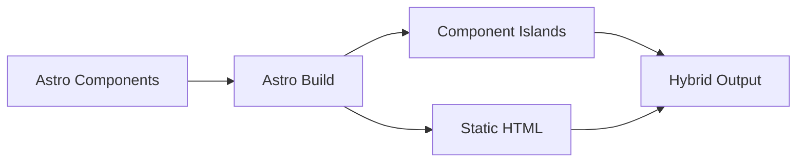
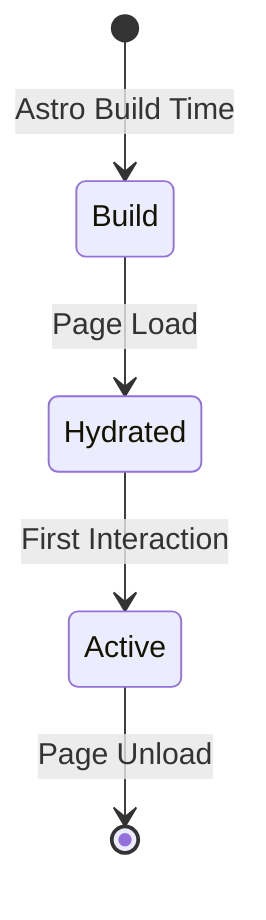

# Sky - UI Components

## Table of Contents

- [Overview](#overview)
- [Architecture](#architecture)
- [Astro Framework](#astro-framework)
- [Page Routing](#page-routing)
- [Workbench Variants](#workbench-variants)
- [Core Components](#core-components)
- [Component Structure](#component-structure)
- [Integration Points](#integration-points)
- [Known Issues and TODOs](#known-issues-and-todos)

---

## Overview

**Sky** is the declarative UI component layer of Code Editor Land, built with the Astro framework. It renders the user interface, manages page routing, and provides multiple workbench variants for different deployment scenarios.

### Key Responsibilities

- Render UI components
- Manage page routing
- Provide workbench variants
- Display application state
- Handle user interactions
- Integrate with Wind services

### Technology Stack

- **Framework**: Astro
- **Language**: TypeScript
- **Styling**: CSS
- **Build**: Astro build system
- **Integration**: Tauri events

---

## Architecture

### Component Hierarchy



### Directory Structure

```
Element/Sky/
├── Source/
│   ├── Function/                     # Utility functions
│   │   ├── Debug.ts                  # Debug utilities
│   │   ├── Meta.astro                # Meta component
│   │   ├── Markup/
│   │   │   └── Base.astro            # Base markup
│   │   └── ...
│   ├── pages/                        # Page routes
│   │   ├── index.astro               # Home page
│   │   ├── Application.astro         # Main application page
│   │   ├── Isolation.astro           # Isolated page
│   │   └── ...
│   ├── Workbench/                    # Workbench variants
│   │   ├── Default.astro             # Default workbench
│   │   ├── Browser.astro             # Browser workbench
│   │   ├── Wind.astro                # Wind workbench
│   │   └── ...
│   └── env.d.ts                      # TypeScript definitions
├── .env.example                      # Environment variables template
├── tsconfig.json                     # TypeScript configuration
└── package.json
```

---

## Astro Framework

### Why Astro?

Astro provides key benefits for Code Editor Land:

| Feature | Benefit |
|---------|---------|
| **Component Islands** | Hydrate only interactive components |
| **Zero JS by Default** | Minimal JavaScript shipped to browser |
| **Framework Agnostic** | Use any UI framework |
| **Fast Build** | Quick build times for development |
| **Static Generation** | Pre-render pages for performance |

### Configuration

**Location**: [`Element/Sky/astro.config.ts`](../../Element/Sky/Source/astro.config.ts)

Astro configuration sets up:

- Integration frameworks
- Build options
- Development server
- Static asset handling

### Build Process



---

## Page Routing

### Route Structure

| Route | Purpose | File |
|-------|---------|------|
| `/` | Home page | `index.astro` |
| `/app` | Main application | `Application.astro` |
| `/isolation` | Isolated mode | `Isolation.astro` |

### Page Components

#### Index Page

**Location**: [`Element/Sky/Source/pages/index.astro`](../../Element/Sky/Source/pages/index.astro)

Home page with:
- Welcome message
- Quick start guide
- Links to key features

#### Application Page

**Location**: [`Element/Sky/Source/pages/Application.astro`](../../Element/Sky/Source/pages/Application.astro)

Main application page that:
- Loads the workbench
- Initializes Wind services
- Sets up event listeners

#### Isolation Page

**Location**: [`Element/Sky/Source/pages/Isolation.astro`](../../Element/Sky/Source/pages/Isolation.astro)

Isolated page for:
- Feature testing
- Component development
- Sandboxed environments

### Routing Logic

```typescript
// Example routing logic
const routes = [
  { path: '/', component: 'IndexPage' },
  { path: '/app', component: 'ApplicationPage' },
  { path: '/isolation', component: 'IsolationPage' }
]
```

---

## Workbench Variants

Sky provides three workbench variants for different scenarios:

### Default Workbench

**Location**: [`Element/Sky/Source/Workbench/Default.astro`](../../Element/Sky/Source/Workbench/Default.astro)

Standard desktop workbench with:
- Full Tauri integration
- Native window controls
- Full feature set
- Desktop-optimized UI

**Use Cases**:
- Desktop application
- Full-featured IDE experience
- Production environment

### Browser Workbench

**Location**: [`Element/Sky/Source/Workbench/Browser.astro`](../../Element/Sky/Source/Workbench/Browser.astro)

Browser-based workbench with:
- Web-only features
- No Tauri integration
- Limited feature set
- Web-optimized UI

**Use Cases**:
- Web deployment
- Cloud-based IDE
- Browser-based development

### Wind Workbench

**Location**: [`Element/Sky/Source/Workbench/Wind.astro`](../../Element/Sky/Source/Workbench/Wind.astro)

Wind-optimized workbench with:
- Integration layer focus
- Service debugging
- Development tools
- Debug-oriented UI

**Use Cases**:
- Service development
- Debugging
- Internal tools

### Workbench Comparison

| Feature | Default | Browser | Wind |
|---------|---------|---------|------|
| Tauri Integration | ✅ Yes | ❌ No | ✅ Yes |
| Native Menus | ✅ Yes | ❌ No | ⚠️ Partial |
| File System | ✅ Full | ⚠️ Limited | ✅ Full |
| Extensions | ✅ Yes | ❌ No | ✅ Yes |
| Debug Tools | ⚠️ Basic | ⚠️ Basic | ✅ Advanced |

---

## Core Components

### Base Components

#### Meta Component

**Location**: [`Element/Sky/Source/Function/Meta.astro`](../../Element/Sky/Source/Function/Meta.astro)

Provides metadata handling:
- Page titles
- Meta tags
- SEO metadata

#### Base Markup

**Location**: [`Element/Sky/Source/Function/Markup/Base.astro`](../../Element/Sky/Source/Function/Markup/Base.astro)

Base HTML structure:
- HTML5 boilerplate
- Common scripts
- Shared styles

### UI Components

#### Layout Components

- **Layout**: Main layout wrapper
- **Sidebar**: Sidebar component
- **Panel**: Panel component
- **Status Bar**: Status bar component

#### Editor Components

- **Editor Container**: Editor wrapper
- **Tab Bar**: Tab bar for open files
- **Line Numbers**: Line numbers display
- **Scrollbar**: Custom scrollbar

#### Explorer Components

- **File Explorer**: File tree view
- **Tree Item**: Tree item component
- **Collapse Action**: Expand/collapse toggle

### Function Components

#### Debug Utilities

**Location**: [`Element/Sky/Source/Function/Debug.ts`](../../Element/Sky/Source/Function/Debug.ts)

Debug utilities:
- Logging functions
- Debug flags
- Performance monitoring

---

## Component Structure

### Component Pattern

Sky components follow this pattern:

```astro
---
// Component logic
import { service } from '@codeeditorland/wind'

const data = await service.getData()
---

<!-- Component template -->
<div>{data}</div>

<style>
  /* Component styles */
  div { color: blue; }
</style>

<script>
  // Client-side scripts
  console.log('Component loaded')
</script>
```

### Component Lifecycle



### Component Communication

Components communicate via:

| Method | Description |
|--------|-------------|
| **Props** | Parent to child data |
| **Events** | Child to parent actions |
| **Services** | Shared state via Wind |
| **Tauri Events** | Cross-component events |

---

## Integration Points

### Wind Integration

Sky components use Wind services:


### Event Handling

#### Tauri Events

Sky listens for events from Mountain:

| Event | Purpose | Source |
|-------|---------|--------|
| `sky://terminal/data` | Terminal output | Mountain |
| `sky://webview/create` | Create webview | Mountain |
| `sky://scm/update-group` | SCM update | Mountain |
| `sky://configuration/changed` | Config change | Mountain |

#### Example Event Listener

```typescript
// Listen for terminal events
import { listen } from '@tauri-apps/api/event'

listen('sky://terminal/data', (event) => {
  const { id, data } = event.payload
  updateTerminal(id, data)
})
```

### State Management

State is managed through:

1. **Wind Services**: Shared state via services
2. **Component State**: Local component state
3. **URL State**: Query parameters and hash

### Navigation

Page navigation uses Astro's routing:

```astro
---
import { Link } from 'astro:components'
---

<Link href="/app">Open App</Link>
```

---

## Deployment Scenarios

### Desktop Application

**Variant**: Default Workbench

Deployment steps:
1. Build Astro site
2. Bundle with Tauri
3. Package for target OS

### Web Application

**Variant**: Browser Workbench

Deployment steps:
1. Build Astro site
2. Deploy to web server
3. Configure backend API

### Development Environment

**Variant**: Wind Workbench

Development setup:
1. Run Tauri dev mode
2. Mount workbench
3. Access at localhost

---

## Known Issues and TODOs

### Current Issues

1. **Component Coverage**
   - Not all UI components implemented
   - Some features missing in browser variant
   - Limited styling consistency

2. **Performance**
   - Large bundle size
   - Slow initial load
   - Memory leaks in some components

3. **Testing**
   - Limited component tests
   - Integration tests needed

### Future Enhancements

1. **Components**
   - Complete UI component library
   - Consistent design system
   - Better accessibility

2. **Features**
   - Dark mode support
   - Customizable UI
   - Better performance

3. **Developer Experience**
   - Component playground
   - Storybook integration
   - Better debugging tools

---

## Key Files Reference

| File | Purpose |
|------|---------|
| [`Element/Sky/Source/pages/Application.astro`](../../Element/Sky/Source/pages/Application.astro) | Main application page |
| [`Element/Sky/Source/pages/index.astro`](../../Element/Sky/Source/pages/index.astro) | Home page |
| [`Element/Sky/Source/Workbench/Default.astro`](../../Element/Sky/Source/Workbench/Default.astro) | Default workbench |
| [`Element/Sky/Source/Workbench/Browser.astro`](../../Element/Sky/Source/Workbench/Browser.astro) | Browser workbench |
| [`Element/Sky/Source/Workbench/Wind.astro`](../../Element/Sky/Source/Workbench/Wind.astro) | Wind workbench |

---

## See Also

- [Wind Component](./wind.md) - Service layer
- [Mountain Component](./mountain.md) - Native backend
- [Communication Flows](../integration/communication-flows.md) - Detailed communication patterns
- [Application Startup Workflow](../../GitHub/Workflow/Application%20Startup%20%26%20Handshake.md) - Startup sequence
