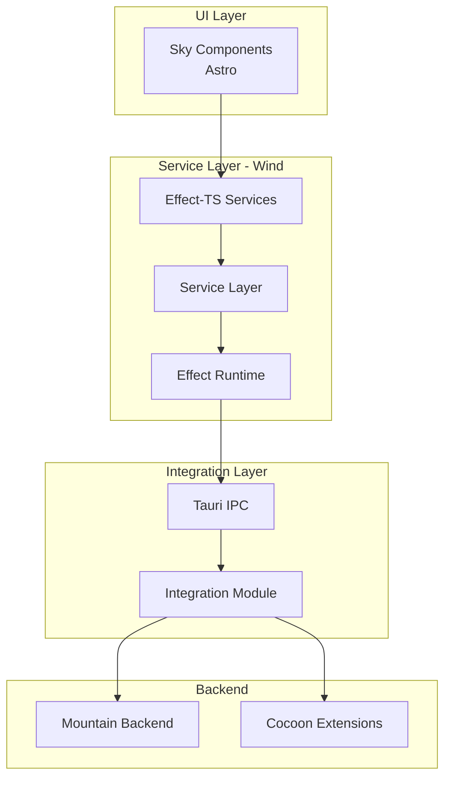
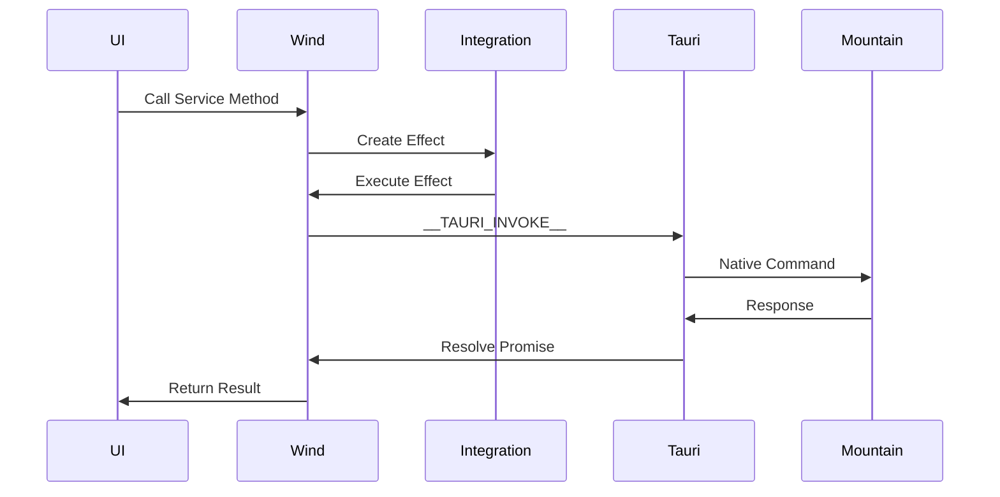
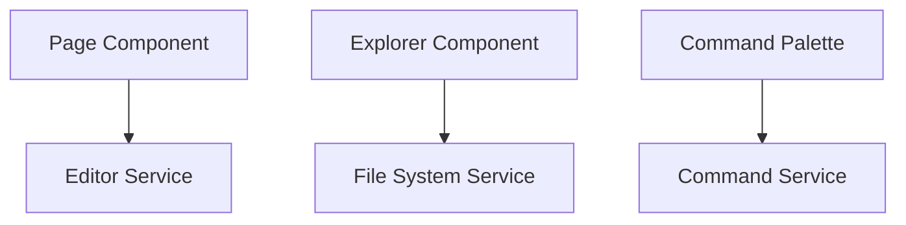

# Wind - UI Service Layer

## Table of Contents

- [Overview](#overview)
- [Architecture](#architecture)
- [Core Services](#core-services)
- [Effect-TS Architecture](#effect-ts-architecture)
- [Tauri IPC Integration](#tauri-ipc-integration)
- [Service Catalog](#service-catalog)
- [Integration Points](#integration-points)
- [Known Issues and TODOs](#known-issues-and-todos)

---

## Overview

**Wind** is the UI service layer of Code Editor Land, re-implementing VS Code's workbench services using Effect-TS. It provides the application logic that bridges the UI components (Sky) with the native backend (Mountain) and extension host (Cocoon).

### Key Responsibilities

- Implement VS Code workbench services
- Manage editor state and operations
- Coordinate file system operations
- Handle language features
- Manage UI state and events
- Integrate with Tauri for IPC
- Provide service layer for Sky components

### Technology Stack

- **Language**: TypeScript
- **Framework**: Effect-TS
- **Build**: ESBuild
- **IPC**: Tauri
- **Integration**: Monaco Editor

---

## Architecture

### Layer Architecture



### Directory Structure

Note: Wind source structure is defined in Element/Wind. Based on the VS Code workbench architecture, key services would include:

```
Element/Wind/
├── Source/
│   ├── Application/
│   │   ├── DesktopMain.ts            # Application entry point
│   │   ├── Editor/                   # Editor services
│   │   │   ├── Definition.ts         # Editor service interface
│   │   │   └── Live.ts               # Live implementation
│   │   ├── FileSystem/               # File system services
│   │   │   ├── Definition.ts
│   │   │   └── Live.ts
│   │   ├── BulkEdit/                 # Bulk edit operations
│   │   │   └── Live.ts
│   │   ├── QuickInput/               # Quick input UI
│   │   │   ├── Definition.ts
│   │   │   └── Live.ts
│   │   └── Preload.ts                # Tauri preload script
│   ├── Preload.ts
│   └── Various other services...
```

---

## Core Services

### Editor Service

**Location**: [`Element/Wind/Source/Application/Editor/`](../../Element/Wind/Source/Application/Editor/)

Manages text editors:

- **Editor Creation**: Create and manage editor instances
- **Editor State**: Track editor state and models
- **Editor Operations**: Handle editor actions (save, close, etc.)
- **Editor Groups**: Manage editor groups and layout

### File System Service

**Location**: [`Element/Wind/Source/Application/FileSystem/`](../../Element/Wind/Source/Application/FileSystem/)

Provides file system abstraction:

- **File Operations**: Read, write, delete files
- **Directory Operations**: List, create, delete directories
- **File Providers**: Pluggable file system providers
- **URI Handling**: Convert between URIs and file paths

### Bulk Edit Service

**Location**: [`Element/Wind/Source/Application/BulkEdit/Live.ts`](../../Element/Wind/Source/Application/BulkEdit/Live.ts)

Handles bulk edit operations:

- **Workspace Edits**: Apply multiple edits across workspace
- **Resource Edits**: Apply edits to specific files
- **Edit Validation**: Validate edits before applying
- **Edit History**: Track edit history

### Quick Input Service

**Location**: [`Element/Wind/Source/Application/QuickInput/`](../../Element/Wind/Source/Application/QuickInput/)

Provides quick input UI:

- **Quick Pick**: Quick pick selection UI
- **Input Box**: Simple text input
- **Custom Quick Input**: Custom quick pick implementations

### Command Service

Manages command registration and execution:

- **Command Registration**: Register commands
- **Command Execution**: Execute commands
- **Command Discovery**: Discover available commands

### Language Features Service

Provides language feature implementations:

- **Hover**: Hover tooltip
- **Completion**: Code completion
- **Definition**: Go to definition
- **References**: Find references
- **Code Actions**: Code actions

---

## Effect-TS Architecture

### Effect Structure

Wind uses Effect-TS for all service operations:

```typescript
// Example effect-based service
const readFileEffect = Effect.gen(function* () {
  const fileService = yield* IFileService
  const content = yield* fileService.readFile(uri)
  return content
})
```

### Service Layer

Services are composed into a service layer:

```typescript
// Service layer composition
const AppLayer = Layer.mergeAll(
  EditorService.live,
  FileSystemService.live,
  CommandService.live,
  LanguageFeaturesService.live,
  // ... other services
)
```

### Runtime Management

Effects are executed through a runtime:

```typescript
// Runtime creation
const runtime = Effect.runSync(AppLayer.pipe(
  Layer.provide(ExecutionContext),
  Layer.launch(InitialEffects)
))
```

### Error Handling

Effect-TS provides comprehensive error handling:

| Error Type | Handling |
|------------|----------|
| **Known Errors** | Recoverable, handled in effects |
| **Unknown Errors** | Logged and propagated to UI |
| **IO Errors** | Retry with backoff |
| **Validation Errors** | Display to user |

---

## Tauri IPC Integration

### Preload Script

**Location**: [`Element/Wind/Source/Preload.ts`](../../Element/Wind/Source/Preload.ts)

Shims the VS Code API for Tauri:

```typescript
// VS Code API shim
window.vscode = {
  postMessage: (message) => {
    __TAURI_INVOKE__('mountain://ipc/post', { message })
  },
  onMessage: (callback) => {
    __TAURI_LISTEN__('vscode-message', callback)
  }
}
```

### IPC Communication Pattern



### Tauri Command Schema

Commands follow a URI scheme:

| Command Pattern | Purpose |
|-----------------|---------|
| `mountain://command/get-all` | Get all commands |
| `mountain://command/execute` | Execute a command |
| `mountain://language-feature/provide-hover` | Provide hover info |
| `mountain://file/read` | Read a file |
| `mountain://file/write` | Write a file |

### Message Types

| Type | Format | Usage |
|------|--------|-------|
| **Command Invoke** | `__TAURI_INVOKE__(commandId, args)` | Send command to Mountain |
| **Event Listener** | `__TAURI_LISTEN__(eventId, callback)` | Listen for events from Mountain |
| **Event Emission** | `__TAURI_EMIT__(eventId, data)` | Emit events (if client-side allowed) |

---

## Service Catalog

### Core Services

| Service | Purpose | Interface | Implementation |
|---------|---------|-----------|----------------|
| **Editor Service** | Editor management | `IEditorService` | `Live.ts` |
| **File System Service** | File operations | `IFileService` | `Live.ts` |
| **Command Service** | Command execution | `ICommandService` | `Live.ts` |
| **Quick Input Service** | Quick input UI | `IQuickInputService` | `Live.ts` |
| **Bulk Edit Service** | Bulk edits | `IBulkEditService` | `Live.ts` |

### Language Feature Services

| Service | Purpose | Status |
|---------|---------|--------|
| **Language Features Service** | Language features | ✅ Implemented |
| **Hover Provider** | Hover tooltips | ✅ Implemented |
| **Completion Provider** | Code completion | ✅ Implemented |
| **Definition Provider** | Go to definition | ✅ Implemented |
| **References Provider** | Find references | ✅ Implemented |
| **Code Actions Provider** | Code actions | ✅ Implemented |

### UI Services

| Service | Purpose | Status |
|---------|---------|--------|
| **Status Bar Service** | Status bar items | ⚠️ Partial |
| **Activity Bar Service** | Activity bar | ⚠️ Partial |
| **Sidebar Service** | Sidebar management | ⚠️ Partial |
| **Panel Service** | Panel management | ⚠️ Partial |

---

## Integration Points

### Sky Integration

Wind provides the service layer that Sky components use:



### Mountain Integration

Wind communicates with Mountain via Tauri IPC:

| Integration | Method | Direction |
|-------------|--------|-----------|
| File Operations | Tauri Invoke | Wind → Mountain |
| Command Execution | Tauri Invoke | Wind → Mountain |
| Language Features | Tauri Invoke | Wind → Mountain |
| State Updates | Tauri Events | Mountain → Wind |

### Cocoon Integration

Wind indirectly communicates with Cocoon via Mountain:

| Feature | Path |
|---------|------|
| Language Features | Wind → Mountain → Cocoon |
| Extension Commands | Wind → Mountain → Cocoon |
| Webview Messages | Wind → Mountain → Cocoon |

### Monaco Editor Integration

Wind integrates with Monaco Editor for text editing:

```typescript
// Service integration with Monaco
const EditorService = Effect.gen(function* () {
  const editor = yield* Effect.tryPromise(() => {
    return monaco.editor.create(container, options)
  })
  return editor
})
```

---

## Known Issues and TODOs

### Critical Implementation Tasks

#### 1. Missing UI Services (HIGH PRIORITY)

**Status**: ❌ Not Implemented
**Reference**: [`../recommendations/refactoring-priorities.md`](../recommendations/refactoring-priorities.md) (Wind Service Coverage, lines 80-98)
**Estimated Effort**: 2-3 weeks

The following VS Code workbench UI services are completely missing and need to be implemented:

##### Status Bar Service

**File**: `Element/Wind/Source/Effect/StatusBar.ts`
**Purpose**: Manage status bar items and their display

**Required Interface**:
```typescript
export interface StatusBarItem {
  readonly id: string;
  readonly text: string;
  readonly alignment: "left" | "right";
  readonly priority: number;
  readonly color?: string;
  readonly backgroundColor?: string;
  readonly tooltip?: string;
  readonly command?: string;
  readonly icon?: string;
}

export interface StatusBarService {
  readonly createItem: (item: Omit<StatusBarItem, "id">) => Effect.Effect<StatusBarItem>;
  readonly updateItem: (id: string, updates: Partial<StatusBarItem>) => Effect.Effect<void>;
  readonly removeItem: (id: string) => Effect.Effect<void>;
  readonly getItem: (id: string) => Effect.Effect<StatusBarItem | undefined>;
  readonly items: Effect.Effect<ReadonlyArray<StatusBarItem>>;
  readonly itemsChanges: Stream.Stream<ReadonlyArray<StatusBarItem>>;
}
```

**Implementation Steps**:
1. Create error classes: `StatusBarItemNotFoundError`, `StatusBarUpdateError`
2. Implement service interface following [`IPC.ts`](../../Element/Wind/Source/Effect/IPC.ts) pattern
3. Create `StatusBarLive` layer with in-memory storage using `SubscriptionRef`
4. Create `StatusBarMockLive` for testing
5. Add telemetry integration for status bar operations

##### Activity Bar Service

**File**: `Element/Wind/Source/Effect/ActivityBar.ts`
**Purpose**: Manage activity bar items and their display

**Required Interface**:
```typescript
export interface ActivityBarItem {
  readonly id: string;
  readonly title: string;
  readonly icon: string;
  readonly command: string;
  readonly position: number;
  readonly badge?: {
    readonly text: string;
    readonly color?: string;
  };
}

export interface ActivityBarService {
  readonly createItem: (item: Omit<ActivityBarItem, "id">) => Effect.Effect<ActivityBarItem>;
  readonly updateItem: (id: string, updates: Partial<ActivityBarItem>) => Effect.Effect<void>;
  readonly removeItem: (id: string) => Effect.Effect<void>;
  readonly getItem: (id: string) => Effect.Effect<ActivityBarItem | undefined>;
  readonly items: Effect.Effect<ReadonlyArray<ActivityBarItem>>;
  readonly itemsChanges: Stream.Stream<ReadonlyArray<ActivityBarItem>>;
  readonly setActiveItem: (id: string) => Effect.Effect<void>;
  readonly getActiveItem: Effect.Effect<string | undefined>;
}
```

**Implementation Steps**:
1. Create error classes: `ActivityBarItemNotFoundError`, `ActivityBarUpdateError`
2. Implement service interface following IPC.ts pattern
3. Create `ActivityBarLive` layer with in-memory storage using `SubscriptionRef`
4. Create `ActivityBarMockLive` for testing
5. Add telemetry integration for activity bar operations
6. Implement active item state management

##### Sidebar Service

**File**: `Element/Wind/Source/Effect/Sidebar.ts`
**Purpose**: Manage sidebar panels and their display

**Required Interface**:
```typescript
export interface SidebarPanel {
  readonly id: string;
  readonly title: string;
  readonly icon: string;
  readonly position: "left" | "right";
  readonly priority: number;
  readonly viewId: string;
  readonly collapsed: boolean;
}

export interface SidebarService {
  readonly createPanel: (panel: Omit<SidebarPanel, "id">) => Effect.Effect<SidebarPanel>;
  readonly updatePanel: (id: string, updates: Partial<SidebarPanel>) => Effect.Effect<void>;
  readonly removePanel: (id: string) => Effect.Effect<void>;
  readonly getPanel: (id: string) => Effect.Effect<SidebarPanel | undefined>;
  readonly panels: Effect.Effect<ReadonlyArray<SidebarPanel>>;
  readonly panelsChanges: Stream.Stream<ReadonlyArray<SidebarPanel>>;
  readonly setActivePanel: (id: string) => Effect.Effect<void>;
  readonly getActivePanel: Effect.Effect<string | undefined>;
  readonly togglePanel: (id: string) => Effect.Effect<void>;
  readonly collapsePanel: (id: string) => Effect.Effect<void>;
  readonly expandPanel: (id: string) => Effect.Effect<void>;
}
```

**Implementation Steps**:
1. Create error classes: `SidebarPanelNotFoundError`, `SidebarUpdateError`
2. Implement service interface following IPC.ts pattern
3. Create `SidebarLive` layer with in-memory storage using `SubscriptionRef`
4. Create `SidebarMockLive` for testing
5. Add telemetry integration for sidebar operations
6. Implement active panel and collapsed state management

##### Panel Service

**File**: `Element/Wind/Source/Effect/Panel.ts`
**Purpose**: Manage bottom panel views (output, debug console, terminal, etc.)

**Required Interface**:
```typescript
export interface PanelView {
  readonly id: string;
  readonly title: string;
  readonly type: "output" | "debug" | "terminal" | "problems" | "custom";
  readonly priority: number;
  readonly visible: boolean;
  readonly maximized: boolean;
}

export interface PanelService {
  readonly createView: (view: Omit<PanelView, "id">) => Effect.Effect<PanelView>;
  readonly updateView: (id: string, updates: Partial<PanelView>) => Effect.Effect<void>;
  readonly removeView: (id: string) => Effect.Effect<void>;
  readonly getView: (id: string) => Effect.Effect<PanelView | undefined>;
  readonly views: Effect.Effect<ReadonlyArray<PanelView>>;
  readonly viewsChanges: Stream.Stream<ReadonlyArray<PanelView>>;
  readonly setActiveView: (id: string) => Effect.Effect<void>;
  readonly getActiveView: Effect.Effect<string | undefined>;
  readonly showView: (id: string) => Effect.Effect<void>;
  readonly hideView: (id: string) => Effect.Effect<void>;
  readonly toggleView: (id: string) => Effect.Effect<void>;
  readonly maximizeView: (id: string) => Effect.Effect<void>;
  readonly restoreView: (id: string) => Effect.Effect<void>;
}
```

**Implementation Steps**:
1. Create error classes: `PanelViewNotFoundError`, `PanelUpdateError`
2. Implement service interface following IPC.ts pattern
3. Create `PanelLive` layer with in-memory storage using `SubscriptionRef`
4. Create `PanelMockLive` for testing
5. Add telemetry integration for panel operations
6. Implement active view, visibility, and maximized state management

#### 2. Additional Missing Services (MEDIUM PRIORITY)

**Reference**: [`../recommendations/refactoring-priorities.md`](../recommendations/refactoring-priorities.md) (Wind Prioritized Actions, lines 488-496)
**Estimated Effort**: 3-4 weeks

The following VS Code workbench services are also missing:

- **Terminal Service** - Manage integrated terminal instances
- **Debug Service** - Debug Adapter Protocol (DAP) integration
- **SCM Service** - Source Control Management integration
- **Search Service** - Search across files and workspace
- **Task Service** - Task execution and management

#### 3. Performance Optimization (MEDIUM PRIORITY)

**Status**: ⚠️ Identified Issue
**Reference**: [`../recommendations/refactoring-priorities.md`](../recommendations/refactoring-priorities.md) (Wind Performance Optimization, lines 206-219)
**Estimated Effort**: 2-3 weeks

**Current Issues**:
- Effect execution overhead
- Tauri IPC latency
- Memory usage

**Implementation Steps**:
1. Profile Effect execution to identify bottlenecks
2. Optimize service layer by reducing unnecessary Effect compositions
3. Implement batching for IPC calls where applicable
4. Add lazy loading for infrequently used services
5. Add performance monitoring and metrics

#### 4. Testing Infrastructure (MEDIUM PRIORITY)

**Status**: ⚠️ Limited Coverage
**Reference**: [`../recommendations/refactoring-priorities.md`](../recommendations/refactoring-priorities.md) (Wind Prioritized Actions, lines 494)
**Estimated Effort**: 2-3 weeks

**Current Issues**:
- Limited test coverage for services
- No integration tests
- No end-to-end tests

**Implementation Steps**:
1. Add unit tests for all service interfaces
2. Add integration tests for cross-service communication
3. Add end-to-end tests for critical workflows
4. Set up continuous testing pipeline
5. Add test coverage reporting

#### 5. Advanced Features (LOW PRIORITY)

**Status**: ⚠️ Not Implemented
**Reference**: [`../recommendations/refactoring-priorities.md`](../recommendations/refactoring-priorities.md) (Wind Advanced Features, lines 342-356)
**Estimated Effort**: 3-4 weeks

**Planned Enhancements**:
- Better error handling with contextual error messages
- Enhanced diagnostics and debugging capabilities
- Performance monitoring and profiling tools
- Comprehensive logging system

**Implementation Steps**:
1. Add contextual error types with recovery strategies
2. Implement diagnostic logging with structured output
3. Add performance monitoring with effect execution tracking
4. Create debugging tools for service inspection
5. Add configurable log levels and output targets

---

## Key Files Reference

| File | Purpose |
|------|---------|
| [`Element/Wind/Source/Application/DesktopMain.ts`](../../Element/Wind/Source/Application/DesktopMain.ts) | Application entry point |
| [`Element/Wind/Source/Application/Editor/Definition.ts`](../../Element/Wind/Source/Application/Editor/Definition.ts) | Editor service interface |
| [`Element/Wind/Source/Application/FileSystem/Definition.ts`](../../Element/Wind/Source/Application/FileSystem/Definition.ts) | File system service interface |
| [`Element/Wind/Source/Preload.ts`](../../Element/Wind/Source/Preload.ts) | Tauri preload script |

---

## See Also

- [Sky Component](./sky.md) - UI component layer
- [Mountain Component](./mountain.md) - Native backend
- [Cocoon Component](./cocoon.md) - Extension host
- [Communication Flows](../integration/communication-flows.md) - Detailed communication patterns
- [Application Startup Workflow](../../GitHub/Workflow/Application%20Startup%20%26%20Handshake.md) - Startup sequence
