# Build System Migration: Shell Scripts to Configuration-Based Builds

## Executive Summary

This document outlines the comprehensive migration plan from shell script-based
builds to a configuration-driven build system using `land-config.json`. The
migration enables triggering builds directly with the Cargo utility instead of
shell scripts.

**Status**: Implementation Complete **Version**: 1.2.0 **Date**: 2026-02-14

---

## Table of Contents

1. [Current State Analysis](#1-current-state-analysis)
2. [Environment Variable Inventory](#2-environment-variable-inventory)
3. [Current Build Flow Documentation](#3-current-build-flow-documentation)
4. [Migration Plan](#4-migration-plan)
5. [Cargo CLI Interface Design](#5-cargo-cli-interface-design)
6. [Backward Compatibility Strategy](#6-backward-compatibility-strategy)
7. [Testing Recommendations](#7-testing-recommendations)
8. [Implementation Roadmap](#8-implementation-roadmap)
9. [Implementation Summary](#9-implementation-summary)

## Build System Architecture Transition

```mermaid
flowchart LR
    subgraph OLD["Old Build Flow (Shell Scripts)"]
        USR1["User runs bash script"]
        SS1["Shell Script<br/>(Debug.sh, Release.sh)"]
        EV1["Set Environment Variables<br/>(Browser, Bundle, NODE_ENV, etc.)"]
        CB1["Call Cargo Binary<br/>./Target/release/Maintain"]
        CG["Read env vars<br/>Generate config"]
        MCF["Modify Cargo.toml<br/>Modify tauri.conf.json"]
        TB1["pnpm tauri build<br/>(through shell)"]
    end

    subgraph NEW["New Build Flow (Cargo CLI)"]
        USR2["User runs cargo"]
        CLI["cargo run --bin Maintain<br/>-- --profile debug"]
        CL["Parse CLI args<br/>(clap)"]
        CFG["Read land-config.json<br/>Resolve profile"]
        ER["EnvironmentResolver<br/>Generate env vars"]
        RS["Run Rhai script<br/>(optional)"]
        TB2["pnpm tauri build<br/>(direct)"]
    end

    subgraph COMMON["Shared Components"]
        Mnt["Mountain"]
        TBP["Tauri Build Process"]
        AST["Astro/Vite Build<br/>(Element/Sky)"]
        BIN["Binary Output"]
    end

    subgraph COMPAT["Backward Compatibility"]
        WRAP["Shell Script Wrapper<br/>(calls cargo CLI)"]
        ALT1["Alt: bash Maintain/Debug.sh"]
        PASS["Pass-through to cargo CLI"]
    end

    USR1 --> SS1
    SS1 --> EV1
    EV1 --> CB1
    CB1 --> CG
    CG --> MCF
    MCF --> TB1
    TB1 --> TBP

    USR2 --> CLI
    CLI --> CL
    CL --> CFG
    CFG --> ER
    ER --> RS
    RS --> TB2
    TB2 --> TBP

    TBP --> AST
    AST --> BIN

    ALT1 --> WRAP
    WRAP --> PASS
    PASS --> CLI

    style OLD fill:#ffcccc
    style NEW fill:#ccffcc
    style COMMON fill:#ccccff
    style COMPAT fill:#ffffcc

    SS1 -. legacy .-> WRAP
```



---

## 1. Current State Analysis

### 1.1 Build Script Locations

| Directory              | Scripts     | Purpose                     |
| ---------------------- | ----------- | --------------------------- |
| `Maintain/`            | 5 scripts   | Primary build orchestration |
| `Maintain/Debug/`      | 2 scripts   | Debug build variants        |
| `Maintain/Release/`    | 1 script    | Release build variants      |
| `Dependency/Maintain/` | 20+ scripts | Dependency management       |

### 1.2 Configuration Files

| File                          | Purpose               | Format |
| ----------------------------- | --------------------- | ------ |
| `.vscode/land-config.json`    | Central configuration | JSON5  |
| `turbo.json`                  | Turborepo environment | JSON   |
| `Element/Maintain/Cargo.toml` | Rust package manifest | TOML   |

### 1.3 Current Architecture

```
┌─────────────────────────────────────────────────────────────────┐
│                    CURRENT BUILD FLOW                           │
├─────────────────────────────────────────────────────────────────┤
│                                                                 │
│  User runs: bash Maintain/Debug.sh                             │
│       │                                                         │
│       ▼                                                         │
│  ┌─────────────────────────────────────────┐                   │
│  │ Shell Script (Debug.sh)                 │                   │
│  │ - Parse --profile argument               │                   │
│  │ - Set environment variables              │                   │
│  │ - Call ./Target/release/Maintain         │                   │
│  └─────────────────────────────────────────┘                   │
│       │                                                         │
│       ▼                                                         │
│  ┌─────────────────────────────────────────┐                   │
│  │ Cargo Binary (./Target/release/Maintain)│                   │
│  │ - Read environment variables             │                   │
│  │ - Generate product names                 │                   │
│  │ - Modify Cargo.toml, tauri.conf.json     │                   │
│  │ - Execute: pnpm tauri build --debug      │                   │
│  └─────────────────────────────────────────┘                   │
│       │                                                         │
│       ▼                                                         │
│  Tauri Build Process                                           │
│                                                                 │
└─────────────────────────────────────────────────────────────────┘
```

---

## 2. Environment Variable Inventory

### 2.1 Complete Environment Variable List

A total of **70+ environment variables** were identified across all sources.

#### 2.1.1 Build Flags (Shell Scripts)

| Variable   | Type    | Values         | Source                  |
| ---------- | ------- | -------------- | ----------------------- |
| `Browser`  | Boolean | `true`/`false` | Debug.sh, Release.sh    |
| `Wind`     | Boolean | `true`/`false` | Debug.sh, Debug/Wind.sh |
| `Mountain` | Boolean | `true`/`false` | Debug.sh, Release.sh    |
| `Electron` | Boolean | `true`/`false` | Debug.sh                |
| `Bundle`   | Boolean | `true`/`false` | All scripts             |
| `Clean`    | Boolean | `true`/`false` | All scripts             |
| `Compile`  | Boolean | `true`/`false` | All scripts             |
| `Debug`    | Boolean | `true`/`false` | Debug scripts           |

#### 2.1.2 Build Configuration (Shell Scripts)

| Variable       | Type   | Values                       | Source               |
| -------------- | ------ | ---------------------------- | -------------------- |
| `Level`        | String | `silent`, `info`, `debug`    | Debug.sh, Release.sh |
| `Dependency`   | String | `Microsoft/VSCode`, org/repo | All scripts          |
| `NODE_ENV`     | String | `development`, `production`  | All scripts          |
| `NODE_VERSION` | String | `22`, `20`, `18`             | All scripts          |
| `NODE_OPTIONS` | String | `--max-old-space-size=16384` | All scripts          |
| `RUST_LOG`     | String | `debug`, `info`, `warn`      | Release.sh           |

#### 2.1.3 Mountain/Cocoon Configuration (Rust Constants)

| Variable                      | Type   | Default              | Constant File                   |
| ----------------------------- | ------ | -------------------- | ------------------------------- |
| `MOUNTAIN_DIR`                | String | `Element/Mountain`   | DirectoryEnvironmentConstant.rs |
| `MOUNTAIN_ORIGINAL_BASE_NAME` | String | `Mountain`           | NameEnvironmentConstant.rs      |
| `MOUNTAIN_BUNDLE_ID_PREFIX`   | String | `land.editor.binary` | PrefixEnvironmentConstant.rs    |

#### 2.1.4 Tauri Environment Variables (turbo.json)

| Variable                             | Purpose                 |
| ------------------------------------ | ----------------------- |
| `TAURI_ENV_ARCH`                     | Target architecture     |
| `TAURI_ENV_DEBUG`                    | Debug mode flag         |
| `TAURI_ENV_FAMILY`                   | OS family               |
| `TAURI_ENV_PLATFORM`                 | Target platform         |
| `TAURI_ENV_PLATFORM_VERSION`         | Platform version        |
| `TAURI_ENV_TARGET_TRIPLE`            | Target triple           |
| `TAURI_DEV_HOST`                     | Development server host |
| `TAURI_DEV_ROOT_CERTIFICATE_PATH`    | SSL certificate path    |
| `TAURI_CLI_PORT`                     | CLI port                |
| `TAURI_CLI_CONFIG_DEPTH`             | Config depth            |
| `TAURI_CLI_NO_DEV_SERVER_WAIT`       | Skip dev server wait    |
| `TAURI_CLI_WATCHER_IGNORE_FILENAME`  | Watcher ignore file     |
| `TAURI_ANDROID_PROJECT_PATH`         | Android project path    |
| `TAURI_IOS_PROJECT_PATH`             | iOS project path        |
| `TAURI_BUNDLER_WIX_FIPS_COMPLIANT`   | WiX FIPS compliance     |
| `TAURI_LINUX_AYATANA_APPINDICATOR`   | Linux appindicator      |
| `TAURI_SIGNING_PRIVATE_KEY`          | Signing private key     |
| `TAURI_SIGNING_PRIVATE_KEY_PASSWORD` | Key password            |
| `TAURI_SIGNING_RPM_KEY`              | RPM signing key         |
| `TAURI_SIGNING_RPM_KEY_PASSPHRASE`   | RPM key passphrase      |
| `TAURI_SKIP_SIDECAR_SIGNATURE_CHECK` | Skip signature check    |
| `TAURI_WEBVIEW_AUTOMATION`           | Webview automation      |
| `TAURI_WINDOWS_SIGNTOOL_PATH`        | Windows signtool path   |

#### 2.1.5 Apple Signing Variables (turbo.json)

| Variable                     | Purpose              |
| ---------------------------- | -------------------- |
| `APPLE_API_ISSUER`           | API issuer ID        |
| `APPLE_API_KEY`              | API key              |
| `APPLE_API_KEY_PATH`         | API key file path    |
| `APPLE_CERTIFICATE`          | Base64 certificate   |
| `APPLE_CERTIFICATE_PASSWORD` | Certificate password |
| `APPLE_DEVELOPMENT_TEAM`     | Development team ID  |
| `APPLE_ID`                   | Apple ID email       |
| `APPLE_PASSWORD`             | Apple ID password    |
| `APPLE_PROVIDER_SHORT_NAME`  | Provider short name  |
| `APPLE_SIGNING_IDENTITY`     | Signing identity     |
| `APPLE_TEAM_ID`              | Team ID              |

#### 2.1.6 Android Variables (turbo.json)

| Variable                       | Purpose              |
| ------------------------------ | -------------------- |
| `ANDROID_HOME`                 | Android SDK home     |
| `ANDROID_NDK_ROOT`             | NDK root path        |
| `ANDROID_NDK`                  | NDK path             |
| `ANDROID_STANDALONE_TOOLCHAIN` | Standalone toolchain |
| `NDK_HOME`                     | NDK home alternative |
| `JAVA_HOME`                    | Java home path       |

#### 2.1.7 Node.js Variables (turbo.json)

| Variable         | Purpose          |
| ---------------- | ---------------- |
| `NODE_ENV`       | Node environment |
| `NODE_VERSION`   | Node version     |
| `NODE_OPTIONS`   | Node CLI options |
| `VITE_CJS_TRACE` | Vite CJS trace   |

#### 2.1.8 Rust Variables (turbo.json)

| Variable                   | Purpose                 |
| -------------------------- | ----------------------- |
| `RUST_LOG`                 | Log level               |
| `RUST_BACKTRACE`           | Backtrace mode          |
| `MACOSX_DEPLOYMENT_TARGET` | macOS deployment target |

#### 2.1.9 API Configuration (turbo.json)

| Variable      | Purpose             |
| ------------- | ------------------- |
| `API_URL`     | API endpoint URL    |
| `API_KEY`     | API key             |
| `MODEL`       | Model name          |
| `TEMPERATURE` | Temperature setting |
| `TOP_P`       | Top P setting       |
| `MAX`         | Max tokens          |
| `STREAM`      | Streaming enabled   |

#### 2.1.10 Other Variables (turbo.json)

| Variable               | Purpose                |
| ---------------------- | ---------------------- |
| `CI`                   | CI environment flag    |
| `CMAKE`                | CMake configuration    |
| `OUT_DIR`              | Output directory       |
| `JAEGER_VERSION`       | Jaeger version         |
| `API_PRIVATE_KEYS_DIR` | Private keys directory |

### 2.2 Environment Variable Mapping

The following mapping defines how current environment variables translate to
configuration paths in `land-config.json`:

```json
{
	"Browser": "workbench.type.browser",
	"Wind": "workbench.type.wind",
	"Mountain": "workbench.type.mountain",
	"Electron": "workbench.type.electron",
	"Bundle": "build.bundle",
	"Clean": "build.clean",
	"Compile": "build.compile",
	"Debug": "build.debug",
	"Level": "build.log_level",
	"Dependency": "dependency.source",
	"NODE_ENV": "node.environment",
	"NODE_VERSION": "node.version",
	"NODE_OPTIONS": "node.options",
	"RUST_LOG": "rust.log_level",
	"MOUNTAIN_DIR": "mountain.directory",
	"MOUNTAIN_ORIGINAL_BASE_NAME": "mountain.base_name",
	"MOUNTAIN_BUNDLE_ID_PREFIX": "mountain.bundle_prefix"
}
```

---

## 3. Current Build Flow Documentation

### 3.1 Shell Script Execution Chain

#### Debug Build Flow

```
bash Maintain/Debug.sh [--profile <name>]
    │
    ├── Parse --profile argument (default: "debug")
    │
    ├── Set environment variables based on profile:
    │   ├── debug: Browser=true, Bundle=true, Clean=true
    │   ├── debug-wind: Wind=true, Bundle=true, Clean=true
    │   ├── debug-mountain: Mountain=true, Bundle=true, Clean=true
    │   └── debug-electron: Electron=true, Bundle=true, Clean=true
    │
    └── Execute: ./Target/release/Maintain -- pnpm tauri build --debug
```

#### Release Build Flow

```
bash Maintain/Release.sh [--profile <name>]
    │
    ├── Parse --profile argument (default: "production")
    │
    ├── Set environment variables based on profile:
    │   ├── production: Mountain=true, Compile=true, Debug=false
    │   ├── release: Mountain=true, Compile=true, Debug=false
    │   └── web-browser: Browser=true, Compile=true, Debug=false
    │
    └── Execute: ./Target/release/Maintain -- pnpm tauri build
```

### 3.2 Cargo Binary Flow

```
./Target/release/Maintain -- <command>
    │
    ├── Parse command-line arguments (clap)
    │   ├── --directory (MOUNTAIN_DIR)
    │   ├── --name (MOUNTAIN_ORIGINAL_BASE_NAME)
    │   ├── --prefix (MOUNTAIN_BUNDLE_ID_PREFIX)
    │   ├── --browser (Browser)
    │   ├── --bundle (Bundle)
    │   ├── --compile (Compile)
    │   ├── --clean (Clean)
    │   ├── --debug (Debug)
    │   ├── --dependency (Dependency)
    │   ├── --environment (NODE_ENV)
    │   └── --node-version (NODE_VERSION)
    │
    ├── Generate unique product name
    │   └── Format: {Env}_{Flags}_{Dependency}_{NodeVersion}_{BaseName}
    │
    ├── Generate bundle identifier
    │   └── Format: {prefix}.{env}.{flags}.{dependency}
    │
    ├── Backup original files (Guard pattern)
    │   ├── Cargo.toml → Cargo.toml.bak
    │   └── tauri.conf.json → tauri.conf.json.bak
    │
    ├── Modify configuration files
    │   ├── Update Cargo.toml with new product name
    │   └── Update tauri.conf.json with bundle identifier
    │
    ├── Stage Node.js sidecar (if NODE_VERSION set)
    │   └── Copy from Element/SideCar/node-{version}-{platform}
    │
    ├── Execute build command
    │   └── Run: pnpm tauri build [--debug]
    │
    └── Restore original files (RAII Guard)
        ├── Cargo.toml.bak → Cargo.toml
        └── tauri.conf.json.bak → tauri.conf.json
```

### 3.3 Environment Variable Flow

```
┌─────────────────────────────────────────────────────────────────┐
│               ENVIRONMENT VARIABLE PROPAGATION                  │
├─────────────────────────────────────────────────────────────────┤
│                                                                 │
│  Shell Script                                                   │
│  ┌─────────────────────────────────────────┐                   │
│  │ export Browser=true                      │                   │
│  │ export Bundle=true                       │                   │
│  │ export NODE_ENV=development              │                   │
│  │ export NODE_VERSION=22                   │                   │
│  └─────────────────────────────────────────┘                   │
│       │                                                         │
│       │ (inherit to child process)                              │
│       ▼                                                         │
│  Cargo Binary (Maintain)                                        │
│  ┌─────────────────────────────────────────┐                   │
│  │ std::env::var("Browser") → "true"       │                   │
│  │ std::env::var("NODE_ENV") → "development"│                   │
│  └─────────────────────────────────────────┘                   │
│       │                                                         │
│       │ (inherit to child process)                              │
│       ▼                                                         │
│  Tauri Build (pnpm tauri build)                                │
│  ┌─────────────────────────────────────────┐                   │
│  │ process.env["Browser"] === "true"       │                   │
│  │ process.env["NODE_ENV"]                 │                   │
│  └─────────────────────────────────────────┘                   │
│       │                                                         │
│       │ (inherit to child process)                              │
│       ▼                                                         │
│  Vite/Astro Build (Element/Sky)                                │
│  ┌─────────────────────────────────────────┐                   │
│  │ process.env["Bundle"] === "true"        │                   │
│  │ process.env["Mountain"] === "true"      │                   │
│  └─────────────────────────────────────────┘                   │
│                                                                 │
└─────────────────────────────────────────────────────────────────┘
```

---

## 4. Migration Plan

### 4.1 Phase Overview

| Phase   | Description               | Status         |
| ------- | ------------------------- | -------------- |
| Phase 1 | Environment Variable Scan | ✅ Complete    |
| Phase 2 | Build Flow Documentation  | ✅ Complete    |
| Phase 3 | Migration Plan Design     | 🔄 In Progress |
| Phase 4 | Update land-config.json   | ⏳ Pending     |
| Phase 5 | Update Rust Maintain Code | ⏳ Pending     |
| Phase 6 | Create Migration Report   | ⏳ Pending     |

### 4.2 Target Architecture

```
┌─────────────────────────────────────────────────────────────────┐
│                    TARGET BUILD FLOW                            │
├─────────────────────────────────────────────────────────────────┤
│                                                                 │
│ User runs: cargo run --bin Maintain -- --profile debug │
│       │                                                         │
│       ▼                                                         │
│  ┌─────────────────────────────────────────┐                   │
│  │ Cargo Binary (Maintain)                 │                   │
│  │ - Read land-config.json                  │                   │
│  │ - Resolve profile configuration          │                   │
│  │ - Generate environment variables         │                   │
│  │ - Execute Rhai script (optional)         │                   │
│  │ - Run build command                      │                   │
│  └─────────────────────────────────────────┘                   │
│       │                                                         │
│       ▼                                                         │
│  Tauri Build Process                                           │
│                                                                 │
│  ────────────────────────────────────────────────               │
│  Alternative: Shell Script Wrapper (Backward Compatible)       │
│  ┌─────────────────────────────────────────┐                   │
│  │ bash Maintain/Debug.sh                  │                   │
│ │ → calls cargo run --bin Maintain │ │
│  │   -- --profile debug                     │                   │
│  └─────────────────────────────────────────┘                   │
│                                                                 │
└─────────────────────────────────────────────────────────────────┘
```

### 4.3 Migration Steps

#### Step 1: Enhanced Configuration Loading

Update `ConfigLoader.rs` to:

- Support CLI argument parsing with `clap`
- Accept `--profile` argument
- Load profile from `land-config.json`
- Support `--list-profiles` command

#### Step 2: Environment Resolution Enhancement

Update `EnvironmentResolver.rs` to:

- Generate environment variables from config
- Support variable expansion
- Apply profile-specific overrides
- Support CLI argument overrides

#### Step 3: Build Command Execution

Update `ScriptRunner.rs` to:

- Execute build commands from config
- Support pre/post build hooks
- Handle Rhai script execution
- Manage environment propagation

#### Step 4: CLI Integration

Create new entry point with `clap`:

- `--profile <name>` - Select build profile
- `--list-profiles` - List available profiles
- `--show-profile <name>` - Show profile details
- `--dry-run` - Show resolved configuration without building
- `--workbench <type>` - Override workbench type

---

## 5. Cargo CLI Interface Design

### 5.1 Command Structure

The CLI uses a subcommand-based structure with global options and
command-specific options.

```
Usage: Maintain [OPTIONS] [-- <BUILD_ARGS>...] [COMMAND]
```

#### Available Commands

**build** - Execute a build with the specified profile

```bash
Maintain build -p < PROFILE > [OPTIONS]
cargo run --bin Maintain -- build -p debug-mountain
./Target/release/Maintain build -p production --verbose
```

**list-profiles** - List all available build profiles

```bash
Maintain list-profiles [OPTIONS]
cargo run --bin Maintain -- list-profiles
./Target/release/Maintain list-profiles --verbose
```

**show-profile** - Show details for a specific profile

```bash
Maintain show-profile < PROFILE > [OPTIONS]
cargo run --bin Maintain -- show-profile debug-mountain
./Target/release/Maintain show-profile production --verbose
```

**validate-profile** - Validate a build profile

```bash
Maintain validate-profile < PROFILE > [OPTIONS]
cargo run --bin Maintain -- validate-profile debug-mountain
./Target/release/Maintain validate-profile production --verbose
```

**resolve** - Show current environment variable resolution

```bash
Maintain resolve -p < PROFILE > [OPTIONS]
cargo run --bin Maintain -- resolve -p debug --format json
./Target/release/Maintain resolve -p production --format env
```

### 5.2 CLI Arguments Specification

```rust
/// Land Build System - Configuration-based builds via Cargo
#[derive(Parser, Debug, Clone)]
#[clap(
    name = "maintain",
    author,
    version,
    about = "Land Build System - Configuration-based builds"
)]
pub struct Cli {
    #[clap(subcommand)]
    pub command: Option<Commands>,

    /// Build profile to use (shortcut for 'build' subcommand)
    #[clap(long, short = 'p')]
    pub profile: Option<String>,

    /// Configuration file path (default: .vscode/land-config.json)
    #[clap(long, short = 'c', global = true)]
    pub config: Option<PathBuf>,

    /// Override workbench type
    #[clap(long, short = 'w', global = true)]
    pub workbench: Option<String>,

    /// Override Node.js version
    #[clap(long, short = 'n', global = true)]
    pub node_version: Option<String>,

    /// Override Node.js environment
    #[clap(long, short = 'e', global = true)]
    pub environment: Option<String>,

    /// Override dependency source
    #[clap(long, short = 'd', global = true)]
    pub dependency: Option<String>,

    /// Enable dry-run mode (show config without building)
    #[clap(long, global = true)]
    pub dry_run: bool,

    /// Enable verbose output
    #[clap(long, short = 'v', global = true)]
    pub verbose: bool,
}

#[derive(Subcommand, Debug, Clone)]
pub enum Commands {
    Build {
        #[clap(short, long)]
        profile: String,
    },
    ListProfiles {
        #[clap(short, long)]
        verbose: bool,
    },
    ShowProfile {
        profile: String,
    },
    ValidateProfile {
        profile: String,
    },
    Resolve {
        #[clap(short, long)]
        profile: String,
        #[clap(short, long, default_value = "table")]
        format: OutputFormat,
    },
}
```

### 5.3 Output Examples

#### List Profiles

```bash
$ cargo run --bin Maintain -- list-profiles

Land Build System - Available Profiles
==================================================

Debug Profiles:

  debug                - Debug build profile with full logging and development features
  debug-electron       - Debug build with Electron workbench for full API testing
  debug-mountain       - Debug build with Mountain workbench (RECOMMENDED for Tauri) [RECOMMENDED]
  debug-wind           - Debug build with Wind workbench for native UI development

Release Profiles:
  production           - Production build profile optimized for release deployment
  release              - Release build profile with complete packaging and signing
  web-browser          - Web browser deployment profile without Tauri dependencies

Bundler Profiles:
  bundler-preparation  - Prepares build system for SWC/OXC bundler integration
  oxc-bundle           - OXC bundler for next-generation JavaScript toolchain
  swc-bundle           - SWC bundler for ultra-fast compilation and bundling

Profile Aliases:
  dw         -> debug-wind
  d          -> debug
  dm         -> debug-mountain
  p          -> production
  r          -> release
  w          -> web-browser
  de         -> debug-electron
```

#### Show Profile

```bash
$ cargo run --bin Maintain -- show-profile debug-mountain

Profile:: debug-mountain
==================================================

Description: Debug build with Mountain workbench (RECOMMENDED for Tauri)

Workbench:
  Type: Mountain
  Coverage: 80-90%
  Complexity: Medium
  Polyfills: enabled
  Mountain Providers: enabled
  Wind Services: enabled

Environment Variables:
  Bundle                    = true
  Clean                     = true
  Compile                   = false
  Debug                     = true
  Dependency                = Microsoft/VSCode
  Level                     = silent
  Mountain                  = true
  NODE_ENV                  = development
  NODE_OPTIONS              = --max-old-space-size=16384
  NODE_VERSION              = 22
  RUST_LOG                  = debug

Features:

  Enabled:
  electron_polyfills
  mountain_providers
  tauri_ipc
  wind_services

Build Command: pnpm tauri build --debug

Rhai Script: scripts/profiles/debug-mountain-profile.rhai
```

#### Validate Profile

```bash
$ cargo run --bin Maintain -- validate-profile debug-mountain

Validating Profile:: debug-mountain
==================================================

Profile is valid!
```

#### Dry Run

```bash
$ cargo run --bin Maintain -- build -p debug --dry-run

Land Build System - Dry Run
============================

Configuration Resolved:
Profile: debug
Workbench: Browser
Config File: .vscode/land-config.json

Resolved Environment Variables:
Browser=false
Mountain=true
Bundle=true
Clean=true
Compile=false
Debug=true
NODE_ENV=development
NODE_VERSION=22
NODE_OPTIONS=--max-old-space-size=16384
RUST_LOG=debug
Level=silent
Dependency=Microsoft/VSCode

Product Name: Development_Mountain_MicrosoftVSCode_22_Mountain
Bundle ID: land.editor.binary.development.mountain.microsoft.vscode.node22.mountain

Build Command: pnpm tauri build --debug

Dry run complete. No changes made.
```

---

## 6. Backward Compatibility Strategy

### 6.1 Shell Script Wrappers

Shell scripts will remain as thin wrappers around the cargo command:

```bash
#!/usr/bin/env bash
# Maintain/Debug.sh - Backward compatible wrapper

set -e

PROFILE="debug"

# Parse arguments for backward compatibility
while [[ $# -gt 0 ]]; do
	case $1 in
		--profile | -p)
			PROFILE="$2"
			shift 2
			;;
		*)
			shift
			;;
	esac
done

# Call cargo maintain with profile
cargo run --bin Maintain --release -- \
	--profile "$PROFILE" \
	"${@}"
```

### 6.2 Environment Variable Precedence

Environment variables maintain their precedence for backward compatibility:

1. CLI arguments (highest priority)
2. Environment variables
3. Profile configuration
4. Template defaults (lowest priority)

```rust
// Environment resolution precedence
fn resolve_env_var(
    cli_value: Option<&str>,
    env_value: Option<&str>,
    profile_value: Option<&str>,
    default_value: Option<&str>,
) -> String {
    cli_value
        .or(env_value)
        .or(profile_value)
        .or(default_value)
        .unwrap_or_default()
        .to_string()
}
```

### 6.3 Migration Path

1. **Phase 1**: Add cargo CLI support alongside shell scripts
2. **Phase 2**: Shell scripts become thin wrappers
3. **Phase 3**: Document cargo CLI as primary interface
4. **Phase 4**: Deprecation notice for direct shell script usage
5. **Phase 5**: (Optional) Remove shell scripts entirely

---

## 7. Testing Recommendations

### 7.1 Unit Tests

```rust
#[cfg(test)]
mod tests {
    use super::*;

    #[test]
    fn test_profile_loading() {
        let config = load_config(".vscode/land-config.json").unwrap();
        assert!(config.profiles.contains_key("debug"));
        assert!(config.profiles.contains_key("debug-mountain"));
    }

    #[test]
    fn test_environment_resolution() {
        let profile = get_profile("debug-mountain").unwrap();
        let env = resolve_environment(&profile, None, None);
        assert_eq!(env.get("Mountain"), Some(&"true".to_string()));
        assert_eq!(env.get("Debug"), Some(&"true".to_string()));
    }

    #[test]
    fn test_cli_argument_override() {
        let cli = Cli::try_parse_from(["maintain", "--profile", "debug", "--node-version", "20"]);
        assert_eq!(cli.node_version, Some("20".to_string()));
    }
}
```

### 7.2 Integration Tests

```rust
#[test]
fn test_full_build_dry_run() {
    let output = Command::new("cargo")
        .args(["run", "--package", "maintain", "--", "--profile", "debug", "--dry-run"])
        .output()
        .expect("Failed to execute command");

    assert!(output.status.success());
    assert!(String::from_utf8_lossy(&output.stdout).contains("Dry run complete"));
}
```

### 7.3 Test Matrix

| Profile        | Platform | Workbench | Expected Result |
| -------------- | -------- | --------- | --------------- |
| debug          | macOS    | Browser   | Build succeeds  |
| debug-mountain | macOS    | Mountain  | Build succeeds  |
| debug-wind     | macOS    | Wind      | Build succeeds  |
| production     | macOS    | Mountain  | Build succeeds  |
| release        | macOS    | Mountain  | Build succeeds  |
| debug          | Windows  | Browser   | Build succeeds  |
| production     | Windows  | Mountain  | Build succeeds  |

---

## 8. Implementation Roadmap

### 8.1 Sprint 1: Core Infrastructure (Week 1-2)

- [ ] Update `ConfigLoader.rs` with profile selection
- [ ] Add CLI argument parsing with clap
- [ ] Implement `--list-profiles` command
- [ ] Implement `--show-profile` command
- [ ] Add unit tests for profile loading

### 8.2 Sprint 2: Environment Resolution (Week 2-3)

- [ ] Update `EnvironmentResolver.rs` for config-based resolution
- [ ] Implement precedence hierarchy (CLI > Env > Profile > Template)
- [ ] Add variable expansion support
- [ ] Add integration tests for environment resolution

### 8.3 Sprint 3: Build Execution (Week 3-4)

- [ ] Update `ScriptRunner.rs` for config-based execution
- [ ] Implement `--dry-run` mode
- [ ] Add build command execution from config
- [ ] Add pre/post build hook support

### 8.4 Sprint 4: Backward Compatibility (Week 4-5)

- [ ] Update shell scripts to use cargo CLI
- [ ] Test all existing build scripts work
- [ ] Add deprecation notices
- [ ] Update documentation

### 8.5 Sprint 5: Documentation & Polish (Week 5-6)

- [ ] Write user documentation
- [ ] Update README.md
- [ ] Add inline code documentation
- [ ] Create migration guide for users

---

## Appendix A: Files Analyzed

### A.1 Shell Scripts (Maintain/)

| File                      | Lines | Env Vars Set |
| ------------------------- | ----- | ------------ |
| `Maintain/Debug.sh`       | 131   | 12           |
| `Maintain/Release.sh`     | 118   | 12           |
| `Maintain/Save.sh`        | 66    | 0            |
| `Maintain/Profile.sh`     | 305   | 0            |
| `Maintain/Debug/All.sh`   | 168   | 6            |
| `Maintain/Debug/Wind.sh`  | 19    | 12           |
| `Maintain/Release/All.sh` | 168   | 6            |

### A.2 Rust Source Files (Element/Maintain/)

| File                                            | Purpose                |
| ----------------------------------------------- | ---------------------- |
| `Source/Build/mod.rs`                           | Main module            |
| `Source/Build/Constant/mod.rs`                  | Constants module       |
| `Source/Build/Constant/*EnvironmentConstant.rs` | 12 env var constants   |
| `Source/Build/Definition/ArgumentDefinition.rs` | CLI argument struct    |
| `Source/Build/Rhai/ConfigLoader.rs`             | Config loading         |
| `Source/Build/Rhai/EnvironmentResolver.rs`      | Environment resolution |
| `Source/Build/Rhai/ScriptRunner.rs`             | Script execution       |

### A.3 Configuration Files

| File                                   | Env Vars Listed |
| -------------------------------------- | --------------- |
| `turbo.json`                           | 57              |
| `.vscode/land-config.json`             | 25+             |
| `Element/Sky/Source/Function/Debug.ts` | 15              |

---

## Appendix B: Environment Variable Constants (Rust)

```rust
// Build Flags
pub const BrowserEnv: &str = "Browser";
pub const BundleEnv: &str = "Bundle";
pub const CleanEnv: &str = "Clean";
pub const CompileEnv: &str = "Compile";
pub const DebugEnv: &str = "Debug";
pub const DependencyEnv: &str = "Dependency";

// Node.js
pub const NodeEnv: &str = "NODE_ENV";
pub const NodeVersionEnv: &str = "NODE_VERSION";

// Mountain/Cocoon
pub const DirEnv: &str = "MOUNTAIN_DIR";
pub const NameEnv: &str = "MOUNTAIN_ORIGINAL_BASE_NAME";
pub const PrefixEnv: &str = "MOUNTAIN_BUNDLE_ID_PREFIX";

// Logging
pub const LogEnv: &str = "RUST_LOG";
```

---

## Appendix C: Sample land-config.json Profile

```json
{
	"profiles": {
		"debug-mountain": {
			"description": "Debug build with Mountain workbench (RECOMMENDED for Tauri)",
			"workbench": "Mountain",
			"env": {
				"Debug": "true",
				"Mountain": "true",
				"Bundle": "true",
				"Clean": "true",
				"Compile": "false",
				"NODE_ENV": "development",
				"NODE_VERSION": "22",
				"NODE_OPTIONS": "--max-old-space-size=16384",
				"RUST_LOG": "debug",
				"Level": "silent",
				"Dependency": "Microsoft/VSCode"
			},
			"features": {
				"tauri_ipc": true,
				"electron_polyfills": true,
				"wind_services": true,
				"mountain_providers": true
			},
			"rhai_script": "scripts/profiles/debug-mountain-profile.rhai"
		}
	}
}
```

---

## 9. Implementation Summary

### 9.1 Completed Tasks

| Task                               | Status      | Details                          |
| ---------------------------------- | ----------- | -------------------------------- |
| Phase 1: Environment Variable Scan | ✅ Complete | 70+ variables identified         |
| Phase 2: Build Flow Documentation  | ✅ Complete | Full flow documented             |
| Phase 3: Migration Plan            | ✅ Complete | Comprehensive plan created       |
| Phase 4: Update land-config.json   | ✅ Complete | Version 1.2.0 with all variables |
| Phase 5: Update Rust Maintain Code | ✅ Complete | CLI module added                 |
| Phase 6: Create Migration Report   | ✅ Complete | This document                    |

### 9.2 Files Created

| File                                                             | Purpose                                            |
| ---------------------------------------------------------------- | -------------------------------------------------- |
| `Element/Maintain/Source/Build/CLI/mod.rs`                       | New CLI module for cargo-first builds (~730 lines) |
| `Documentation/Architecture/integration/BuildSystemMigration.md` | This migration document                            |
| `Documentation/Architecture/integration/BuildCLIQuickStart.md`   | CLI quick start guide                              |

### 9.3 Files Modified

| File                                                 | Changes                                                |
| ---------------------------------------------------- | ------------------------------------------------------ |
| `.vscode/land-config.json`                           | Added environment_variables, cli config, version 1.2.0 |
| `Element/Maintain/Source/Build/mod.rs`               | Added CLI module export                                |
| `Element/Maintain/Source/Build/Rhai/ConfigLoader.rs` | Added new config types                                 |
| `Element/Maintain/Source/Library.rs`                 | Added dual-mode entry point                            |

### 9.4 New CLI Commands

The following commands are now available:

```bash
# List all available profiles
cargo run --bin Maintain -- list-profiles
./Target/release/Maintain list-profiles

# Show profile details
cargo run --bin Maintain -- show-profile debug-mountain
./Target/release/Maintain show-profile debug-mountain

# Execute a build (using subcommand)
cargo run --bin Maintain -- build -p debug-mountain
./Target/release/Maintain build -p debug-mountain

# Execute a build (using shortcut)
cargo run --bin Maintain -- -p debug-mountain
./Target/release/Maintain -p debug-mountain

# Dry run (show config without building)
cargo run --bin Maintain -- build -p debug --dry-run
./Target/release/Maintain build -p debug --dry-run

# Validate a profile
cargo run --bin Maintain -- validate-profile debug-mountain
./Target/release/Maintain validate-profile debug-mountain

# Resolve environment variables (multiple formats)
cargo run --bin Maintain -- resolve -p debug --format table
cargo run --bin Maintain -- resolve -p debug --format json
cargo run --bin Maintain -- resolve -p debug --format env
```

**Note:** Use `--bin Maintain` instead of `--package maintain` due to PascalCase
naming convention.

### 9.5 Profile Aliases

Short aliases are available for quick access:

| Alias | Profile        |
| ----- | -------------- |
| `d`   | debug          |
| `dm`  | debug-mountain |
| `dw`  | debug-wind     |
| `de`  | debug-electron |
| `p`   | production     |
| `r`   | release        |
| `w`   | web-browser    |

### 9.6 Environment Variable Summary

**Total Variables Identified: 70+**

| Category            | Count |
| ------------------- | ----- |
| Build Flags         | 9     |
| Build Configuration | 2     |
| Node.js             | 3     |
| Rust                | 3     |
| Mountain/Cocoon     | 10    |
| Tauri               | 23    |
| Apple Signing       | 11    |
| Android             | 6     |
| CI/CD               | 3     |
| API                 | 7     |
| Other               | 6     |

### 9.7 Testing Checklist

Before using in production, verify:

- [ ] `cargo run --bin Maintain -- --list-profiles` shows all profiles
- [ ] `cargo run --bin Maintain -- --show-profile debug-mountain` shows correct
      details
- [ ] `cargo run --bin Maintain -- --profile debug --dry-run` resolves
      environment correctly
- [ ] `cargo run --bin Maintain -- --profile debug-mountain` executes build
- [ ] Legacy mode works: `./Target/release/Maintain -- pnpm tauri build --debug`
- [ ] Profile aliases work: `cargo run --bin Maintain -- --profile dm`
- [ ] CLI overrides work: `--node-version 20 --workbench Mountain`

### 9.8 Next Steps

1. **Build and test the new CLI**:

    ```bash
    cargo build --bin Maintain --release
    ./Target/release/Maintain -- --list-profiles
    
    # Or from workspace root:
    cargo run --bin Maintain -- --list-profiles
    ```

2. **Update shell scripts** (optional, for backward compatibility):
    - Modify shell scripts to call cargo CLI internally
    - Keep environment variable support as fallback

3. **Add Rhai scripts** (optional):
    - Create `scripts/profiles/*.rhai` for dynamic configuration
    - Add pre/post build hooks

4. **Documentation updates**:
    - Update README.md with new CLI commands
    - Add examples to user documentation

### 9.9 Known Limitations

1. The CLI mode requires `land-config.json` to exist
2. Some environment variables may need manual verification
3. Rhai script execution is not yet fully integrated
4. Windows-specific paths may need testing

---

## Document History

| Version | Date       | Author            | Changes                      |
| ------- | ---------- | ----------------- | ---------------------------- |
| 1.1.0   | 2026-02-14 | Build System Team | Added implementation summary |
| 1.0.0   | 2026-02-14 | Build System Team | Initial migration plan       |

---

**End of Document**
