# Communication Flows

## Table of Contents

- [Overview](#overview)
- [Communication Protocols](#communication-protocols)
- [Component Communication Matrix](#component-communication-matrix)
- [Request/Response Patterns](#requestresponse-patterns)
- [Event Patterns](#event-patterns)
- [Data Flow Diagrams](#data-flow-diagrams)
- [Workflow Examples](#workflow-examples)

---

## Overview

This document describes the communication flows between all components in Code
Editor Land. Understanding these flows is critical for debugging, extending, and
maintaining the system.

### Communication Channels

| Channel          | Participants        | Protocol       | Direction      |
| ---------------- | ------------------- | -------------- | -------------- |
| **gRPC**         | Cocoon ↔ Mountain   | ProtoBuf       | Bidirectional  |
| **Tauri IPC**    | Wind → Mountain     | Tauri Commands | Unidirectional |
| **Tauri Events** | Mountain → Wind/Sky | Tauri Events   | Unidirectional |
| **gRPC**         | Air ↔ Mountain      | ProtoBuf       | Bidirectional  |

---

## Communication Protocols

### gRPC (Cocoon ↔ Mountain)

**Protocol Definition**:
[`Element/Mountain/Proto/Vine.proto`](https://github.com/CodeEditorLand/Mountain/tree/Current/Proto/Vine.proto)

**Characteristics**:

- Binary serialization with Protocol Buffers
- Low latency
- Type-safe
- Supports streaming

**Use Cases**:

- Extension host communication
- Language feature requests
- File system operations
- Terminal I/O

### Tauri IPC (Wind → Mountain)

**Command Scheme**: `mountain://service/method`

**Characteristics**:

- Text-based JSON
- Client-initiated only
- Synchronous request-response
- Bridge to native code

**Use Cases**:

- Editor operations
- File operations
- Command execution
- UI state updates

### Tauri Events (Mountain → Wind/Sky)

**Event Scheme**: `sky://service/event`

**Characteristics**:

- Event-driven
- Server-initiated
- Asynchronous
- Broadcast or targeted

**Use Cases**:

- Terminal output
- Webview updates
- SCM notifications
- Configuration changes

---

## Component Communication Matrix

### Communication Patterns

| From         | To       | Protocol     | Pattern          | Latency |
| ------------ | -------- | ------------ | ---------------- | ------- |
| **Cocoon**   | Mountain | gRPC         | Request/Response | ~1ms    |
| **Mountain** | Cocoon   | gRPC         | Request/Response | ~1ms    |
| **Wind**     | Mountain | Tauri IPC    | Request/Response | ~2-5ms  |
| **Mountain** | Wind     | Tauri Events | Event            | ~1ms    |
| **Mountain** | Sky      | Tauri Events | Event            | ~1ms    |
| **Air**      | Mountain | gRPC         | Request/Response | ~1ms    |
| **Mountain** | Air      | gRPC         | Request/Response | ~1ms    |

### Communication Flow Summary

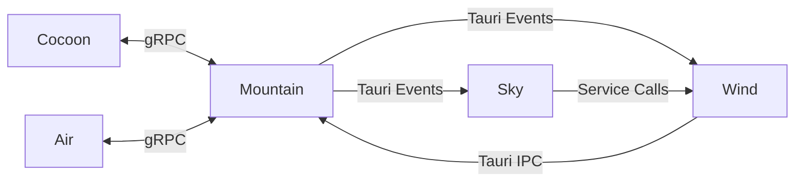

---

## Request/Response Patterns

### Pattern 1: Command Execution (Wind → Mountain)

**Example**: Execute a command from Wind

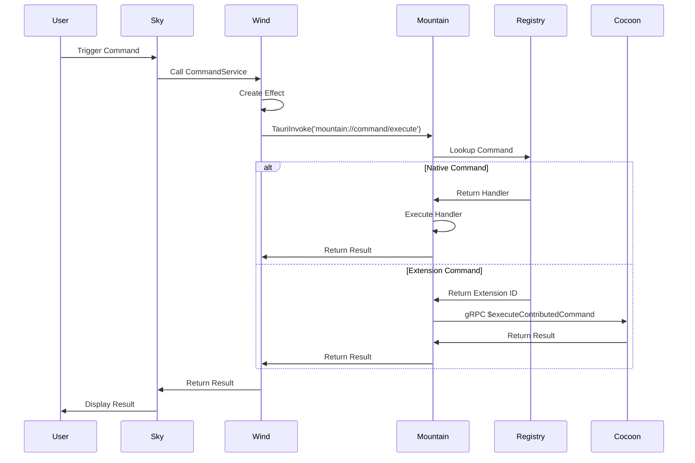

**Key Characteristics**:

- Synchronous request-response
- Single-hop or double-hop depending on command type
- Error propagation through call stack

### Pattern 2: Language Feature (Wind → Mountain → Cocoon → Mountain)

**Example**: Request hover information

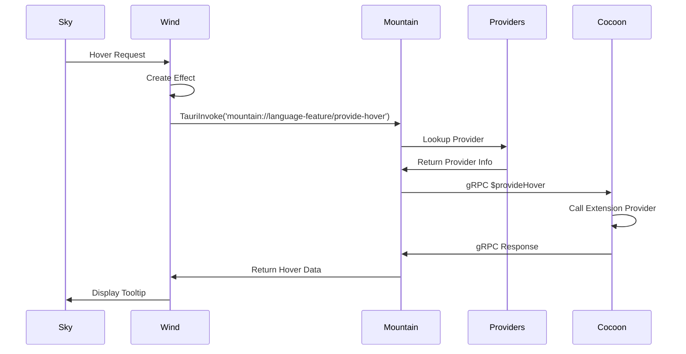

**Key Characteristics**:

- Triple-hop (Wind → Mountain → Cocoon → Mountain → Wind)
- Provider lookup in AppState
- Extension execution isolated in Cocoon

### Pattern 3: File Operation (Wind → Mountain)

**Example**: Read file content

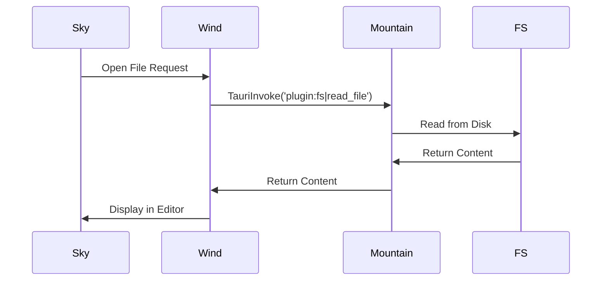

**Key Characteristics**:

- Uses Tauri FS plugin
- Direct file system access
- No extension involvement

### Pattern 4: Extension Registration (Cocoon → Mountain)

**Example**: Register language feature provider

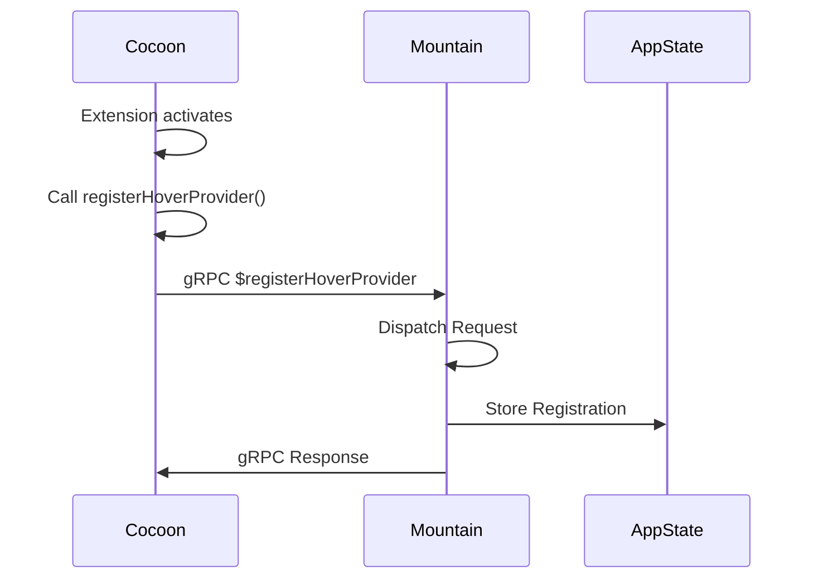

**Key Characteristics**:

- Initiated by Cocoon
- Registration stored in Mountain's AppState
- Future requests use stored registration

---

## Event Patterns

### Pattern 1: Terminal Output (Mountain → Cocoon + Wind/Sky)

**Example**: Terminal produces output

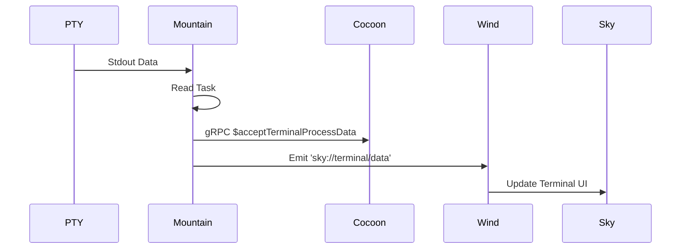

**Key Characteristics**:

- Single event, multiple recipients
- Broadcast pattern
- No response expected

### Pattern 2: Configuration Change (Mountain → Cocoon + Wind/Sky)

**Example**: Configuration changes

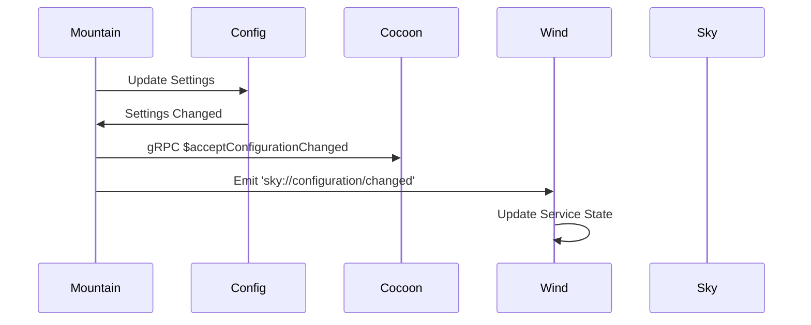

**Key Characteristics**:

- Single event, multiple recipients
- State synchronization
- Cascading updates

### Pattern 3: Webview Message (Wind → Mountain → Cocoon)

**Example**: User interacts with webview

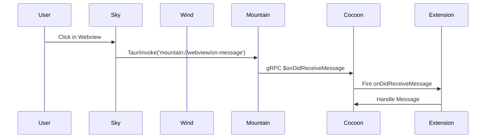

**Key Characteristics**:

- User-initiated
- Tauri IPC first, then gRPC
- Extension handles the message

---

## Data Flow Diagrams

### Startup Flow

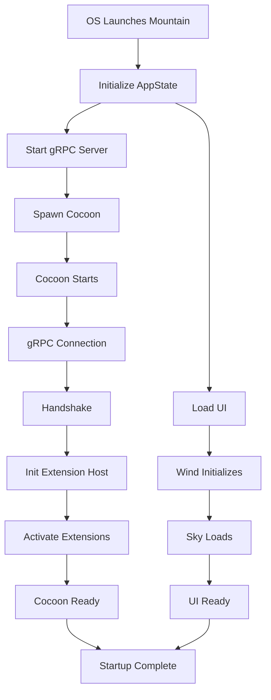

### Command Execution Flow

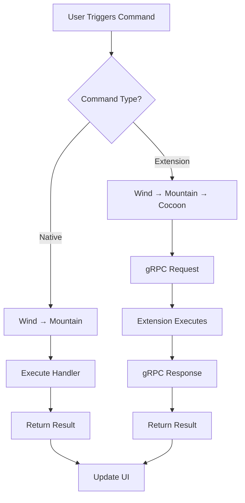

### Language Feature Flow

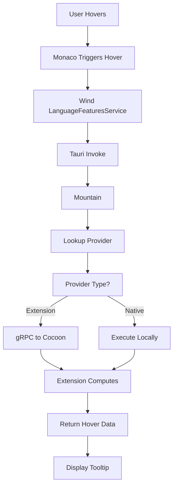

---

## Workflow Examples

### Workflow 1: Opening a File

**Source**:
[`Documentation/GitHub/Workflow/OpeningAFileFromTheUI.md`](https://github.com/CodeEditorLand/Land/tree/Current/Documentation/GitHub/Workflow/OpeningAFileFromTheUI.md)

**Components**: Sky → Wind → Mountain → Disk

1. User clicks file in File Explorer (Sky)
2. Sky calls Wind's `IEditorService.openEditor()`
3. Wind creates effect and calls `TauriInvoke`
4. Mountain receives request, reads file from disk
5. Mountain returns content to Wind
6. Wind creates editor model and returns to Sky
7. Sky renders editor with file content

### Workflow 2: Saving with Save Participants

**Source**:
[`Documentation/GitHub/Workflow/SavingAFileWithSaveParticipants.md`](https://github.com/CodeEditorLand/Land/tree/Current/Documentation/GitHub/Workflow/SavingAFileWithSaveParticipants.md)

**Components**: Sky → Wind → Mountain → Cocoon → Wind → Mountain → Disk

1. User saves file (Cmd+S)
2. Sky calls Wind's `IEditorService.save()`
3. Wind triggers save participants (if any)
4. Wind makes `$participateInSave` gRPC request to Cocoon
5. Extensions in Cocoon provide edits
6. Wind applies edits via `BulkEditService`
7. Wind writes final content to Mountain
8. Mountain writes to disk
9. Wind updates editor state and notifies Sky

### Workflow 3: Language Feature (Hover)

**Source**:
[`Documentation/GitHub/Workflow/InvokingALanguageFeatureHoverProvider.md`](<https://github.com/CodeEditorLand/Land/tree/main/Documentation/GitHub/Workflow/Invoking%20a%20Language%20Feature%20(Hover%20Provider).md>)

**Components**: Sky → Wind → Mountain → Cocoon → Mountain → Wind → Sky

1. User hovers mouse over code
2. Monaco triggers hover request
3. Wind's `LanguageFeaturesService.getHover()` called
4. Wind makes `TauriInvoke` to Mountain
5. Mountain looks up hover provider in AppState
6. Mountain makes `$provideHover` gRPC request to Cocoon
7. Extension in Cocoon computes hover information
8. Cocoon returns result to Mountain
9. Mountain returns to Wind
10. Wind displays hover tooltip in Sky

### Workflow 4: Terminal I/O

**Source**:
[`Documentation/GitHub/Workflow/CreatingAndInteractingWithAnIntegratedTerminal.md`](https://github.com/CodeEditorLand/Land/tree/Current/Documentation/GitHub/Workflow/CreatingAndInteractingWithAnIntegratedTerminal.md)

**Components**: Sky → Wind → Mountain → PTY → Mountain → Cocoon + Wind + Sky

**Output Flow**:

1. PTY producesstdout data
2. Mountain's Reader Task reads data
3. Mountain sends `$acceptTerminalProcessData` gRPC to Cocoon
4. Mountain emits `sky://terminal/data` Tauri event
5. Wind receives event
6. Sky updates terminal UI

**Input Flow**:

1. User types in terminal (Sky)
2. Sky sends input to Wind
3. Wind makes `TauriInvoke` to Mountain
4. Mountain writes to PTY stdin

### Workflow 5: Webview Communication

**Source**:
[`Documentation/GitHub/Workflow/CreatingAndInteractingWithAWebviewPanel.md`](https://github.com/CodeEditorLand/Land/tree/Current/Documentation/GitHub/Workflow/CreatingAndInteractingWithAWebviewPanel.md)

**Components**: Cocoon → Mountain → Sky + Mountain → Wind → Cocoon

**Creation Flow**:

1. Extension calls `createWebviewPanel()` (Cocoon)
2. Cocoon makes `$createWebviewPanel` gRPC to Mountain
3. Mountain stores webview state
4. Mountain emits `sky://webview/create` event
5. Wind receives event, creates webview DOM element
6. Mountain returns handle to Cocoon

**Message Flow**:

1. User interacts with webview (Sky)
2. Sky makes `TauriInvoke('mountain://webview/on-message')`
3. Mountain makes `$onDidReceiveMessage` gRPC to Cocoon
4. Cocoon fires `onDidReceiveMessage` event on extension

### Workflow 6: Source Control Management

**Source**:
[`Documentation/GitHub/Workflow/SourceControlManagementSCM.md`](<https://github.com/CodeEditorLand/Land/tree/main/Documentation/GitHub/Workflow/Source%20Control%20Management%20(SCM).md>)

**Components**: Cocoon → Mountain → Cocoon → Mountain → Wind → Sky

**Status Update Flow**:

1. Git extension runs `git status` (Cocoon)
2. Cocoon makes `$gitExec` gRPC to Mountain
3. Mountain spawns git process, captures output
4. Mountain returns output to Cocoon
5. Cocoon parses output, updates SCM state
6. Cocoon makes `$updateScmGroup` gRPC to Mountain
7. Mountain updates SCM view state
8. Mountain emits `sky://scm/update-group` event
9. Wind receives event, updates UI
10. Sky renders SCM changes

### Workflow 7: Command Palette

**Source**:
[`Documentation/GitHub/Workflow/ExecutingACommandFromTheCommandPalette.md`](https://github.com/CodeEditorLand/Land/tree/Current/Documentation/GitHub/Workflow/ExecutingACommandFromTheCommandPalette.md)

**Components**: Sky → Wind → Mountain → Mountain → Wind

**Fetch Commands Flow**:

1. User opens Command Palette (Sky)
2. Wind's `CommandsQuickAccessProvider` queries commands
3. Wind makes `TauriInvoke('mountain://command/get-all')`
4. Mountain returns list of all commands
5. Wind populates QuickPick UI

**Execute Command Flow**:

1. User selects command (Sky)
2. Wind makes `TauriInvoke('mountain://command/execute')`
3. Mountain dispatches to appropriate handler
4. Mountain returns result

### Workflow 8: Extension Tests

**Source**:
[`Documentation/GitHub/Workflow/RunningExtensionTests.md`](https://github.com/CodeEditorLand/Land/tree/Current/Documentation/GitHub/Workflow/RunningExtensionTests.md)

**Components**: Wind → Mountain → Mountain → Cocoon Test → Mountain Main

**Test Execution Flow**:

1. Developer runs test command (Wind)
2. Mountain Test Runner Service triggers
3. Mountain spawns new test instance
4. Test instance spawns test Cocoon
5. Test Cocoon connects to gRPC server of main Mountain
6. Test code executes, makes gRPC calls to main Mountain
7. Main Mountain executes, updates UI
8. Test Cocoon verifies state
9. Test completes, returns exit code

---

## Performance Characteristics

### Latency by Protocol

| Protocol     | Base Latency | With Payload (1KB) | With Payload (100KB) |
| ------------ | ------------ | ------------------ | -------------------- |
| gRPC         | ~1ms         | ~1.5ms             | ~5ms                 |
| Tauri IPC    | ~2ms         | ~3ms               | ~20ms                |
| Tauri Events | ~1ms         | ~1.5ms             | ~5ms                 |

### Throughput Considerations

- **gRPC**: High throughput, streaming support
- **Tauri IPC**: Moderate throughput, limited by serialization
- **Tauri Events**: High throughput for small events

### Optimization Tips

1. **Batch Operations**: Combine multiple small operations
2. **Use Events for Updates**: Use events instead of polling
3. **Cache Results**: Cache frequently accessed data
4. **Minimize Payloads**: Keep message sizes small
5. **Use Streaming**: For large data transfers

---

## Error Handling

### Error Propagation

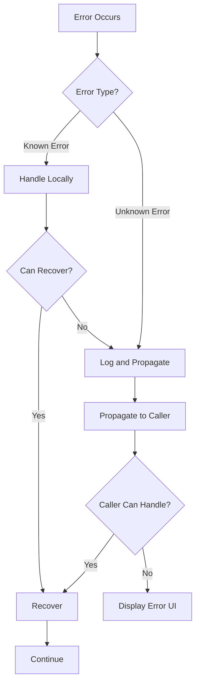

### Error Codes

| Error Code          | Protocol   | Meaning             | Handling           |
| ------------------- | ---------- | ------------------- | ------------------ |
| `OK`                | Both       | Success             | Normal flow        |
| `NOT_FOUND`         | gRPC       | Resource not found  | Show error to user |
| `INVALID_ARGUMENT`  | gRPC/Tauri | Invalid parameters  | Validate and retry |
| `PERMISSION_DENIED` | gRPC       | Permission issue    | Check permissions  |
| `INTERNAL`          | gRPC/Tauri | Server error        | Show error to user |
| `UNAVAILABLE`       | gRPC/Tauri | Service unavailable | Retry with backoff |

---

## See Also

- [Spine Contract](https://github.com/CodeEditorLand/Land/tree/main/Documentation/Architecture/integration/SpineContract.md) -
  Detailed gRPC contract specification
- [Component Documentation](https://github.com/CodeEditorLand/Land/tree/Current/Documentation/Architecture/components) -
  Individual component documentation
- [Workflow Examples](https://github.com/CodeEditorLand/Land/tree/Current/Documentation/GitHub/Workflow) -
  Detailed workflow examples
- [Vine Component](https://github.com/CodeEditorLand/Land/tree/Current/Documentation/Architecture/components/Vine.md) -
  gRPC protocol definition
