# Wind Module Distribution Fix

## Problem Summary

The Sky webview frontend was unable to import `@codeeditorland/wind` modules at
runtime in the built binary, causing these errors:

```
TypeError: Module name, '@codeeditorland/wind' does not resolve to a valid URL.
TypeError: Module name, '@codeeditorland/wind/Effect' does not resolve to a valid URL.
Unhandled Promise Rejection: TypeError: undefined is not an object (evaluating 'preloadGlobals.process')
```

## Root Cause

1. **Wind was commented out** from the `Link` array in
   [`Element/Sky/Source/Function/Debug.ts:78`](https://github.com/CodeEditorLand/Sky/tree/Current/Source/Function/Debug.ts#L78),
   preventing Vite from resolving Wind imports during development
2. **No static copy configuration** for Wind's built files to be included in the
   Sky build output
3. **URL-based imports** needed for browser ES modules to work at runtime

## Solution Implemented

## Wind Module Distribution Architecture

```mermaid
graph TB
    subgraph Wind["Wind Package (Element/Wind)"]
        WSRC["Source/"]
        WTS["TypeScript Code"]
        WF["Function/Install.ts"]
        WE["Effect/Bootstrap.ts, IPC.ts, Mountain.ts"]
        WCFG["Configuration/"]
        WT["Types/"]

        WTS --> WF
        WTS --> WE
        WTS --> WCFG
        WTS --> WT

        WTGT["Target/ (Build Output)"]
        WJS["*.js files"]
        WBOOT["Bootstrap/"]
        WEFF["Effect/<br/>index.ts exports"]
        WFUN["Function/<br/>Install.js exports"]
        WTP["Types/"]

        WEFF --> WE
        WFUN --> WF
    end

    subgraph Sky["Sky Package (Element/Sky)"]
        SDT["Debug.ts<br/>(Link array)"]
        SA["astro.config.ts<br/>(resolve alias)"]
        SWSRC["Wind.astro<br/>Default.astro"]

        SDT -->|Link array| LINK["@codeeditorland/wind"]
        SA -->|alias| ALIAS["@codeeditorland/wind → /Static/Wind"]
        SWSRC -->|imports| IMP["/Static/Wind/Function/Install.js<br/>/Static/Wind/Effect/index.js"]

        STGT["Target/ (Build Output)"]
        SVAR["Static/"]
        SWIND["Static/Wind/"]
        SWJS["*.js (copied from Wind)"]
        SWBOOT["Bootstrap/<br/>copied"]
        SWEFF["Effect/<br/>copied"]
        SWFUN["Function/<br/>copied"]
        SWTP["Types/<br/>copied"]

        SVAR --> SWIND
        SWIND --> SWJS
        SWIND --> SWBOOT
        SWIND --> SWEFF
        SWIND --> SWFUN
        SWIND --> SWTP
    end

    subgraph NPM["Node Modules"]
        NM["@codeeditorland/wind<br/>(pnpm workspace link)"]
        NM -. linked to .-> SDT
    end

    subgraph Build["Build Process"]
        VITE["Vite Build"]
        SPC["vite-plugin-static-copy"]
    end

    subgraph Runtime["Runtime in Built Binary"]
        BRW["Browser ES Modules"]
        MOD["Load from /Static/Wind/<br/>Absolute URLs"]

        BRW --> MOD
        MOD -->|"resolve"| SWJS
        MOD -->|"resolve"| SWEFF
        MOD -->|"resolve"| SWFUN
    end

    WTS -. build .-> WTGT
    WTGT -->|"copy via"| SPC
    SPC -->|"to"| STGT

    VITE --> SPC
    VITE -->|"resolves"| LINK
    VITE -->|"uses"| ALIAS

    MOD -. runtime .-> IMP

    style Wind fill:#e1f5ff
    style Sky fill:#fff4e1
    style NPM fill:#ffe1f5
    style Build fill:#e1ffe1
    style Runtime fill:#f5e1ff
```



### 1. Enabled Wind in Link Array

**File:**
[`Element/Sky/Source/Function/Debug.ts`](https://github.com/CodeEditorLand/Sky/tree/Current/Source/Function/Debug.ts)

Uncommented `@codeeditorland/wind` in the `Link` array to enable Vite module
resolution:

```typescript
export const Link = [
	"@codeeditorland/common",
	"@codeeditorland/output",
	"@codeeditorland/wind", // ✅ ENABLED
	"@codeeditorland/worker",
];
```

### 2. Added Wind to Static Copy Configuration

**File:**
[`Element/Sky/Source/Function/Debug.ts`](https://github.com/CodeEditorLand/Sky/tree/Current/Source/Function/Debug.ts)

Added Wind build outputs to `Static.targets` for bundling mode:

```typescript
// In the Bundle === true branch
{
	src: "node_modules/@codeeditorland/wind/Target/*.js",
	dest: "Static/Wind/",
},
{
	src: "node_modules/@codeeditorland/wind/Target/Bootstrap/*",
	dest: "Static/Wind/Bootstrap/",
},
{
	src: "node_modules/@codeeditorland/wind/Target/Configuration/*",
	dest: "Static/Wind/Configuration/",
},
{
	src: "node_modules/@codeeditorland/wind/Target/Effect/*",
	dest: "Static/Wind/Effect/",
},
{
	src: "node_modules/@codeeditorland/wind/Target/Function/*",
	dest: "Static/Wind/Function/",
},
{
	src: "node_modules/@codeeditorland/wind/Target/Types/*",
	dest: "Static/Wind/Types/",
},

// In the Bundle === false branch
{
	src: "node_modules/@codeeditorland/wind/Target/*",
	dest: "Static/Wind/",
},
```

This follows the same pattern used for `@codeeditorland/output` and
`@codeeditorland/worker`.

### 3. Updated Imports to Use Absolute URLs

**Files:**

- [`Element/Sky/Source/Workbench/Wind.astro`](https://github.com/CodeEditorLand/Sky/tree/Current/Source/Workbench/Wind.astro)
- [`Element/Sky/Source/Workbench/Default.astro`](https://github.com/CodeEditorLand/Sky/tree/Current/Source/Workbench/Default.astro)

Changed from npm package imports to static file URLs:

```astro
<!-- Before -->
<script type="module">
	import { Install } from "@codeeditorland/wind";

	Install();
</script>

<script type="module">
	import { runBootstrap, TauriLiveLayer } from "@codeeditorland/wind/Effect";
	import { Runtime } from "effect";

	// ...
</script>

<!-- After -->
<script type="module">
	import { Install } from "/Static/Wind/Function/Install.js";

	Install();
</script>

<script type="module">
	import { Runtime } from "effect";

	import { runBootstrap, TauriLiveLayer } from "/Static/Wind/Effect/index.js";

	// ...
</script>
```

### 4. Added Vite Resolve Alias (Optional Enhancement)

**File:**
[`Element/Sky/astro.config.ts`](https://github.com/CodeEditorLand/Sky/tree/Current/astro.config.ts)

Added alias configuration for easier import resolution:

```typescript
resolve: {
	preserveSymlinks: false,
	alias: {
		// Wind package is copied to Static/Wind during build
		// Redirect imports to the static location
		"@codeeditorland/wind": "/Static/Wind",
		"@codeeditorland/wind/Effect": "/Static/Wind/Effect",
	},
},
```

This allows using the original npm package names in imports if needed.

## Build Process Flow

1. **Development Mode:**
    - Vite resolves `@codeeditorland/wind` from `node_modules/` via the `Link`
      array
    - TypeScript checks against npm package types
    - No static files are copied

2. **Production Build:**
    - Vite resolves imports using the npm package
    - `vite-plugin-static-copy` copies Wind's built files from
      `node_modules/@codeeditorland/wind/Target/` to `Target/Static/Wind/`
    - Imports reference static file URLs (e.g.,
      `/Static/Wind/Function/Install.js`)

3. **Runtime in Built Binary:**
    - Browser ES modules load from `/Static/Wind/` directory
    - All dependencies are locally available
    - No external module resolution needed

## Wind Build Structure

The Wind package builds its TypeScript source to JavaScript in the `Target/`
directory:

```
Element/Wind/Target/
├── ESBuild.js
├── Preload.js
├── Bootstrap/
├── Configuration/
├── Effect/
│   ├── index.ts ( exports runBootstrap, TauriLiveLayer )
│   ├── Bootstrap.ts
│   ├── IPC.ts
│   ├── Mountain.ts
│   └── ...
├── Function/
│   └── Install.ts ( exports Install function )
└── Types/
```

## TypeScript Errors (Expected)

During development, you may see TypeScript errors like:

```
Cannot find module '/Static/Wind/Function/Install.js' or its corresponding type declarations.
```

These are **expected and harmless**. The static files don't exist during
development but will be available after the build completes. The errors won't
affect the production build.

If the errors are distracting, you can add type declarations in
`Element/Sky/Source/env.d.ts`:

```typescript
declare module "/Static/Wind/Function/Install.js" {
	export { Install } from "@codeeditorland/wind/Function/Install";
}

declare module "/Static/Wind/Effect/index.js" {
	export * from "@codeeditorland/wind/Effect";
}
```

## Verification

To verify the fix:

1. Build Sky:

    ```bash
    cd Element/Sky
    pnpm run prepublishOnly
    ```

2. Check that Wind files exist in the output:

    ```bash
    ls -la Target/Static/Wind/
    ```

3. Test the built binary and verify no Wind-related errors in console logs

## Related Files Modified

- [`Element/Sky/Source/Function/Debug.ts`](https://github.com/CodeEditorLand/Sky/tree/Current/Source/Function/Debug.ts) -
  Link array and Static targets
- [`Element/Sky/astro.config.ts`](https://github.com/CodeEditorLand/Sky/tree/Current/astro.config.ts) -
  Vite resolve alias
- [`Element/Sky/Source/Workbench/Wind.astro`](https://github.com/CodeEditorLand/Sky/tree/Current/Source/Workbench/Wind.astro) -
  Import statements
- [`Element/Sky/Source/Workbench/Default.astro`](https://github.com/CodeEditorLand/Sky/tree/Current/Source/Workbench/Default.astro) -
  Import statements

## Architecture Patterns

This solution follows the existing codebase patterns:

1. **Static Copy Pattern:** Similar to how `@codeeditorland/output` and
   `@codeeditorland/worker` are handled
2. **Element Nesting:** Each Element package builds independently, then gets
   copied to dependent packages
3. **Workspace Dependencies:** pnpm workspace packages are linked during
   development, bundled for production
4. **Browser Module Resolution:** Uses absolute URLs for ES modules in browser
   environments

## Future Considerations

1. **Type Safety:** Consider adding `.d.ts` declarations for static imports to
   improve TypeScript experience
2. **Build Optimization:** Could add Wind to bundle-specific optimizations (tree
   shaking, code splitting)
3. **Version Compatibility:** Ensure Wind and Sky build processes stay
   synchronized
4. **Testing:** Add integration tests to verify Wind functionality in built Sky
   binaries
