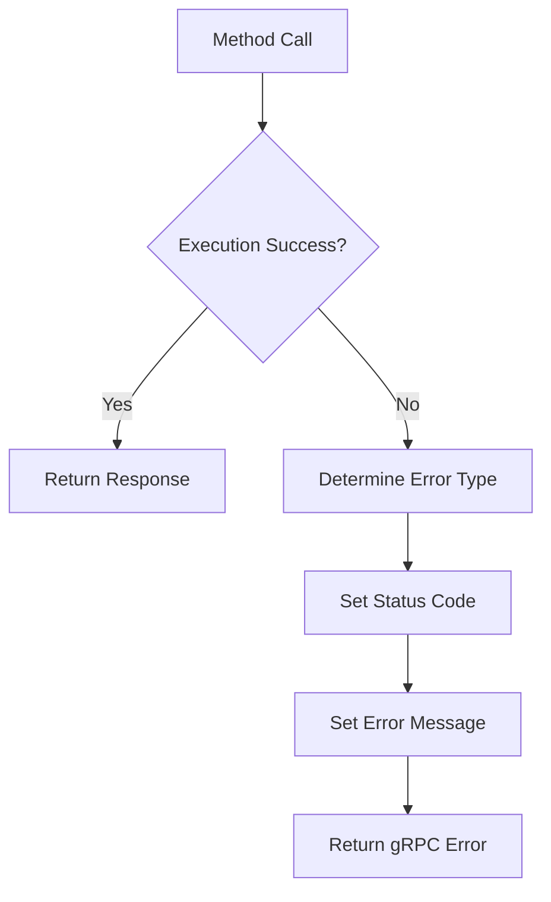

# Spine Contract Specification

## Table of Contents

- [Overview](#overview)
- [Protocol Definition](#protocol-definition)
- [Method Catalog](#method-catalog)
- [Message Types](#message-types)
- [Error Handling](#error-handling)
- [Versioning](#versioning)
- [Wire Format](#wire-format)
- [Security Considerations](#security-considerations)

---

## Overview

The **Spine Contract** is the central gRPC contract specification that defines the communication protocol between Mountain and Cocoon (and optionally Air). This contract serves as the single source of truth for all inter-process communication.

### Contract Participants

| Participant | Role | Implementation |
|-------------|------|----------------|
| **Mountain** | Server (Cocoon Service), Client (Air Service) | Rust + tonic |
| **Cocoon** | Client | TypeScript + gRPC-Web |
| **Air** | Server | Rust + tonic |

### Contract Scope

- **Cocoon-Mountain Communication**: Extension host ↔ Native backend
- **Air-Mountain Communication**: Background daemon ↔ Native backend
- **Message Serialization**: ProtoBuf format definition
- **Service Contracts**: Service interface specifications

### Protocol File

**Location**: [`Element/Mountain/Proto/Vine.proto`](../../Element/Mountain/Proto/Vine.proto)

---

## Protocol Definition

### Package Definition

```protobuf
syntax = "proto3";

package vine;

option go_package = "github.com/codeeditorland/vine";
option java_multiple_files = true;
option java_outer_classname = "VineProto";
option objc_class_prefix = "VNE";
```

### Service Definitions

#### CocoonService

The main service for Mountain-Cocoon communication:

```protobuf
service CocoonService {
  // ==================== Initialization ====================
  
  // Handshake - Called by Cocoon to signal readiness
  rpc $initialHandshake(Empty) returns (Empty);
  
  // Initialize Extension Host - Mountain sends initialization data to Cocoon
  rpc initExtensionHost(InitExtensionHostRequest) returns (Empty);
  
  // ==================== Commands ====================
  
  // Register Command - Cocoon registers an extension command
  rpc $registerCommand(RegisterCommandRequest) returns (Empty);
  
  // Execute Contributed Command - Mountain executes an extension command
  rpc $executeContributedCommand(ExecuteCommandRequest) returns (ExecuteCommandResponse);
  
  // ==================== Language Features ====================
  
  // Register Hover Provider - Register a hover provider
  rpc $registerHoverProvider(RegisterProviderRequest) returns (Empty);
  
  // Provide Hover - Request hover information
  rpc $provideHover(ProvideHoverRequest) returns (ProvideHoverResponse);
  
  // Register Completion Item Provider - Register a completion provider
  rpc $registerCompletionItemProvider(RegisterProviderRequest) returns (Empty);
  
  // Provide Completion Items - Request completion items
  rpc $provideCompletionItems(ProvideCompletionItemsRequest) returns (ProvideCompletionItemsResponse);
  
  // Register Definition Provider - Register a definition provider
  rpc $registerDefinitionProvider(RegisterProviderRequest) returns (Empty);
  
  // Provide Definition - Request definition location
  rpc $provideDefinition(ProvideDefinitionRequest) returns (ProvideDefinitionResponse);
  
  // Register Reference Provider - Register a reference provider
  rpc $registerReferenceProvider(RegisterProviderRequest) returns (Empty);
  
  // Provide References - Request references
  rpc $provideReferences(ProvideReferencesRequest) returns (ProvideReferencesResponse);
  
  // Register Code Actions Provider - Register code actions provider
  rpc $registerCodeActionsProvider(RegisterProviderRequest) returns (Empty);
  
  // Provide Code Actions - Request code actions
  rpc $provideCodeActions(ProvideCodeActionsRequest) returns (ProvideCodeActionsResponse);
  
  // ==================== File System ====================
  
  // Read File - Read file contents
  rpc $readFile(ReadFileRequest) returns (ReadFileResponse);
  
  // Write File - Write file contents
  rpc $writeFile(WriteFileRequest) returns (Empty);
  
  // Stat - Get file metadata
  rpc $stat(StatRequest) returns (StatResponse);
  
  // Read Directory - List directory contents
  rpc $readdir(ReaddirRequest) returns (ReaddirResponse);
  
  // Watch File - Watch file for changes
  rpc $watchFile(WatchFileRequest) returns (Empty);
  
  // ==================== Workspace ====================
  
  // Update Configuration - Notify of configuration changes
  rpc $updateConfiguration(UpdateConfigurationRequest) returns (Empty);
  
  // Update Workspace Folders - Update workspace folders
  rpc $updateWorkspaceFolders(UpdateWorkspaceFoldersRequest) returns (Empty);
  
  // ==================== Webview ====================
  
  // Create Webview Panel - Create a new webview panel
  rpc $createWebviewPanel(CreateWebviewPanelRequest) returns (CreateWebviewPanelResponse);
  
  // Set Webview HTML - Update webview HTML content
  rpc $setWebviewHtml(SetWebviewHtmlRequest) returns (Empty);
  
  // On Did Receive Message - Receive message from webview
  rpc $onDidReceiveMessage(OnDidReceiveMessageRequest) returns (Empty);
  
  // ==================== Terminal ====================
  
  // Open Terminal - Open a new terminal
  rpc $openTerminal(OpenTerminalRequest) returns (Empty);
  
  // Terminal Input - Send input to terminal
  rpc $terminalInput(TerminalInputRequest) returns (Empty);
  
  // Close Terminal - Close a terminal
  rpc $closeTerminal(CloseTerminalRequest) returns (Empty);
  
  // Accept Terminal Opened - Notification: Terminal opened
  rpc $acceptTerminalOpened(TerminalOpenedNotification) returns (Empty);
  
  // Accept Terminal Closed - Notification: Terminal closed
  rpc $acceptTerminalClosed(TerminalClosedNotification) returns (Empty);
  
  // Accept Terminal Process ID - Notification: Terminal process ID
  rpc $acceptTerminalProcessId(TerminalProcessIdNotification) returns (Empty);
  
  // Accept Terminal Process Data - Notification: Terminal output
  rpc $acceptTerminalProcessData(TerminalDataNotification) returns (Empty);
  
  // ==================== Tree View ====================
  
  // Register Tree View Provider - Register a tree view provider
  rpc $registerTreeViewProvider(RegisterTreeViewProviderRequest) returns (Empty);
  
  // Get Children - Request tree view children
  rpc getTreeChildren(GetTreeChildrenRequest) returns (GetTreeChildrenResponse);
  
  // ==================== SCM ====================
  
  // Register SCM Provider - Register source control provider
  rpc $registerScmProvider(RegisterScmProviderRequest) returns (Empty);
  
  // Update SCM Group - Update SCM group
  rpc $updateScmGroup(UpdateScmGroupRequest) returns (Empty);
  
  // Execute Git - Execute git command
  rpc $gitExec(GitExecRequest) returns (GitExecResponse);
  
  // ==================== Debug ====================
  
  // Register Debug Adapter - Register debug adapter
  rpc $registerDebugAdapter(RegisterDebugAdapterRequest) returns (Empty);
  
  // Start Debugging - Start debug session
  rpc $startDebugging(StartDebuggingRequest) returns (StartDebuggingResponse);
  
  // ==================== Save Participants ====================
  
  // Participate in Save - Extension participates in save
  rpc $participateInSave(ParticipateInSaveRequest) returns (ParticipateInSaveResponse);
}
```

---

## Method Catalog

### Initialization Methods

#### `$initialHandshake`

Initiates the handshake sequence.

| Field | Type | Description |
|-------|------|-------------|
| Request | `Empty` | No parameters |
| Response | `Empty` | No return value |

**Flow**: Cocoon → Mountain

#### `initExtensionHost`

Sends initialization data to Cocoon.

| Field | Type | Description |
|-------|------|-------------|
| Request | `InitExtensionHostRequest` | Workspace, extension, configuration data |
| Response | `Empty` | No return value |

**Flow**: Mountain → Cocoon

### Command Methods

#### `$registerCommand`

Registers a new command.

| Field | Type | Description |
|-------|------|-------------|
| `commandId` | `string` | Unique command identifier |
| `extensionId` | `string` | Extension that owns the command |
| `title` | `string` | Display title |

**Flow**: Cocoon → Mountain

#### `$executeContributedCommand`

Executes a command.

| Field | Type | Description |
|-------|------|-------------|
| `commandId` | `string` | Command to execute |
| `arguments` | `repeated Argument` | Command arguments |

**Flow**: Mountain → Cocoon

### Language Feature Methods

#### `$registerHoverProvider`

Registers a hover provider.

| Field | Type | Description |
|-------|------|-------------|
| `languageSelector` | `string` | Language identifier |
| `handle` | `uint32` | Unique provider handle |
| `extensionId` | `string` | Extension that owns the provider |

**Flow**: Cocoon → Mountain

#### `$provideHover`

Requests hover information.

| Field | Type | Description |
|-------|------|-------------|
| `uri` | `Uri` | Document URI |
| `position` | `Position` | Cursor position |
| `provider_handle` | `uint32` | Provider handle |

**Flow**: Mountain → Cocoon

#### `$registerCompletionItemProvider`

Registers a completion provider.

| Field | Type | Description |
|-------|------|-------------|
| Same as `$registerHoverProvider` | - | - |

**Flow**: Cocoon → Mountain

#### `$provideCompletionItems`

Requests completion items.

| Field | Type | Description |
|-------|------|-------------|
| `uri` | `Uri` | Document URI |
| `position` | `Position` | Cursor position |
| `provider_handle` | `uint32` | Provider handle |
| `trigger_character` | `string` | Optional trigger character |

**Flow**: Mountain → Cocoon

#### `$registerDefinitionProvider`

Registers a definition provider.

| Field | Type | Description |
|-------|------|-------------|
| Same as `$registerHoverProvider` | - | - |

**Flow**: Cocoon → Mountain

#### `$provideDefinition`

Requests definition location.

| Field | Type | Description |
|-------|------|-------------|
| `uri` | `Uri` | Document URI |
| `position` | `Position` | Cursor position |
| `provider_handle` | `uint32` | Provider handle |

**Flow**: Mountain → Cocoon

#### `$registerReferenceProvider`

Registers a reference provider.

| Field | Type | Description |
|-------|------|-------------|
| Same as `$registerHoverProvider` | - | - |

**Flow**: Cocoon → Mountain

#### `$provideReferences`

Requests references.

| Field | Type | Description |
|-------|------|-------------|
| `uri` | `Uri` | Document URI |
| `position` | `Position` | Cursor position |
| `provider_handle` | `uint32` | Provider handle |

**Flow**: Mountain → Cocoon

#### `$registerCodeActionsProvider`

Registers a code actions provider.

| Field | Type | Description |
|-------|------|-------------|
| Same as `$registerHoverProvider` | - | - |

**Flow**: Cocoon → Mountain

#### `$provideCodeActions`

Requests code actions.

| Field | Type | Description |
|-------|------|-------------|
| `uri` | `Uri` | Document URI |
| `range` | `Range` | Document range |
| `provider_handle` | `uint32` | Provider handle |

**Flow**: Mountain → Cocoon

### File System Methods

#### `$readFile`

Reads file contents.

| Field | Type | Description |
|-------|------|-------------|
| `uri` | `Uri` | File URI |

**Flow**: Mountain → Cocoon

#### `$writeFile`

Writes file contents.

| Field | Type | Description |
|-------|------|-------------|
| `uri` | `Uri` | File URI |
| `content` | `bytes` | File content |
| `encoding` | `string` | Content encoding |

**Flow**: Mountain → Cocoon (or Wind)

#### `$stat`

Gets file metadata.

| Field | Type | Description |
|-------|------|-------------|
| `uri` | `Uri` | File URI |

**Flow**: Mountain → Cocoon (or Wind)

#### `$readdir`

Lists directory contents.

| Field | Type | Description |
|-------|------|-------------|
| `uri` | `Uri` | Directory URI |

**Flow**: Mountain → Cocoon (or Wind)

### Workspace Methods

#### `$updateConfiguration`

Notifies of configuration changes.

| Field | Type | Description |
|-------|------|-------------|
| `changed_keys` | `repeated string` | Changed configuration keys |

**Flow**: Mountain → Cocoon

#### `$updateWorkspaceFolders`

Updates workspace folders.

| Field | Type | Description |
|-------|------|-------------|
| `additions` | `repeated WorkspaceFolder` | Added folders |
| `removals` | `repeated WorkspaceFolder` | Removed folders |

**Flow**: Mountain → Cocoon

### Webview Methods

#### `$createWebviewPanel`

Creates a new webview panel.

| Field | Type | Description |
|-------|------|-------------|
| `view_type` | `string` | Webview type |
| `title` | `string` | Panel title |
| `icon_path` | `string` | Icon path |
| `view_column` | `ViewColumn` | View column |
| `preserve_focus` | `bool` | Preserve focus |
| `enable_find_widget` | `bool` | Enable find widget |
| `retain_context_when_hidden` | `bool` | Retain context |
| `local_resource_roots` | `repeated string` | Local resource roots |

**Flow**: Cocoon → Mountain

**Response**: `CreateWebviewPanelResponse` with `handle` field

#### `$setWebviewHtml`

Updates webview HTML content.

| Field | Type | Description |
|-------|------|-------------|
| `handle` | `uint32` | Webview handle |
| `html` | `string` | HTML content |

**Flow**: Cocoon → Mountain

#### `$onDidReceiveMessage`

Receives message from webview.

| Field | Type | Description |
|-------|------|-------------|
| `handle` | `uint32` | Webview handle |
| `message` | `oneof` | Message (string or bytes) |

**Flow**: Mountain → Cocoon

### Terminal Methods

#### `$openTerminal`

Opens a new terminal.

| Field | Type | Description |
|-------|------|-------------|
| `name` | `string` | Terminal name |
| `shell_path` | `string` | Shell executable path |
| `shell_args` | `repeated string` | Shell arguments |
| `cwd` | `string` | Working directory |

**Flow**: Cocoon → Mountain

#### `$terminalInput`

Sends input to terminal.

| Field | Type | Description |
|-------|------|-------------|
| `terminal_id` | `uint32` | Terminal ID |
| `data` | `bytes` | Input data |

**Flow**: Cocoon → Mountain

#### `$closeTerminal`

Closes a terminal.

| Field | Type | Description |
|-------|------|-------------|
| `terminal_id` | `uint32` | Terminal ID |

**Flow**: Cocoon → Mountain

#### `$acceptTerminalOpened`

Notification: Terminal opened.

| Field | Type | Description |
|-------|------|-------------|
| `terminal_id` | `uint32` | Terminal ID |
| `name` | `string` | Terminal name |

**Flow**: Mountain → Cocoon

#### `$acceptTerminalClosed`

Notification: Terminal closed.

| Field | Type | Description |
|-------|------|-------------|
| `terminal_id` | `uint32` | Terminal ID |

**Flow**: Mountain → Cocoon

#### `$acceptTerminalProcessId`

Notification: Terminal process ID.

| Field | Type | Description |
|-------|------|-------------|
| `terminal_id` | `uint32` | Terminal ID |
| `process_id` | `uint32` | Process ID |

**Flow**: Mountain → Cocoon

#### `$acceptTerminalProcessData`

Notification: Terminal output.

| Field | Type | Description |
|-------|------|-------------|
| `terminal_id` | `uint32` | Terminal ID |
| `data` | `bytes` | Output data |

**Flow**: Mountain → Cocoon

### Tree View Methods

#### `$registerTreeViewProvider`

Registers a tree view provider.

| Field | Type | Description |
|-------|------|-------------|
| `view_id` | `string` | View ID |
| `extension_id` | `string` | Extension ID |

**Flow**: Cocoon → Mountain

#### `getTreeChildren`

Requests tree view children.

| Field | Type | Description |
|-------|------|-------------|
| `view_id` | `string` | View ID |
| `tree_item_handle` | `string` | Parent item handle |

**Flow**: Mountain → Cocoon

### SCM Methods

#### `$registerScmProvider`

Registers SCM provider.

| Field | Type | Description |
|-------|------|-------------|
| `scm_id` | `string` | SCM ID (e.g., 'git') |
| `extension_id` | `string` | Extension ID |

**Flow**: Cocoon → Mountain

#### `$updateScmGroup`

Updates SCM group.

| Field | Type | Description |
|-------|------|-------------|
| `provider_id` | `string` | Provider ID |
| `group_id` | `string` | Group ID |
| `resource_states` | `repeated SourceControlResourceState` | Resource states |

**Flow**: Cocoon → Mountain

#### `$gitExec`

Executes git command.

| Field | Type | Description |
|-------|------|-------------|
| `repository_path` | `string` | Repository path |
| `args` | `repeated string` | Git arguments |

**Flow**: Cocoon → Mountain

### Debug Methods

#### `$registerDebugAdapter`

Registers debug adapter.

| Field | Type | Description |
|-------|------|-------------|
| `debug_type` | `string` | Debug type |
| `extension_id` | `string` | Extension ID |

**Flow**: Cocoon → Mountain

#### `$startDebugging`

Starts debug session.

| Field | Type | Description |
|-------|------|-------------|
| `debug_type` | `string` | Debug type |
| `configuration` | `DebugConfiguration` | Debug configuration |

**Flow**: Mountain → Cocoon

### Save Participant Methods

#### `$participateInSave`

Extension participates in save.

| Field | Type | Description |
|-------|------|-------------|
| `uri` | `Uri` | Document URI |
| `reason` | `TextDocumentSaveReason` | Save reason |

**Flow**: Wind → Cocoon

---

## Message Types

### Primitive Types

| Proto Type | Rust Type | TypeScript Type |
|------------|-----------|-----------------|
| `string` | `String` | `string` |
| `int32` | `i32` | `number` |
| `int64` | `i64` | `bigint` |
| `uint32` | `u32` | `number` |
| `uint64` | `u64` | `bigint` |
| `bool` | `bool` | `boolean` |
| `bytes` | `Vec<u8>` | `Uint8Array` |
| `Empty` | `()` | `{}` |

### Common Messages

#### Empty

```protobuf
message Empty {}
```

#### Position

```protobuf
message Position {
  uint32 line = 1;        // 0-based line number
  uint32 character = 2;   // 0-based character offset
}
```

#### Range

```protobuf
message Range {
  Position start = 1;
  Position end = 2;
}
```

#### Uri

```protobuf
message Uri {
  string value = 1;
}
```

#### Argument

```protobuf
message Argument {
  oneof value {
    string string_value = 1;
    int32 int_value = 2;
    bool bool_value = 3;
    bytes bytes_value = 4;
  }
}
```

#### WorkspaceFolder

```protobuf
message WorkspaceFolder {
  Uri uri = 1;
  string name = 2;
}
```

---

## Error Handling

### gRPC Status Codes

The contract uses standard gRPC status codes:

| Code | Name | Usage |
|------|------|-------|
| 0 | OK | Success |
| 1 | CANCELLED | Operation cancelled by client |
| 2 | UNKNOWN | Unknown error |
| 3 | INVALID_ARGUMENT | Invalid argument |
| 5 | NOT_FOUND | Resource not found |
| 9 | FAILED_PRECONDITION | Failed precondition |
| 10 | ABORTED | Operation aborted |
| 14 | UNAVAILABLE | Service unavailable |
| 16 | UNAUTHENTICATED | Not authenticated |

### Error Message Format

Errors include:

- **Status Code**: Standard gRPC status code
- **Message**: Human-readable error message
- **Details**: Structured error details (optional)

### Error Propagation



---

## Versioning

### Version Strategy

The Spine Contract follows semantic versioning:

- **Major**: Breaking changes
- **Minor**: Non-breaking additions
- **Patch**: Bug fixes

### Version Compatibility

| Client Version | Server Version | Compatible? |
|----------------|----------------|-------------|
| v1.0 | v1.0 | ✅ Yes |
| v1.0 | v1.1 | ✅ Yes (server has new features) |
| v1.1 | v1.0 | ❌ No (client expects new features) |

---

## Wire Format

### Serialization

Protocol Buffers use a compact binary format:

- **Variable-width integers**: Smaller values use fewer bytes
- **Field tags**: Each field has a unique tag
- **Oneof fields**: Efficiently handle mutually exclusive fields

### Encoding

```
Message → ProtoBuf Serialize → Binary → gRPC Frame → Network
```

### Performance

| Operation | Approximate Cost |
|-----------|------------------|
| Serialize (small message) | < 1μs |
| Deserialize (small message) | < 1μs |
| Serialize (large message) | 10-100μs |
| Deserialize (large message) | 10-100μs |

---

## Security Considerations

### Authentication

Currently, the contract does not include authentication. Future versions may add:

- Mutual TLS
- API keys
- Token-based authentication

### Authorization

Authorization is handled at the application layer:

- Mountain validates permissions
- Cocoon respects provided privileges
- Air enforces its own authorization

### Data Privacy

- No sensitive data in error messages
- Sanitized logging
- Content-type validation

### Validation

- Input validation on all requests
- Output validation on all responses
- Type safety through ProtoBuf

---

## Key Files Reference

| File | Purpose |
|------|---------|
| [`Element/Mountain/Proto/Vine.proto`](../../Element/Mountain/Proto/Vine.proto) | Protocol definition |
| [`Element/Mountain/Source/Vine/Generated/vine.rs`](../../Element/Mountain/Source/Vine/Generated/vine.rs) | Generated Rust code |
| [`Element/Cocoon/Source/Generated/Vine.ts`](../../Element/Cocoon/Source/Generated/Vine.ts) | Generated TypeScript code |

---

## See Also

- [Vine Component](../components/vine.md) - gRPC protocol implementation
- [Communication Flows](./communication-flows.md) - Communication patterns
- [Mountain Component](../components/mountain.md) - Server implementation
- [Cocoon Component](../components/cocoon.md) - Client implementation
