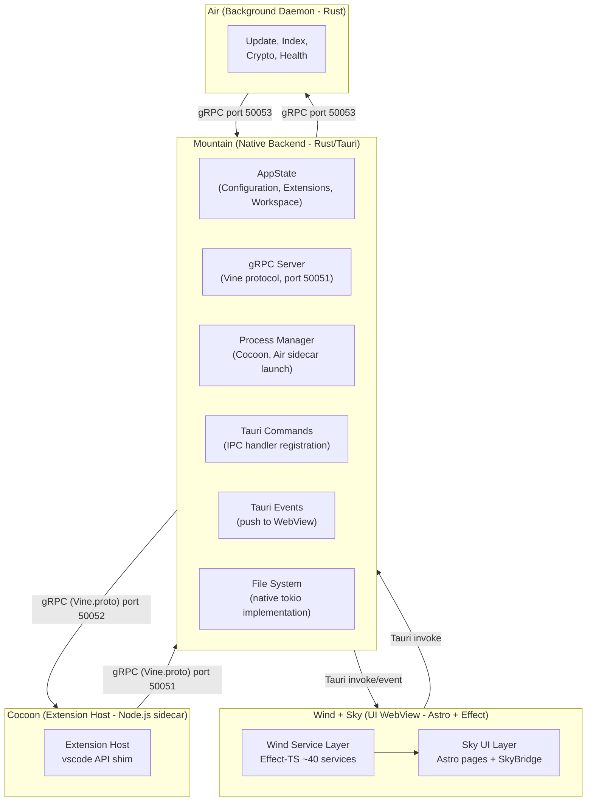
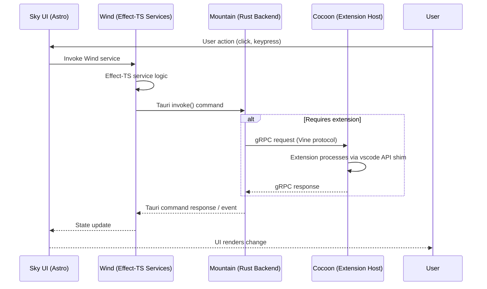
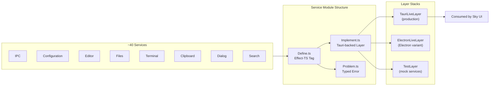
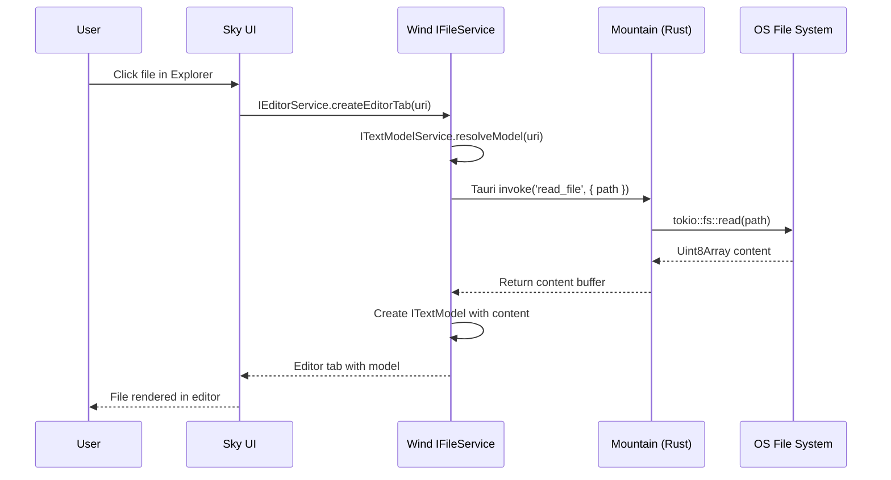
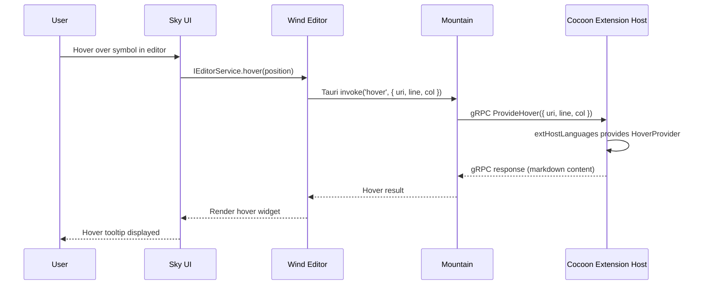
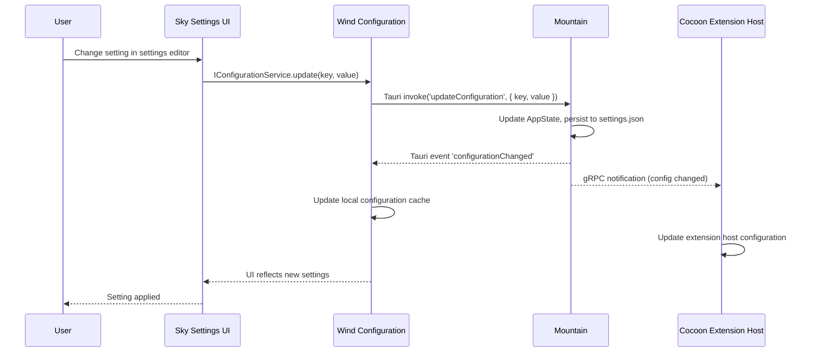

# Land System Architecture

This document describes the complete system architecture of the **Land** code
editor. It covers the process model, inter-component communication patterns,
component responsibilities, and the layered design that enables multi-process
operation on `macOS`, `Windows`, and `Linux`.

---

## Table of Contents

1. [Process Model](#process-model)
2. [Component Map](#component-map)
3. [IPC Architecture](#ipc-architecture)
4. [Service Layer Design](#service-layer-design)
5. [Tier-Gated Implementation](#tier-gated-implementation)
6. [Data Flow Patterns](#data-flow-patterns)
7. [Related Documentation](#related-documentation)

---

## Process Model 🏗️

**Land** operates as a multi-process application with three concurrent
processes:

| Process        | Element        | Language                 | Purpose                                                                    |
| -------------- | -------------- | ------------------------ | -------------------------------------------------------------------------- |
| Native Backend | `Mountain`     | `Rust` (`Tauri`)         | Application lifecycle, OS operations, `gRPC` server, sidecar orchestration |
| Extension Host | `Cocoon`       | `TypeScript` (`Node.js`) | VS Code extension execution, `vscode` API shim                             |
| UI Renderer    | `Wind` + `Sky` | `TypeScript` (WebView)   | Editor UI rendering, workbench services, `Astro` page composition          |

A fourth optional process, the background daemon (`Air`), runs as a persistent
sidecar for updates and indexing.

> **TierIPC note:** The `TierIPC` environment variable controls whether
> `Wind`/`Output` route IPC through `Mountain` (default), fall back to `Cocoon`
> on miss (`NodeDeferred`), or bypass `Mountain` entirely (`Node`).
> Per-subsystem overrides (`TierTerminal`, `TierSCM`, `TierAuth`, etc.) allow
> independent routing per channel. See
> [EnvironmentVariables.md](EnvironmentVariables.md).



## Component Map 🗺️

### Rust Components (Native)

| Component    | Crate Type       | Role                                                                                                                                                                                                                                                                                                 |
| ------------ | ---------------- | ---------------------------------------------------------------------------------------------------------------------------------------------------------------------------------------------------------------------------------------------------------------------------------------------------- |
| **Common**   | Library          | Abstract trait definitions, `ActionEffect` system, DTOs, error types. Foundation layer with zero concrete implementations. All service interfaces (`IFileService`, `IConfigurationService`, etc.) are defined here as async traits.                                                                  |
| **Echo**     | Library          | Bounded work-stealing task scheduler. Implements priority-based scheduling (`High`/`Normal`/`Low`) with lock-free deques (`crossbeam-deque`). Core execution engine for `Mountain`'s async workloads.                                                                                                |
| **Mountain** | Binary (`Tauri`) | Primary native application. Implements every trait from `Common`. Hosts the `gRPC` server (`Vine` protocol), manages `AppState`, dispatches `Tauri` commands, orchestrates sidecar lifecycle, owns OS-level capabilities (file system, terminal PTY, clipboard, dialogs).                            |
| **Mist**     | Library + Binary | Local DNS server for `*.editor.land` resolution. Authoritative DNS for the private zone; resolves all subdomains to `127.0.0.1`. Implements forward allowlisting for controlled external domain access. Used by `Mountain` and `Air` for network isolation.                                          |
| **Air**      | Binary           | Background daemon. Runs as a persistent sidecar managed by `Mountain`. Handles: update downloads and verification, file indexing and search, cryptographic signing and authentication, background asset downloading, health monitoring, metrics collection. Communicates via `gRPC` on port `50053`. |
| **Rest**     | Binary + Library | High-performance `TypeScript` compiler built on `OXC` (Oxidation Compiler). Replaces `esbuild`'s `TypeScript` loader with a `Rust`-powered `OXC` pipeline, producing VS Code-compatible output at 2-3x speed improvement. Handles decorators, class field transformations, `JSX`.                    |
| **Grove**    | Library + Binary | Native `Rust`/`WASM` extension host. Provides a sandboxed environment via `WASMtime` for running `WASM`-compiled VS Code extensions. Shares the same VS Code API surface as `Cocoon`. Supports `gRPC`, IPC, and `WASM` host function transport strategies.                                           |
| **SideCar**  | Library          | Vendored runtime binary management. Packages exact `Node.js` binaries per target triple (`aarch64`/`x86_64` for `macOS`/`Linux`/`Windows`). Provides download, caching, version resolution, and `Git LFS` management. Consumed at `Mountain` build time.                                             |
| **Vine**     | Protocol Library | gRPC protocol definitions for all inter-process communication. Defines `Vine.proto` - the service contracts used between `Mountain` (port 50051) and `Cocoon` (port 50052), and between `Mountain` and `Air` (port 50053). Generated stubs are consumed by every element that speaks gRPC.           |

### TypeScript Components (Web / Node.js)

| Component  | Framework             | Role                                                                                                                                                                                                                                                                                                                                                                                                                                                                                                                                                      |
| ---------- | --------------------- | --------------------------------------------------------------------------------------------------------------------------------------------------------------------------------------------------------------------------------------------------------------------------------------------------------------------------------------------------------------------------------------------------------------------------------------------------------------------------------------------------------------------------------------------------------- |
| **Cocoon** | `Node.js` + `ESBuild` | `Node.js` extension host sidecar. Runs VS Code extensions in a supervised process. Provides a `vscode` API shim that translates extension calls to `gRPC` requests for `Mountain` or handles them in-process. Bootstrap is lean async (no `Effect-TS` runtime); stages run in a fixed order: `RPCServer` (port 50052) binds **before** `MountainConnection` so `Mountain`'s 30-second gRPC budget does not expire before `Cocoon` is ready. Extension dependencies are activated in topological order with a cycle guard.                                 |
| **Wind**   | `Effect-TS` + `Vite`  | UI service layer that recreates the VS Code workbench environment inside a `Tauri` WebView. Implements ~40 effect services (`IPC`, `Configuration`, `Editor`, `Terminal`, `Clipboard`, `Dialog`, `FileSystem`, `Window`) composed into three Layer stacks: `TauriLiveLayer`, `ElectronLiveLayer`, `TestLayer`. Services use `Layer.succeed` (not `Layer.effect`) and are composed with `Layer.mergeAll`. The `TauriLiveLayer` is backed by an eager `ManagedRuntime` (module singleton via `globalThis.__CEL_WIND_RUNTIME__`) for sub-5ms service lookup. |
| **Sky**    | `Astro` + `Vite`      | UI component layer. Renders the editor interface (editor, sidebar, activity bar, status bar, panels) using `Astro` pages. Loads the VS Code workbench from `@codeeditorland/output` and bridges `Tauri` events through `SkyBridge` (~2900 lines).                                                                                                                                                                                                                                                                                                         |
| **Output** | `ESBuild`             | Build artifact management. Handles compilation of VS Code platform source via dual-compiler support (`esbuild` primary, `Rest` `OXC` optional). Produces the `@codeeditorland/output` npm package consumed by `Cocoon`, `Sky`, and `Wind`.                                                                                                                                                                                                                                                                                                                |
| **Worker** | `ESBuild`             | Service worker implementation. Provides asset caching (network-first for navigation, cache-first for static assets), offline support, and dynamic CSS loading. Intercepts JS imports of CSS files and responds with JS modules that trigger `<link>` tag injection.                                                                                                                                                                                                                                                                                       |

---

## IPC Architecture 🔌

### Inter-Process Communication Matrix

| Source              | Sink         | Protocol              | Transport        | Port    |
| ------------------- | ------------ | --------------------- | ---------------- | ------- |
| `Mountain`          | `Cocoon`     | `gRPC` (`Vine.proto`) | TCP (localhost)  | `50052` |
| `Cocoon`            | `Mountain`   | `gRPC` (`Vine.proto`) | TCP (localhost)  | `50051` |
| `Mountain`          | `Air`        | `gRPC`                | TCP (localhost)  | `50053` |
| `Wind`/`Sky`        | `Mountain`   | `Tauri` Commands      | IPC (in-process) | N/A     |
| `Mountain`          | `Wind`/`Sky` | `Tauri` Events        | IPC (in-process) | N/A     |
| `Cocoon` extensions | `Mountain`   | `gRPC` (via `Cocoon`) | TCP (localhost)  | `50051` |

### Request Flow for UI Operations

All requests from the user interface follow a consistent flow through the
system:



### Protocol Layers

**Land**'s IPC uses three distinct protocol layers:

1. **`Tauri` Commands (request-response):** `Wind` invokes `Mountain` handlers
   through `@tauri-apps/api` `invoke()`. Each command maps to a registered
   `Rust` handler in `Mountain`.
    - Used for: file read/write, configuration get/set, dialog open, terminal
      operations

2. **`Tauri` Events (push from Mountain):** `Mountain` emits events that `Wind`
   listens to.
    - Used for: configuration change notifications, extension activation
      signals, terminal output streaming

3. **`gRPC` (bidirectional streaming):** `Mountain` and `Cocoon` communicate via
   protocol buffers over `gRPC`. The service contracts are defined in
   `Vine.proto`.
    - Used for: extension host initialization, command execution, language
      feature requests (hover, completion, definition), webview panel
      communication

### TierIPC Routing

`Wind` and `Output` both support three routing modes, selected by the `TierIPC`
environment variable:

| Value          | Behaviour                                                                                      |
| -------------- | ---------------------------------------------------------------------------------------------- |
| `Mountain`     | All IPC calls route to `Mountain` Tauri backend (default)                                      |
| `NodeDeferred` | `Mountain` first; falls back to `Cocoon` `cocoon:request` bridge on miss or `undefined` return |
| `Node`         | All calls route to `Cocoon` Node.js process via `cocoon:request` bridge                        |

Per-subsystem tier variables (`TierTerminal`, `TierSCM`, `TierDebug`,
`TierLanguageFeatures`, `TierAuth`, `TierTasks`, etc.) override `TierIPC` for
individual channel prefixes. For example, `TierTasks=Node` and `TierAuth=Node`
are the defaults even when the global `TierIPC=Mountain`, because those handlers
live in Cocoon's extension host.

This is a runtime switch - no rebuild required. Set in `.env.Land` as
`TierIPC=NodeDeferred` to enable gradual migration of handlers to `Cocoon`.

---

## Service Layer Design 🧩

### Common Trait Architecture (Rust side)

The `Common` crate defines application capabilities as abstract async traits.
Each trait represents a domain:

```
Common::Interface
    +-- FileSystem (read, write, watch, stat, mkdir, readdir)
    +-- Configuration (get, set, has, inspect, onDidChange)
    +-- Terminal (create, write, resize, onData)
    +-- Clipboard (read, write, readText, writeText)
    +-- Dialog (open, save, message)
    +-- Window (show, focus, maximize, minimize, close)
    +-- ExtensionManagement (scan, install, uninstall, list)
    +-- Process (spawn, kill, onExit)
```

`Mountain` implements every trait with concrete `Rust` implementations. `Cocoon`
and `Wind` never implement these traits directly -- they call `Mountain`'s
implementations through IPC.

### Wind Effect-TS Service Architecture (UI side)

`Wind` recreates the VS Code workbench service architecture using `Effect-TS`.
Each service follows a consistent module structure:



Services compose into Layer stacks:

| Layer                 | Components                   | Purpose                                                |
| --------------------- | ---------------------------- | ------------------------------------------------------ |
| **TauriLiveLayer**    | All production services      | Used in `Tauri` WebView for development and production |
| **ElectronLiveLayer** | Electron-compatible services | Used for Electron workbench variant                    |
| **TestLayer**         | Mock implementations         | Used in extension test runner                          |

### Cocoon Bootstrap and Extension Architecture

`Cocoon`'s bootstrap is lean async - plain `async`/`await` functions with no
`Effect-TS` runtime overhead. Stages run sequentially in this order:

1. **Environment** - validate Node version, platform, architecture
2. **Configuration** - resolve `MOUNTAIN_GRPC_PORT` (50051) and
   `COCOON_GRPC_PORT` (50052) from env
3. **RPCServer** - bind Cocoon's own gRPC server on port 50052 **first**, before
   attempting to connect to `Mountain`. This prevents `Mountain`'s 30-second
   gRPC connection budget from expiring while `Cocoon`'s port is still unbound.
4. **ModuleInterceptor** - install the VS Code module shim
5. **MountainConnection** - connect to `Mountain` gRPC at port 50051 with
   exponential-backoff retry (3 TCP probes, 5 connection attempts)
6. **Extensions** - activate all enabled extensions (concurrency 8)
7. **HealthCheck** - verify all services are operational

Extension dependencies are activated in topological order with an `InProgress`
Set cycle guard to prevent circular-dependency deadlocks.

The `vscode` API shim in `Cocoon/Source/Services/Handler/VscodeAPI/` uses a
two-track dispatch model:

- **Track A - Stock Node:** Loads unmodified VS Code `extHost*.ts` sources. The
  `ExtHostContext`/`MainContext` RPC glue is provided by `Cocoon`'s shim
  alongside stock extension host code. Maximizes compatibility.
- **Track B - Rust Native:** For I/O-heavy APIs, `Cocoon`'s `vscode` shim sends
  `gRPC` requests to `Mountain` which performs the operation natively
  (filesystem, process, terminal, search, git). Faster than bouncing through
  `Node.js`.

The per-call tier router in `Cocoon/Source/Services/Handler/VscodeAPI/` selects
the track at runtime.

---

## Tier-Gated Implementation ⚙️

**Land** uses a configuration-driven selection mechanism for capabilities that
have multiple implementation strategies. Each capability is assigned a tier
value in `.env.Land`:

| Capability            | Tier Values                                                          | Purpose                         |
| --------------------- | -------------------------------------------------------------------- | ------------------------------- |
| `FileSystem`          | `Layer2` (gRPC), `Layer3` (native in-language), `Layer4` (pure Rust) | File system access strategy     |
| `RemoteProcedureCall` | `gRPC`, `SharedMemory`                                               | IPC transport mechanism         |
| `FileWatcher`         | `Layer4`, `Layer5` (OS-level integration)                            | File system change notification |
| `Glob`                | JavaScript, Native (`globset` Rust)                                  | Glob pattern compilation        |
| `Telemetry`           | `PostHog`, `OTLP`, `Disabled`                                        | Telemetry backend selection     |
| `HTTPProxy`           | `Hyper`, `Standard`                                                  | HTTP client implementation      |

The tier selection propagates through every Element's build system
simultaneously. See
[Tier-Gated Implementation Selection](Workflow/TierGatedImplementationSelection.md)
for the full propagation workflow.

---

## Data Flow Patterns 📊

### Read Request (File Open)



### Extension Feature Request (Hover)



### Configuration Change



---

## Related Documentation 📋

- [BuildPipeline](BuildPipeline.md) - Full build pipeline from env files to
  binary artifacts
- [EditorCore](EditorCore.md) - Editor workbench adaptation and `Wind` service
  layer
- [Polyfills](Polyfills.md) - Compatibility shims and initialization layers
- [RustInfrastructure](RustInfrastructure.md) - `Rust` backend component
  internals
- [InterComponentProtocol](InterComponentProtocol.md) - `gRPC` protocol
  specification
- [Building](Building.md) - Build instructions and prerequisites
- [BuildMatrix](BuildMatrix.md) - Build variant profile reference
- [EnvironmentVariables](EnvironmentVariables.md) - Complete env var reference
- [Workflow/](Workflow/) - Detailed component interaction workflows
- [VSCode-API-Coverage-Matrix](VSCode-API-Coverage-Matrix.md) - `vscode.*` API
  implementation status per namespace

---

**Project Maintainers:** Source Open
([Source/Open@editor.land](mailto:Source/Open@editor.land)) |
[GitHub Repository](https://github.com/CodeEditorLand/Land) |
[Report an Issue](https://github.com/CodeEditorLand/Land/issues)
