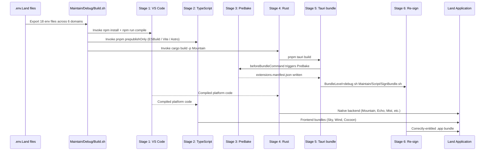
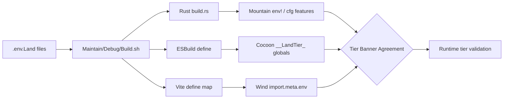
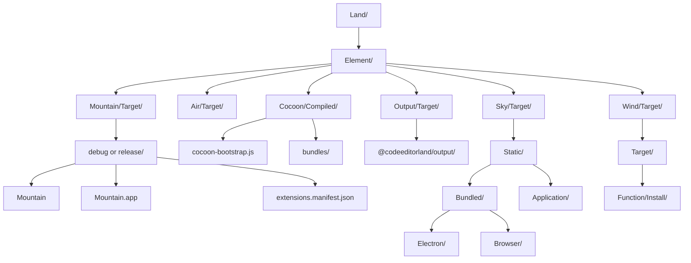

# Build Pipeline

The complete build pipeline for the **Land** code editor, from environment
variable resolution through binary artifact production. The pipeline is a
multi-stage, multi-language process that coordinates `Rust`, `TypeScript`, and
static asset compilation across 15+ component workspaces.

---

## Table of Contents

1. [Pipeline Overview](#pipeline-overview)
2. [Environment Variable System](#environment-variable-system)
3. [Build Entry Point](#build-entry-point)
4. [Profile System](#profile-system)
5. [Env Propagation to Each Element](#env-propagation-to-each-element)
6. [Rust Build Process](#rust-build-process)
7. [TypeScript Build Process](#typescript-build-process)
8. [Artifact Layout](#artifact-layout)
9. [Output Transform Pipeline](#output-transform-pipeline)
10. [Worker Build Process](#worker-build-process)
11. [SideCar Binary Management](#sidecar-binary-management)
12. [Related Documentation](#related-documentation)

---

## Pipeline Overview 📋

The **Land** build has six stages:

1. **VS Code platform compile** - produces the compiled JavaScript platform code
2. **TypeScript build** - `pnpm prepublishOnly` for Wind, Cocoon, Output, Sky,
   Worker
3. **PreBake** - walks extension roots, writes `extensions.manifest.json` (runs
   via `beforeBundleCommand`)
4. **Rust build** - `cargo build -p Mountain`
5. **Tauri bundle** - `pnpm tauri build`
6. **Re-sign** - `Maintain/Script/SignBundle.sh` strips quarantine bits and
   re-applies entitlements



### Stage 1: VS Code Platform Compilation

The VS Code source is vendored as a `Git` submodule at
`Dependency/Microsoft/Dependency/Editor`. Stage 1 produces the compiled
JavaScript platform code that `Cocoon` and `Sky` consume:

> [!IMPORTANT]
>
> This step is a **mandatory prerequisite** for every Land build. `Cocoon` and
> `Output` both depend on the compiled output. You must be on **Node 24**
> (tracked in `Dependency/Microsoft/Dependency/Editor/.nvmrc`).

```sh
cd Dependency/Microsoft/Dependency/Editor

# Switch to Node 24 (reads .nvmrc automatically)
nvm use 24

git fetch --all
git reset --hard Parent/main
git clean -dfx
pnpm install
pnpm run compile
pnpm run compile-extensions-build
```

The `compile-extensions-build` step produces `out-<platform>` directories
containing compiled extension JavaScript and metadata. These are consumed by the
`Output` element for bundling into the `@codeeditorland/output` package.

### Stage 2: Land Application Assembly

Stage 2 compiles the native `Rust` backend and bundles the `TypeScript` frontend
into a runnable `Tauri` application:

```sh
cd Land
export Trace=all Record=1 Disable=false
./Maintain/Debug/Build.sh --profile debug-electron-bundled
```

The build script invokes, in sequence:

1. **TypeScript build** (`pnpm prepublishOnly`) - Output, Cocoon, Worker, Wind,
   Sky
    - Output artifact bundling via `ESBuild` for the VS Code platform code
    - Cocoon compilation via `ESBuild` for the extension host
    - Worker compilation via `ESBuild` for the service worker
    - Wind + Sky compilation via `Vite`/`Astro` for the UI layer
2. **PreBake** (`Maintain/Build/Manifest/PreBake.ts`) - runs via
   `beforeBundleCommand` inside `tauri.conf.json`; walks extension roots and
   writes `extensions.manifest.json`. Fires in **all** build paths (direct
   `pnpm tauri build`, `Build.sh`, CI) - not only via the wrapper script.
   Consumed by `LoadFromCache.rs` at boot (<50 ms vs ~1200 ms live scan).
3. **Rust workspace compilation** via `cargo build -p Mountain`
4. **Tauri bundling** for the final `.app` bundle
5. **Re-sign** (`Maintain/Script/SignBundle.sh`) - strips macOS quarantine bits
   with `xattr -cr`, then re-signs with `codesign --force --deep --sign -` plus
   `Entitlements.plist` (hardened runtime + JIT + file-picker TCC). Invoked
   automatically by `Build.sh`:
    ```sh
    BundleLevel=debug sh Maintain/Script/SignBundle.sh
    ```

---

## Environment Variable System ⚙️

**Land** uses a multi-file `.env` system with 18 files across 6 domains:

### File Discovery

The build script resolves env files in this priority order:

1. `$Land_Env_File` (if explicitly exported)
2. `.env.Land` (local gitignored overrides)
3. `../.env.Land` (one level up)
4. `.env.Land.Sample` (checked-in defaults)
5. `../.env.Land.Sample`

The resolved file is sourced via `set -a; . "$EnvFile"; set +a`, exporting every
key-value pair into the shell environment so every child tool inherits the same
variable set.

### File Hierarchy by Domain

| Domain      | Suffix         | Dev File                | Sample File                    | Production File                    |
| ----------- | -------------- | ----------------------- | ------------------------------ | ---------------------------------- |
| Core        | (none)         | `.env.Land`             | `.env.Land.Sample`             | `.env.Land.Production`             |
| Node        | `.Node`        | `.env.Land.Node`        | `.env.Land.Node.Sample`        | `.env.Land.Production.Node`        |
| Extensions  | `.Extensions`  | `.env.Land.Extensions`  | `.env.Land.Extensions.Sample`  | `.env.Land.Production.Extensions`  |
| PostHog     | `.PostHog`     | `.env.Land.PostHog`     | `.env.Land.PostHog.Sample`     | `.env.Land.Production.PostHog`     |
| Diagnostics | `.Diagnostics` | `.env.Land.Diagnostics` | `.env.Land.Diagnostics.Sample` | `.env.Land.Production.Diagnostics` |
| Bundled     | `.Bundled`     | `.env.Land.Bundled`     | `.env.Land.Bundled.Sample`     | `.env.Land.Production.Bundled`     |

### Profile-to-File Mapping

Each build profile loads a specific combination of env files:

| Profile                   | Files Loaded                                                | Purpose                         |
| ------------------------- | ----------------------------------------------------------- | ------------------------------- |
| Development               | `.env.Land`                                                 | Default local development       |
| Development + Bundled     | `.env.Land` + `.env.Land.Bundled`                           | Dev with pre-compiled workbench |
| Development + Extensions  | `.env.Land` + `.env.Land.Extensions`                        | Dev with extension installation |
| Development + Node        | `.env.Land` + `.env.Land.Node`                              | Dev with specific Node version  |
| Development + PostHog     | `.env.Land` + `.env.Land.PostHog`                           | Dev with telemetry enabled      |
| Development + Diagnostics | `.env.Land` + `.env.Land.Diagnostics`                       | Dev with debug tracing          |
| Production                | `.env.Land.Production`                                      | Release build                   |
| Production + Bundled      | `.env.Land.Production` + `.env.Land.Production.Bundled`     | Release with bundled workbench  |
| Production + Extensions   | `.env.Land.Production` + `.env.Land.Production.Extensions`  | Production with extension skip  |
| Production + Node         | `.env.Land.Production` + `.env.Land.Production.Node`        | Production with specific Node   |
| Production + PostHog      | `.env.Land.Production` + `.env.Land.Production.PostHog`     | Production with telemetry       |
| Production + Diagnostics  | `.env.Land.Production` + `.env.Land.Production.Diagnostics` | Production with trace/record    |

---

## Profile System 📋

### Available Build Profiles

| Profile String                  | Workbench      | Feature Coverage                     | Output Type              |
| ------------------------------- | -------------- | ------------------------------------ | ------------------------ |
| `debug`                         | Browser        | 70-80%                               | Dev binary               |
| `debug-mountain`                | Mountain       | 80-90%                               | Dev binary (recommended) |
| `debug-electron`                | Electron       | 95%+                                 | Dev binary               |
| `debug-electron-rest`           | Electron + OXC | 95%+ + fastest TS                    | Dev binary               |
| `debug-electron-minimal`        | Electron       | No built-in extensions               | Dev binary               |
| `debug-mountain-only`           | Mountain       | No `Cocoon` subprocess               | Dev binary               |
| `debug-cocoon-headless`         | None           | Mountain + `Cocoon`, `Wind` disabled | Dev binary               |
| `debug-kernel`                  | None           | Pure `Mountain`, no built-ins        | Dev binary               |
| `debug-electron-compiled`       | Electron       | Single-binary embedded resources     | Dev binary               |
| `debug-mountain-compiled`       | Mountain       | Single-binary embedded resources     | Dev binary               |
| `debug-electron-bundled`        | Electron       | `Vite`/`Astro` compiled workbench    | Dev binary               |
| `debug-browser-bundled`         | Browser        | `Vite`/`Astro` compiled workbench    | Dev binary               |
| `debug-sessions-bundled`        | Sessions       | `Vite`/`Astro` compiled workbench    | Dev binary               |
| `debug-workbench-bundled`       | Workbench      | `Vite`/`Astro` compiled workbench    | Dev binary               |
| `debug-bundled-all`             | All four       | Single Rollup pass                   | Dev binary               |
| `production-electron-bundled`   | Electron       | Optimized release                    | Prod binary              |
| `production-electron-unbundled` | Electron       | Release without bundled assets       | Prod binary              |

### Program Launch Options

The build script supports additional runtime flags:

| Flag               | Effect                                     |
| ------------------ | ------------------------------------------ |
| `--run`            | Launch application immediately after build |
| `--profile <name>` | Select build profile (default: `debug`)    |
| `--help`           | Show profile documentation                 |

---

## Env Propagation to Each Element 📡

Each Element reads the resolved environment variables through its own build
system path:



### Rust Elements (Mountain, Common, Echo, Mist, Rest, SideCar, Air, Grove, Vine)

```
Maintain/Debug/Build.sh
    |
    | exports every Tier* and Product* env var
    v
Cargo / build.rs
    |
    +---> PropagateTierGating() emits:
    |       cargo:rustc-env=Tier<Capability>=<Value>  (compile-time env var)
    |       cargo:rustc-cfg=feature="Tier<Capability><Value>"  (cfg gates)
    |       cargo:rerun-if-changed=<envfile>  (invalidation)
    |
    v
Mountain/src/main.rs
    |
    +---> env!("TierFileSystem")  // compile-time constant
    +---> #[cfg(feature = "TierFileSystemLayer4")]  // conditional compilation
```

### TypeScript Elements (Cocoon)

```
Maintain/Debug/Build.sh
    |
    | serialises every Tier* var into CocoonEsbuildDefine JSON blob
    v
Cocoon/Source/Configuration/ESBuild/Config/TargetConfig.ts
    |
    | merges blob into esbuild define map
    v
ESBuild bundle
    |
    | __LandTier_FileSystem__ is substituted at bundle time
    v
Cocoon/Source/Bootstrap/Implementation/CocoonMain.ts
    |
    | populates globalThis.__LandTiers from substituted identifiers
    | falls through to process.env.Tier<Capability>
    | falls through to hard-coded defaults
    v
Cocoon/Source/Utility/Tier.ts
    |
    | exposes const Tier = { ... } as const
    | read by all Cocoon services
```

### TypeScript Elements (Sky/Wind)

```
Maintain/Debug/Build.sh
    |
    | exports Tier* and Product* env vars
    v
Sky/astro.config.ts
    |
    | forwards every Tier* env var to Vite define map
    v
Vite bundle
    |
    | import.meta.env.TierFileSystem is substituted at build time
    v
Wind/Source/Utility/Tier.ts
    |
    | reads import.meta.env.Tier<Capability>
    | falls through to globalThis.__LandTiers
    | falls through to hard-coded defaults
    | emits console.info() boot banner
```

### Cross-Element Agreement

All three runtime banners must report identical tier values:

| Element    | Banner Mechanism         |
| ---------- | ------------------------ |
| `Mountain` | `Rust` `env!()` banner   |
| `Cocoon`   | `LandFixLog.Info` banner |
| `Wind`     | `console.info` banner    |

A mismatch indicates one build tool read a different env file.

---

## Rust Build Process 🔧

### Workspace Structure

The `Rust` elements form a workspace at `Land/Cargo.toml`:

```toml
[workspace]
members = [
	"Element/Common",
	"Element/Echo",
	"Element/Mist",
	"Element/Mountain",
	"Element/Rest",
	"Element/SideCar",
	"Element/Air",
	"Element/Grove",
	"Element/Vine",
]
```

### build.rs Tier Propagation

Every `Rust` Element with tier-gated features has a `build.rs` that:

1. Calls `PropagateTierGating()` which scans the resolved env file
2. Emits `cargo:rustc-env=` for every row (defaults + overrides)
3. For non-default values, emits
   `cargo:rustc-cfg=feature="Tier<Capability><Value>"`
4. Calls `IsDeclaredTierFeature()` to validate against `Cargo.toml [features]`
5. Calls `IsDefaultTierValue()` to identify no-op default values
6. Emits `cargo:warning=` for any unrecognized `(Key, Value)` pair

### Feature Gates

Non-default tier values activate `Cargo` features:

```toml
[features]
default = []
TierFileSystemLayer4 = []
TierGlobNative = []
```

When `.env.Land` contains `TierFileSystem=Layer4`, the build script passes
`--features TierFileSystemLayer4` to cargo. Default values do not activate
features, keeping the baseline compilation lean.

---

## TypeScript Build Process 📦

### ESBuild Compilation (Cocoon, Output, Worker)

`Cocoon`, `Output`, and `Worker` compile through `ESBuild` with:

1. **Env-injected defines** via `CocoonEsbuildDefine` JSON blob
2. **Target configuration** via `TargetConfig.ts` (resolves platform, arch,
   profile)
3. **Output to** `Element/<Name>/Target/` or `Element/<Name>/Compiled/`

### Vite/Astro Compilation (Sky, Wind)

`Sky` and `Wind` compile through `Vite` with `Astro`:

1. **Vite define map** receives every `Tier*` env var as `import.meta.env.Tier*`
2. **Astro pages** are rendered to static HTML + JS bundles
3. **SkyBridge** (~2900 lines) is compiled as the runtime event bridge
4. **Output to** `Element/Sky/Target/`

---

## Artifact Layout 📁

After a successful build, artifacts are placed in per-Element target
directories:



Notable artifacts:

| Path                                                       | Description                                                 |
| ---------------------------------------------------------- | ----------------------------------------------------------- |
| `Element/Mountain/Target/<level>/Mountain`                 | Native binary                                               |
| `Element/Mountain/Target/<level>/bundle/macos/*.app`       | Signed `.app` bundle                                        |
| `Element/Mountain/Target/<level>/extensions.manifest.json` | Pre-baked extension list (~50 ms load vs 1200 ms live scan) |
| `Element/Sky/Target/Static/Application/`                   | VS Code workbench assets                                    |
| `Element/Sky/Target/Static/Bundled/Electron/`              | Vite-bundled workbench (bundled profiles only)              |
| `Element/Cocoon/Compiled/cocoon-bootstrap.js`              | Extension host bundle                                       |

---

## Output Transform Pipeline 🔧

The `Output` element manages the compilation of VS Code platform source code
through two parallel compiler paths:

### Primary Path (ESBuild)

1. **Input:** `Dependency/Editor/out/` (Stage 1 compiled VS Code)
2. **Processing:** `ESBuild` applies transforms for `Tauri` compatibility:
    - Module resolution remapping (`electron` -> `@tauri-apps/api`)
    - `require()` interceptor patches
    - Source map generation
    - Polyfill injection (see [Polyfills](Polyfills.md))
    - `InjectShimHook` - shim interception layer injection
3. **Output:** `Output/Target/@codeeditorland/output/`

### Optional Path (Rest/OXC)

1. **Input:** Same VS Code source
2. **Processing:** `Rest` (`Rust` `OXC`) re-compiles `TypeScript` 2-3x faster:
    - `OXC` parser handles decorators, class fields, `JSX`
    - `OXC` transformer produces VS Code-compatible output
    - `Rest` `--compiler` CLI flag activates this path
3. **Output:** Same layout, substituted for `ESBuild` output when
   `--compiler rest` is set

---

## Worker Build Process 🗂️

The `Worker` element compiles independently through `ESBuild` with no runtime
dependencies:

1. **Input:** `Element/Worker/Source/`
2. **ESBuild** produces:
    - Service worker script (caching strategy, offline handler)
    - CSS module interceptor (intercepts `import 'styles.css'` in JS and loads
      as `<link>`)
3. **Output:** `Element/Worker/Target/`
4. **Consumed by:** `Sky` at build time (bundled into UI as
   `<script type="module">`)

The `Worker` has zero runtime dependencies (`"dependencies": {}` in its
`package.json`). All functionality is implemented with standard `ServiceWorker`
and `Cache` APIs.

---

## SideCar Binary Management 📦

The `SideCar` element manages vendored `Node.js` runtime binaries:

1. **Binary resolution:** `Build.sh` reads `NodeVersion` and `NodePlatform` from
   env
2. **Download:** `SideCar`'s tool fetches the exact binary from official sources
3. **Caching:** Binaries cached by version + platform key in
   `SideCar/Cache.json`
4. **Git LFS:** Large binaries stored via `Git LFS` for version-controlled
   distribution
5. **Consumption:** `Mountain`'s build process copies the resolved binary into
   the app bundle

Target triples supported:

- `aarch64-apple-darwin` (Apple Silicon `macOS`)
- `x86_64-apple-darwin` (Intel `macOS`)
- `aarch64-unknown-linux-gnu` (ARM64 Linux)
- `x86_64-unknown-linux-gnu` (x86_64 Linux)
- `aarch64-pc-windows-msvc` (ARM64 Windows)
- `x86_64-pc-windows-msvc` (x86_64 Windows)

---

## Related Documentation 📋

- [Architecture](Architecture.md) - System architecture overview
- [EditorCore](EditorCore.md) - Editor workbench adaptation
- [Polyfills](Polyfills.md) - Compatibility shims
- [RustInfrastructure](RustInfrastructure.md) - `Rust` backend components
- [InterComponentProtocol](InterComponentProtocol.md) - `gRPC` protocol
  specification
- [Building](Building.md) - Build instructions and prerequisites
- [BuildMatrix](BuildMatrix.md) - Full build variant matrix
- [EnvironmentVariables](EnvironmentVariables.md) - Complete env var reference
- [Workflow/TierGatedImplementationSelection](Workflow/TierGatedImplementationSelection.md)

---

**Project Maintainers:** Source Open
([Source/Open@Editor.Land](mailto:Source/Open@Editor.Land)) |
[GitHub Repository](https://github.com/CodeEditorLand/Land) |
[Report an Issue](https://github.com/CodeEditorLand/Land/issues)
