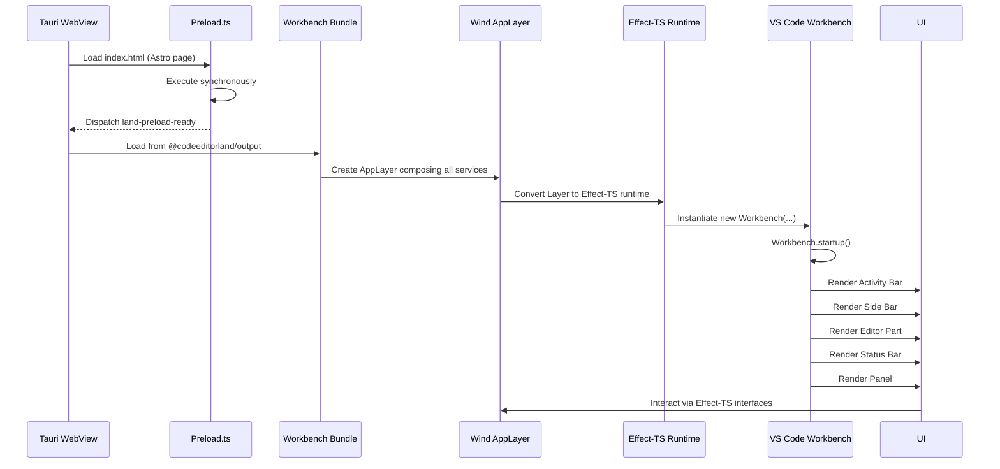
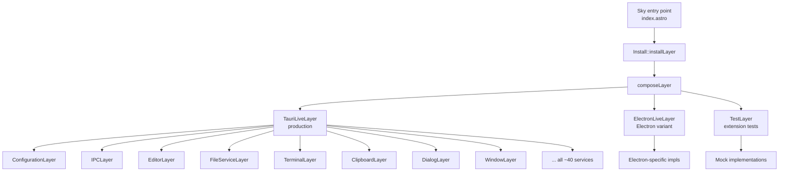
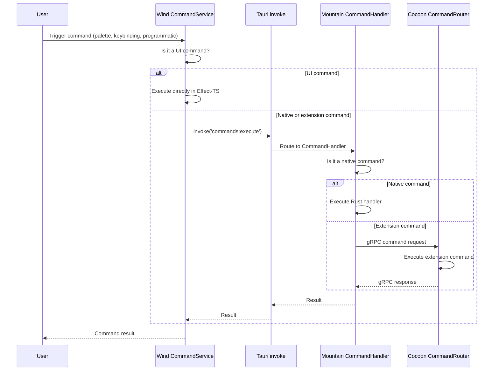

# Editor Core: Workbench Adaptation

This document describes how Land adapts the VS Code workbench to run inside a
Tauri WebView. It covers the Wind service layer architecture, workbench variant
system, command dispatch, and the VS Code API coverage split across Mountain,
Cocoon, and Sky/Wind.

---

## Table of Contents

1. [Workbench Architecture](#workbench-architecture)
2. [Wind Service Layer](#wind-service-layer)
3. [Service Composition and Layer Stacks](#service-composition-and-layer-stacks)
4. [Workbench Variants](#workbench-variants)
5. [Command Dispatch System](#command-dispatch-system)
6. [Editor Service Architecture](#editor-service-architecture)
7. [VS Code API Coverage Strategy](#vs-code-api-coverage-strategy)
8. [Related Documentation](#related-documentation)

---

## Workbench Architecture

The VS Code workbench is the core UI framework that renders the editor
interface. In VS Code's Electron architecture, the workbench runs in the
renderer process and communicates with the main process via Electron IPC. Land
replaces this IPC layer with Tauri commands and events while keeping the
workbench UI code substantially unchanged.

### Architecture Comparison

| Aspect            | VS Code (Electron)           | Land (Tauri)                   |
| ----------------- | ---------------------------- | ------------------------------ |
| Main process      | Electron Main                | Mountain (Rust)                |
| Renderer process  | Electron Renderer            | Tauri WebView                  |
| IPC mechanism     | Electron ipcRenderer/ipcMain | Tauri invoke/event             |
| Preload           | electron preload.js          | Wind Preload.ts                |
| Extension host    | Child Node process           | Cocoon (Node sidecar via gRPC) |
| File system       | Node.js fs module            | Mountain native Rust fs        |
| Native dialogs    | Electron dialog API          | Tauri dialog plugin            |
| Window management | Electron BrowserWindow       | Tauri Window                   |

### Workbench Loading Sequence



---

## Wind Service Layer

Wind provides ~40 Effect-TS services that replace the VS Code workbench service
implementations. Each service follows a consistent module structure with three
files:

```
Wind/Source/Effect/<Service>/
    +-- Define.ts    - Service Tag (Effect-TS service identifier)
    +-- Implement.ts - Tauri-backed implementation
    +-- Problem.ts   - Typed error types (subclass of Effect-TS Cause)
```

### Service Catalog

#### Core Infrastructure

| Service       | Tag             | Purpose                                         |
| ------------- | --------------- | ----------------------------------------------- |
| IPC           | `IPC`           | Tauri command invocation and event subscription |
| Configuration | `Configuration` | Read/write settings via Mountain                |
| Environment   | `Environment`   | OS environment variables and paths              |
| Mountain      | `Mountain`      | gRPC-level communication with Mountain backend  |
| MountainSync  | `MountainSync`  | Synchronous state snapshot from Mountain        |
| Log           | `Log`           | Structured logging                              |

#### Editor Services

| Service           | Tag                 | Purpose                                                |
| ----------------- | ------------------- | ------------------------------------------------------ |
| Editor            | `Editor`            | Text editor creation, focus, layout management         |
| TextModel         | `TextModel`         | Document model creation and management                 |
| TextModelResolver | `TextModelResolver` | Resolve text models from URI references                |
| CodeEditor        | `CodeEditor`        | Monaco editor widget wrapping                          |
| CodeEditorService | `CodeEditorService` | Editor decoration, suggestion, and widget coordination |
| BulkEdit          | `BulkEdit`          | Multi-document text editing                            |
| UndoRedo          | `UndoRedo`          | Undo/redo stack management                             |

#### File System Services

| Service     | Tag           | Purpose                                         |
| ----------- | ------------- | ----------------------------------------------- |
| FileService | `FileService` | File read/write/delete/copy/move via Mountain   |
| FileDialog  | `FileDialog`  | Native OS file dialogs via Tauri                |
| Workspace   | `Workspace`   | Workspace root resolution and folder management |

#### Window and UI Services

| Service      | Tag            | Purpose                                         |
| ------------ | -------------- | ----------------------------------------------- |
| Window       | `Window`       | Window state (fullscreen, maximized, minimized) |
| Dialog       | `Dialog`       | Message boxes, input boxes via Mountain         |
| Notification | `Notification` | Toast notifications and progress indicators     |
| Progress     | `Progress`     | Long-running operation progress UI              |
| Views        | `Views`        | View container management (sidebar, panel)      |

#### Clipboard Services

| Service       | Tag             | Purpose                                  |
| ------------- | --------------- | ---------------------------------------- |
| Clipboard     | `Clipboard`     | System clipboard read/write via Mountain |
| LiveClipboard | `LiveClipboard` | Real-time clipboard monitoring           |

#### Terminal Services

| Service         | Tag               | Purpose                                     |
| --------------- | ----------------- | ------------------------------------------- |
| Terminal        | `Terminal`        | Integrated terminal creation and management |
| TerminalProcess | `TerminalProcess` | PTY process lifecycle via Mountain          |

#### Extension Integration Services

| Service             | Tag                   | Purpose                                       |
| ------------------- | --------------------- | --------------------------------------------- |
| ExtensionManagement | `ExtensionManagement` | Extension install/uninstall/list via Mountain |
| ExtensionScanner    | `ExtensionScanner`    | Scan filesystem for installed extensions      |
| ExtensionsWorkbench | `ExtensionsWorkbench` | Extensions view in sidebar                    |

#### Storage Services

| Service       | Tag             | Purpose                                         |
| ------------- | --------------- | ----------------------------------------------- |
| Storage       | `Storage`       | Key-value storage (global and workspace scoped) |
| StorageClient | `StorageClient` | Remote storage synchronization                  |
| SecretStorage | `SecretStorage` | OS keychain-backed secrets                      |

#### Other Services

| Service       | Tag             | Purpose                                  |
| ------------- | --------------- | ---------------------------------------- |
| CustomEditor  | `CustomEditor`  | Custom (webview-based) editor support    |
| Keybinding    | `Keybinding`    | Keyboard shortcut resolution             |
| SCM           | `SCM`           | Source Control Management integration    |
| Search        | `Search`        | File search and text search via Mountain |
| Task          | `Task`          | Task execution and management            |
| Timeline      | `Timeline`      | File timeline (local history)            |
| Webview       | `Webview`       | Webview panel management                 |
| Accessibility | `Accessibility` | Screen reader support via OS APIs        |
| Lifecycle     | `Lifecycle`     | Application lifecycle events             |

---

## Service Composition and Layer Stacks

Wind services compose into Layer stacks using Effect-TS's Layer system. Each
Layer is a collection of service implementations wired together through
Effect-TS's dependency injection.

### Layer Stack Architecture



### Layer Resolution

The active layer is determined at build time through environment variables:

```
Wind/Source/Function/Install/index.ts
    |
    +---> Reads Tier configuration from import.meta.env
    +---> Selects TauriLiveLayer | ElectronLiveLayer | TestLayer
    +---> Converts Layer to Runtime via Effect-TS Layer.toRuntime()
    +---> Provides Runtime to Sky UI components
```

Each Layer wire uses the Effect-TS `Layer.merge` combinator to compose services
with their explicit dependency graphs:

```typescript
export const TauriLiveLayer: Layer<...> = Layer.mergeAll(
    ConfigurationLayer,
    IPCLayer,
    EditorLayer,
    FileServiceLayer,
    TerminalLayer,
    // ... all service layers
);
```

Effect-TS's compile-time dependency tracking ensures that no service can be used
without its dependencies being satisfied by the Layer stack. A missing
dependency produces a TypeScript type error.

---

## Workbench Variants

Land supports multiple workbench variants selected at build time:

| Variant              | Feature Coverage          | Build Profile             | Use Case                                   |
| -------------------- | ------------------------- | ------------------------- | ------------------------------------------ |
| **Browser**          | 70-80%                    | `debug`                   | Quick development, limited native features |
| **Mountain**         | 80-90%                    | `debug-mountain`          | Daily development, Tauri native features   |
| **Electron**         | 95%+                      | `debug-electron`          | Maximum VS Code compatibility              |
| **Electron+Rest**    | 95%+                      | `debug-electron-rest`     | Same as Electron + OXC compiler            |
| **Electron Minimal** | No built-in extensions    | `debug-electron-minimal`  | Minimal footprint debugging                |
| **Sessions**         | Window/Session management | `debug-sessions-bundled`  | Multi-window session support               |
| **Workbench**        | Base workbench only       | `debug-workbench-bundled` | Minimal UI for testing                     |

### Variant Selection Logic

Sky's `index.astro` entry point selects the active workbench at build time:

```typescript
// Pseudo-code from Sky's build-time conditional imports
const workbench: WorkbenchVariant =
	TierWorkbench === "Electron"
		? ElectronWorkbench
		: TierWorkbench === "Mountain"
			? MountainWorkbench
			: TierWorkbench === "Browser"
				? BrowserWorkbench
				: BaseWorkbench;
```

Unused variants are tree-shaken by Vite and do not enter the production module
graph.

---

## Command Dispatch System

Land implements the VS Code command system across all three layers:

### Command Registry Structure

```
Command Registration:
    Wind (UI commands)      -- registered in Wind services
    Mountain (native)       -- registered as Tauri command handlers
    Cocoon (extensions)     -- registered via vscode.commands.registerCommand
```

### Command Execution Flow



### Command Categories

| Category        | Registered In | Examples                                                                     |
| --------------- | ------------- | ---------------------------------------------------------------------------- |
| Native editor   | Wind          | `cursorMove`, `type`, `replacePreviousChar`                                  |
| Window/UI       | Mountain      | `workbench.action.toggleSidebar`, `workbench.action.terminal.toggleTerminal` |
| File operations | Mountain      | `workbench.action.files.save`, `workbench.action.files.openFile`             |
| Extension       | Cocoon        | `editor.action.formatDocument`, `git.commit`                                 |

---

## Editor Service Architecture

The editor service in Wind integrates the VS Code CodeEditor widget (based on
Monaco) with Tauri's WebView and Mountain's native capabilities:

### Text Model Management

```
User opens file
    |
    v
Wind EditorService
    |
    +---> TextModelService resolves URI
    +---> IFileService.readFile() via Tauri -> Mountain
    +---> Content returned as Uint8Array
    +---> TextModel created with content
    +---> Language mode detected from file extension
    +---> Editor widget instantiated with TextModel
    |
    v
Editor renders in Sky UI
```

### Editor Change Lifecycle

```
User types in editor
    |
    v
CodeEditor widget fires onDidChangeTextContent
    |
    v
Wind TextModel marks model as dirty
    |
    v
Dirty state propagates to:
    +---> Tab indicator change (tab shows unsaved dot)
    +---> FileService save provider pipeline (see Workflow/SavingAFileWithSaveParticipants.md)
    +---> Autosave timer (if configured)
```

---

## VS Code API Coverage Strategy

Land uses a dual-track strategy for VS Code API coverage:

### Track A: Stock Node (Maximum Compatibility)

The Cocoon extension host loads unmodified VS Code `extHost*.ts` source files.
The ExtHostContext/MainContext RPC glue that normally runs in Electron's main
process is shimmed by Cocoon to work over gRPC.

Coverage: All APIs that the stock implementation handles in-process are
immediately compatible.

### Track B: Rust Native (Performance)

For I/O-heavy APIs, the Cocoon `vscode` shim routes operations through gRPC to
Mountain for native Rust execution. This provides:

- Faster filesystem operations (native syscalls vs Node.js fs)
- Direct OS integration (clipboard, dialogs, keychain)
- Native terminal PTY (portable-pty crate vs node-pty)
- Zero-copy buffer handling

### Coverage Matrix

The authoritative coverage matrix is at
`Documentation/GitHub/VSCode-API-Coverage-Matrix.md`. Status symbols:

| Status        | Meaning                                               |
| ------------- | ----------------------------------------------------- |
| Working       | Activation + feature render path confirmed end-to-end |
| Partial       | RPC wired but UI render gap, or missing sub-method    |
| Stubbed       | Registration accepted but no effect                   |
| Not attempted | No implementation started                             |
| Lifted        | Pure-function stateless implementation already landed |

---

## Related Documentation

- [Architecture](Architecture.md) - System architecture overview
- [BuildPipeline](BuildPipeline.md) - Build pipeline
- [Polyfills](Polyfills.md) - Compatibility shims and initialization layers
- [RustInfrastructure](RustInfrastructure.md) - Rust backend components
- [InterComponentProtocol](InterComponentProtocol.md) - gRPC protocol
  specification
- [VSCode-API-Coverage-Matrix](VSCode-API-Coverage-Matrix.md) - Comprehensive
  API status
- [Workflow/ApplicationStartupAndHandshake](Workflow/ApplicationStartupAndHandshake.md)
- [Workflow/CreatingAndInteractingWithAWebviewPanel](Workflow/CreatingAndInteractingWithAWebviewPanel.md)

---

**Project Maintainers:** Source Open
([Source/Open@Editor.Land](mailto:Source/Open@Editor.Land)) |
[GitHub Repository](https://github.com/CodeEditorLand/Land) |
[Report an Issue](https://github.com/CodeEditorLand/Land/issues)
