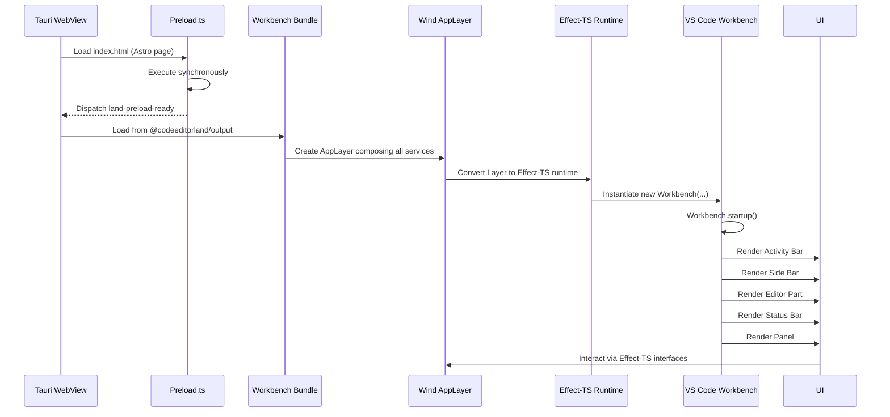
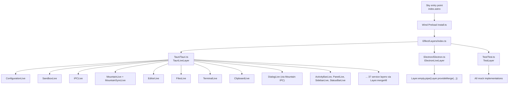
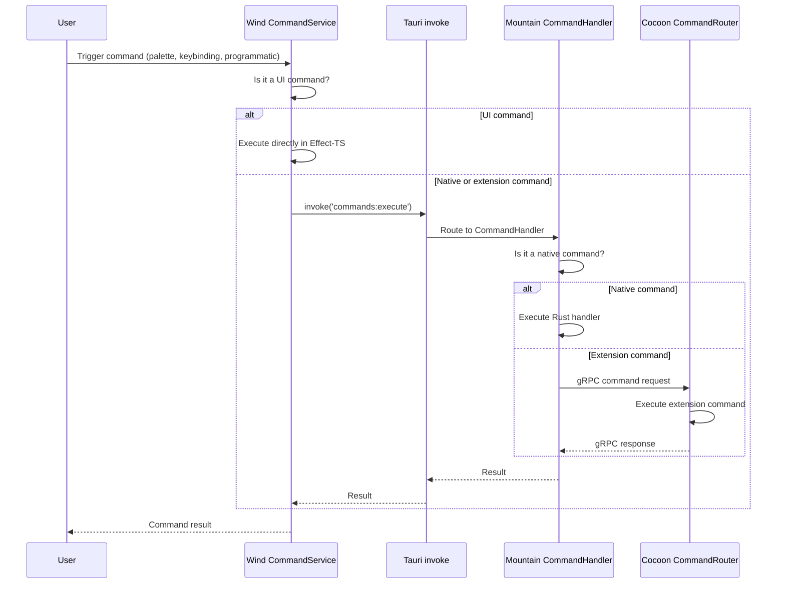

# Editor Core: Workbench Adaptation

How **Land** adapts the VS Code workbench to run inside a `Tauri` WebView. It
covers the `Wind` service layer architecture, workbench variant system, command
dispatch, and the VS Code API coverage split across `Mountain`, `Cocoon`, and
`Sky`/`Wind`.

Each section below restates its own context, so the document survives being
read out of order. Every source path is a link to its canonical location on the
`Current` branch of the repository that owns it.

---

## Table of Contents

1. [Workbench Architecture](#workbench-architecture)
2. [Wind Service Layer](#wind-service-layer)
3. [Service Composition and Layer Stacks](#service-composition-and-layer-stacks)
4. [Workbench Variants](#workbench-variants)
5. [Command Dispatch System](#command-dispatch-system)
6. [Editor Service Architecture](#editor-service-architecture)
7. [VS Code API Coverage Strategy](#vs-code-api-coverage-strategy)
8. [Related Documentation](#related-documentation)

---

## Workbench Architecture&#x2001;🏗️

**What the workbench does:** it renders the editor surface - Activity Bar, Side
Bar, Editor Part, Status Bar and Panel - and owns the service graph that every
other UI component resolves against.

The VS Code workbench is the core UI framework that renders the editor
interface. In VS Code's Electron architecture, the workbench runs in the
renderer process and communicates with the main process via Electron IPC.

**Land** replaces this IPC layer with `Tauri` commands and events while keeping
the workbench UI code substantially unchanged. The UI tree is upstream code; the
transport underneath it is not.

### Architecture Comparison

**What this mapping does:** it pairs each Electron facility VS Code depends on
with the **Land** component that replaces it, so a contributor tracing a
subsystem knows which repository to open.

| Aspect            | VS Code (Electron)           | Land (Tauri)                       |
| ----------------- | ---------------------------- | ---------------------------------- |
| Main process      | Electron Main                | `Mountain` (`Rust`)                |
| Renderer process  | Electron Renderer            | `Tauri` WebView                    |
| IPC mechanism     | Electron ipcRenderer/ipcMain | `Tauri` invoke/event               |
| Preload           | electron preload.js          | `Wind` `Preload.ts`                |
| Extension host    | Child Node process           | `Cocoon` (Node sidecar via `gRPC`) |
| File system       | Node.js fs module            | `Mountain` native `Rust` fs        |
| Native dialogs    | Electron dialog API          | `Tauri` dialog plugin              |
| Window management | Electron BrowserWindow       | `Tauri` Window                     |

The `Wind` column resolves to [`Wind/Source/`](https://github.com/CodeEditorLand/Wind/tree/Current/Source), the `Mountain`
column to the [`Mountain`](https://github.com/CodeEditorLand/Mountain/tree/Current) repository, and the extension host column to
[`Cocoon`](https://github.com/CodeEditorLand/Cocoon/tree/Current).

### Workbench Loading Sequence

**What the loading sequence does:** it carries the WebView from a cold Astro
page to a painted workbench, installing the preload bridge before any workbench
code is allowed to run.

**`Workbench loading sequence`**



> [!NOTE]
>
> The diagram traces one cold start: the preload stage runs synchronously and
> announces itself, then the bundle builds the service graph and
> `Workbench.startup()` paints the five UI parts.

### Preload Handshake

**What the preload stage does:** it installs the `Tauri` bridge onto the WebView
global scope and then fires a single DOM event that tells the workbench bundle
the bridge is ready to use.

**[`Wind/Source/Preload.ts`](https://github.com/CodeEditorLand/Wind/tree/Current/Source/Preload.ts)**

```ts
// Final line of the synchronous preload stage - the bundle waits on this.
window.dispatchEvent(new Event("land-preload-ready"));
```

> [!NOTE]
>
> Nothing in the workbench bundle may call `Tauri` before this event fires,
> which is why the preload stage is synchronous rather than deferred.

---

## Wind Service Layer&#x2001;🧩

**What the Wind service layer does:** it supplies the service implementations
the workbench resolves at startup, standing in for VS Code's Electron-backed
services with ones that call `Mountain` across the `Tauri` boundary.

`Wind` provides ~45 `Effect-TS` services (spanning 59 directories under
`Effect/`, including a `Generated/` layer of upstream VS Code service wrappers)
that replace the VS Code workbench service implementations. Each service follows
a consistent module structure:

**`Wind service module layout`**

```
Wind/Source/Effect/<Service>/
    +-- <Service>.ts            - Barrel re-export module
    +-- Interface/              - Service interface (TypeScript type)
    +-- Tag/                    - Effect-TS service Tag identifier
    +-- Type/                   - Effect-TS Cause subtypes (errors)
    +-- Implementation/         - Concrete implementations (Live, Mock)
    +-- Live.ts                 - Layer export (Layer.succeed)
```

> [!NOTE]
>
> Some directories (e.g., `WorkbenchActivity/`) follow a flatter layout where
> `Implementation/` contains the bridge shape and live implementation, and
> `index.ts` replaces `<Service>.ts` as the barrel. The `Generated/` directory
> holds auto-generated upstream VS Code service wrappers (I<Interface>Upstream.ts).

> [!IMPORTANT]
>
> The `Effect-TS` layout above is the design this chapter documents; the tracked
> tree has since moved on. Commit `96704967` (2026-06-13) migrated the service
> domains out of `Source/Effect/` and removed the `effect` dependency from Wind's
> `package.json`, so on `Current` [`Wind/Source/Effect/`](https://github.com/CodeEditorLand/Wind/tree/Current/Source) holds no
> tracked files and the live transport code sits in
> [`Wind/Source/Service/`](https://github.com/CodeEditorLand/Wind/tree/Current/Source/Service).

### Service Catalog

**What the catalog does:** it names every service the workbench can resolve and
the `Tag` it is resolved by, grouped so a reader can find the owner of a
capability without reading the whole list.

#### Core Infrastructure

| Service       | Tag             | Purpose                                            |
| ------------- | --------------- | -------------------------------------------------- |
| IPC           | `IPC`           | `Tauri` command invocation and event subscription  |
| Configuration | `Configuration` | Read/write settings via `Mountain`                 |
| Environment   | `Environment`   | OS environment variables and paths                 |
| Mountain      | `Mountain`      | `gRPC`-level communication with `Mountain` backend |
| MountainSync  | `MountainSync`  | Synchronous state snapshot from `Mountain`         |
| Log           | `Log`           | Structured logging                                 |

#### Editor Services

| Service           | Tag                 | Purpose                                                |
| ----------------- | ------------------- | ------------------------------------------------------ |
| Editor            | `Editor`            | Text editor creation, focus, layout management         |
| TextModel         | `TextModel`         | Document model creation and management                 |
| TextModelResolver | `TextModelResolver` | Resolve text models from URI references                |
| CodeEditor        | `CodeEditor`        | Monaco editor widget wrapping                          |
| CodeEditorService | `CodeEditorService` | Editor decoration, suggestion, and widget coordination |
| BulkEdit          | `BulkEdit`          | Multi-document text editing                            |
| UndoRedo          | `UndoRedo`          | Undo/redo stack management                             |

#### File System Services

| Service     | Tag           | Purpose                                         |
| ----------- | ------------- | ----------------------------------------------- |
| FileService | `FileService` | File read/write/delete/copy/move via `Mountain` |
| FileDialog  | `FileDialog`  | Native OS file dialogs via `Tauri`              |
| Workspace   | `Workspace`   | Workspace root resolution and folder management |

#### Window and UI Services

| Service      | Tag            | Purpose                                         |
| ------------ | -------------- | ----------------------------------------------- |
| Window       | `Window`       | Window state (fullscreen, maximized, minimized) |
| Dialog       | `Dialog`       | Message boxes, input boxes via `Mountain`       |
| Notification | `Notification` | Toast notifications and progress indicators     |
| Progress     | `Progress`     | Long-running operation progress UI              |
| Views        | `Views`        | View container management (sidebar, panel)      |

#### Clipboard Services

| Service       | Tag             | Purpose                                    |
| ------------- | --------------- | ------------------------------------------ |
| Clipboard     | `Clipboard`     | System clipboard read/write via `Mountain` |
| LiveClipboard | `LiveClipboard` | Real-time clipboard monitoring             |

#### Terminal Services

| Service         | Tag               | Purpose                                     |
| --------------- | ----------------- | ------------------------------------------- |
| Terminal        | `Terminal`        | Integrated terminal creation and management |
| TerminalProcess | `TerminalProcess` | PTY process lifecycle via `Mountain`        |

#### Extension Integration Services

| Service             | Tag                   | Purpose                                         |
| ------------------- | --------------------- | ----------------------------------------------- |
| ExtensionManagement | `ExtensionManagement` | Extension install/uninstall/list via `Mountain` |
| ExtensionScanner    | `ExtensionScanner`    | Scan filesystem for installed extensions        |
| ExtensionsWorkbench | `ExtensionsWorkbench` | Extensions view in sidebar                      |

#### Storage Services

| Service       | Tag             | Purpose                                         |
| ------------- | --------------- | ----------------------------------------------- |
| Storage       | `Storage`       | Key-value storage (global and workspace scoped) |
| StorageClient | `StorageClient` | Remote storage synchronization                  |
| SecretStorage | `SecretStorage` | OS keychain-backed secrets                      |

#### Other Services

| Service       | Tag             | Purpose                                    |
| ------------- | --------------- | ------------------------------------------ |
| CustomEditor  | `CustomEditor`  | Custom (webview-based) editor support      |
| Keybinding    | `Keybinding`    | Keyboard shortcut resolution               |
| SCM           | `SCM`           | Source Control Management integration      |
| Search        | `Search`        | File search and text search via `Mountain` |
| Task          | `Task`          | Task execution and management              |
| Timeline      | `Timeline`      | File timeline (local history)              |
| Webview       | `Webview`       | Webview panel management                   |
| Accessibility | `Accessibility` | Screen reader support via OS APIs          |
| Lifecycle     | `Lifecycle`     | Application lifecycle events               |

### Transport Modules on Current

**What these modules do:** they carry the traffic the service catalog above
describes - one file resolves a channel name to a `Mountain` route, one performs
the invoke, and one answers the channels **Land** does not implement.

| File                                                                                        | Role                                                          |
| ------------------------------------------------------------------------------------------- | ------------------------------------------------------------- |
| [`TauriMainProcessService.ts`](https://github.com/CodeEditorLand/Wind/tree/Current/Source/Service/TauriMainProcessService.ts)                 | Drop-in replacement for VS Code's `ElectronIPCMainProcessService` |
| [`ChannelRouteMap.ts`](https://github.com/CodeEditorLand/Wind/tree/Current/Source/Service/ChannelRouteMap.ts)                                 | Maps a VS Code channel name to a `Mountain` method prefix     |
| [`MountainInvoke.ts`](https://github.com/CodeEditorLand/Wind/tree/Current/Source/Service/MountainInvoke.ts)                                   | Performs the `Tauri` invoke and forwards to `Cocoon`          |
| [`StubChannels.ts`](https://github.com/CodeEditorLand/Wind/tree/Current/Source/Service/StubChannels.ts)                                       | Static answers for shared-process channels with no native path |
| [`MistWebSocketTransport.ts`](https://github.com/CodeEditorLand/Wind/tree/Current/Source/Service/MistWebSocketTransport.ts)                   | `Mist` WebSocket transport, gated off by default              |
| [`Trace.ts`](https://github.com/CodeEditorLand/Wind/tree/Current/Source/Service/Trace.ts)                                                     | `performance.mark()` tracing with no console output           |

**[`Wind/Source/Service/MountainInvoke.ts`](https://github.com/CodeEditorLand/Wind/tree/Current/Source/Service/MountainInvoke.ts)**

```ts
// One Tauri hop to a Mountain handler; failures are logged then re-thrown.
export async function InvokeMountain(
	Method: string,
	Params: unknown[],
): Promise<unknown>;
```

> [!NOTE]
>
> This is the single entry point every channel call funnels through, which is
> what makes the tier overrides below able to redirect traffic centrally.

---

## Service Composition and Layer Stacks&#x2001;🧩

**What layer composition does:** it wires the individual service
implementations into one dependency-checked graph, so the workbench can resolve
any service knowing its dependencies are already satisfied.

`Wind` services compose into Layer stacks using `Effect-TS`'s Layer system. Each
Layer is a collection of service implementations wired together through
`Effect-TS`'s dependency injection.

### Layer Stack Architecture

**What the stack does:** it selects one backend family - `Tauri`, Electron or
Test - and merges that family's service implementations into a single root
layer the runtime is built from.

**`Layer stack composition`**



> [!NOTE]
>
> Three sibling stacks share one service vocabulary; only the implementations
> behind each `Tag` differ between them.

### Layer Resolution

**What resolution does:** it decides which of the three stacks the build gets,
reading environment variables at build time rather than branching at runtime.

The active layer is determined at build time through environment variables:

**`Layer re-export graph`**

```
Wind/Source/Effect/Layers/index.ts
    |
    +---> Re-exports TauriBaseLayer, TauriLiveLayer, TauriDevLayer from ./Tauri.ts
    +---> Re-exports ElectronBaseLayer, ElectronLiveLayer, ElectronDevLayer from ./Electron.ts
    +---> Re-exports TestLayer, TestWithTelemetryLayer from ./Test.ts
    +---> Sky pages import Install() from Wind/Source/Function/Install.ts
    +---> Install.ts delegates to ./Install/Function/Install.ts
```

> [!NOTE]
>
> The entry point that survives on `Current` is
> [`Wind/Source/Function/Install.ts`](https://github.com/CodeEditorLand/Wind/tree/Current/Source/Function/Install.ts), which
> re-exports from
> [`Install/Function/Install.ts`](https://github.com/CodeEditorLand/Wind/tree/Current/Source/Function/Install/Function/Install.ts).

### Layer Composition

**What the composition operators do:** they combine service layers either flat
(`Layer.mergeAll`) or as a dependency chain (`Layer.provideMerge`), and wrap a
single concrete implementation with `Layer.succeed`.

Each layer stack uses `Layer.mergeAll` (Tauri) or
`Layer.empty.pipe(Layer.provideMerge(...))` (Electron/Test) to compose services.
Individual services use `Layer.succeed` to wrap a concrete implementation
object:

**`Layer composition patterns`**

```typescript
// Tauri layer - Layer.mergeAll: flat composition
export const TauriLiveLayer = Layer.mergeAll(
	SandboxLive,
	ConfigurationWithSyncLive,
	EditorLive,
	FilesLive,
	TerminalLive,
	// ... all ~37 service layers
);

// Electron layer - .pipe(Layer.provideMerge): chain composition
export const ElectronLiveLayer = Layer.empty
	.pipe(Layer.provideMerge(SandboxLive))
	.pipe(Layer.provideMerge(IPCElectronLive))
	.pipe(Layer.provideMerge(TelemetryLive))
	.pipe(Layer.provideMerge(ConfigurationWithSyncLive))
	.pipe(Layer.provideMerge(MountainLive));

// Individual service pattern:
export const LiveEditorServiceLayer = Layer.succeed(
	EditorTag,
	makeEditorService(),
);
```

`Effect-TS`'s compile-time dependency tracking ensures that no service can be
used without its dependencies being satisfied by the Layer stack. A missing
dependency produces a `TypeScript` type error.

### TierIPC Routing

**What TierIPC routing does:** it chooses, per call, whether a channel invocation
is served by `Mountain` in `Rust` or forwarded to `Cocoon` over `gRPC` - and it
lets individual subsystems opt out of the global default.

`TauriMainProcessService` reads the `TierIPC` env var (from `.env.Land` via
`turbo.json` `globalEnv`) to select the IPC backend at runtime. It also supports
per-subsystem overrides (`TierTerminal`, `TierSCM`, `TierStorage`, etc.) so
individual channels can be routed independently.

| Value          | Behaviour                                                                                        |
| -------------- | ------------------------------------------------------------------------------------------------ |
| `Mountain`     | Default. All `channel.call()` invocations route to Mountain via Tauri `MountainIPCInvoke`.       |
| `NodeDeferred` | Mountain first; if Mountain returns `undefined` or has no handler, falls through to Cocoon gRPC. |
| `Node`         | All calls bypass Mountain and go directly to Cocoon via the `cocoon:request` gRPC bridge.        |

Per-subsystem tier variables (all default to `Mountain` unless noted):

| Variable               | Default    | Channels governed                                   |
| ---------------------- | ---------- | --------------------------------------------------- |
| `TierTerminal`         | `Mountain` | `terminal`, `localPty`                              |
| `TierSCM`              | `Mountain` | `git` (localGit)                                    |
| `TierDebug`            | `Mountain` | `extensionHostStarter`, `extensionhostdebugservice` |
| `TierLanguageFeatures` | `Mountain` | `language`, `languages`                             |
| `TierSearch`           | `Mountain` | `search`                                            |
| `TierOutputChannel`    | `Mountain` | `output`                                            |
| `TierNativeHost`       | `Mountain` | `nativeHost`                                        |
| `TierTreeView`         | `Mountain` | `tree`                                              |
| `TierStorage`          | `Mountain` | `storage`                                           |
| `TierModel`            | `Mountain` | `model`, `textFile`, `file`                         |
| `TierTasks`            | `Node`     | `tasks`                                             |
| `TierAuth`             | `Node`     | `auth`                                              |
| `TierEncryption`       | `Mountain` | `encryption`                                        |
| `TierWebSocket`        | `Disabled` | Mist WebSocket transport (S6, not yet active)       |

**[`Wind/Source/Service/TauriMainProcessService.ts`](https://github.com/CodeEditorLand/Wind/tree/Current/Source/Service/TauriMainProcessService.ts)**

```ts
// Each subsystem reads its own override, falling back to the global TierIPC.
const _TierTerminal = _ReadTier("Terminal") ?? "Mountain";
const _TierTasks = _ReadTier("Tasks") ?? "Node";
const _TierWebSocket: string = _ReadTier("WebSocket") ?? "Disabled";
```

> [!NOTE]
>
> The defaults in this snippet are the same ones tabulated above; the table is
> the contract and the constants are where it is enforced.

The tier vocabulary is declared in
[`Wind/Source/Utility/Tier.ts`](https://github.com/CodeEditorLand/Wind/tree/Current/Source/Utility/Tier.ts), which mirrors
`Cocoon`'s copy so both sides of the bridge agree on the value set.

### ManagedRuntime

**What the managed runtime does:** it builds the service graph exactly once per
page and hands every later caller the same warmed instance, so service lookups
do not pay layer construction twice.

`Wind/Source/Effect/LandWorkbench/LandWorkbenchRuntime.ts` provides a
module-singleton `ManagedRuntime` wrapping `LandWorkbenchLayer`:

- Initialized eagerly via IIFE at module load time - initialization cost is paid
  once during Sky bundle evaluation, not deferred to the first call.
- Stored on `globalThis.__CEL_WIND_RUNTIME__` so multiple Sky chunks that import
  this module share a single runtime instance.
- `LandWorkbenchRuntime.Get()` returns the pre-warmed runtime; service lookups
  are sub-5 ms after initialization.
- `LandWorkbenchRuntime.Dispose()` tears down the runtime and clears the global
  slot (used on window unload).

> [!IMPORTANT]
>
> This module belongs to the pre-migration `Source/Effect/` tree described
> above and has no tracked counterpart on `Current`.

---

## Workbench Variants&#x2001;🚀

**What a variant does:** it fixes how much of VS Code the build carries and
which backend serves it, letting a contributor trade feature coverage for build
speed or footprint.

**Land** supports multiple workbench variants selected at build time:

| Variant               | Feature Coverage          | Build Profile (shorthand) | Use Case                                   |
| --------------------- | ------------------------- | ------------------------- | ------------------------------------------ |
| **Browser**           | 70-80%                    | `debug`                   | Quick development, limited native features |
| **Mountain**          | 80-90%                    | `debug-mountain`          | Daily development, `Tauri` native features |
| **Electron**          | 95%+                      | `debug-electron`          | Maximum VS Code compatibility              |
| **Electron+Rest**     | 95%+                      | `debug-electron-rest`     | Same as Electron + `OXC` compiler          |
| **Electron Minimal**  | No built-in extensions    | `debug-electron-minimal`  | Minimal footprint debugging                |
| **Mountain Only**     | Core services, no Cocoon  | `debug-mountain-only`     | Mountain without extension host            |
| **Cocoon Headless**   | No Wind preload           | `debug-cocoon-headless`   | Cocoon subprocess only, no workbench UI    |
| **Kernel**            | Pure Mountain             | `debug-kernel`            | No built-ins, no Cocoon, no Wind           |
| **Electron Compiled** | Single-binary embedded    | `debug-electron-compiled` | Single-binary deploy with debug symbols    |
| **Mountain Compiled** | Single-binary embedded    | `debug-mountain-compiled` | Single-binary (Mountain variant)           |
| **Electron Bundled**  | Vite/Astro bundled        | `debug-electron-bundled`  | Workbench compiled through Vite/Rollup     |
| **Browser Bundled**   | Vite/Astro bundled        | `debug-browser-bundled`   | Browser workbench bundled                  |
| **Sessions**          | Window/Session management | `debug-sessions-bundled`  | Multi-window session support               |
| **Workbench**         | Base workbench only       | `debug-workbench-bundled` | Minimal UI for testing                     |
| **Bundled All**       | All four bundled variants | `debug-bundled-all`       | All workbenches in one Rollup pass         |

Every profile in the third column is a case in
[`Maintain/Debug/Build.sh`](https://github.com/CodeEditorLand/Land/tree/Current/Maintain/Debug/Build.sh), with the release
counterparts in [`Maintain/Release/Build.sh`](https://github.com/CodeEditorLand/Land/tree/Current/Maintain/Release/Build.sh).

**`Terminal`**

```sh
sh Maintain/Debug/Build.sh --profile mountain
```

> [!NOTE]
>
> The profile name is the shorthand minus its `debug-` prefix; running the
> script with no arguments prints the full list.

### Variant Selection Logic

**What the selection logic does:** it reads plain environment booleans on the
`Sky` entry page and picks one workbench component to render, so unselected
variants never reach the module graph.

`Sky`'s `index.astro` entry point selects the active workbench at build time via
environment variable booleans (not `TierWorkbench`):

**[`Sky/Source/pages/index.astro`](https://github.com/CodeEditorLand/Sky/tree/Current/Source/pages/index.astro)**

```typescript
// From Sky/Source/pages/index.astro - environment detection
const Bundle = process.env["Bundle"] === "true";
const Mountain = process.env["Mountain"] === "true";
const Electron = process.env["Electron"] === "true";
const BrowserProxy = process.env["BrowserProxy"] === "true";

// Determine workbench type
const WorkbenchType =
	Electron || Mountain
		? "Electron"
		: BrowserProxy
			? "BrowserProxy"
			: "Browser"; // Default, not null
```

`Mountain` maps to the Electron workbench (same workbench shape, different IPC
backend). `BrowserProxy` uses its own proxy-backed layout. Unused variants are
tree-shaken by `Vite` and do not enter the production module graph.

For bundled builds, `process.env["Boot"]` and `process.env["Pack"]` gate which
variants are bundled through Vite/Astro (see `Bundled/<Variant>/Layout.astro`).

> [!NOTE]
>
> The four bundled layouts live under
> [`Sky/Source/Workbench/Bundled/`](https://github.com/CodeEditorLand/Sky/tree/Current/Source/Workbench/Bundled) as `Browser`,
> `Electron`, `Sessions` and `Workbench`.

---

## Command Dispatch System&#x2001;🎮

**What command dispatch does:** it takes one user gesture - a palette entry, a
keybinding or a programmatic call - and routes it to whichever of the three
layers actually owns that command.

**Land** implements the VS Code command system across all three layers:

### Command Registry Structure

**What registration does:** it records, per layer, where a command's handler
lives, so dispatch has somewhere to look before it crosses a process boundary.

**`Command registration by layer`**

```
Command Registration:
    Wind (UI commands)      -- registered in Wind services
    Mountain (native)       -- registered as Tauri command handlers
    Cocoon (extensions)     -- registered via vscode.commands.registerCommand
```

> [!NOTE]
>
> Three registries, one namespace: a command id is unique across all three, and
> dispatch tries them in the order shown.

### Command Execution Flow

**What the execution flow does:** it resolves a command locally when `Wind` owns
it, and otherwise crosses into `Mountain` and, if the handler is an extension's,
on into `Cocoon`.

**`Command execution flow`**



> [!NOTE]
>
> The fast path never leaves the WebView; only a native or extension command
> pays the `Tauri` and `gRPC` hops.

### Command Categories

**What the categories do:** they say which layer registers each family of
commands, which is what determines the path a given command takes through the
flow above.

| Category        | Registered In | Examples                                                                     |
| --------------- | ------------- | ---------------------------------------------------------------------------- |
| Native editor   | `Wind`        | `cursorMove`, `type`, `replacePreviousChar`                                  |
| Window/UI       | `Mountain`    | `workbench.action.toggleSidebar`, `workbench.action.terminal.toggleTerminal` |
| File operations | `Mountain`    | `workbench.action.files.save`, `workbench.action.files.openFile`             |
| Extension       | `Cocoon`      | `editor.action.formatDocument`, `git.commit`                                 |

---

## Editor Service Architecture&#x2001;✏️

**What the editor service does:** it turns a URI into a live editor - resolving
a text model, filling it from `Mountain`, and mounting the Monaco-based widget
that renders it.

The editor service in `Wind` integrates the VS Code CodeEditor widget (based on
Monaco) with `Tauri`'s WebView and `Mountain`'s native capabilities:

### Text Model Management

**What text model management does:** it resolves a URI to a text model, reads
the bytes through `Mountain`, and hands the populated model to a newly
instantiated editor widget.

**`Open-file path`**

```
User opens file
    |
    v
Wind EditorService
    |
    +---> TextModelService resolves URI
    +---> IFileService.readFile() via Tauri -> Mountain
    +---> Content returned as Uint8Array
    +---> TextModel created with content
    +---> Language mode detected from file extension
    +---> Editor widget instantiated with TextModel
    |
    v
Editor renders in Sky UI
```

**[`Wind/Source/FileSystem/Implementation/FileSystemProviderImplementation.ts`](https://github.com/CodeEditorLand/Wind/tree/Current/Source/FileSystem/Implementation/FileSystemProviderImplementation.ts)**

```ts
// The read step of the path above, crossing into Mountain's native fs.
TauriInvoke("MountainIPCInvoke", {
	method: "file:readFile",
});
```

> [!NOTE]
>
> The provider is what makes `IFileService.readFile()` in the diagram resolve to
> a `Rust` syscall rather than a Node.js one.

### Editor Change Lifecycle

**What the change lifecycle does:** it propagates a keystroke from the widget
into the model's dirty state, and from there into the tab indicator, the save
pipeline and the autosave timer.

**`Dirty-state propagation`**

```
User types in editor
    |
    v
CodeEditor widget fires onDidChangeTextContent
    |
    v
Wind TextModel marks model as dirty
    |
    v
Dirty state propagates to:
    +---> Tab indicator change (tab shows unsaved dot)
    +---> FileService save provider pipeline (see Workflow/SavingAFileWithSaveParticipants.md)
    +---> Autosave timer (if configured)
```

> [!NOTE]
>
> One flag fans out to three consumers; the save participant pipeline is the
> only one of them that can veto a write.

---

## VS Code API Coverage Strategy&#x2001;🔬

**What the coverage strategy does:** it decides, per API, whether **Land** runs
VS Code's own implementation unchanged or substitutes a native `Rust` one -
trading maximum compatibility against performance.

**Land** uses a dual-track strategy for VS Code API coverage:

### Track A: Stock Node (Maximum Compatibility)

**What Track A does:** it runs VS Code's unmodified extension-host sources and
shims only the RPC glue beneath them, so behaviour matches upstream by
construction.

The `Cocoon` extension host loads unmodified VS Code `extHost*.ts` source files.
The `ExtHostContext`/`MainContext` RPC glue that normally runs in Electron's
main process is shimmed by `Cocoon` to work over `gRPC`.

Coverage: All APIs that the stock implementation handles in-process are
immediately compatible.

### Track B: Rust Native (Performance)

**What Track B does:** it intercepts the I/O-heavy calls and re-implements them
against `Mountain`'s native `Rust` services instead of Node.js.

For I/O-heavy APIs, the `Cocoon` `vscode` shim routes operations through `gRPC`
to `Mountain` for native `Rust` execution. This provides:

- Faster filesystem operations (native syscalls vs Node.js fs)
- Direct OS integration (clipboard, dialogs, keychain)
- Native terminal PTY (`portable-pty` crate vs `node-pty`)
- Zero-copy buffer handling

On the `Wind` side the equivalent interception point is
[`Wind/Source/Shim/IPCInterceptor.ts`](https://github.com/CodeEditorLand/Wind/tree/Current/Source/Shim/IPCInterceptor.ts), which
is gated behind `TierShim`.

**[`Wind/Source/Service/TauriMainProcessService.ts`](https://github.com/CodeEditorLand/Wind/tree/Current/Source/Service/TauriMainProcessService.ts)**

```ts
// Shim imports - every invoke is wrapped before it reaches Mountain.
import { createInterceptedInvoke } from "../Shim/IPCInterceptor.js";
```

> [!NOTE]
>
> With `TierShim` off the wrapper is a pass-through and the module is
> tree-shaken out of the bundle entirely.

### Coverage Matrix

**What the matrix does:** it records the verified state of each API surface, so
a contributor can tell a wired-but-unrendered feature from a working one.

The authoritative coverage matrix is at
[`Documentation/GitHub/VSCode-API-Coverage-Matrix.md`](https://github.com/CodeEditorLand/Land/tree/Current/Documentation/GitHub/VSCode-API-Coverage-Matrix.md).
Status symbols:

| Status        | Meaning                                               |
| ------------- | ----------------------------------------------------- |
| Working       | Activation + feature render path confirmed end-to-end |
| Partial       | RPC wired but UI render gap, or missing sub-method    |
| Stubbed       | Registration accepted but no effect                   |
| Not attempted | No implementation started                             |
| Lifted        | Pure-function stateless implementation already landed |

---

## Related Documentation&#x2001;📋

**What this index does:** it points at the neighbouring documents that carry the
detail this chapter deliberately stops short of, with both the in-tree path and
its canonical URL.

| Document                                                                              | Scope                                            |
| --------------------------------------------------------------------------------------- | ------------------------------------------------ |
| [Architecture](Architecture.md) - [canonical](https://github.com/CodeEditorLand/Land/tree/Current/Documentation/GitHub/Architecture.md) | System architecture overview                     |
| [BuildPipeline](BuildPipeline.md) - [canonical](https://github.com/CodeEditorLand/Land/tree/Current/Documentation/GitHub/BuildPipeline.md) | Build pipeline                                   |
| [Polyfills](Polyfills.md) - [canonical](https://github.com/CodeEditorLand/Land/tree/Current/Documentation/GitHub/Polyfills.md)         | Compatibility shims and initialization layers    |
| [RustInfrastructure](RustInfrastructure.md) - [canonical](https://github.com/CodeEditorLand/Land/tree/Current/Documentation/GitHub/RustInfrastructure.md) | `Rust` backend components                        |
| [InterComponentProtocol](InterComponentProtocol.md) - [canonical](https://github.com/CodeEditorLand/Land/tree/Current/Documentation/GitHub/InterComponentProtocol.md) | `gRPC` protocol specification                    |
| [VSCode-API-Coverage-Matrix](VSCode-API-Coverage-Matrix.md) - [canonical](https://github.com/CodeEditorLand/Land/tree/Current/Documentation/GitHub/VSCode-API-Coverage-Matrix.md) | Comprehensive API status                         |
| [Workflow/ApplicationStartupAndHandshake](Workflow/ApplicationStartupAndHandshake.md) - [canonical](https://github.com/CodeEditorLand/Land/tree/Current/Documentation/GitHub/Workflow/ApplicationStartupAndHandshake.md) | Startup and handshake walkthrough                |
| [Workflow/CreatingAndInteractingWithAWebviewPanel](Workflow/CreatingAndInteractingWithAWebviewPanel.md) - [canonical](https://github.com/CodeEditorLand/Land/tree/Current/Documentation/GitHub/Workflow/CreatingAndInteractingWithAWebviewPanel.md) | Webview panel walkthrough                        |

---

**Project Maintainers:** Source Open
([Source/Open@Editor.Land](mailto:Source/Open@Editor.Land)) |
[GitHub Repository](https://github.com/CodeEditorLand/Land) |
[Report an Issue](https://github.com/CodeEditorLand/Land/issues)
