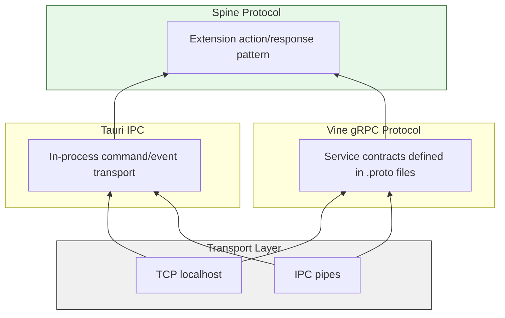
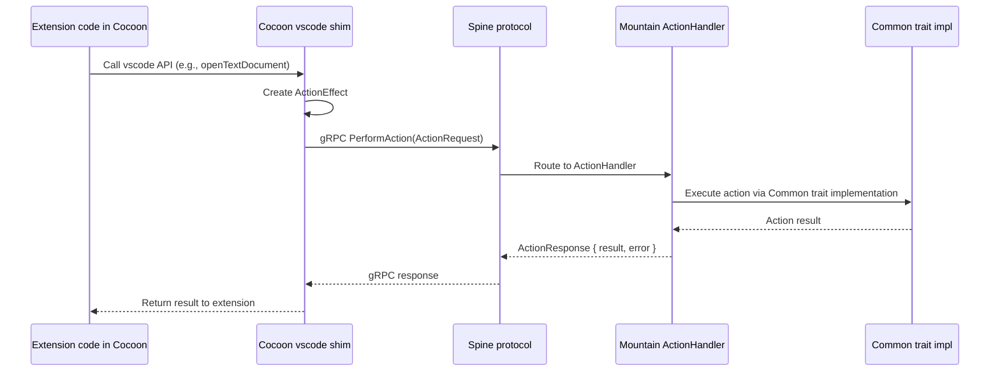

# Inter-Component Protocol

This document specifies the communication protocols used between **Land**
components. It covers the `gRPC` service definitions (`Vine` protocol), the
`Tauri` IPC mechanism, the `Spine` extension coordination protocol, and the
connection lifecycle management.

---

## Table of Contents

1. [Protocol Overview](#protocol-overview)
2. [Tauri IPC](#tauri-ipc)
3. [Vine gRPC Protocol](#vine-grpc-protocol)
4. [Spine Extension Protocol](#spine-extension-protocol)
5. [Connection Lifecycle](#connection-lifecycle)
6. [Health Monitoring](#health-monitoring)
7. [Protocol Buffer Definitions](#protocol-buffer-definitions)
8. [Security](#security)
9. [Related Documentation](#related-documentation)

---

## Protocol Overview 🔌

**Land** uses three communication protocols operating at different abstraction
levels:

| Protocol        | Transport               | Layer       | Components                                    | Purpose                     |
| --------------- | ----------------------- | ----------- | --------------------------------------------- | --------------------------- |
| `Tauri` IPC     | In-process IPC          | Application | `Wind`/`Sky` <-> `Mountain`                   | UI-backend communication    |
| `gRPC` (`Vine`) | TCP localhost           | Service     | `Cocoon` <-> `Mountain`, `Air` <-> `Mountain` | Inter-service RPC           |
| `Spine`         | `gRPC` + `ActionEffect` | Extension   | `Cocoon` -> `Mountain`                        | Extension host coordination |

### Protocol Stack



---

## Tauri IPC 🎮

### TierIPC Runtime Routing

The `TierIPC` environment variable controls how `Wind` and `Output` route Tauri
IPC calls at runtime. No rebuild is required to switch tiers.

| Value          | Behaviour                                                                                       |
| -------------- | ----------------------------------------------------------------------------------------------- |
| `Mountain`     | All calls route to Mountain (default)                                                           |
| `NodeDeferred` | Mountain first; on miss or `undefined` result, falls back to Cocoon via `cocoon:request` bridge |
| `Node`         | All calls bypass Mountain and route directly to Cocoon via `cocoon:request`                     |

Individual subsystems have their own tier constants (e.g. `TierTerminal`,
`TierStorage`, `TierSearch`) baked at compile time from `.env.Land`. A runtime
shell export (e.g. `export TierStorage=Node`) overrides the baked value without
a rebuild. The active tier for each subsystem is logged at boot by
`Mountain/Source/LandFixTier.rs`.

### Commands (Request-Response)

`Wind` invokes `Mountain` handlers through `@tauri-apps/api` `invoke()`. Each
command maps to a registered `Rust` handler in `Mountain`.

**Wind-side invocation:**

```typescript
import { invoke } from "@tauri-apps/api/core";

const content: Uint8Array = await invoke("read_file", {
	path: "/Users/user/Documents/example.ts",
});
```

**Mountain-side handler:**

```rust
use tauri;

#[tauri::command]
async fn read_file(
    path: String,
    state: State<'_, AppState>
) -> Result<Vec<u8>, String> {
    let fs = state.file_system();
    fs.read_file(std::path::Path::new(&path))
        .await
        .map_err(|e| e.to_string())
}

fn main() {
    tauri::Builder::default()
        .invoke_handler(tauri::generate_handler![read_file])
        .run(tauri::generate_context!());
}
```

### Command Catalog

All commands are dispatched through the single Tauri command `MountainIPCInvoke`
with `{ method: string, params: any[] }`. The method string corresponds to the
channel wire name defined in `Common/Source/IPC/Channel.rs`.

#### Encryption

| Command              | Parameters             | Returns  | Purpose                                                                    |
| -------------------- | ---------------------- | -------- | -------------------------------------------------------------------------- |
| `encryption:encrypt` | `[plaintext: string]`  | `string` | AES-256-GCM encryption; key is SHA-256 of machine UUID, cached per-process |
| `encryption:decrypt` | `[ciphertext: string]` | `string` | Symmetric decryption; used by extension context `secrets` API              |

The encryption key is derived once per process in `Encryption/Key.rs` using
`SHA-256("Land-Encryption-v1" + machine_id)`. Returns an empty string on failure
rather than throwing, so callers treat a corrupt blob as "no stored secret".

#### File System

| Command          | Parameters                            | Returns      | Purpose                                                             |
| ---------------- | ------------------------------------- | ------------ | ------------------------------------------------------------------- |
| `file:watch`     | `[path: string, options?]`            | `void`       | Register a file watcher via `FileWatcherProvider`                   |
| `file:unwatch`   | `[path: string]`                      | `void`       | Deregister a file watcher                                           |
| `file:open`      | `[path: string, opts?]`               | `number`     | Open a file descriptor; fd is tracked in Mountain's fd table        |
| `file:close`     | `[fd: number]`                        | `void`       | Close a tracked file descriptor                                     |
| `file:stat`      | `[path: string]`                      | `FileStat`   | Stat a path                                                         |
| `file:readFile`  | `[path: string]`                      | `Uint8Array` | Read file (VS Code native path)                                     |
| `file:readdir`   | `[path: string]`                      | `DirEntry[]` | List directory entries                                              |
| `file:writeFile` | `[path: string, content: Uint8Array]` | `void`       | Write file                                                          |
| `file:delete`    | `[path: string, opts?]`               | `void`       | Delete file or directory; fires `$acceptDidDeleteFiles`             |
| `file:rename`    | `[from: string, to: string]`          | `void`       | Rename/move file; fires `$acceptDidRenameFiles`                     |
| `file:mkdir`     | `[path: string]`                      | `void`       | Create directory; fires `$acceptDidCreateFiles`                     |
| `file:copy`      | `[from: string, to: string]`          | `void`       | Copy file                                                           |
| `file:cloneFile` | `[from: string, to: string]`          | `void`       | Clone file (reflink where supported); fires `$acceptDidCreateFiles` |
| `file:realpath`  | `[path: string]`                      | `string`     | Resolve symlinks                                                    |
| `file:exists`    | `[path: string]`                      | `boolean`    | Check existence                                                     |

`file:open` / `file:close` are classified as high-frequency and short-circuit
the Echo scheduler.

#### Terminal

| Command                            | Parameters                             | Returns       | Purpose                                                                                                                                   |
| ---------------------------------- | -------------------------------------- | ------------- | ----------------------------------------------------------------------------------------------------------------------------------------- |
| `localPty:createProcess`           | `[shellLaunchConfig, cols, rows, ...]` | `{ id, pid }` | Spawn a PTY process; returns its internal id and OS PID                                                                                   |
| `localPty:resize`                  | `[id, cols, rows]`                     | `void`        | Resize PTY via SIGWINCH                                                                                                                   |
| `localPty:attachToProcess`         | `[id: number]`                         | `{ id, pid }` | Reconnect workbench to an existing live PTY after window reload                                                                           |
| `localPty:detachFromProcess`       | `[id: number]`                         | `void`        | Detach the workbench from a PTY without killing the process                                                                               |
| `localPty:reviveTerminalProcesses` | `[states: TerminalState[]]`            | `void`        | Re-spawn terminals from serialised state after reload; populates id-remap table                                                           |
| `localPty:shellExecutionStart`     | `[{ id, commandLine, cwd }]`           | `void`        | Fired by Sky on OSC 633 ;C (command output begins); forwards `$acceptTerminalShellExecutionStart` to Cocoon                               |
| `localPty:shellExecutionEnd`       | `[{ id, commandLine, cwd, exitCode }]` | `void`        | Fired by Sky on OSC 633 ;D (command finished); fans out `$acceptTerminalShellExecutionEnd` and `$acceptExecutedTerminalCommand` to Cocoon |
| `localPty:freePortKillProcess`     | `[port: number]`                       | `void`        | Find process owning a port (lsof) and SIGKILL it                                                                                          |
| `localPty:getDefaultShell`         | `[]`                                   | `string`      | Return the user's default login shell path                                                                                                |
| `localPty:getEnvironment`          | `[]`                                   | `object`      | Return the login-shell environment variables                                                                                              |
| `localPty:getProfiles`             | `[includeDetected?]`                   | `Profile[]`   | List available shell profiles                                                                                                             |
| `terminal:create`                  | `[options]`                            | `{ id }`      | Create a terminal tab (calls `TerminalProvider`)                                                                                          |
| `terminal:sendText`                | `[id, text]`                           | `void`        | Write text to terminal PTY                                                                                                                |
| `terminal:show`                    | `[id]`                                 | `void`        | Reveal terminal tab in UI                                                                                                                 |
| `terminal:hide`                    | `[id]`                                 | `void`        | Hide terminal tab                                                                                                                         |
| `terminal:dispose`                 | `[id]`                                 | `void`        | Destroy terminal and PTY                                                                                                                  |

#### NativeHost

| Command                                     | Purpose                                                               |
| ------------------------------------------- | --------------------------------------------------------------------- |
| `nativeHost:quit`                           | Request graceful application quit                                     |
| `nativeHost:exit`                           | Exit with process code                                                |
| `nativeHost:relaunch`                       | Restart the application                                               |
| `nativeHost:reload`                         | Reload the webview                                                    |
| `nativeHost:openDevTools`                   | Open Tauri/WebView developer tools                                    |
| `nativeHost:toggleDevTools`                 | Toggle developer tools visibility                                     |
| `nativeHost:killProcess`                    | Kill a process by PID                                                 |
| `nativeHost:installShellCommand`            | Install `fiddee` CLI symlink in `/usr/local/bin`                      |
| `nativeHost:uninstallShellCommand`          | Remove `fiddee` CLI symlink                                           |
| `nativeHost:findFreePort`                   | Find an available TCP port                                            |
| `nativeHost:isPortFree`                     | Check whether a specific port is free (real TCP bind check)           |
| `nativeHost:resolveProxy`                   | Read `HTTPS_PROXY` / `HTTP_PROXY` environment variables               |
| `nativeHost:getEnvironmentPaths`            | Return `home`, `appRoot`, `userData`, `temp` and related paths        |
| `nativeHost:isRunningUnderARM64Translation` | Detect Rosetta 2 translation on macOS                                 |
| `nativeHost:moveItemToTrash`                | Move a file to the OS trash                                           |
| `nativeHost:showMessageBox`                 | Show a native OS alert/confirm dialog                                 |
| `nativeHost:showSaveDialog`                 | Show a native save-file dialog                                        |
| `nativeHost:showOpenDialog`                 | Show a native open-file/folder dialog                                 |
| `nativeHost:readClipboardText`              | Read text from clipboard                                              |
| `nativeHost:writeClipboardText`             | Write text to clipboard                                               |
| `nativeHost:readClipboardFindText`          | Read macOS find-pasteboard text                                       |
| `nativeHost:writeClipboardFindText`         | Write macOS find-pasteboard text                                      |
| `nativeHost:readClipboardBuffer`            | Read clipboard in a specific format (e.g. `text/html`)                |
| `nativeHost:writeClipboardBuffer`           | Write clipboard in a specific format                                  |
| `nativeHost:hasClipboard`                   | Test whether clipboard contains data in a given format                |
| `nativeHost:readImage`                      | Read an image from clipboard as PNG bytes                             |
| `nativeHost:triggerPaste`                   | Programmatically trigger a paste action in the focused element        |
| `nativeHost:setMinimumSize`                 | Set the window minimum size constraints                               |
| `nativeHost:positionWindow`                 | Reposition or resize the window                                       |
| `nativeHost:setRepresentedFilename`         | Set the macOS proxy-icon path in the window title bar                 |
| `nativeHost:getWindows`                     | Return the list of open windows with product name and active document |
| `nativeHost:getOSColorScheme`               | Return the current OS light/dark/high-contrast scheme                 |
| `nativeHost:getOSProperties`                | Return OS name, version, architecture                                 |
| `nativeHost:getOSStatistics`                | Return memory and CPU usage snapshot                                  |

#### Language

| Command                             | Parameters                 | Returns              | Purpose                                                                                                                 |
| ----------------------------------- | -------------------------- | -------------------- | ----------------------------------------------------------------------------------------------------------------------- |
| `language:provideInlineCompletions` | `[uri, position, context]` | `InlineCompletion[]` | Request inline completion items via `LanguageFeatureProviderRegistry`; used by Sky's Monaco `InlineCompletionsProvider` |
| `language:getLanguages`             | `[]`                       | `string[]`           | Return all registered Monaco language IDs                                                                               |

#### Other Core Commands

| Command                                                                      | Purpose                                                  |
| ---------------------------------------------------------------------------- | -------------------------------------------------------- |
| `commands:execute`                                                           | Execute a registered VS Code command by ID               |
| `configuration:get`                                                          | Read a configuration value                               |
| `configuration:update`                                                       | Write a configuration value                              |
| `storage:get` / `storage:set` / `storage:delete`                             | Key-value storage backed by Mountain's `StorageProvider` |
| `textFile:read` / `textFile:write` / `textFile:save`                         | Editor working-copy surface                              |
| `output:create` / `output:append` / `output:appendLine`                      | Output channel management                                |
| `notification:show` / `notification:showProgress`                            | User-facing notifications                                |
| `quickInput:showQuickPick` / `quickInput:showInputBox`                       | Quick-pick and input-box UI round-trips                  |
| `themes:getActive` / `themes:list` / `themes:set`                            | Theme management                                         |
| `workspaces:getFolders` / `workspaces:addFolder` / `workspaces:removeFolder` | Workspace folder management                              |
| `decorations:get` / `decorations:set` / `decorations:clear`                  | File decoration provider                                 |
| `keybinding:add` / `keybinding:remove` / `keybinding:lookup`                 | Keybinding registry                                      |
| `lifecycle:getPhase` / `lifecycle:whenPhase`                                 | Workbench lifecycle phase queries                        |
| `model:open` / `model:get` / `model:updateContent` / `model:close`           | Text model management                                    |
| `search:findFiles` / `search:findInFiles`                                    | File search (routes to Cocoon when `TierSearch=Node`)    |
| `update:checkForUpdates` / `update:downloadUpdate` / `update:applyUpdate`    | Update service (all stubs; no update server)             |
| `auth:getSessions` / `auth:createSession` / `auth:removeSession`             | Authentication (routes to Cocoon)                        |
| `tasks:executeTask` / `tasks:getTasks`                                       | Task execution (routes to Cocoon)                        |
| `scm:createSourceControl` / `scm:getSourceControls`                          | Source control management                                |
| `debug:startDebugging` / `debug:getSessions` / `debug:addBreakpoints`        | Debug session management                                 |

> The full channel enum is defined in `Common/Source/IPC/Channel.rs` (Rust) and
> mirrored in `Wind/Source/IPC/Channel.ts` (TypeScript). Both must be kept in
> lockstep - adding a channel to one requires adding it to the other.

### Events (Push from Mountain)

`Mountain` emits events that `Wind`/`Sky` listen to via `@tauri-apps/api/event`:

```typescript
import { listen } from "@tauri-apps/api/event";

const unlisten = await listen("configuration-changed", (event) => {
	// event.payload contains the changed configuration keys
	updateLocalConfiguration(event.payload);
});
```

### Event Catalog

| Event                   | Payload                          | Direction            | Purpose                             |
| ----------------------- | -------------------------------- | -------------------- | ----------------------------------- |
| `configuration-changed` | `{ keys: string[] }`             | `Mountain` -> `Wind` | Configuration updates               |
| `extension-activated`   | `{ id: string }`                 | `Mountain` -> `Wind` | Extension activation notification   |
| `terminal-data`         | `{ id: number, data: string }`   | `Mountain` -> `Wind` | Terminal output streaming           |
| `file-changed`          | `{ path: string, type: string }` | `Mountain` -> `Wind` | File system watcher notification    |
| `theme-changed`         | `{ theme: string }`              | `Mountain` -> `Wind` | Color theme change                  |
| `window-state-changed`  | `{ state: string }`              | `Mountain` -> `Wind` | Window maximize/minimize/fullscreen |

### Serialization

`Tauri` IPC uses JSON serialization with the following conventions:

- **Strings** are UTF-8 encoded
- **Numbers** are JSON numbers (f64), deserialized to appropriate `Rust` types
- **Binary data** is `Vec<u8>` / `Uint8Array`, serialized as JSON number arrays
  for small payloads, or via custom serializer for large files
- **Complex types** are serialized through serde `Serialize`/`Deserialize`
  traits

---

## Vine gRPC Protocol 🔌

`Vine` defines the `gRPC` service contracts for `Mountain`-`Cocoon` and
`Mountain`-`Air` communication. The canonical definition lives at
`Element/Vine/Proto/Vine.proto`. `Mountain` keeps a local sync'd copy at
`Element/Mountain/Proto/Vine.proto` which its `build.rs` compiles directly.

### Service Definitions

```protobuf
syntax = "proto3";

package Vine;

// Service running on the Mountain host, listening for requests from Cocoon.
service MountainService {
  // Generic request-response: Cocoon -> Mountain.
  rpc ProcessCocoonRequest(GenericRequest) returns (GenericResponse);
  // Fire-and-forget notification: Cocoon -> Mountain.
  rpc SendCocoonNotification(GenericNotification) returns (Empty);
  // Cancel a long-running operation.
  rpc CancelOperation(CancelOperationRequest) returns (Empty);
  // LAND-PATCH B7-S6 P2: bidirectional streaming channel.
  rpc OpenChannelFromCocoon(stream Envelope) returns (stream Envelope);
}

// Service running on the Cocoon sidecar, listening for requests from Mountain.
service CocoonService {
  // A generic request-response method for Mountain to call a function on Cocoon.
  rpc ProcessMountainRequest(GenericRequest) returns (GenericResponse);

  // A generic fire-and-forget method for Mountain to send a notification to Cocoon.
  rpc SendMountainNotification(GenericNotification) returns (Empty);

  // A method for Mountain to request that Cocoon cancel a long-running operation.
  rpc CancelOperation(CancelOperationRequest) returns (Empty);

  // LAND-PATCH B7-S6 P2: bidirectional streaming channel (mirror of
  // MountainService::OpenChannelFromCocoon). Mountain opens this
  // stream once per Cocoon connection; all subsequent traffic
  // multiplexes over it.
  rpc OpenChannelFromMountain(stream Envelope) returns (stream Envelope);

  // ==================== Initialization ====================

  // Handshake - Called by Cocoon to signal readiness
  rpc InitialHandshake(Empty) returns (Empty);

  // Initialize Extension Host - Mountain sends initialization data to Cocoon
  rpc InitExtensionHost(InitExtensionHostRequest) returns (Empty);

  // ==================== Commands ====================

  // Register Command - Cocoon registers an extension command
  rpc RegisterCommand(RegisterCommandRequest) returns (Empty);

  // Execute Contributed Command - Mountain executes an extension command
  rpc ExecuteContributedCommand(ExecuteCommandRequest) returns (ExecuteCommandResponse);

  // Unregister Command - Unregister a previously registered command
  rpc UnregisterCommand(UnregisterCommandRequest) returns (Empty);

  // ==================== Language Features ====================

  // Register Hover Provider - Register a hover provider
  rpc RegisterHoverProvider(RegisterProviderRequest) returns (Empty);

  // Provide Hover - Request hover information
  rpc ProvideHover(ProvideHoverRequest) returns (ProvideHoverResponse);

  // Register Completion Item Provider - Register a completion provider
  rpc RegisterCompletionItemProvider(RegisterProviderRequest) returns (Empty);

  // Provide Completion Items - Request completion items
  rpc ProvideCompletionItems(ProvideCompletionItemsRequest) returns (ProvideCompletionItemsResponse);

  // Register Definition Provider - Register a definition provider
  rpc RegisterDefinitionProvider(RegisterProviderRequest) returns (Empty);

  // Provide Definition - Request definition location
  rpc ProvideDefinition(ProvideDefinitionRequest) returns (ProvideDefinitionResponse);

  // Register Reference Provider - Register a reference provider
  rpc RegisterReferenceProvider(RegisterProviderRequest) returns (Empty);

  // Provide References - Request references
  rpc ProvideReferences(ProvideReferencesRequest) returns (ProvideReferencesResponse);

  // Register Code Actions Provider - Register code actions provider
  rpc RegisterCodeActionsProvider(RegisterProviderRequest) returns (Empty);

  // Provide Code Actions - Request code actions
  rpc ProvideCodeActions(ProvideCodeActionsRequest) returns (ProvideCodeActionsResponse);

  // ==================== Language Features (Extended) ====================

  // Register Document Highlight Provider
  rpc RegisterDocumentHighlightProvider(RegisterProviderRequest) returns (Empty);

  // Provide Document Highlights
  rpc ProvideDocumentHighlights(ProvideDocumentHighlightsRequest) returns (ProvideDocumentHighlightsResponse);

  // Register Document Symbol Provider
  rpc RegisterDocumentSymbolProvider(RegisterProviderRequest) returns (Empty);

  // Provide Document Symbols
  rpc ProvideDocumentSymbols(ProvideDocumentSymbolsRequest) returns (ProvideDocumentSymbolsResponse);

  // Register Workspace Symbol Provider
  rpc RegisterWorkspaceSymbolProvider(RegisterProviderRequest) returns (Empty);

  // Provide Workspace Symbols
  rpc ProvideWorkspaceSymbols(ProvideWorkspaceSymbolsRequest) returns (ProvideWorkspaceSymbolsResponse);

  // Register Rename Provider
  rpc RegisterRenameProvider(RegisterProviderRequest) returns (Empty);

  // Provide Rename Edits
  rpc ProvideRenameEdits(ProvideRenameEditsRequest) returns (ProvideRenameEditsResponse);

  // Register Document Formatting Provider
  rpc RegisterDocumentFormattingProvider(RegisterProviderRequest) returns (Empty);

  // Provide Document Formatting
  rpc ProvideDocumentFormatting(ProvideDocumentFormattingRequest) returns (ProvideDocumentFormattingResponse);

  // Register Document Range Formatting Provider
  rpc RegisterDocumentRangeFormattingProvider(RegisterProviderRequest) returns (Empty);

  // Provide Document Range Formatting
  rpc ProvideDocumentRangeFormatting(ProvideDocumentRangeFormattingRequest) returns (ProvideDocumentRangeFormattingResponse);

  // Register On Type Formatting Provider
  rpc RegisterOnTypeFormattingProvider(RegisterOnTypeFormattingProviderRequest) returns (Empty);

  // Provide On Type Formatting
  rpc ProvideOnTypeFormatting(ProvideOnTypeFormattingRequest) returns (ProvideOnTypeFormattingResponse);

  // Register Signature Help Provider
  rpc RegisterSignatureHelpProvider(RegisterSignatureHelpProviderRequest) returns (Empty);

  // Provide Signature Help
  rpc ProvideSignatureHelp(ProvideSignatureHelpRequest) returns (ProvideSignatureHelpResponse);

  // Register Code Lens Provider
  rpc RegisterCodeLensProvider(RegisterProviderRequest) returns (Empty);

  // Provide Code Lenses
  rpc ProvideCodeLenses(ProvideCodeLensesRequest) returns (ProvideCodeLensesResponse);

  // Register Folding Range Provider
  rpc RegisterFoldingRangeProvider(RegisterProviderRequest) returns (Empty);

  // Provide Folding Ranges
  rpc ProvideFoldingRanges(ProvideFoldingRangesRequest) returns (ProvideFoldingRangesResponse);

  // Register Selection Range Provider
  rpc RegisterSelectionRangeProvider(RegisterProviderRequest) returns (Empty);

  // Provide Selection Ranges
  rpc ProvideSelectionRanges(ProvideSelectionRangesRequest) returns (ProvideSelectionRangesResponse);

  // Register Semantic Tokens Provider
  rpc RegisterSemanticTokensProvider(RegisterSemanticTokensProviderRequest) returns (Empty);

  // Provide Semantic Tokens Full
  rpc ProvideSemanticTokensFull(ProvideSemanticTokensRequest) returns (ProvideSemanticTokensResponse);

  // Register Inlay Hints Provider
  rpc RegisterInlayHintsProvider(RegisterProviderRequest) returns (Empty);

  // Provide Inlay Hints
  rpc ProvideInlayHints(ProvideInlayHintsRequest) returns (ProvideInlayHintsResponse);

  // Register Type Hierarchy Provider
  rpc RegisterTypeHierarchyProvider(RegisterProviderRequest) returns (Empty);

  // Provide Type Hierarchy Supertypes
  rpc ProvideTypeHierarchySupertypes(ProvideTypeHierarchyRequest) returns (ProvideTypeHierarchyResponse);

  // Provide Type Hierarchy Subtypes
  rpc ProvideTypeHierarchySubtypes(ProvideTypeHierarchyRequest) returns (ProvideTypeHierarchyResponse);

  // Register Call Hierarchy Provider
  rpc RegisterCallHierarchyProvider(RegisterProviderRequest) returns (Empty);

  // Provide Call Hierarchy Incoming Calls
  rpc ProvideCallHierarchyIncomingCalls(ProvideCallHierarchyRequest) returns (ProvideCallHierarchyResponse);

  // Provide Call Hierarchy Outgoing Calls
  rpc ProvideCallHierarchyOutgoingCalls(ProvideCallHierarchyRequest) returns (ProvideCallHierarchyResponse);

  // Register Linked Editing Range Provider
  rpc RegisterLinkedEditingRangeProvider(RegisterProviderRequest) returns (Empty);

  // Provide Linked Editing Ranges
  rpc ProvideLinkedEditingRanges(ProvideLinkedEditingRangesRequest) returns (ProvideLinkedEditingRangesResponse);
}
```

### Service: MountainService

Used for `Cocoon` -> `Mountain` communication:

| RPC                      | Direction              | Trigger         | Purpose                                              |
| ------------------------ | ---------------------- | --------------- | ---------------------------------------------------- |
| `ProcessCocoonRequest`   | `Cocoon` -> `Mountain` | Per API call    | Generic request-response for commands / queries      |
| `SendCocoonNotification` | `Cocoon` -> `Mountain` | State change    | Fire-and-forget event from extension host            |
| `CancelOperation`        | `Cocoon` -> `Mountain` | User cancels    | Cancel an in-flight operation                        |
| `OpenChannelFromCocoon`  | `Cocoon` -> `Mountain` | After handshake | LAND-PATCH B7-S6 P2 bidirectional multiplexed stream |

### Service: CocoonService

Used for `Mountain` -> `Cocoon` communication:

| RPC                                       | Direction              | Trigger          | Purpose                                              |
| ----------------------------------------- | ---------------------- | ---------------- | ---------------------------------------------------- |
| `ProcessMountainRequest`                  | `Mountain` -> `Cocoon` | Per API call     | Generic request-response from backend                |
| `SendMountainNotification`                | `Mountain` -> `Cocoon` | Backend event    | Fire-and-forget notification to sidecar              |
| `CancelOperation`                         | `Mountain` -> `Cocoon` | Backend cancel   | Cancel an in-flight extension operation              |
| `OpenChannelFromMountain`                 | `Mountain` -> `Cocoon` | After handshake  | LAND-PATCH B7-S6 P2 bidirectional multiplexed stream |
| `InitialHandshake`                        | `Mountain` -> `Cocoon` | After bootstrap  | Handshake readiness signal                           |
| `InitExtensionHost`                       | `Mountain` -> `Cocoon` | After handshake  | Send workspace root, extensions, configuration       |
| `RegisterCommand`                         | `Cocoon` -> `Mountain` | Extension boot   | Register an extension-contributed command            |
| `ExecuteContributedCommand`               | `Mountain` -> `Cocoon` | User triggers    | Execute an extension-contributed command             |
| `UnregisterCommand`                       | `Cocoon` -> `Mountain` | Extension unload | Unregister an extension command                      |
| `RegisterHoverProvider`                   | `Cocoon` -> `Mountain` | Extension boot   | Register a hover provider                            |
| `ProvideHover`                            | `Mountain` -> `Cocoon` | User hovers      | Request hover from extension provider                |
| `RegisterCompletionItemProvider`          | `Cocoon` -> `Mountain` | Extension boot   | Register a completion provider                       |
| `ProvideCompletionItems`                  | `Mountain` -> `Cocoon` | User types       | Request completion items                             |
| `RegisterDefinitionProvider`              | `Cocoon` -> `Mountain` | Extension boot   | Register a definition provider                       |
| `ProvideDefinition`                       | `Mountain` -> `Cocoon` | User clicks      | Request definition location                          |
| `RegisterReferenceProvider`               | `Cocoon` -> `Mountain` | Extension boot   | Register a reference provider                        |
| `ProvideReferences`                       | `Mountain` -> `Cocoon` | User triggers    | Request reference locations                          |
| `RegisterCodeActionsProvider`             | `Cocoon` -> `Mountain` | Extension boot   | Register a code actions provider                     |
| `ProvideCodeActions`                      | `Mountain` -> `Cocoon` | User triggers    | Request code actions                                 |
| `RegisterDocumentHighlightProvider`       | `Cocoon` -> `Mountain` | Extension boot   | Register a document highlight provider               |
| `ProvideDocumentHighlights`               | `Mountain` -> `Cocoon` | User hovers      | Request document highlights                          |
| `RegisterDocumentSymbolProvider`          | `Cocoon` -> `Mountain` | Extension boot   | Register a document symbol provider                  |
| `ProvideDocumentSymbols`                  | `Mountain` -> `Cocoon` | Sidebar open     | Request document symbols                             |
| `RegisterWorkspaceSymbolProvider`         | `Cocoon` -> `Mountain` | Extension boot   | Register a workspace symbol provider                 |
| `ProvideWorkspaceSymbols`                 | `Mountain` -> `Cocoon` | Search types     | Request workspace symbols                            |
| `RegisterRenameProvider`                  | `Cocoon` -> `Mountain` | Extension boot   | Register a rename provider                           |
| `ProvideRenameEdits`                      | `Mountain` -> `Cocoon` | User triggers    | Request rename edits                                 |
| `RegisterDocumentFormattingProvider`      | `Cocoon` -> `Mountain` | Extension boot   | Register a document formatting provider              |
| `ProvideDocumentFormatting`               | `Mountain` -> `Cocoon` | User triggers    | Request document formatting                          |
| `RegisterDocumentRangeFormattingProvider` | `Cocoon` -> `Mountain` | Extension boot   | Register a range formatting provider                 |
| `ProvideDocumentRangeFormatting`          | `Mountain` -> `Cocoon` | User triggers    | Request document range formatting                    |
| `RegisterOnTypeFormattingProvider`        | `Cocoon` -> `Mountain` | Extension boot   | Register an on-type formatting provider              |
| `ProvideOnTypeFormatting`                 | `Mountain` -> `Cocoon` | User types       | Request on-type formatting                           |
| `RegisterSignatureHelpProvider`           | `Cocoon` -> `Mountain` | Extension boot   | Register a signature help provider                   |
| `ProvideSignatureHelp`                    | `Mountain` -> `Cocoon` | User types       | Request signature help                               |
| `RegisterCodeLensProvider`                | `Cocoon` -> `Mountain` | Extension boot   | Register a code lens provider                        |
| `ProvideCodeLenses`                       | `Mountain` -> `Cocoon` | Code lens shown  | Request code lenses                                  |
| `RegisterFoldingRangeProvider`            | `Cocoon` -> `Mountain` | Extension boot   | Register a folding range provider                    |
| `ProvideFoldingRanges`                    | `Mountain` -> `Cocoon` | File opened      | Request folding ranges                               |
| `RegisterSelectionRangeProvider`          | `Cocoon` -> `Mountain` | Extension boot   | Register a selection range provider                  |
| `ProvideSelectionRanges`                  | `Mountain` -> `Cocoon` | User selects     | Request selection ranges                             |
| `RegisterSemanticTokensProvider`          | `Cocoon` -> `Mountain` | Extension boot   | Register a semantic tokens provider                  |
| `ProvideSemanticTokensFull`               | `Mountain` -> `Cocoon` | File opened      | Request semantic tokens                              |
| `RegisterInlayHintsProvider`              | `Cocoon` -> `Mountain` | Extension boot   | Register an inlay hints provider                     |
| `ProvideInlayHints`                       | `Mountain` -> `Cocoon` | User hovers      | Request inlay hints                                  |
| `RegisterTypeHierarchyProvider`           | `Cocoon` -> `Mountain` | Extension boot   | Register a type hierarchy provider                   |
| `ProvideTypeHierarchySupertypes`          | `Mountain` -> `Cocoon` | User triggers    | Request type hierarchy supertypes                    |
| `ProvideTypeHierarchySubtypes`            | `Mountain` -> `Cocoon` | User triggers    | Request type hierarchy subtypes                      |
| `RegisterCallHierarchyProvider`           | `Cocoon` -> `Mountain` | Extension boot   | Register a call hierarchy provider                   |
| `ProvideCallHierarchyIncomingCalls`       | `Mountain` -> `Cocoon` | User triggers    | Request call hierarchy incoming calls                |
| `ProvideCallHierarchyOutgoingCalls`       | `Mountain` -> `Cocoon` | User triggers    | Request call hierarchy outgoing calls                |
| `RegisterLinkedEditingRangeProvider`      | `Cocoon` -> `Mountain` | Extension boot   | Register a linked editing range provider             |
| `ProvideLinkedEditingRanges`              | `Mountain` -> `Cocoon` | User edits       | Request linked editing ranges                        |

### Message Formats

```protobuf
// A generic request / response envelope shared across all RPCs.
message GenericRequest {
  uint64 RequestIdentifier = 1;
  string Method = 2;              // JSON-serialized parameters
  bytes Parameter = 3;
}

message GenericResponse {
  uint64 RequestIdentifier = 1;
  bytes Result = 2;               // JSON-serialized success payload
  optional RPCError error = 3;   // JSON-RPC-style error object
}

message GenericNotification {
  string Method = 1;
  bytes Parameter = 2;           // JSON-serialized
}

message RPCError {
  int32 Code = 1;
  string Message = 2;
  bytes Data = 3;
}

message CancelOperationRequest {
  uint64 RequestIdentifierToCancel = 1;
}

message Empty {}
```

Common types used across messages:

```protobuf
message Position {
  uint32 Line = 1;
  uint32 Character = 2;
}

message Range {
  Position Start = 1;
  Position End = 2;
}

message Uri {
  string Value = 1;
}

message WorkspaceFolder {
  Uri Uri = 1;
  string Name = 2;
}

message CompletionItem { /* ... */ }
message Location { /* ... */ }
```

### Port Allocation

| Service       | Element    | Port    | Transport |
| ------------- | ---------- | ------- | --------- |
| Mountain Vine | `Mountain` | `50051` | TCP       |
| Cocoon Vine   | `Cocoon`   | `50052` | TCP       |
| Air Vine      | `Air`      | `50053` | TCP       |

All listeners bind to `[::1]` (not `0.0.0.0`). Environment overrides are
described in
[`Vine/Source/Library.rs`](../../../Element/Vine/Source/Library.rs).

---

## Spine Extension Protocol 🔄

The `Spine` protocol is the extension host coordination layer built on top of
`Vine` `gRPC`. It implements an action/response pattern for extension-to-backend
communication.

### Action/Response Pattern



### ActionEffect Types

The `Spine` protocol encodes all possible extension actions as a discriminated
union:

```
ActionEffect
    +-- ReadFile { path }
    +-- WriteFile { path, content }
    +-- DeleteFile { path }
    +-- ReadDirectory { path }
    +-- CreateDirectory { path }
    +-- Stat { path }
    +-- Rename { from, to }
    +-- Copy { from, to }
    +-- WatchFile { path }
    +-- OpenDialog { options }
    +-- SaveDialog { options }
    +-- ShowMessage { message, options }
    +-- ShowInputBox { options }
    +-- OpenExternal { url }
    +-- ExecuteProcess { command, args }
    +-- ExecuteCommand { command_id, args }
    +-- RegisterCommand { command_id, handler }
    +-- CreateTerminal { options }
    +-- WriteTerminal { id, data }
    +-- ReadClipboard { format }
    +-- WriteClipboard { text }
    +-- GetConfiguration { key }
    +-- SetConfiguration { key, value, target }
    +-- GetSecret { key }
    +-- SetSecret { key, value }
    +-- DeleteSecret { key }
    +-- CreateWebviewPanel { options }
    +-- SendWebviewMessage { id, message }
    // ... 80+ effect variants
```

### Routing

The `Cocoon` tier router (`Cocoon/Source/Services/Handler/VscodeAPI/ROUTING.md`)
decides per-call whether to:

1. **Track A (Stock Node):** Handle entirely in-process via unmodified
   `extHost*.ts` code
2. **Track B (Rust Native):** Package as `ActionEffect`, send via `Spine` `gRPC`
   to `Mountain`, await native execution
3. **Track C (Cocoon Bespoke):** Hand-rolled `TypeScript` implementation in
   `Cocoon` (last resort)

---

## Connection Lifecycle 🔄

### Mountain-Cocoon Connection

**Bootstrap order (critical):** Cocoon's gRPC server (port 50052) must bind
before Cocoon attempts to connect to Mountain's gRPC server (port 50051). The
bootstrap stage order is: `RPCServer` (Stage 5) bind → `MountainConnection`
(Stage 3) connect. Mountain allows a 30-second connection budget; reversing this
order causes Mountain to time out before Cocoon is ready to accept the
handshake.


### Disconnection and Reconnection

```
Network failure or Cocoon crash
    |
    v
Mountain detects stale connection (no activity within 30-second check window)
    |
    +---> Option 1: Restart Cocoon (default, up to 3 attempts)
    |       - Kill existing Cocoon process
    |       - Re-spawn from bootstrap-fork.js
    |       - Re-run initialization sequence
    |       - Restored state: configuration, open files
    |       - Lost state: extension-managed data, webview panels
    |
    +---> Option 2: Graceful degradation
            - Show reconnection notification in UI
            - Queue extension API calls
            - Reconnect when Cocoon restarts (user manually)
```

### Mountain-Air Connection

```
Mountain starts
    |
    v
Mountain spawns Air binary
    |
    v
Air connects gRPC to 127.0.0.1:50053
    |
    +---> Sends Connect { services: [updater, indexer, crypto] }
    |
    v
Mountain registers Air services in AppState
    |
    v
Normal operation:
    - Mountain dispatches background work via PerformAction
    - Air responds with action results
    - Both sides maintain activity tracking
    - Staleness check every 30 seconds
```

---

## Health Monitoring 💓

### Heartbeat Protocol

Both `gRPC` connections (`Mountain`-`Cocoon`, `Mountain`-`Air`) implement a
health monitoring protocol. Health is tracked via a per-connection
`ConnectionMetadata` struct in `Vine/Source/Client/Shared.rs`:

| Parameter                | Value                                   |
| ------------------------ | --------------------------------------- |
| Staleness check interval | 30 seconds (`HEALTH_CHECK_INTERVAL_MS`) |
| Max retry attempts       | 10 (`MAX_RETRY_ATTEMPTS`)               |
| Retry base delay         | 200 ms (`RETRY_BASE_DELAY_MS`)          |
| Connection timeout       | 30 seconds (`CONNECTION_TIMEOUT`)       |

Health is determined by three conditions in
`Vine/Source/Client/CheckSideCarHealth.rs`: the connection must be marked
`IsHealthy`, the `LastActivity` timestamp must not be older than
`HEALTH_CHECK_INTERVAL_MS` (30 seconds), and the `FailureCount` must not exceed
`MAX_RETRY_ATTEMPTS` (10). Failed connections are recorded via
`RecordSideCarFailure` which increments the counter and sets `IsHealthy` to
`false`; successful activity resets both via `UpdateSideCarActivity`.

### Diagnostic Logging

All connection state changes are logged via the `dev_log!` system at
`Mountain/Source/IPC/DevLog/`:

```
[DEV:Vine] gRPC server listening on [::1]:50051
[DEV:Vine] Cocoon connected, handshake received
[DEV:Vine] Heartbeat OK (seq=142, latency=3ms)
[DEV:Vine] Heartbeat TIMEOUT (last: seq=147, 18s ago)
[DEV:Vine] Cocoon disconnected, restarting (attempt 1/3)
```

---

## Protocol Buffer Definitions 📁

### Current Location

Protocol definitions currently reside in consuming components:

| File          | Location                                                 | Purpose                                           |
| ------------- | -------------------------------------------------------- | ------------------------------------------------- |
| `Vine.proto`  | `Element/Vine/Proto/Vine.proto`                          | Core `Mountain`<->`Cocoon` `gRPC` services        |
| `Grove.proto` | `Element/Grove/Proto/Grove.proto`                        | Grove-specific WASM hosting extensions            |
| Server impl   | `Element/Mountain/Source/Vine/`                          | Rust `gRPC` server (`tonic`, consumes Vine stubs) |
| Client impl   | `Element/Cocoon/Source/Services/Mountain/gRPC/Client.ts` | TypeScript `gRPC` client                          |
| RouteManifest | `Element/Cocoon/Source/Generated/RouteManifest.ts`       | Auto-generated routing tier enumeration           |

### Code Generation

Rust types are generated from `.proto` files using `prost` and `tonic-build` at
compile time:

```rust
// Mountain/build.rs  (references Vine element's proto)
fn main() {
    tonic_build::configure()
        .compile(&["../Vine/Proto/Vine.proto"], &["../Vine/Proto"])
        .expect("Failed to compile protos");
}
```

TypeScript types are generated using `protoc-gen-ts` and checked into the
`Cocoon` source tree as generated artifacts.

---

## Security 🛡️

All `gRPC` connections are restricted to localhost only (`[::1]` / `127.0.0.1`).
No remote connections are accepted.

| Aspect        | Implementation                              |
| ------------- | ------------------------------------------- |
| Transport     | TCP loopback only                           |
| Auth          | None required (localhost-only)              |
| Encryption    | None (localhost-only, no network exposure)  |
| Port binding  | `[::1]` only, not `0.0.0.0`                 |
| DNS isolation | All non-localhost traffic blocked by `Mist` |
| Timeout       | 30-second staleness check                   |
| Backpressure  | `gRPC` flow control + bounded channels      |

---

## Related Documentation 📋

- [Architecture](Architecture.md) - System architecture
- [BuildPipeline](BuildPipeline.md) - Build pipeline
- [EditorCore](EditorCore.md) - Editor workbench
- [Polyfills](Polyfills.md) - Compatibility shims
- [RustInfrastructure](RustInfrastructure.md) - `Rust` backend components
- [Building](Building.md) - Build instructions
- [Workflow/ApplicationStartupAndHandshake](Workflow/ApplicationStartupAndHandshake.md)
- [Workflow/CreatingAndInteractingWithAWebviewPanel](Workflow/CreatingAndInteractingWithAWebviewPanel.md)

---

**Project Maintainers:** Source Open
([Source/Open@editor.land](mailto:Source/Open@editor.land)) |
[GitHub Repository](https://github.com/CodeEditorLand/Land) |
[Report an Issue](https://github.com/CodeEditorLand/Land/issues)
