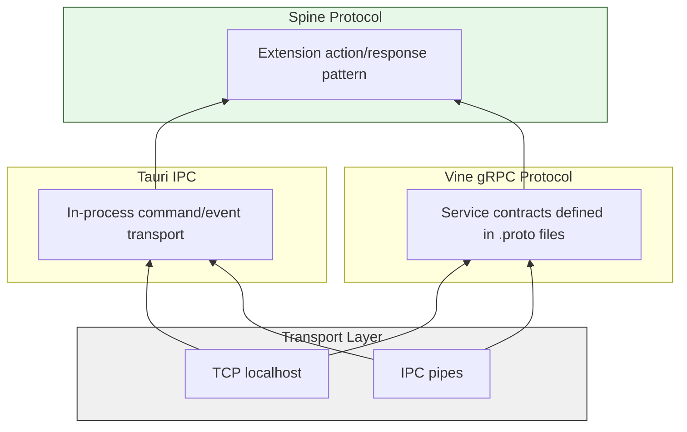
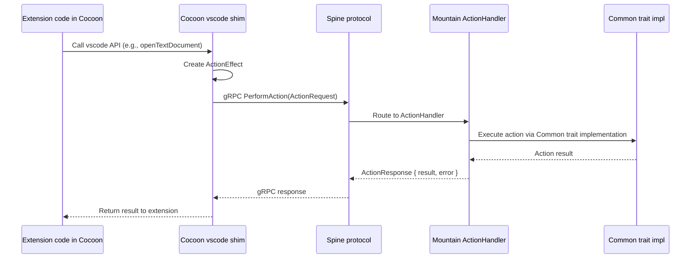
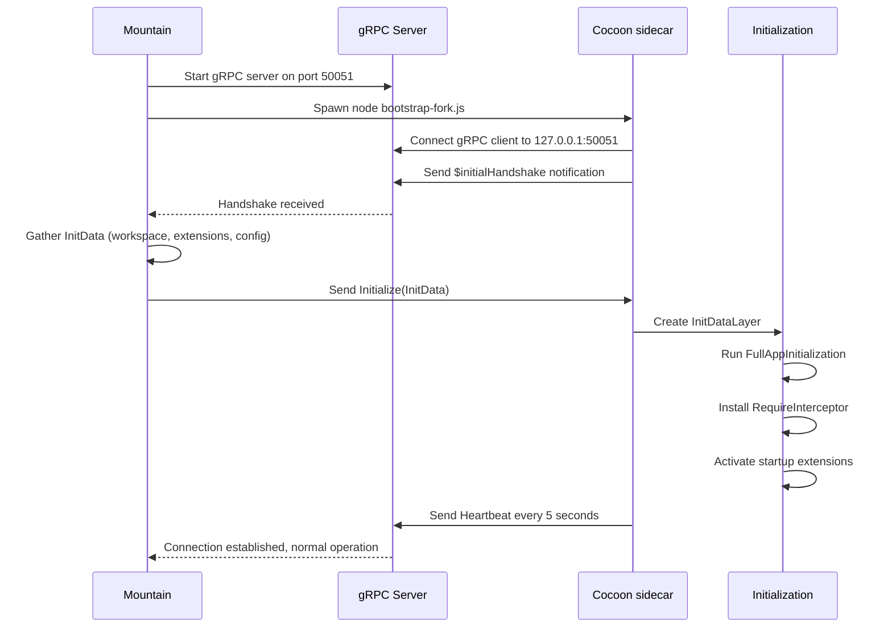

# Inter-Component Protocol

This document specifies the communication protocols used between **Land**
components. It covers the `gRPC` service definitions (`Vine` protocol), the `Tauri`
IPC mechanism, the `Spine` extension coordination protocol, and the connection
lifecycle management.

---

## Table of Contents

1. [Protocol Overview](#protocol-overview)
2. [Tauri IPC](#tauri-ipc)
3. [Vine gRPC Protocol](#vine-grpc-protocol)
4. [Spine Extension Protocol](#spine-extension-protocol)
5. [Connection Lifecycle](#connection-lifecycle)
6. [Health Monitoring](#health-monitoring)
7. [Protocol Buffer Definitions](#protocol-buffer-definitions)
8. [Security](#security)
9. [Related Documentation](#related-documentation)

---

## Protocol Overview 🔌

**Land** uses three communication protocols operating at different abstraction
levels:

| Protocol | Transport | Layer | Components | Purpose |
| -------- | --------- | ----- | ---------- | ------- |
| `Tauri` IPC | In-process IPC | Application | `Wind`/`Sky` <-> `Mountain` | UI-backend communication |
| `gRPC` (`Vine`) | TCP localhost | Service | `Cocoon` <-> `Mountain`, `Air` <-> `Mountain` | Inter-service RPC |
| `Spine` | `gRPC` + `ActionEffect` | Extension | `Cocoon` -> `Mountain` | Extension host coordination |

### Protocol Stack



---

## Tauri IPC 🎮

### Commands (Request-Response)

`Wind` invokes `Mountain` handlers through `@tauri-apps/api` `invoke()`. Each
command maps to a registered `Rust` handler in `Mountain`.

**Wind-side invocation:**

```typescript
import { invoke } from "@tauri-apps/api/core";

const content: Uint8Array = await invoke("read_file", {
	path: "/Users/user/Documents/example.ts",
});
```

**Mountain-side handler:**

```rust
use tauri;

#[tauri::command]
async fn read_file(
    path: String,
    state: State<'_, AppState>
) -> Result<Vec<u8>, String> {
    let fs = state.file_system();
    fs.read_file(std::path::Path::new(&path))
        .await
        .map_err(|e| e.to_string())
}

fn main() {
    tauri::Builder::default()
        .invoke_handler(tauri::generate_handler![read_file])
        .run(tauri::generate_context!());
}
```

### Command Catalog

| Command | Parameters | Returns | Purpose |
| ------- | ---------- | ------- | ------- |
| `read_file` | `{ path: string }` | `Uint8Array` | Read file from disk |
| `write_file` | `{ path: string, content: Uint8Array }` | `void` | Write file to disk |
| `get_configuration` | `{ key?: string }` | `Configuration` | Read configuration values |
| `set_configuration` | `{ key: string, value: any, target: string }` | `void` | Update configuration |
| `open_dialog` | `{ options: DialogOptions }` | `string[]` | Open native file dialog |
| `save_dialog` | `{ options: DialogOptions }` | `string \| null` | Open native save dialog |
| `show_message` | `{ message: string, type: string }` | `string` | Show OS message box |
| `create_terminal` | `{ name: string, cwd?: string }` | `number` | Create PTY terminal |
| `write_terminal` | `{ id: number, data: string }` | `void` | Write to terminal PTY |
| `execute_command` | `{ commandId: string, args: any[] }` | `any` | Execute a command |
| `get_clipboard` | `{ format: string }` | `string` | Read clipboard contents |
| `set_clipboard` | `{ text: string }` | `void` | Write to clipboard |
| `get_environment` | `{ name: string }` | `string` | Read environment variable |
| `search_files` | `{ pattern: string, options: SearchOptions }` | `SearchResult[]` | Search for files |

### Events (Push from Mountain)

`Mountain` emits events that `Wind`/`Sky` listen to via `@tauri-apps/api/event`:

```typescript
import { listen } from "@tauri-apps/api/event";

const unlisten = await listen("configuration-changed", (event) => {
	// event.payload contains the changed configuration keys
	updateLocalConfiguration(event.payload);
});
```

### Event Catalog

| Event | Payload | Direction | Purpose |
| ----- | ------- | --------- | ------- |
| `configuration-changed` | `{ keys: string[] }` | `Mountain` -> `Wind` | Configuration updates |
| `extension-activated` | `{ id: string }` | `Mountain` -> `Wind` | Extension activation notification |
| `terminal-data` | `{ id: number, data: string }` | `Mountain` -> `Wind` | Terminal output streaming |
| `file-changed` | `{ path: string, type: string }` | `Mountain` -> `Wind` | File system watcher notification |
| `theme-changed` | `{ theme: string }` | `Mountain` -> `Wind` | Color theme change |
| `window-state-changed` | `{ state: string }` | `Mountain` -> `Wind` | Window maximize/minimize/fullscreen |

### Serialization

`Tauri` IPC uses JSON serialization with the following conventions:

- **Strings** are UTF-8 encoded
- **Numbers** are JSON numbers (f64), deserialized to appropriate `Rust` types
- **Binary data** is `Vec<u8>` / `Uint8Array`, serialized as JSON number arrays for small payloads, or via custom serializer for large files
- **Complex types** are serialized through serde `Serialize`/`Deserialize` traits

---

## Vine gRPC Protocol 🔌

`Vine` defines the `gRPC` service contracts for `Mountain`-`Cocoon` and `Mountain`-`Air`
communication. The protocol is defined in `.proto` files located at
`Element/Mountain/Proto/Vine.proto`.

### Service Definitions

```protobuf
syntax = "proto3";

package editor.land.vine;

service ExtensionHost {
    // Lifecycle
    rpc Initialize(InitRequest) returns (InitResponse);
    rpc Shutdown(ShutdownRequest) returns (ShutdownResponse);
    rpc Heartbeat(HeartbeatRequest) returns (HeartbeatResponse);

    // Extension Management
    rpc ActivateExtension(ActivateRequest) returns (ActivateResponse);
    rpc DeactivateExtension(DeactivateRequest) returns (DeactivateResponse);

    // Commands
    rpc ExecuteCommand(CommandRequest) returns (CommandResponse);
    rpc RegisterCommand(RegisterCommandRequest) returns (RegisterCommandResponse);

    // Features
    rpc ProvideHover(HoverRequest) returns (HoverResponse);
    rpc ProvideCompletions(CompletionRequest) returns (CompletionResponse);
    rpc ProvideDefinition(DefinitionRequest) returns (DefinitionResponse);
    rpc ProvideReferences(ReferencesRequest) returns (ReferencesResponse);
    rpc ProvideCodeActions(CodeActionRequest) returns (CodeActionResponse);

    // Webview
    rpc CreateWebviewPanel(CreateWebviewRequest) returns (CreateWebviewResponse);
    rpc SendWebviewMessage(SendWebviewMessageRequest) returns (SendWebviewMessageResponse);
    rpc DisposeWebviewPanel(DisposeWebviewRequest) returns (DisposeWebviewResponse);
}

service BackgroundServices {
    rpc Connect(ConnectRequest) returns (ConnectResponse);
    rpc HealthCheck(HealthCheckRequest) returns (HealthCheckResponse);
    rpc PerformAction(ActionRequest) returns (ActionResponse);
}
```

### Service: ExtensionHost

Used for `Mountain` <-> `Cocoon` communication:

| RPC | Direction | Trigger | Purpose |
| --- | --------- | ------- | ------- |
| `Initialize` | `Mountain` -> `Cocoon` | After handshake | Send init data, start extension host |
| `Shutdown` | `Mountain` -> `Cocoon` | App quit | Graceful extension host shutdown |
| `Heartbeat` | Bidirectional | Every 5 seconds | Connection health monitoring |
| `ActivateExtension` | `Mountain` -> `Cocoon` | Extension activation | Activate a VS Code extension |
| `ExecuteCommand` | `Cocoon` -> `Mountain` | Extension command | Execute a registered command |
| `RegisterCommand` | `Cocoon` -> `Mountain` | Extension startup | Register a command handler |
| `ProvideHover` | `Cocoon` -> `Mountain` | User hovers | Request hover information |
| `ProvideCompletions` | `Cocoon` -> `Mountain` | User types | Request completion items |
| `ProvideDefinition` | `Cocoon` -> `Mountain` | User clicks | Request definition location |
| `CreateWebviewPanel` | `Cocoon` -> `Mountain` | Extension | Create a webview panel |
| `SendWebviewMessage` | `Cocoon` -> `Mountain` | Extension | Send message to webview |

### Service: BackgroundServices

Used for `Mountain` <-> `Air` communication:

| RPC | Direction | Purpose |
| --- | --------- | ------- |
| `Connect` | `Air` -> `Mountain` | Register available services |
| `HealthCheck` | Bidirectional | Connection health monitoring |
| `PerformAction` | `Mountain` -> `Air` | Execute background operation |

### Message Formats

```protobuf
message InitRequest {
    string workspace_path = 1;
    string app_root = 2;
    repeated ExtensionManifest extensions = 3;
    Configuration configuration = 4;
    map<string, string> environment = 5;
    string commit_hash = 6;
}

message ExtensionManifest {
    string id = 1;
    string name = 2;
    string version = 3;
    string publisher = 4;
    repeated string activation_events = 5;
    string main = 6;
    bytes package_json = 7;
}

message CommandRequest {
    string command_id = 1;
    repeated bytes args = 2;
    string caller_id = 3;
}

message CommandResponse {
    bytes result = 1;
    bool success = 2;
    string error_message = 3;
}

message HoverRequest {
    string document_uri = 1;
    uint32 line = 2;
    uint32 column = 3;
}

message HoverResponse {
    string contents = 1;  // Markdown string
    uint32 range_start_line = 2;
    uint32 range_start_column = 3;
    uint32 range_end_line = 4;
    uint32 range_end_column = 5;
}

message CreateWebviewRequest {
    string view_type = 1;
    string title = 2;
    string icon_path = 3;
    WebviewOptions options = 4;
}

message WebviewOptions {
    bool enable_scripts = 1;
    bool enable_forms = 2;
    repeated string allowed_origins = 3;
}
```

### Port Allocation

| Service | Element | Port | Transport |
| ------- | ------- | ---- | --------- |
| Extension Host | `Cocoon` | `50051` | TCP |
| Background Services | `Air` | `50053` | TCP |

Ports can be overridden via `NetworkMountainPort` and `NetworkCocoonPort`
environment variables.

---

## Spine Extension Protocol 🔄

The `Spine` protocol is the extension host coordination layer built on top of `Vine`
`gRPC`. It implements an action/response pattern for extension-to-backend
communication.

### Action/Response Pattern



### ActionEffect Types

The `Spine` protocol encodes all possible extension actions as a discriminated
union:

```
ActionEffect
    +-- ReadFile { path }
    +-- WriteFile { path, content }
    +-- DeleteFile { path }
    +-- ReadDirectory { path }
    +-- CreateDirectory { path }
    +-- Stat { path }
    +-- Rename { from, to }
    +-- Copy { from, to }
    +-- WatchFile { path }
    +-- OpenDialog { options }
    +-- SaveDialog { options }
    +-- ShowMessage { message, options }
    +-- ShowInputBox { options }
    +-- OpenExternal { url }
    +-- ExecuteProcess { command, args }
    +-- ExecuteCommand { command_id, args }
    +-- RegisterCommand { command_id, handler }
    +-- CreateTerminal { options }
    +-- WriteTerminal { id, data }
    +-- ReadClipboard { format }
    +-- WriteClipboard { text }
    +-- GetConfiguration { key }
    +-- SetConfiguration { key, value, target }
    +-- GetSecret { key }
    +-- SetSecret { key, value }
    +-- DeleteSecret { key }
    +-- CreateWebviewPanel { options }
    +-- SendWebviewMessage { id, message }
    // ... 80+ effect variants
```

### Routing

The `Cocoon` tier router (`Cocoon/Source/Services/Handler/VscodeAPI/ROUTING.md`)
decides per-call whether to:

1. **Track A (Stock Node):** Handle entirely in-process via unmodified `extHost*.ts` code
2. **Track B (Rust Native):** Package as `ActionEffect`, send via `Spine` `gRPC` to `Mountain`, await native execution
3. **Track C (Cocoon Bespoke):** Hand-rolled `TypeScript` implementation in `Cocoon` (last resort)

---

## Connection Lifecycle 🔄

### Mountain-Cocoon Connection



### Disconnection and Reconnection

```
Network failure or Cocoon crash
    |
    v
Mountain detects heartbeat timeout (3 missed heartbeats = 15 seconds)
    |
    +---> Option 1: Restart Cocoon (default, up to 3 attempts)
    |       - Kill existing Cocoon process
    |       - Re-spawn from bootstrap-fork.js
    |       - Re-run initialization sequence
    |       - Restored state: configuration, open files
    |       - Lost state: extension-managed data, webview panels
    |
    +---> Option 2: Graceful degradation
            - Show reconnection notification in UI
            - Queue extension API calls
            - Reconnect when Cocoon restarts (user manually)
```

### Mountain-Air Connection

```
Mountain starts
    |
    v
Mountain spawns Air binary
    |
    v
Air connects gRPC to 127.0.0.1:50053
    |
    +---> Sends Connect { services: [updater, indexer, crypto] }
    |
    v
Mountain registers Air services in AppState
    |
    v
Normal operation:
    - Mountain dispatches background work via PerformAction
    - Air responds with action results
    - Both sides send Heartbeat every 5 seconds
```

---

## Health Monitoring 💓

### Heartbeat Protocol

Both `gRPC` connections (`Mountain`-`Cocoon`, `Mountain`-`Air`) implement a health
monitoring protocol:

| Parameter | Value |
| --------- | ----- |
| Heartbeat interval | 5 seconds |
| Timeout (missed heartbeats) | 3 (15 seconds) |
| Recovery | Automatic restart (up to 3 attempts) |
| Exponential backoff | 1s, 2s, 4s for consecutive failures |

### Health Check Messages

```
message HeartbeatRequest {
    int64 timestamp = 1;       // Unix millis
    uint32 sequence_number = 2; // Monotonically increasing
    string process_id = 3;      // Process identifier
    ResourceUsage resources = 4; // Optional resource snapshot
}

message HeartbeatResponse {
    int64 timestamp = 1;
    uint32 last_sequence = 2;   // Acknowledge last received
    bool healthy = 3;
    string status = 4;          // "ok", "busy", "degraded"
}
```

### Diagnostic Logging

All connection state changes are logged via the `@landfix` diagnostic system:

```
[LandFix:Vine] gRPC server listening on 127.0.0.1:50051
[LandFix:Vine] Cocoon connected, handshake received
[LandFix:Vine] Initialize sent to Cocoon (payload: 2.3 MB)
[LandFix:Vine] Heartbeat OK (seq=142, latency=3ms)
[LandFix:Vine] Heartbeat TIMEOUT (last: seq=147, 18s ago)
[LandFix:Vine] Cocoon disconnected, restarting (attempt 1/3)
```

---

## Protocol Buffer Definitions 📁

### Current Location

Protocol definitions currently reside in consuming components:

| File | Location | Purpose |
| ---- | -------- | ------- |
| `Vine.proto` | `Element/Mountain/Proto/Vine.proto` | Core `Mountain`<->`Cocoon` `gRPC` services |
| `Grove.proto` | `Element/Grove/Proto/Grove.proto` | Grove-specific WASM hosting extensions |
| Server impl | `Element/Mountain/Source/Vine/` | Rust `gRPC` server (`tonic`) |
| Client impl | `Element/Cocoon/Source/Services/Mountain/gRPC/Client.ts` | TypeScript `gRPC` client |
| RouteManifest | `Element/Cocoon/Source/Generated/RouteManifest.ts` | Auto-generated routing tier enumeration |

### Code Generation

Rust types are generated from `.proto` files using `prost` and `tonic-build` at
compile time:

```rust
// Mountain/build.rs
fn main() {
    tonic_build::configure()
        .compile(&["Proto/Vine.proto"], &["Proto"])
        .expect("Failed to compile protos");
}
```

TypeScript types are generated using `protoc-gen-ts` and checked into the `Cocoon`
source tree as generated artifacts.

---

## Security 🛡️

All `gRPC` connections are restricted to localhost only (`127.0.0.1`). No remote
connections are accepted.

| Aspect | Implementation |
| ------ | -------------- |
| Transport | TCP loopback only |
| Auth | None required (localhost-only) |
| Encryption | None (localhost-only, no network exposure) |
| Port binding | `127.0.0.1` only, not `0.0.0.0` |
| DNS isolation | All non-localhost traffic blocked by `Mist` |
| Timeout | 15-second heartbeat timeout |
| Backpressure | `gRPC` flow control + bounded channels |

---

## Related Documentation 📋

- [Architecture](Architecture.md) - System architecture
- [BuildPipeline](BuildPipeline.md) - Build pipeline
- [EditorCore](EditorCore.md) - Editor workbench
- [Polyfills](Polyfills.md) - Compatibility shims
- [RustInfrastructure](RustInfrastructure.md) - `Rust` backend components
- [Building](Building.md) - Build instructions
- [Workflow/ApplicationStartupAndHandshake](Workflow/ApplicationStartupAndHandshake.md)
- [Workflow/CreatingAndInteractingWithAWebviewPanel](Workflow/CreatingAndInteractingWithAWebviewPanel.md)

---

**Project Maintainers:** Source Open
([Source/Open@Editor.Land](mailto:Source/Open@Editor.Land)) |
[GitHub Repository](https://github.com/CodeEditorLand/Land) |
[Report an Issue](https://github.com/CodeEditorLand/Land/issues)