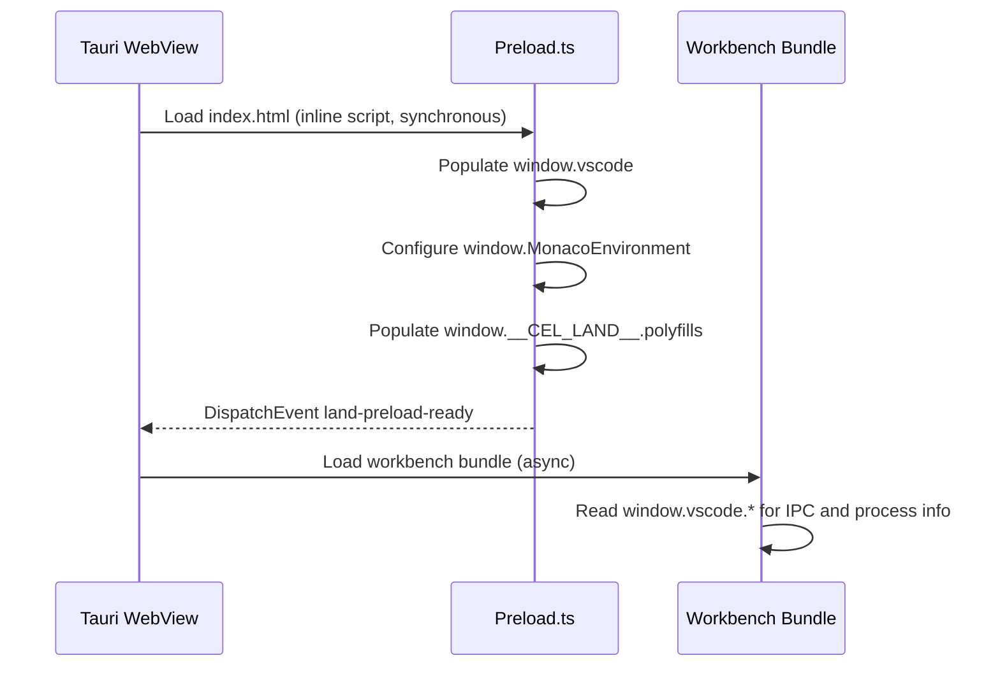
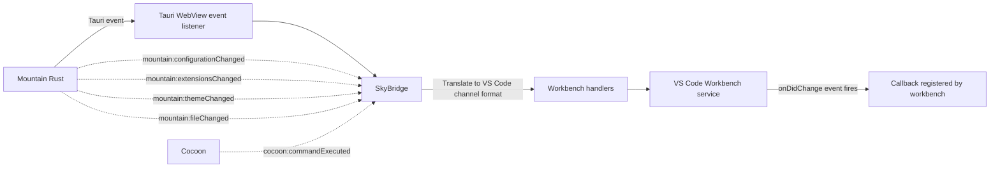
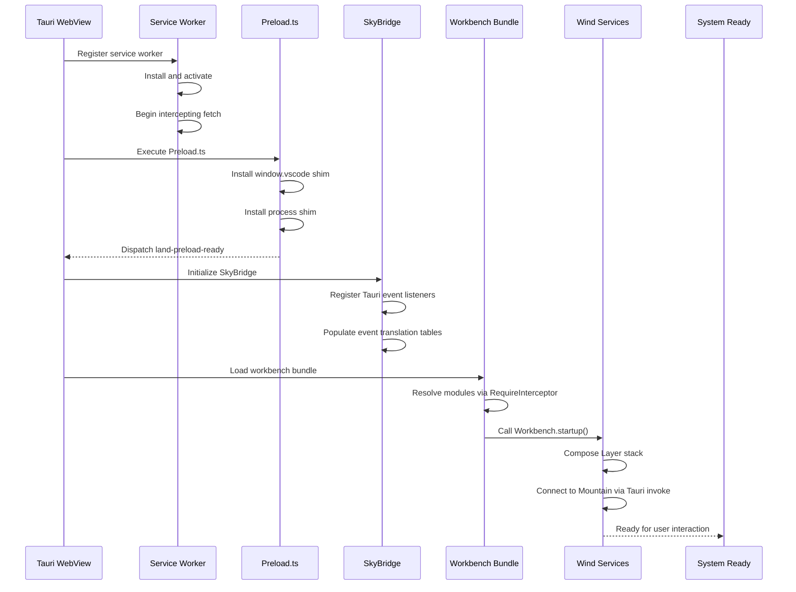

# Polyfills and Compatibility Shims

This document catalogues every polyfill, shim, and compatibility layer that
enables the VS Code workbench and extension host to function inside **Land**'s
`Tauri` WebView and `Node.js` sidecar architecture. These layers translate
Electron and `Node.js` APIs into their `Tauri` and `Rust` equivalents without
modifying upstream VS Code source code.

---

## Table of Contents

1. [Wind Preload Shim](#wind-preload-shim)
2. [SkyBridge](#skybridge)
3. [Cocoon Initialization Prelude](#cocoon-initialization-prelude)
4. [Output Transform Pipeline](#output-transform-pipeline)
5. [Worker Service Worker](#worker-service-worker)
6. [LandFix Diagnostics](#landfix-diagnostics)
7. [Telemetry Bridge](#telemetry-bridge)
8. [Polyfill Lifecycle](#polyfill-lifecycle)
9. [Global Namespace Cleanup](#global-namespace-cleanup)
10. [Related Documentation](#related-documentation)

---

## Wind Preload Shim 🛡️

The Preload shim (`Wind/Source/Preload.ts`) establishes the VS Code workbench
execution environment inside the `Tauri` WebView. It runs as the first script
loaded by `index.html` and patches the global scope with Electron/`Node.js` APIs
before the workbench bundle loads.

### Execution Order



### Shimming Strategy

The Preload shim defines the following global replacements:

| VS Code Expectation         | Land Implementation                     | Mechanism                                                                      |
| --------------------------- | --------------------------------------- | ------------------------------------------------------------------------------ |
| `window.vscode.ipcRenderer` | `Tauri` `invoke()` wrapper              | Custom `IPCRenderer` interface in `Wind/Source/Types/Interface/IPCRenderer.ts` |
| `process.env`               | Object with tier-gated env vars         | Populated from `__LandTiers` at preload time                                   |
| `process.platform`          | `darwin` / `linux` / `win32`            | Derived from `navigator.userAgent` at preload time                             |
| `process.versions`          | Object with `node`, `http_parser`, `v8` | Populated from navigator.userAgent                                             |
| `process.argv`              | Array of launch arguments               | Received from `Tauri` IPC                                                      |
| `process.cwd()`             | Resolved workspace root                 | Set during init from `Mountain`                                                |
| `process.nextTick()`        | Custom microtask queue                  | Standard `queueMicrotask` + polyfill                                           |
| `globalThis.__filename`     | Environment path `appRoot`              | Path to workbench bundle root                                                  |
| `webFrame` (Electron)       | No-op stub                              | Methods return undefined                                                       |

### Diagnostic Tag

`Preload.ts` emits a `preload-shim` diagnostic entry:

```
[preload-shim] window.vscode.ipcRenderer installed
[preload-shim] process shim installed
[preload-shim] land-preload-ready dispatched
```

This diagnostic is visible in `Mountain`'s dev-log when `Trace=preload-shim` is
set. It confirms the shim is active in the real WebView (not an `Astro` SSR pass
where `window` is a Node polyfill).

---

## SkyBridge 🌐

`SkyBridge` (`Sky/Source/Function/Sky/Bridge.ts`) is the runtime event routing
bridge between `Tauri`'s IPC system and the VS Code workbench's internal message
channel system. It is composed of focused sub-modules in the `Bridge/`
directory:

- `InstallCommands.ts` - `sky://command/*` handlers (execute, register,
  unregister)
- `InstallDebug.ts` - debug breakpoint gutter sync
  (`sky://debug/addBreakpoints`)
- `InstallDeadChannelListeners.ts` - no-op stubs for deprecated channels
- `InstallDiagnostics.ts` - language diagnostics relay to Monaco
- `InstallEditorAndOutput.ts` - `sky://workspace/applyEdit`, save, saveAll,
  saveAs
- `InstallEditorOperations.ts` - Monaco content debounce (300 ms) →
  `sky:model:contentChanged` → `$acceptModelChanged` → Cocoon
  `onDidChangeTextDocument`
- `InstallFanOut.ts` - fan-out dispatcher for multi-subscriber channels
- `InstallInlineCompletions.ts` -
  `ILanguageFeaturesService.inlineCompletionsProvider.register()` relay
- `InstallProgressTerminalWorkspace.ts` - progress notifications and terminal
  events
- `InstallScm.ts` - SCM provider registration with 10 × 200 ms retry for
  `__CEL_SERVICES__.SCM` population race
- `InstallSearch.ts` - workspace search result forwarding
- `InstallSimpleRelays.ts` - single-line DOM CustomEvent relays (language
  config, theme, etc.)
- `InstallStatusbar.ts` - `sky://statusbar/*` status-bar entry lifecycle
- `InstallTasksAndDecorations.ts` - task and file-decoration event relay
- `InstallTreeView.ts` - tree-view selection, expand/collapse, reveal
  (`sky://tree-view/*`)
- `InstallUiRequests.ts` - `sky://ui/show-message-request`, quick-pick,
  input-box
- `InstallWebview.ts` - webview message forwarding and disposal

It translates between two event models:

### Event Translation

| Tauri Event                     | VS Code Workbench Channel  | Direction               |
| ------------------------------- | -------------------------- | ----------------------- |
| `mountain:configurationChanged` | `onDidChangeConfiguration` | `Mountain` -> Workbench |
| `mountain:extensionsChanged`    | `onDidChangeExtensions`    | `Mountain` -> Workbench |
| `mountain:themeChanged`         | `onDidChangeColorTheme`    | `Mountain` -> Workbench |
| `mountain:fileChanged`          | FileSystem watcher events  | `Mountain` -> Workbench |
| `cocoon:commandExecuted`        | Extension command result   | `Cocoon` -> Workbench   |

### Bridge Architecture



### HTML Injection and Webview Input

`SkyBridge` manages the lifecycle of webview content injection through
`first-set-html` logging. When an extension creates a webview panel, the flow
is:

```
Extension calls vscode.window.createWebviewPanel()
    |
    v
Cocoon sends gRPC createWebviewPanel request
    |
    v
Mountain creates Wry webview
    |
    v
Sky webview sets HTML content
    |
    +---> SkyBridge logs: first-set-html applied=method
    |       (content reached real WebviewInput)
    +---> SkyBridge logs: first-set-html applied=setter
    |       (content stored, view not yet parked)
    +---> SkyBridge logs: first-set-html applied=skipped
            (no parked view available - silent drop)
```

---

## Cocoon Initialization Prelude 🚀

The `Cocoon` initialization prelude (`Cocoon/Source/Effect/Bootstrap.ts`) runs
before any extension code executes. It establishes the execution environment for
the VS Code Extension Host within `Node.js`.

### Prelude Sequence

```
Cocoon Node.js process starts
    |
    v
Stage 1: Environment
    - Records Node.js version, platform, arch
    |
    v
Stage 2: Configuration
    - Resolves MOUNTAIN_GRPC_PORT (default 50051) and COCOON_GRPC_PORT (default 50052)
    - Populates globalThis.__cocoonBootstrapConfig
    - Populates globalThis.__LandTiers from esbuild __LandTier_<Capability>__ defines,
      falling through to process.env.Tier<Capability> and hard-coded defaults
    |
    v
Stage 3: RPCServer  ← must bind BEFORE MountainConnection
    - Starts Cocoon's gRPC server on COCOON_GRPC_PORT (default 50052)
    - Mountain's 30-second gRPC connection budget begins ticking from spawn;
      RPCServer must be listening before that budget expires
    |
    v
Stage 4: ModuleInterceptor
    - Initializes and installs the Node.js require() interceptor
    - Remaps electron → Tauri stubs, patches VS Code bundle loading
    |
    v
Stage 5: MountainConnection
    - TCP-probes Mountain on port 50051 (up to 3 attempts, 100 ms → 500 ms backoff)
    - Opens gRPC channel; retries up to 5 times with exponential back-off
    - On success emits $initialHandshake; waits for initExtensionHost payload
    |
    v
Stage 6: Extensions
    - Fetches all extensions; activates enabled ones concurrently (up to 8 in parallel)
    - Activation uses topological ordering: if extension A declares
      extensionDependencies: ["B"], B is activated first. An InProgress Set
      prevents circular dependency deadlocks.
    |
    v
Stage 7: HealthCheck (skippable via skipHealthCheck option)
    - Runs checkAllServices(); marks overall result healthy/degraded/unhealthy
    |
    v
Extension host ready for use
```

### RequireInterceptor

The `RequireInterceptor` patches `Node.js`'s `require()` to:

1. Remap `electron` module references to local shims (empty objects with
   expected method shapes)
2. Remap `original-fs` to `fs` (`Node.js` standard library)
3. Intercept VS Code module loading to inject **Land**-specific patches
4. Provide shims for native modules (`keytar`, `spdlog`,
   `vscode-windows-registry`)

The interceptor is installed before any VS Code source code is loaded, ensuring
module resolution works correctly for the unmodified `extHost*.ts` sources.

---

## Output Transform Pipeline 🔧

The `Output` element applies polyfills during the compilation of VS Code
platform code:

### Transform Categories

| Transform               | Purpose                                                             | Applied By                   |
| ----------------------- | ------------------------------------------------------------------- | ---------------------------- |
| Module resolution remap | Replace `electron` imports with `Tauri` stubs                       | `ESBuild` `alias` config     |
| `define` substitution   | Replace `process.platform` checks with compile-time constants       | `ESBuild` `define` config    |
| CSS import interception | Wrap CSS imports for runtime `<link>` injection                     | `ESBuild` plugin             |
| Source map chaining     | Preserve original VS Code source maps through transforms            | `ESBuild` `sourcemap` config |
| Dead code elimination   | Remove Electron-specific code paths (window management, tray, etc.) | `ESBuild` tree shaking       |

### Platform Code Markers

The `Output` element identifies platform-specific code sections through marker
comments:

```typescript
// @CEL:platform:electron-start
// This block runs on Electron workbench variant
// @CEL:platform:electron-end

// @CEL:platform:mountain-start
// This block runs on Mountain workbench variant
// @CEL:platform:mountain-end
```

These markers are respected by the VS Code platform code and used by the
workbench variant selection system.

### Cocoon `console.*` Replacement

In production Cocoon source, all `console.log`, `console.warn`, and
`console.error` calls are replaced with `CocoonDevLog` (routes through
`Mountain`'s dev-log sink) or `process.stdout.write` / `process.stderr.write`
directly. This ensures diagnostic output survives esbuild's `drop: ["console"]`
pass, which strips bare `console.*` calls from production bundles.

### Sky Sourcemap Strategy

Sky dev builds use `sourcemap: "inline"` so the browser profiler and DevTools
can resolve minified symbols back to original TypeScript source without a
separate `.map` file download. Production builds use the standard external
sourcemap (a `.js.map` file alongside the bundle).

---

## Worker Service Worker 🗂️

The `Worker` element provides a service worker that enables offline support and
optimizes asset loading:

### Caching Strategy

| Request Type                   | Strategy      | Cache Name           | Duration |
| ------------------------------ | ------------- | -------------------- | -------- |
| Navigation (HTML)              | Network-first | `land-pages-v1`      | Session  |
| Static assets (JS, CSS, fonts) | Cache-first   | `land-static-v1`     | 7 days   |
| Extension assets               | Cache-first   | `land-extensions-v1` | 24 hours |
| External resources             | Network-only  | None                 | N/A      |

### Dynamic CSS Interception

A unique feature of the `Worker` is its dynamic CSS loading interceptor:

```
JavaScript imports CSS file
    |
    v
Service Worker intercepts import
    |
    +---> Checks if request is JS -> CSS import
    +---> Returns a JS module that:
    |       1. Creates a <link rel="stylesheet"> element
    |       2. Sets href to the original CSS URL (cached)
    |       3. Appends to document.head
    |       4. Returns a Promise that resolves on load
    v
CSS loads via native browser mechanism
```

This enables the VS Code workbench and extensions to `import 'styles.css'` in
JavaScript modules while leveraging the browser's native CSS loading for proper
cascade ordering.

### Service Worker Lifecycle

```
1. Sky registers Worker on application start
2. Worker installs, caching critical assets (install event)
3. Sky signals activation via message channel (activate event)
4. Worker begins intercepting fetch events
5. Worker listens for update messages from Sky
6. On update, Worker skips waiting and reloads clients
```

---

## LandFix Diagnostics 🔬

The `@landfix` system provides structured diagnostic logging across all
processes:

### Diagnostic Tag System

| Tag                | Source              | Purpose                               |
| ------------------ | ------------------- | ------------------------------------- |
| `preload-shim`     | `Wind` `Preload.ts` | Confirms shim installation success    |
| `landfix:layer`    | `Wind` Layer        | Service layer composition diagnostics |
| `landfix:tier`     | All processes       | Runtime tier banner                   |
| `landfix:bridge`   | `SkyBridge`         | Event bridge state changes            |
| `landfix:cocoon`   | `Cocoon`            | Extension host lifecycle              |
| `landfix:mountain` | `Mountain`          | Backend service initialization        |

### Runtime Tier Banner

Every process emits a tier banner at startup showing the resolved tier values:

```
[LandFix:Tier] TierFileSystem=Layer4 TierGlob=Native TierRemoteProcedureCall=gRPC
[LandFix:Tier] TierConfiguration=Layer3 TierFileWatcher=Layer4 TierClipboard=Layer3
[LandFix:Tier] TierExtensionActivation=Layer3 TierExtensionScan=Layer3 TierModuleCache=Layer2
```

The three banners (`Mountain`, `Cocoon`, `Wind`) must agree. A mismatch
indicates env propagation drift.

### Dev-Log File Sink

`Mountain` writes diagnostic output to a structured dev-log file when
`Trace=all` and `Record=1` are set:

```
<app_data_dir>/<bundle>/logs/<timestamp>/Mountain.dev.log
```

The dev-log captures:

- Process lifecycle events (spawn, crash, exit)
- Service initialization sequence
- `gRPC` connection state changes
- Diagnostic tags from all processes
- Unhandled errors with stack traces

---

## Telemetry Bridge 📊

**Land** implements a dual-pipe telemetry system through the PostHog+OTEL
bridge:

### Wind PostHog Bridge

The `Wind` PostHog bridge (`Wind/Source/Telemetry/PostHogBridge.ts`) reuses an
in-webview `window.posthog` client:

```
Wind service emits telemetry event
    |
    v
Wind PostHogBridge.ts
    |
    +---> Checks Disable flag (from TierTelemetry)
    +---> If PostHog enabled: sends to window.posthog.capture()
    +---> If OTLP enabled: sends to OTLP collector via gRPC
    +---> If disabled: silently drops event
```

### Mountain Telemetry

`Mountain`'s telemetry layer sends events from `Rust` directly to both PostHog
(via `posthog-rs` crate) and OTLP (via `opentelemetry` crate).

### Telemetry Kill Switch

Setting `Disable=true` in any `.env.Land*` file disables all telemetry and
polyfill injection globally. This is read at build time and burned into the
binary -- no runtime toggle.

---

## Polyfill Lifecycle 🔄

The startup sequence coordinates all polyfill layers:



### Polyfill Disable Flag

The `Disable` environment variable can be set to `true` to bypass all polyfill
layers, useful for diagnosing polyfill-related issues:

- `Disable=true` - All polyfills skipped
- `Disable=false` (default) - Normal polyfill installation
- `Disable=preload` - Skip only Preload shim
- `Disable=bridge` - Skip only `SkyBridge`

---

## Global Namespace Cleanup 🧹

After all shims are installed and the workbench is loaded, the Preload shim
removes temporary globals to avoid polluting the workbench's global namespace:

```typescript
// After shim installation
delete (window as any).__land_preload_tmp;
delete (window as any).__land_polyfill_cache;
```

Only essential globals remain on `window.vscode` and `globalThis.__LandTiers`.

---

## Related Documentation 📋

- [Architecture](Architecture.md) - System architecture
- [EditorCore](EditorCore.md) - `Wind` service layer and workbench adaptation
- [BuildPipeline](BuildPipeline.md) - Build pipeline
- [RustInfrastructure](RustInfrastructure.md) - `Rust` backend components
- [InterComponentProtocol](InterComponentProtocol.md) - `gRPC` protocol
- [VSCode-API-Coverage-Matrix](VSCode-API-Coverage-Matrix.md) - API support
  status
- [Workflow/CreatingAndInteractingWithAWebviewPanel](Workflow/CreatingAndInteractingWithAWebviewPanel.md)

---

**Project Maintainers:** Source Open
([Source/Open@Editor.Land](mailto:Source/Open@Editor.Land)) |
[GitHub Repository](https://github.com/CodeEditorLand/Land) |
[Report an Issue](https://github.com/CodeEditorLand/Land/issues)
