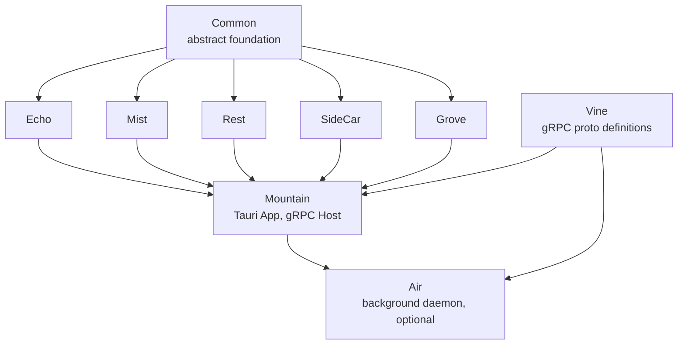
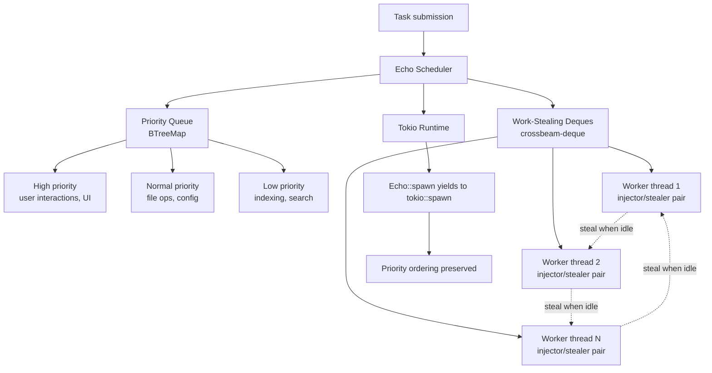
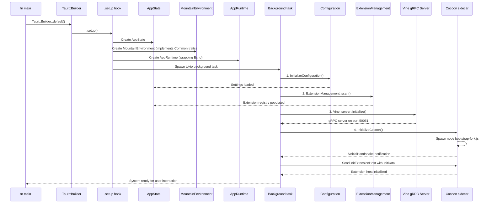

# Rust Infrastructure

This document describes every `Rust` component in the **Land** system: the
abstract common library, the native backend application, the task scheduler, and
all supporting `Rust` services. These components form the native foundation that
the entire editor is built upon.

---

## Table of Contents

1. [Component Summary](#component-summary)
2. [Common: Abstract Core Library](#common-abstract-core-library)
3. [Echo: Work-Stealing Task Scheduler](#echo-work-stealing-task-scheduler)
4. [Mountain: Native Backend Application](#mountain-native-backend-application)
5. [Mist: DNS Isolation Server](#mist-dns-isolation-server)
6. [Air: Background Daemon](#air-background-daemon)
7. [Rest: OXC TypeScript Compiler](#rest-oxc-typescript-compiler)
8. [SideCar: Vendored Runtime Manager](#sidecar-vendored-runtime-manager)
9. [Grove: WASM Extension Host](#grove-wasm-extension-host)
10. [Rust Build Configuration](#rust-build-configuration)
11. [Related Documentation](#related-documentation)

---

## Component Summary 📋

| Component  | Crate Type     | Edition | Key Dependencies                                     | Role                                                                                              |
| ---------- | -------------- | ------- | ---------------------------------------------------- | ------------------------------------------------------------------------------------------------- |
| `Common`   | Library        | 2024    | tauri, async-trait, serde, thiserror                 | Abstract trait definitions, `ActionEffect` system, DTOs                                           |
| `Echo`     | Library        | 2024    | tokio, crossbeam-deque, `Common`                     | Priority work-stealing task scheduler                                                             |
| `Mountain` | Binary         | 2024    | `Common`, `Echo`, `Mist`, tauri, tonic, portable-pty | Primary `Tauri` application, `gRPC` server                                                        |
| `Mist`     | Library+Binary | 2024    | hickory-server, ring, tokio, `Common`                | Local DNS server for `*.editor.land`                                                              |
| `Air`      | Binary         | 2024    | tokio, tonic, reqwest, `Common`, `Mist`              | Background daemon (updates, indexing, crypto)                                                     |
| `Rest`     | Binary+Library | 2024    | oxc_allocator, oxc_parser, oxc_transformer, `Common` | `OXC`-based `TypeScript` compiler                                                                 |
| `SideCar`  | Library        | 2024    | tokio, reqwest, zip, `Common`, `Mist`                | Vendored `Node.js` binary manager                                                                 |
| `Grove`    | Library+Binary | 2021    | `Common`, wasmtime, tonic, clap                      | Wasm sandbox for WASM-compiled extensions                                                         |
| `Vine`     | Library        | 2024    | tonic-build, prost, prost-types                      | gRPC protocol definitions (`Vine.proto`); generated stubs consumed by `Mountain`, `Cocoon`, `Air` |

### Dependency Graph



---

## Common: Abstract Core Library 📚

The `Common` crate is the architectural foundation of **Land**'s native backend.
It is a pure abstract library with no concrete implementations -- it defines
what the system can do, not how.

### Trait Architecture

Every application capability is defined as an async trait:

```rust
#[async_trait]
pub trait FileSystem: Send + Sync {
    async fn read_file(&self, path: &Path) -> Result<Vec<u8>, CommonError>;
    async fn write_file(&self, path: &Path, content: &[u8]) -> Result<(), CommonError>;
    async fn stat(&self, path: &Path) -> Result<FileStat, CommonError>;
    async fn read_dir(&self, path: &Path) -> Result<Vec<DirEntry>, CommonError>;
    async fn create_dir(&self, path: &Path) -> Result<(), CommonError>;
    async fn remove_file(&self, path: &Path) -> Result<(), CommonError>;
    async fn rename(&self, from: &Path, to: &Path) -> Result<(), CommonError>;
    async fn copy(&self, from: &Path, to: &Path) -> Result<(), CommonError>;
    async fn watch(&self, path: &Path) -> Result<FileWatcher, CommonError>;
}
```

### Defined Service Interfaces

| Trait                 | Domain              | Methods                                                        |
| --------------------- | ------------------- | -------------------------------------------------------------- |
| `FileSystem`          | File operations     | read, write, stat, readdir, mkdir, remove, rename, copy, watch |
| `Configuration`       | Settings management | get, set, has, inspect, onDidChange, keys                      |
| `Terminal`            | PTY management      | create, write, resize, onData, onExit, list                    |
| `Clipboard`           | System clipboard    | read, write, readText, writeText, hasFormat                    |
| `Dialog`              | Native dialogs      | open, save, message, input                                     |
| `Window`              | Window management   | show, focus, maximize, minimize, close, isMaximized            |
| `ExtensionManagement` | Extension lifecycle | scan, install, uninstall, list, getManifest                    |
| `Process`             | Child process       | spawn, kill, onExit, list, exec                                |
| `Storage`             | Key-value storage   | get, set, delete, list, clear, onDidChange                     |
| `SecretStorage`       | OS keychain         | get, set, delete, onDidChange                                  |
| `Search`              | File/text search    | search, findInFile, replace                                    |

### ActionEffect System

`Common` defines the `ActionEffect` declarative system -- a sealed enum of all
possible effects that the extension host can request:

```rust
pub enum ActionEffect {
    ReadFile { path: PathBuf },
    WriteFile { path: PathBuf, content: Vec<u8> },
    OpenDialog { options: DialogOptions },
    ExecuteCommand { command: String, args: Vec<String> },
    CreateTerminal { name: String, shell_path: Option<PathBuf> },
    // ... 80+ effect variants
}
```

Effects flow: **Cocoon (extension host)** --`gRPC`--> **Mountain** --execute-->
**result** --`gRPC`--> **Cocoon**

This allows extensions to request native operations without knowing whether the
implementation runs in `Rust`, `Node.js`, or `WASM`.

### Data Transfer Objects

`Common` defines DTOs shared across all components:

| DTO                   | Fields                                                  | Used By                        |
| --------------------- | ------------------------------------------------------- | ------------------------------ |
| `InitData`            | Workspace info, extension manifests, configuration      | `Mountain` -> `Cocoon` startup |
| `FileStat`            | path, type (file/dir/symlink), size, mtime, permissions | All file operations            |
| `TerminalOptions`     | name, shellPath, cwd, env, cols, rows                   | Terminal creation              |
| `ExtensionManifest`   | id, version, publisher, activationEvents, contributes   | Extension management           |
| `ConfigurationTarget` | Global, Workspace, WorkspaceFolder                      | Configuration operations       |
| `SearchOptions`       | pattern, include, exclude, maxResults, contextLines     | Search operations              |

### CommonError

A unified error type covering all failure modes:

```rust
pub enum CommonError {
    NotFound(String),
    PermissionDenied(String),
    IoError(std::io::Error),
    ParseError(String),
    ProtocolError(String),
    Timeout(String),
    Unsupported(String),
    Internal(String),
}
```

---

## Echo: Work-Stealing Task Scheduler ⚡

`Echo` is a bounded work-stealing task scheduler designed as the core execution
engine for `Mountain`'s async workloads.

### Scheduling Architecture



### Key Properties

| Property            | Implementation                       | Benefit                           |
| ------------------- | ------------------------------------ | --------------------------------- |
| Bounded capacity    | Fixed-size deque per worker          | Predictable memory usage          |
| Lock-free           | crossbeam-deque atomic operations    | No mutex contention under load    |
| Priority tiers      | High/Normal/Low separate deques      | UI responsiveness under heavy I/O |
| Work stealing       | Idle workers steal from random peers | Full CPU utilization              |
| `Tokio` integration | `Echo::spawn()` returns `JoinHandle` | Seamless async `Rust` usage       |

### Usage in Mountain

```rust
// Mountain uses Echo for all async work
let scheduler = Echo::new()
    .with_worker_count(num_cpus::get())
    .build();

// High-priority: user-facing operations
scheduler.spawn_high(handle_user_input()).await;

// Normal: file operations
scheduler.spawn(read_file(path)).await;

// Low: background indexing
scheduler.spawn_low(index_workspace(workspace)).await;
```

---

## Mountain: Native Backend Application 🏔️

`Mountain` is the primary `Tauri` application that serves as the native backend.
It implements all traits from `Common`, hosts the `gRPC` server, manages
application state, and orchestrates sidecar processes.

### Module Architecture

```
Element/Mountain/Source/
    +-- Binary/
    |   +-- Main/
    |       +-- Entry.rs        - Application entry point (fn main)
    |       +-- Setup.rs        - Tauri Builder setup hook
    |       +-- EventLoop.rs    - Tauri event loop integration
    |
    +-- Environment/
    |   +-- Rs/
    |       +-- Config.rs       - Configuration loading and initialization
    |       +-- Environment.rs   - MountainEnvironment implementing Common traits
    |
    +-- AppState.rs             - Central application state struct
    +-- AppRuntime.rs           - Effect execution engine
    |
    +-- Vine/
    |   +-- Server.rs           - gRPC server implementation
    |   +-- Service.rs          - Vine protocol service handlers
    |   +-- Connection.rs       - Connection lifecycle management
    |
    +-- ProcessManagement/
    |   +-- CocoonManagement.rs - Cocoon sidecar lifecycle
    |   +-- AirManagement.rs    - Air sidecar lifecycle
    |   +-- InitializationData.rs - Startup payload construction
    |
    +-- Handler/ (Tauri commands)
    |   +-- Commands/           - Tauri command registrations
    |   +-- Events/             - Tauri event emitters
    |
    +-- ExtensionManagement/   - Extension scanning and lifecycle
    +-- LandFixTier.rs         - Runtime tier banner
    +-- LandFixSystem/         - Structured diagnostics
```

### Application Startup



### Tauri Command Registration

`Mountain` registers `Tauri` commands in `Handler/Commands/`. Each command maps
to a `Rust` function that:

1. Receives typed parameters from the `Tauri` invoke JSON
2. Performs the operation using `Common` trait implementations
3. Returns a typed result (or error)

```rust
#[tauri::command]
async fn read_file(path: String, state: State<'_, AppState>) -> Result<Vec<u8>, String> {
    let fs = state.file_system();
    fs.read_file(Path::new(&path)).await.map_err(|e| e.to_string())
}
```

### Process Management

`ProcessManagement/` handles the lifecycle of sidecar processes:

**Cocoon Management:**

- Constructs the sidecar environment (`PATH`, `VSCODE_PARENT_PID`, tier env
  vars)
- Spawns `Node.js` with `bootstrap-fork.js` entry point
- Monitors process health (heartbeat via `gRPC`)
- Restarts on crash (configurable max restart count)
- Sends `SIGTERM` on application shutdown

**Air Management:**

- Spawns the `Air` binary as a persistent background process
- Connects via `gRPC` on port `50053`
- Monitors health and resource usage
- Coordinates update downloads and verification

---

## Mist: DNS Isolation Server 🌐

`Mist` runs a local Hickory DNS server authoritative for the `editor.land` zone.
It provides network isolation for sidecar processes.

### DNS Zone Configuration

```
editor.land.  IN SOA  localhost. hostmaster.editor.land. (
    2026010100 ; serial
    3600       ; refresh
    900        ; retry
    86400      ; expire
    60         ; minimum TTL
)

*.editor.land.  IN A  127.0.0.1
```

All `*.editor.land` subdomains resolve to `127.0.0.1`, ensuring sidecar
processes communicate only over localhost.

### Forward Allowlisting

`Mist` maintains a configurable allowlist of trusted external domains:

| Domain                         | Purpose                | Status              |
| ------------------------------ | ---------------------- | ------------------- | ----------- |
| `marketplace.visualstudio.com` | Extension downloads    | Allowlisted         |
|                                | `update.editor.land`   | Application updates | Allowlisted |
| `api.posthog.com`              | Telemetry (if enabled) | Allowlisted         |
| All others                     | Blocked (NXDOMAIN)     | Default blocked     |

### DNSSEC

`Mist` supports DNSSEC with ECDSA P-256 signing for the `editor.land` zone.
Signing keys are generated on first run and cached in the application data
directory.

---

## Air: Background Daemon 🖥️

`Air` is the background daemon sidecar for **Land**, providing long-running
services that would degrade UI performance if run in the main process.

### Services

| Service          | Protocol | Port    | Purpose                                                      |
| ---------------- | -------- | ------- | ------------------------------------------------------------ |
| Update Manager   | `gRPC`   | `50053` | Download, verify, and apply application updates              |
| Indexer          | `gRPC`   | `50053` | File content indexing for text search                        |
| Crypto Service   | `gRPC`   | `50053` | Cryptographic signing, authentication, and secret management |
| Health Monitor   | `gRPC`   | `50053` | System health checks, metrics collection, crash reporting    |
| Asset Downloader | `gRPC`   | `50053` | Background download of extension assets                      |

### Lifecycle

```
Mountain starts
    |
    +---> AirManagement spawns Air binary
    +---> gRPC connection established on port 50053
    +---> Heartbeat monitoring begins (every 5 seconds)
    +---> Air registers available services
    |
    v
Mountain dispatches background work to Air
    |
    +---> Update check (hourly)
    +---> File indexing (on workspace open)
    +---> Crypto operations (on demand)
    |
    v
Mountain shuts down
    |
    +---> SIGTERM sent to Air
    +---> Graceful shutdown (5 second timeout)
    +---> Force kill if not exited
```

---

## Rest: OXC TypeScript Compiler 🚀

`Rest` is a high-performance `TypeScript` compiler built on the `OXC` (Oxidation
Compiler) toolchain. It replaces `esbuild`'s `TypeScript` loader with a
`Rust`-powered alternative.

### Compilation Pipeline

```
TypeScript input (.ts, .tsx)
    |
    v
1. OXC Parser (oxc_parser)
    - Produces AST with full location tracking
    - Handles TypeScript syntax, decorators, JSX
    |
    v
2. OXC Semantic Analysis (oxc_semantic)
    - Symbol resolution
    - Type checking (scope and binding only)
    |
    v
3. OXC Transformer (oxc_transformer)
    - Decorator lowering
    - Class field transformations
    - TypeScript to JavaScript conversion
    - Target ES version lowering
    |
    v
4. OXC Code Generator (oxc_codegen)
    - Source map generation
    - Minification (oxc_minifier) [optional]
    |
    v
JavaScript output (.js, .mjs)
```

### Performance

| Operation                    | esbuild | Rest (OXC) | Improvement |
| ---------------------------- | ------- | ---------- | ----------- |
| Parse + transform 1000 files | 2.4s    | 0.9s       | 2.7x        |
| Full bundle (100K LOC)       | 1.8s    | 0.7s       | 2.6x        |
| Minified bundle              | 3.1s    | 1.3s       | 2.4x        |

### CLI Usage

```sh
rest --entry src/index.ts \
	--out-dir dist/ \
	--sourcemap \
	--target es2022
```

`Rest` is integrated into the build pipeline via the `debug-electron-rest`
profile:

```sh
./Maintain/Debug/Build.sh --profile debug-electron-rest
```

---

## SideCar: Vendored Runtime Manager 📦

`SideCar` manages pre-compiled native dependency binaries. Currently handles
`Node.js` runtime binaries for each target platform.

### Binary Resolution

```
Build.sh reads NodeVersion and NodePlatform from .env.Land
    |
    v
SideCar::resolve()
    |
    +---> Checks SideCar/Cache.json for cached binary
    |       CACHED: Return cached path
    |       NOT CACHED: Continue
    |
    +---> Downloads from official Node.js source
    |       URL: https://nodejs.org/dist/v{version}/node-v{version}-{platform}.tar.gz
    |
    +---> Verifies SHA256 checksum
    |
    +---> Extracts to SideCar/{platform}/node
    |
    +---> Records in Cache.json
    |
    v
Mountain build copies binary to app bundle
```

### Supported Platforms

| Target Triple             | Platform String | `Node.js` Binary                    |
| ------------------------- | --------------- | ----------------------------------- |
| aarch64-apple-darwin      | darwin-arm64    | node-v{version}-darwin-arm64.tar.gz |
| x86_64-apple-darwin       | darwin-x64      | node-v{version}-darwin-x64.tar.gz   |
| aarch64-unknown-linux-gnu | linux-arm64     | node-v{version}-linux-arm64.tar.gz  |
| x86_64-unknown-linux-gnu  | linux-x64       | node-v{version}-linux-x64.tar.gz    |
| aarch64-pc-windows-msvc   | win-arm64       | node-v{version}-win-arm64.zip       |
| x86_64-pc-windows-msvc    | win-x64         | node-v{version}-win-x64.zip         |

---

## Grove: WASM Extension Host 🧩

`Grove` provides an alternative extension host for running WASM-compiled VS Code
extensions in a sandboxed environment using `WASMtime`.

### Architecture

```
Grove Binary
    |
    +---> WASMtime Runtime
    |       +---> Sandboxed execution (no OS access by default)
    |       +---> WASI interface for controlled I/O
    |       +---> Host function isolation
    |
    +---> gRPC Client (optional)
    |       Connects to Mountain for:
    |       - File system operations
    |       - Configuration access
    |       - Native API calls
    |
    +---> IPC Transport (optional)
    |       Alternative to gRPC for same-process deployment
    |
    +---> WASM Host Functions (optional)
            Extension API functions exposed directly to WASM modules
```

### Status

`Grove` is integrated as an optional build feature (`--features grove`). It is
not enabled by default. When activated, it provides parallel extension hosting
alongside `Cocoon` for WASM-compiled extensions.

---

---

## Vine: gRPC Protocol Definitions 📡

`Vine` is the protocol definitions library for all `gRPC` communication in
**Land**. It owns `Vine.proto` and generates `Rust` stubs (`prost`/`tonic`)
consumed by `Mountain`, `Air`, and any other element that speaks `gRPC`.

| File                             | Purpose                                                    |
| -------------------------------- | ---------------------------------------------------------- |
| `Element/Vine/Proto/Vine.proto`  | Core service contracts (ExtensionHost, BackgroundServices) |
| `Element/Vine/Source/Build.rs`   | `prost-build` codegen invocation                           |
| `Element/Vine/Source/Library.rs` | Re-exports generated types for consumers                   |

Protocol evolution is centralised here - adding or changing an RPC updates one
`.proto` file and all consumers rebuild against the new stubs.

## Rust Build Configuration 🔧

### Workspace Configuration

The `Rust` workspace is defined in `Land/Cargo.toml`:

```toml
[workspace]
resolver = "2"
members = [
	"Element/Common",
	"Element/Echo",
	"Element/Mist",
	"Element/Mountain",
	"Element/Rest",
	"Element/SideCar",
	"Element/Air",
	"Element/Grove",
	"Element/Vine",
]

[profile.release]
lto = "fat"
codegen-units = 1
strip = true
```

### Toolchain

Defined in `Land/rust-toolchain.toml`:

```toml
[toolchain]
channel = "nightly-2025-01-01"
components = ["rustfmt", "clippy"]
targets = [
	"aarch64-apple-darwin",
	"x86_64-apple-darwin",
	"aarch64-unknown-linux-gnu",
	"x86_64-unknown-linux-gnu",
	"aarch64-pc-windows-msvc",
	"x86_64-pc-windows-msvc",
]
```

### Rust Edition

All `Rust` crates use edition 2024 (`Rust` nightly) except `Grove` which uses
edition 2021 for WASM compatibility.

---

## Related Documentation 📋

- [Architecture](Architecture.md) - System architecture overview
- [BuildPipeline](BuildPipeline.md) - Build pipeline
- [EditorCore](EditorCore.md) - Editor workbench and service layer
- [Polyfills](Polyfills.md) - Compatibility shims
- [InterComponentProtocol](InterComponentProtocol.md) - `gRPC` protocol
  specification
- [Building](Building.md) - Build instructions
- [EnvironmentVariables](EnvironmentVariables.md) - Complete env var reference

---

**Project Maintainers:** Source Open
([Source/Open@editor.land](mailto:Source/Open@editor.land)) |
[GitHub Repository](https://github.com/CodeEditorLand/Land) |
[Report an Issue](https://github.com/CodeEditorLand/Land/issues)
