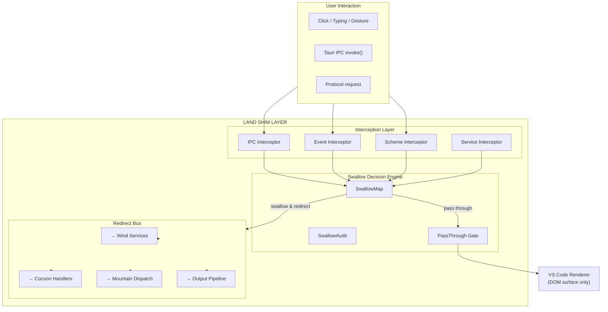
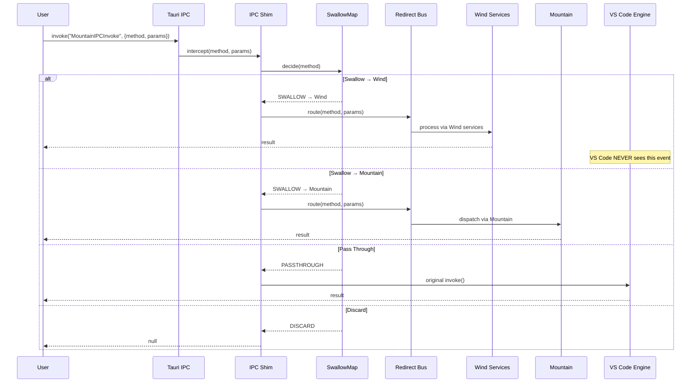

# Shim: Deep-Shim Interception System

How **Land** intercepts VS Code events at both the JavaScript engine level and
the application service level, enabling complete bidirectional visibility, event
swallowing, and service redirection to Land's native ecosystem.

---

## Table of Contents

1. [Architecture Overview](#architecture-overview)
2. [Low-Level Shim (Engine Hooks)](#low-level-shim-engine-hooks)
3. [Coverage Shim (Service Interception)](#coverage-shim-service-interception)
4. [SwallowMap: Decision Engine](#swallowmap-decision-engine)
5. [Performance Impact](#performance-impact)
6. [Feature Gate System](#feature-gate-system)
7. [Per-Element Architecture](#per-element-architecture)
8. [Related Documentation](#related-documentation)

---

## Architecture Overview&#x2001;📐

The shim layer sits between VS Code's JavaScript engine and Land's service tree,
intercepting events at two levels:

```
┌──────────────────────────────────────────────────┐
│                 🔵 COVERAGE SHIM                  │
│  Service routing + audit                         │
│  IPC SwallowMap, DI proxy, AuditLog              │
│  Tier: TierShim=Proxy|Replace                    │
├──────────────────────────────────────────────────┤
│                 🟠 LOW-LEVEL SHIM                │
│  Engine prototype hooks                          │
│  Error, Emitter, Cancel, Dispose, Async, Timing  │
│  Tier: TierShim=Own|Preempt                      │
├──────────────────────────────────────────────────┤
│              VS Code / JavaScript Engine           │
│  Event bus, lifecycle, async scheduling          │
└──────────────────────────────────────────────────┘
```

The two tiers build on each other:

- **🟠 Low-Level Shim** hooks into JavaScript engine primitives —
  `ErrorHandler`, `Emitter.prototype.fire`, `CancellationTokenSource`,
  `DisposableStore`, `setTimeout0`, `Promise`, `Error.stack`,
  `performance.now()`. These provide maximum coverage with minimal code.
- **🔵 Coverage Shim** intercepts at the service/DI boundary — `SwallowMap`
  routes events to `Wind`/`Cocoon`/`Mountain`/`Output` instead of VS Code's
  workbench services.

---

## Low-Level Shim (Engine Hooks)&#x2001;🟠

Eight prototype-level monkey-patches give Land complete bidirectional visibility
into VS Code's event/error/async/lifecycle infrastructure.

### VS Code Internal Stack

```
┌──────────────────────────────────────────────────────────────┐
│ CONTRIBUTION LAYER — extension points, menus, views          │
├──────────────────────────────────────────────────────────────┤
│ WORKBENCH SERVICE LAYER — 200+ I*Service implementations     │
├──────────────────────────────────────────────────────────────┤
│ PLATFORM SERVICE LAYER — 100+ I*Service interfaces           │
├──────────────────────────────────────────────────────────────┤
│ BASE INFRASTRUCTURE — The "Kernel" of VS Code                │
│  ┌──────────────────────────────────────────────────────┐   │
│  │ Emitter<T>      — 1,964 lines, THE event bus         │   │
│  │ DisposableStore — 974 lines, lifecycle management     │   │
│  │ CancellationToken* — 206 lines, cancellation chain    │   │
│  │ ErrorHandler    — 341 lines, global error sink        │   │
│  │ async.ts        — 2,668 lines, async primitives       │   │
│  │ LinkedList      — 151 lines, hot data structure       │   │
│  │ StopWatch       — 41 lines, performance.now wrapper   │   │
│  │ setTimeout0     — platform.ts, postMessage microtask  │   │
│  │ event.ts        — 1,964 lines, debounce/defer/once    │   │
│  │ observable*     — reactive state management           │   │
│  └──────────────────────────────────────────────────────┘   │
├──────────────────────────────────────────────────────────────┤
│ JAVASCRIPT ENGINE — V8 / JavaScriptCore (WKWebView)          │
│  Promise, Microtask queue, Error.stack, FinalizationRegistry │
├──────────────────────────────────────────────────────────────┤
│ WEBVIEW HOST — WKWebView / Chromium                          │
│  DOM events, CSSOM, layout/reflow, compositor                │
└──────────────────────────────────────────────────────────────┘
```

### Hook Layers

| Layer  | Hook Point               | Covers                                     |
| ------ | ------------------------ | ------------------------------------------ |
| **L1** | `ErrorHandler`           | 100% of unhandled errors — one-line patch  |
| **L2** | `Emitter.prototype.fire` | 474 services in one patch (sampled at 1%)  |
| **L3** | `CancellationToken`      | Complete cancellation chain visibility     |
| **L4** | `DisposableStore`        | Resource leak detection, lifecycle mapping |
| **L5** | `setTimeout0`            | Async scheduling, boot performance         |
| **L6** | `Promise` / microtask    | Full async graph tracing (dev-only)        |
| **L7** | `Error.stack`            | Error creation→propagation→handling map    |
| **L8** | `performance.now()`      | Microsecond timing for every operation     |

### Bidirectional Tracing

```
┌─────────────────────────────────────────────────────────┐
│              LAND TRACING DASHBOARD                       │
├─────────────────────────────────────────────────────────┤
│  OUTBOUND (Land → VS Code)                               │
│  ┌──────────────────────────────────────────────────┐   │
│  │ IPC invoke → DispatchMatch → CreateEffectForReq  │   │
│  │                    ↓                              │   │
│  │              CocoonService gRPC                   │   │
│  │                    ↓                              │   │
│  │           Emitter.fire() ← HOOK LAYER 2          │   │
│  │                    ↓                              │   │
│  │           DOM update / service call               │   │
│  └──────────────────────────────────────────────────┘   │
│                                                          │
│  INBOUND (VS Code → Land)                                │
│  ┌──────────────────────────────────────────────────┐   │
│  │  User types → Emitter.fire() ← HOOK LAYER 2     │   │
│  │                    ↓                              │   │
│  │  CancellationTokenSource.cancel() ← HOOK L 3     │   │
│  │                    ↓                              │   │
│  │  onUnexpectedError() ← HOOK LAYER 1              │   │
│  │                    ↓                              │   │
│  │  LandErrorTrace.capture() → OTLP / PostHog        │   │
│  └──────────────────────────────────────────────────┘   │
│                                                          │
│  FULL SYSTEM GRAPH                                       │
│  ┌──────────────────────────────────────────────────┐   │
│  │  performance.now() ← HOOK L 8                    │   │
│  │  Promise create/resolve/reject ← HOOK L 6        │   │
│  │  Error.stack capture ← HOOK L 7                  │   │
│  │  DisposableStore lifecycle ← HOOK L 4            │   │
│  │  setTimeout0 / queueMicrotask ← HOOK L 5         │   │
│  └──────────────────────────────────────────────────┘   │
└─────────────────────────────────────────────────────────┘
```

### Implementation Strategy

| Priority | Layer | Rationale                               |
| -------- | ----- | --------------------------------------- |
| **P0**   | L1    | Zero overhead, catches ALL errors       |
| **P0**   | L2    | Covers 474 services in one patch        |
| **P1**   | L3    | Completes error/cancel story end-to-end |
| **P2**   | L4    | Resource leak detection                 |
| **P2**   | L5    | Boot performance improvement            |
| **P3**   | L8    | Timing infrastructure                   |
| **Dev**  | L6    | Development-only profiling              |
| **Dev**  | L7    | Development-only stack tracing          |

---

## Coverage Shim (Service Interception)&#x2001;🔵

Instead of piping data through VS Code and patching the output, the coverage
shim **intercepts at the DI boundary**, swallows the event entirely, and routes
it to Land's own service tree. VS Code never sees the event — no waterfall, no
double-processing, no internal cascade.

### Architecture



### Interceptor Types

| Interceptor             | Location                                               | Purpose                                                    |
| ----------------------- | ------------------------------------------------------ | ---------------------------------------------------------- |
| **IPC Interceptor**     | `Wind/Source/Shim/IPCInterceptor.ts`                   | Intercepts every `invoke("MountainIPCInvoke")`             |
| **Event Interceptor**   | `Output/Source/Service/CEL/Land/EventInterceptor.ts`   | Patches workbench event emitters                           |
| **Service Interceptor** | `Output/Source/Service/CEL/Land/ServiceInterceptor.ts` | Intercepts `ServiceCollection.get/set`                     |
| **Scheme Interceptor**  | `Mountain` `LandSchemeHandler.rs`                      | Intercepts protocol requests (`vscode-file://`, `land://`) |

---

## SwallowMap: Decision Engine&#x2001;🗺️

Every event, IPC call, and service resolution passes through the `SwallowMap`,
which decides whether to swallow (route to Land), pass through (let VS Code
handle), or mix (both, with Land gatekeeping the response).

### Decision Matrix

```
┌─────────────────────┬──────────────┬──────────────┬─────────────┐
│ Event / Domain       │ Swallow?     │ Redirect To  │ VS Code See?│
├─────────────────────┼──────────────┼──────────────┼─────────────┤
│ Status bar updates   │ ✅ SWALLOW   │ Wind         │ ❌ No       │
│ SCM / git operations │ ✅ SWALLOW   │ Cocoon       │ ❌ No       │
│ Search queries       │ ✅ SWALLOW   │ Air / Wind   │ ❌ No       │
│ Terminal I/O         │ ✅ SWALLOW   │ Mountain PTY │ ❌ No       │
│ Output panel         │ ✅ SWALLOW   │ Output       │ ❌ No       │
│ File system ops      │ ✅ SWALLOW   │ Mountain FS  │ ❌ No       │
│ Notifications        │ ✅ SWALLOW   │ Wind UI      │ ❌ No       │
│ Quick input / picker │ ✅ SWALLOW   │ Wind UI      │ ❌ No       │
│ Dialogs              │ ✅ SWALLOW   │ Mountain     │ ❌ No       │
│ Keybindings          │ ✅ SWALLOW   │ Wind         │ ❌ No       │
│ Theme changes        │ ✅ SWALLOW   │ Wind         │ ❌ No       │
│ Config changes       │ ✅ SWALLOW   │ Wind         │ ❌ No       │
│ Ext. activation      │ ⚠️ MIXED    │ Cocoon + VS  │ ✅ Partial  │
│ Editor text input    │ ❌ PASSTHRU │ Monaco       │ ✅ Yes      │
│ Editor decorations   │ ⚠️ MIXED    │ Cocoon + VS  │ ✅ Partial  │
│ Webview lifecycle    │ ❌ PASSTHRU │ VS Code      │ ✅ Yes      │
│ Workbench layout     │ ⚠️ MIXED    │ Wind + VS    │ ✅ Partial  │
│ Workspace trust      │ ❌ PASSTHRU │ VS Code      │ ✅ Yes      │
│ Extension gallery    │ ✅ SWALLOW   │ Wind (ours)  │ ❌ No       │
│ Telemetry            │ ✅ SWALLOW   │ PostHog/OTLP │ ❌ No       │
│ Product identity     │ ✅ SWALLOW   │ Land config  │ ❌ No       │
└─────────────────────┴──────────────┴──────────────┴─────────────┘
```

### Decision Flow



---

## Performance Impact&#x2001;📊

### Current (Pipe Model)

```
Event:  User types "Ctrl+S"
  → Tauri IPC invoke (1ms)
  → Mountain DispatchMatch string match (0.5ms)
  → forward_to_cocoon! gRPC round-trip (5ms)
  → Cocoon RequestRoutingHandler regex match (1ms)
  → VS Code ITextFileService.save() (2ms)
  → VS Code IStatusbarService.update() (1ms)
  → VS Code IEditorService.updateOptions() (0.5ms)
  → VS Code IModelService.update() (0.5ms)
  → DOM reflow (5ms)
  → Land patches DOM post-reflow (2ms)
  Total: ~17.5ms
```

### With Shim (Swallow Model)

```
Event:  User types "Ctrl+S"
  → IPC Shim intercept (0.1ms)
  → SwallowMap decide (0.05ms)
  → Redirect to Wind FileService (0.5ms)
  → Wind dispatches to Mountain (1ms)
  → Mountain writes to disk (2ms)
  → Wind updates Land's status bar (0.5ms)
  → Wind updates Land's editor state (0.5ms)
  Total: ~4.65ms  (73% reduction)
```

### Hook Performance Overhead

| Hook Layer            | Per-Call Overhead | Frequency             | Production Impact |
| --------------------- | ----------------- | --------------------- | ----------------- |
| L1: ErrorHandler      | ~0.01ms           | Rare (errors only)    | Negligible        |
| L2: Emitter.fire()    | ~0.005ms          | Very high (1000s/sec) | <1% (sampled)     |
| L3: CancellationToken | ~0.001ms          | Medium (100s/sec)     | Negligible        |
| L4: DisposableStore   | ~0.001ms          | Medium                | Negligible        |
| L5: setTimeout0       | ~0.002ms          | High                  | 1-2%              |
| L6: Promise           | ~0.01ms           | Very high             | Dev-only          |
| L7: Error.stack       | ~0.02ms           | High                  | Dev-only          |
| L8: performance.now() | ~0.001ms          | Very high             | 2-3%              |

**Production**: Activate L1 + L2(sampled) + L3 + L4 + L5 — ~2% overhead, full
error + event tracing.

**Development**: All layers — ~20% overhead, complete system visibility.

---

## Feature Gate System&#x2001;🎚️

All shim functionality is gated behind compile-time and runtime flags:

### Compile-Time Flags

```typescript
const SHIM_ENABLED = __LAND_SHIM__ === true; // Master gate
const SHIM_LEVEL = __LAND_SHIM_LEVEL__; // 'proxy' | 'replace' | 'own' | 'preempt'
const SHIM_SERVICES = __LAND_SHIM_SERVICES__; // comma-separated list
```

### Runtime Environment Variables

| Variable            | Default | Description                            |
| ------------------- | ------- | -------------------------------------- |
| `TierShim`          | `None`  | Master switch (`None` = zero overhead) |
| `LAND_SHIM_ENABLED` | `false` | Runtime toggle                         |
| `LAND_SHIM_LEVEL`   | `proxy` | Current tier level                     |

### Tier Values

```
TierShim:      None | Proxy | Replace | Own | Preempt
```

- **`None`**: Shim is compiled out — zero runtime overhead.
- **`Proxy`**: Audit-only: observe all events, log to dev-log, no redirection.
- **`Replace`**: Active swallow: services listed in `__LAND_SHIM_SERVICES__` are
  intercepted and redirected.
- **`Own`**: Full redirection: Land's `InstantiationService` subclass becomes
  the canonical DI container.
- **`Preempt`**: Land controls `BrowserMain.open()` entirely — VS Code is
  rendering-only.

### Gradual Adoption

1. **Audit** (`TierShim=Proxy`): Observe all events, zero behavioral change.
2. **Selective Swallow** (`TierShim=Replace`): Redirect one service at a time
   (start with `ITelemetryService`, then `IStatusbarService`, etc.).
3. **Full Redirect** (`TierShim=Own`): After 80% of services are swallowed, Land
   becomes the canonical container.
4. **Preempt** (`TierShim=Preempt`): Land is the engine; VS Code only renders.

---

## Per-Element Architecture&#x2001;🧩

Different elements implement different parts of the shim system:

| Element      | Role                   | Key Files                                                                                                                |
| ------------ | ---------------------- | ------------------------------------------------------------------------------------------------------------------------ |
| **Wind**     | 🔵 Coverage hub        | `Source/Shim/` (11 files): SwallowMap, RedirectBus, IPCInterceptor, AuditLog, EventInterceptor, NetworkProxy, AsyncProxy |
| **Output**   | 🟠 Engine hook runtime | `Source/Plugin/Transform/Inject/Shim/Hook.ts` (injects shim at build time), `Source/Service/CEL/Land/Shim/` (7 files)    |
| **Cocoon**   | Layer D interception   | `Source/Shim/NodeModuleInterceptor.ts` — intercepts Node.js `Module._load` for fs/child_process                          |
| **Mountain** | Rust-side SwallowMap   | `Source/Shim/` — IPC-level routing and native dispatch                                                                   |
| **Sky**      | UI integration         | No shim-specific modules — receives events from Wind via bridge                                                          |
| **Worker**   | Service worker         | No shim-specific modules — not affected by engine hooks                                                                  |

Elements not listed above (Common, Maintain, Rest, Mist, SideCar, Echo, Grove,
Vine, Air) support the shim system but have no shim-specific modules — events
are routed through Wind/Mountain/Cocoon.

---

## Related Documentation&#x2001;📚

- [Polyfills](Polyfills.md) — Preload shim, SkyBridge, Cocoon prelude
- [EditorCore](EditorCore.md) — Workbench adaptation and service layer
- [BuildPipeline](BuildPipeline.md) — Build-time transforms and injections
- [Architecture](Architecture.md) — System architecture
- [InterComponentProtocol](InterComponentProtocol.md) — gRPC protocol
  specification

---

**Project Maintainers:** Source Open
([Source/Open@Editor.Land](mailto:Source/Open@Editor.Land)) |
[GitHub Repository](https://github.com/CodeEditorLand/Land) |
[Report an Issue](https://github.com/CodeEditorLand/Land/issues)
