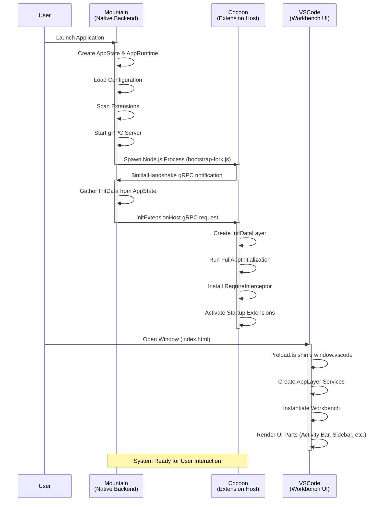

### **Workflow Example #1: Application Startup & Handshake** 🚀

**Goal:** To successfully launch the entire Land application, from the native
[`Mountain`](https://github.com/CodeEditorLand/Mountain/tree/Current) backend to
the [`Wind`](https://github.com/CodeEditorLand/Wind/tree/Current) UI and the
[`Cocoon`](https://github.com/CodeEditorLand/Cocoon/tree/Current) extension
host. This workflow details the critical startup sequence, the IPC handshake,
and the initialization of all core services, setting the stage for all other
user interactions.

This is the foundational workflow that enables all others.

---

#### **Phase 1: Native Application Startup ([`Mountain`](https://github.com/CodeEditorLand/Mountain/tree/Current))**

1.  **Application Launch
    ([`Mountain/src/main.rs`](https://github.com/CodeEditorLand/Mountain/tree/Current/src/main.rs#L1))**
    - **Action:** The user launches the Land application. The `main` function in
      `Mountain`'s `main.rs` is executed.
    - Tauri's `Builder` is created, and the `.setup()` hook is configured.
    - Inside the `.setup()` hook:
        - The central `AppState` is created and managed by Tauri.
        - The `MountainEnvironment` (which implements all the `Common` traits)
          is created.
        - The `AppRuntime` (the "engine" for running effects) is created,
          wrapping the environment.
        - A `tokio` background task is spawned to handle post-setup
          initializations.

2.  **Post-Setup Initialization (`Mountain` background task)**
    - **Action:** The background task begins its work.
    - It calls
      [`handlers::config::InitializeConfiguration`](https://github.com/CodeEditorLand/Land/tree/Current/Mountain/Source/handlers/config.rs#L1)
      to load all `settings.json` files from disk into `AppState`.
    - It calls
      [`handlers::extension_management::ScanExtensionsAndPopulateState`](https://github.com/CodeEditorLand/Land/tree/Current/Mountain/Source/handlers/extension_management.rs#L1)
      to find all extensions and load their manifests into `AppState`.
    - It calls
      **[`vine::server::Initialize`](https://github.com/CodeEditorLand/Land/tree/Current/Mountain/Source/vine/server.rs#L1)**,
      which starts the **gRPC server** to listen for connections from `Cocoon`.
    - It then calls
      **[`handlers::process_management::InitializeCocoon`](https://github.com/CodeEditorLand/Land/tree/Current/Mountain/Source/handlers/process_management.rs#L1)**.

3.  **Spawning the Sidecar
    ([`handlers/process_management/CocoonManagement.rs`](https://github.com/CodeEditorLand/Land/tree/Current/Mountain/Source/handlers/process_management/CocoonManagement.rs#L1))**
    - **Action:**
      [`LaunchAndManageCocoonSidecar`](https://github.com/CodeEditorLand/Land/tree/Current/Mountain/Source/handlers/process_management/CocoonManagement.rs#L1)
      is executed.
    - It constructs a detailed environment for the sidecar, including
      `VSCODE_PARENT_PID` to enable automatic shutdown.
    - It spawns the Node.js process:
      [`node ./scripts/cocoon/bootstrap-fork.js`](https://github.com/CodeEditorLand/Land/tree/Current/scripts/cocoon/bootstrap-fork.js#L1).
      **`Cocoon` is now running.**

#### **Phase 2: Sidecar Handshake and UI Launch ([`Cocoon`](https://github.com/CodeEditorLand/Cocoon/tree/Current) & [`Wind`](https://github.com/CodeEditorLand/Wind/tree/Current))**

4.  **`Cocoon` Initialization
    ([`Cocoon/src/Index.ts`](https://github.com/CodeEditorLand/Cocoon/tree/Current/src/Index.ts#L1))**
    - **Action:** The `Cocoon` process starts.
    - The
      [`RunProcessPatches`](https://github.com/CodeEditorLand/Cocoon/tree/Current/src/Index.ts#L1)
      effect executes, setting up `console.log` piping and other critical
      process patches.
    - The
      [`IpcProvider`](https://github.com/CodeEditorLand/Cocoon/tree/Current/src/Index.ts#L1)
      starts `Cocoon`'s gRPC client.
    - Upon successful connection, it sends the **`$initialHandshake` gRPC
      notification to `Mountain`** to signal that it is ready to receive
      initialization data.
    - It then registers an RPC handler for the `initExtensionHost` method and
      waits.

5.  **`Mountain` Responds to Handshake**
    ([`handlers/process_management/CocoonManagement.rs`](https://github.com/CodeEditorLand/Land/tree/Current/Mountain/Source/handlers/process_management/CocoonManagement.rs#L1))\*\*
    - **Action:** `Mountain`'s gRPC server receives the `$initialHandshake`.
    - This signals `Mountain` to proceed. It calls
      [`InitData::ConstructExtensionHostInitData`](https://github.com/CodeEditorLand/Land/tree/Current/Mountain/Source/handlers/process_management/CocoonManagement.rs#L1),
      gathering all necessary data from `AppState` (workspace info, extension
      lists, configuration, etc.).
    - It sends the **`initExtensionHost` gRPC request back to `Cocoon`**,
      containing this massive initialization payload.

6.  **`Cocoon` Final Initialization
    ([`Cocoon/src/Index.ts`](https://github.com/CodeEditorLand/Cocoon/tree/Current/src/Index.ts#L1))**
    - **Action:** The
      [`initExtensionHost`](https://github.com/CodeEditorLand/Cocoon/tree/Current/src/Index.ts#L1)
      handler in `Cocoon` fires.
    - It uses the received payload to create and provide the
      [`InitDataLayer`](https://github.com/CodeEditorLand/Cocoon/tree/Current/src/Index.ts#L1).
    - **It runs the
      [`FullAppInitialization`](https://github.com/CodeEditorLand/Cocoon/tree/Current/src/Index.ts#L1)
      effect.**
    - Inside this effect, the
      [`RequireInterceptor`](https://github.com/CodeEditorLand/Cocoon/tree/Current/src/Index.ts#L1)
      is installed, patching `require()`.
    - The
      [`ExtensionHostProvider`](https://github.com/CodeEditorLand/Cocoon/tree/Current/src/Index.ts#L1)
      is resolved, and it begins activating "startup" extensions (`*` activation
      event). At this point, workflows like **#3 (Language Features)** and **#6
      (Webviews)** can begin, as extensions register their providers.

7.  **Simultaneously, the UI Loads
    ([`Wind/Source/Preload.ts`](https://github.com/CodeEditorLand/Wind/tree/Current/Source/Preload.ts#L1))**
    - **Action:** The main Tauri window opens, loading
      [`index.html`](https://github.com/CodeEditorLand/Wind/tree/Current/index.html#L1).
    - The
      [`Preload.ts`](https://github.com/CodeEditorLand/Wind/tree/Current/Source/Preload.ts#L1)
      script executes first, shimming the `window.vscode` global with
      Tauri-backed implementations for `ipcRenderer` and `process`. This is the
      critical bridge that allows the VS Code workbench code to run.

#### **Phase 3: Launching the Workbench ([`Wind`](https://github.com/CodeEditorLand/Wind/tree/Current))**

8.  **UI Application Entry Point
    ([`Wind/Source/Application/DesktopMain.ts`](https://github.com/CodeEditorLand/Wind/tree/Current/Source/Application/DesktopMain.ts#L1))**
    - **Action:** The main UI script runs.
    - It waits for the DOM to be ready.
    - It creates the master
      **[`AppLayer`](https://github.com/CodeEditorLand/Wind/tree/Current/Source/Application/DesktopMain.ts#L1)**,
      which composes all `Wind` services (e.g.,
      [`LiveClipboardService`](https://github.com/CodeEditorLand/Wind/tree/Current/Source/Application/DesktopMain.ts#L1),
      [`LiveDialogService`](https://github.com/CodeEditorLand/Wind/tree/Current/Source/Application/DesktopMain.ts#L1),
      [`LiveEditorService`](https://github.com/CodeEditorLand/Wind/tree/Current/Source/Application/DesktopMain.ts#L1)).
    - It converts this `Layer` into a `Runtime` and resolves the core services.
    - It instantiates the VS Code
      [`Workbench`](https://github.com/CodeEditorLand/Grove/tree/Current/vs/workbench/browser/workbench.ts#L1)
      class: **`new Workbench(...)`**.

9.  **VS Code Workbench Startup
    ([`vs/workbench/browser/workbench.ts`](https://github.com/CodeEditorLand/Grove/tree/Current/vs/workbench/browser/workbench.ts#L1))**
    - **Action:** The `Workbench.startup()` method is called.
    - This kicks off the entire UI rendering lifecycle. It creates all the core
      UI parts: the Activity Bar, Status Bar, Side Bar, Editor Part, etc.
    - As these parts are created, they begin to interact with the `Wind`
      services. For example, the File Explorer will use the `IFileService` to
      list directory contents, which triggers **Workflow #2 (Opening a File)**.
      The Command Palette uses the `ICommandService`, triggering **Workflow #5
      (Executing a Command)**.
    - **The application is now fully initialized and ready for user
      interaction.**
