### **Workflow Example #5: Executing a Command from the Command Palette** ⌨️

**Goal:** The user opens the Command Palette (`Ctrl+Shift+P`), types the name of
a command (e.g., "Format Document"), and selects it. The corresponding action is
executed. This workflow covers both a native command and an extension-provided
command.

```mermaid
flowchart LR
    subgraph OpenPalette["Phase 1: Opening Command Palette"]
        UserKeybind(["User presses<br/>Ctrl+Shift+P"]) --> Dispatch["Dispatch<br/>workbench.action.showCommands"]
        Dispatch --> InvokeQuickInput["QuickInputService.quickAccess.show()"]
        InvokeQuickInput --> CommandsProvider["CommandsQuickAccessProvider"]
    end

    subgraph FetchCommands["Phase 2: Fetching Command List"]
        CommandsProvider --> GetAllCommands["TauriInvoke<br/>mountain://command/get-all"]
        GetAllCommands --> Track1["Track Dispatcher"]
        Track1 --> Effect1["Common::command::GetAllCommands<br/>Effect"]
        Effect1 --> CommandProviderGetAll
    end

    subgraph GetAll["GetAllCommands Execution"]
        CommandProviderGetAll["Mountain<br/>CommandProvider.GetAllCommands()"] --> LockRegistry["Acquire lock on<br/>CommandRegistry"]
        LockRegistry --> GetKeys["Get command ID keys<br/>from HashMap"]
        GetKeys --> ReturnIds["Return command ID list"]
    end

    ReturnIds --> DisplayList

    subgraph DisplaySelect["Phase 3: Displaying & Selecting"]
        DisplayList["Populate Quick Pick UI<br/>with command list"] --> UserSelect(["User types & selects<br/>command"])
        UserSelect --> ExecuteService["ICommandService.executeCommand()"]
    end

    ExecuteService --> NativeCheck{Native or<br/>Extension?}

    subgraph NativeFlow["Phase 4A: Native Command Execution"]
        NativeCheck -->|Native| NativeInvoke["TauriInvoke<br/>mountain://command/execute"]
        NativeInvoke --> Track2["Track Dispatcher"]
        Track2 --> Effect2["Common::command::ExecuteCommand<br/>Effect"]
        Effect2 --> LookupNative["Lookup command in<br/>CommandRegistry"]
        LookupNative --> NativeHandler["Invoke native Rust<br/>function pointer"]
        NativeHandler --> NativeResult["Execute command logic"]
        NativeResult --> ReturnNative["Return result"]
    end

    subgraph ExtensionFlow["Phase 4B: Extension Command Execution"]
        NativeCheck -->|Extension| ExtensionCmd["TauriInvoke<br/>mountain://command/execute"]
        ExtensionCmd --> Track3["Track Dispatcher"]
        Track3 --> Effect3["Common::command::ExecuteCommand<br/>Effect"]
        Effect3 --> LookupExt["Lookup Proxied handler<br/>in CommandRegistry"]
        LookupExt --> ProxyRequest["IpcProvider makes<br/>$executeContributedCommand<br/>gRPC request"]
        ProxyRequest --> CocoonRPC["Cocoon gRPC Server"]
        CocoonRPC --> LookupProvider["Lookup command in<br/>Cocoon registry"]
        LookupProvider --> ExecuteExt["Execute extension's<br/>JavaScript function"]
        ExecuteExt --> ReturnExt["Return result to Mountain"]
        ReturnExt --> ForwardToWind["Forward result to Wind"]
    end
```

---

#### **Phase 1: Opening the Command Palette (`Wind/Sky`)**

1.  **User Input**
    - **Action:** The user presses `Ctrl+Shift+P`.
    - The keybinding system dispatches the `workbench.action.showCommands`
      command.

2.  **`QuickInputService` (`Wind/Source/Application/QuickInput/Definition.ts`)**
    - **Action:** The handler for `showCommands` invokes the
      `quickInputService.quickAccess.show()`.
    - This opens the Quick Pick UI, configured for showing commands.

3.  **`CommandsQuickAccessProvider`
    (`vs/workbench/contrib/quickaccess/browser/commandsQuickAccess.ts`)**
    - **Action:** This provider is responsible for populating the Quick Pick
      list.
    - To get the list of all available commands, it needs to call
      `ICommandService.getCommands()`. However, since this is in `Wind` and the
      registry is in `Mountain`, it makes an `Integration` layer call.
    - It executes an Effect that wraps
      `TauriInvoke('mountain://command/get-all')`.

#### **Phase 2: Fetching the Command List (`Mountain`)**

4. **[`track.rs`](https://github.com/CodeEditorLand/Mountain/tree/Current/Source/Track/TrackLogic.rs)
   &
   [`CommandProvider.rs`](https://github.com/CodeEditorLand/Mountain/tree/Current/Source/Environment/CommandProvider.rs)
   (`Mountain`)**

- **Action:** The Tauri command is dispatched to `track`, which creates the
  `Common::command::GetAllCommands` effect.
    - The `AppRuntime` executes the effect.
    - The `MountainEnvironment`'s implementation of
      `CommandExecutor::GetAllCommands` is called. It delegates to the handler.

5. **[`CommandProvider.GetAllCommands()`](https://github.com/CodeEditorLand/Mountain/tree/Current/Source/Environment/CommandProvider.rs#L322)**

- **Action:** The `GetAllCommands` method is executed.
    - It acquires a lock on `AppState.CommandRegistry`.
    - It retrieves the `keys()` of the `HashMap`, which contains the IDs of all
      registered native commands AND all proxied commands from `Cocoon`.
    - It returns this list of command ID strings.

#### **Phase 3: Displaying and Selecting a Command (`Wind/Sky`)**

6.  **`CommandsQuickAccessProvider` (continued)**
    - **Action:** The `TauriInvoke` promise resolves with the list of command
      IDs.
    - The provider populates the Quick Pick UI with the command list, making it
      visible to the user.

7.  **User Selection**
    - **Action:** The user types "Format Document" and presses Enter.
    - The Quick Pick widget registers that the command
      `editor.action.formatDocument` has been selected.
    - It then calls
      `ICommandService.executeCommand('editor.action.formatDocument')`.

#### **Phase 4A: Executing a NATIVE Command (`Wind` -> `Mountain`)**

8.  **`CommandService` (`Wind`)**
    - **Action:** The `executeCommand` call is made. Since the `CommandService`
      in `Wind` is a thin client, it immediately forwards the request to the
      backend.
    - It creates and runs an Effect that wraps
      `TauriInvoke('mountain://command/execute', { commandId: 'editor.action.formatDocument', args: [...] })`.

9.  **`track.rs` & `environment/CommandsProvider.rs` (`Mountain`)**
    - **Action:** The request is dispatched to `track`, creating the
      `Common::command::ExecuteCommand` effect.
    - The `AppRuntime` executes it.
    - The `MountainEnvironment`'s `CommandExecutor::ExecuteCommand` is called.

10. **[`CommandProvider.ExecuteCommand()`](https://github.com/CodeEditorLand/Mountain/tree/Current/Source/Environment/CommandProvider.rs#L231)
    (`Mountain`)**

- **Action:** The `ExecuteCommand` method is executed.
    - It acquires a lock on `AppState.CommandRegistry` and looks up
      `'editor.action.formatDocument'`.
    - It finds that the handler is of the type `CommandHandler::Native`.
    - **It invokes the corresponding native Rust function pointer**, passing it
      the `AppHandle`, `Window`, `AppRuntime`, and arguments.

11. **Native Formatting Handler**
    - **Action:** The native Rust code for formatting a document runs. This
      might involve:
        - Getting the active document's content from `AppState`.
        - Finding a registered formatting provider in `AppState` (which may
          itself be proxied to `Cocoon`).
        - Requesting edits from the provider.
        - Applying the edits via the `WorkspaceEditApplier`.
    - The command completes, and its result (if any) is returned up the call
      chain.

#### **Phase 4B: Executing an EXTENSION Command (`Wind` -> `Mountain` -> `Cocoon`)**

_(Steps 8 and 9 are the same)_

10. **`handlers/commands/CommandsLogic.rs` (`Mountain`)**
    - **Action:** `ExecuteCommandLogic` looks up `'my-extension.doSomething'`.
    - It finds that the handler is of the type
      `CommandHandler::Proxied { SidecarIdentifier: "cocoon-main", CommandIdentifier: "my-extension.doSomething" }`.

11. **`IpcProvider` (`Mountain`)**
    - **Action:** The handler knows it must proxy the request. It uses the
      `IpcProvider` capability from the `MountainEnvironment`.
    - It makes a **`$executeContributedCommand` gRPC request to `Cocoon`**,
      sending the command ID and its arguments.

12. **`IpcProvider` & Command Handler (`Cocoon`)**
    - **Action:** `Cocoon`'s gRPC server receives the request and dispatches it
      to the `CommandsProvider`.
    - The `CommandsProvider` looks up `'my-extension.doSomething'` in its _own_
      local registry.
    - **It finds the JavaScript function provided by the extension and executes
      it.**

13. **Result Propagation**
    - **Action:** The extension's command finishes and returns a result (e.g., a
      string or number).
    - This result is serialized and sent back to `Mountain` as the response to
      the gRPC request.
    - `Mountain` receives the gRPC response and forwards it back to `Wind` as
      the result of the `TauriInvoke` promise.
    - The command execution is complete.
