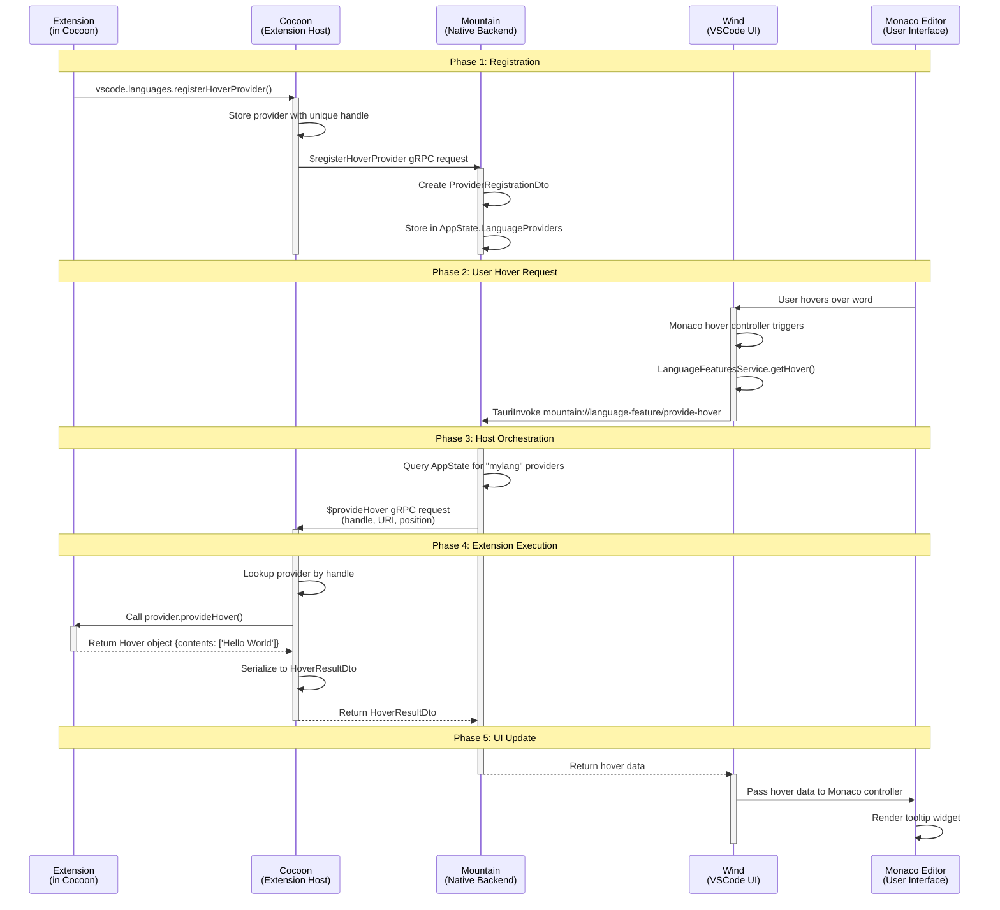

### **Workflow Example #3: Invoking a Language Feature (Hover Provider)** 💡

**Goal:** An extension has registered a "Hover Provider." When the user hovers
their mouse over a specific word in the editor, the extension's logic is
executed, and the resulting tooltip is displayed in the UI.

---

#### **Phase 1: Extension Registration (`Cocoon`)**

1.  **Extension Activation (`Cocoon/src/Core/ExtensionHost.ts`)**
    - **Action:** An extension (e.g., `my-lang-extension`) is activated by
      `Cocoon`.
    - Its `activate()` function is called.

2.  **`vscode.languages.registerHoverProvider()`
    (`Cocoon/src/Service/LanguageFeatures.ts`)**
    - **Action:** The extension's code calls
      `vscode.languages.registerHoverProvider('mylang', provider)`.
    - The `LanguageFeaturesProvider` in `Cocoon` receives this call.
    - It stores the `provider` object (which contains the `provideHover` method)
      in a local map, associated with a new unique handle (e.g., `handle: 123`).
    - It serializes the metadata about this provider (the language selector
      `'mylang'`, the extension ID, etc.) into a DTO.
    - It sends a **`$registerHoverProvider` gRPC request** to `Mountain`,
      including the handle (`123`) and the metadata.

#### **Phase 2: Host-Side Provider Registration (`Mountain`)**

3.  **gRPC Server (`Mountain/Source/Vine/server/MountainVineGrpcService.rs`)**
    - **Action:** The gRPC server receives the `$registerHoverProvider` request.
    - It passes the request to the `track` dispatcher.

4.  **Dispatcher
    ([`Mountain/Source/Track/TrackLogic.rs`](https://github.com/CodeEditorLand/Mountain/tree/Current/Source/Track/TrackLogic.rs))**

- **Action:** `DispatchSidecarRequest` is called.
    - It maps the method name (`$registerHoverProvider`) to an `ActionEffect`
      via `EffectCreation`. The effect is `LanguageFeature::RegisterProvider`.

5. **[`LanguageFeatureProvider.RegisterProvider()`](https://github.com/CodeEditorLand/Mountain/tree/Current/Source/Environment/LanguageFeatureProvider/mod.rs#L49)
   (`Mountain`)**

- **Action:** The `AppRuntime` executes the `RegisterProvider` effect.
- The `MountainEnvironment`'s implementation of the
  `LanguageFeatureProviderRegistry` trait is called.
- It delegates to the
  [`Registration`](https://github.com/CodeEditorLand/Mountain/tree/Current/Source/Environment/LanguageFeatureProvider/Registration.rs)
  helper module.

6. **[`Registration.register_provider()`](https://github.com/CodeEditorLand/Mountain/tree/Current/Source/Environment/LanguageFeatureProvider/Registration.rs)
   (`Mountain`)**

- **Action:** The `register_provider` helper function creates a
  `ProviderRegistrationDTO` and stores it in `AppState.LanguageProviders`.
    - It creates a `ProviderRegistrationDto` containing the handle (`123`), the
      provider type (`Hover`), the language selector, and the ID of the sidecar
      that owns it (`cocoon-main`).
    - **It stores this registration DTO in `AppState.LanguageProviders`.**
      `Mountain` now knows that for the language "mylang", `cocoon-main` has a
      hover provider with handle `123`.

#### **Phase 3: User Interaction and UI Request (`Wind/Sky`)**

7.  **Monaco Editor UI**
    - **Action:** The user moves their mouse over a word in an editor showing a
      "mylang" file.
    - Monaco's internal hover controller is triggered. It needs to fetch hover
      information for the current position.
    - This logic ultimately calls the `ILanguageFeaturesService`'s `getHover`
      method.

8.  **`LanguageFeaturesService.getHover()` (`Wind`)**
    - **Action:** This UI-side service is responsible for orchestrating the
      hover request.
    - It creates an `Effect` that describes the operation.
    - This effect will call the `IEditorService` to get the current editor model
      and position.
    - It then makes an `Integration` layer call to `TauriInvoke` with a command
      like `mountain://language-feature/provide-hover`.

#### **Phase 4: Host-Side Orchestration (`Mountain` -> `Cocoon` -> `Mountain`)**

9.  **`Mountain/Source/handlers/protocol/ProtocolLogic.rs`**
    - **Action:** The `HandleCustomUriSchemeRequest` function receives the
      `mountain://language-feature/provide-hover` request.
    - It dispatches this to the `track` module.
    - The `track` module creates the `LanguageFeature::ProvideHover` effect.

10. **[`LanguageFeatureProvider.ProvideHover()`](https://github.com/CodeEditorLand/Mountain/tree/Current/Source/Environment/LanguageFeatureProvider/FeatureMethods.rs)
    (`Mountain`)**

- **Action:** The `AppRuntime` executes the `ProvideHover` effect.
- The environment's implementation delegates to the FeatureMethods helper
  module.
    - Inside this method:
        - It queries `AppState.LanguageProviders` to find all registered hover
          providers for the "mylang" language. It finds our registration with
          handle `123` belonging to `cocoon-main`.
        - It now knows it needs to ask `cocoon-main` to do the work.
        - It makes a **`$provideHover` gRPC request to `Cocoon`**, passing along
          the document URI, position, and the original provider handle (`123`).

#### **Phase 5: Extension Execution and Response (`Cocoon`)**

11. **gRPC Server (`Cocoon/src/Service/Ipc/Server.ts`)**
    - **Action:** `Cocoon`'s gRPC server receives the `$provideHover` request.
    - It passes the request to its `RpcDispatcher`.

12. **`TreeViewProvider` in `Cocoon` (or a more general Features RPC handler)**
    - **Action:** The dispatcher finds the handler for `$provideHover`.
    - This handler looks up the provider object associated with handle `123` in
      its local map.
    - It finds the `provider` object that the extension originally registered.
    - **It calls `provider.provideHover(document, position, token)`. The
      extension's code is now executing.**
    - The extension's code returns a `Hover` object (e.g.,
      `{ contents: ['Hello World'] }`).
    - The handler receives this `Hover` object. It uses the `TypeConverter` to
      serialize it into a `HoverResultDto`.
    - **It sends the `HoverResultDto` back to `Mountain` as the response to the
      gRPC request.**

#### **Phase 6: Final UI Update (`Mountain` -> `Wind/Sky`)**

13. **`LanguageFeaturesProvider` (`Mountain` continued)**
    - **Action:** The `gRPC` call to `Cocoon` resolves with the
      `HoverResultDto`.
    - The `ProvideHover` `ActionEffect` in `Mountain` succeeds, yielding this
      DTO.
    - The result is serialized and sent back as the response to the original
      Tauri `invoke` from step #8.

14. **`LanguageFeaturesService` (`Wind` continued)**
    - **Action:** The `TauriInvoke` promise resolves with the hover data.
    - The `getHover` effect succeeds.
    - The service passes the `Hover` data to Monaco's hover controller.

15. **Monaco Editor UI**
    - **Action:** The hover controller receives the content and renders the
      tooltip widget on the screen.
    - **The user now sees the "Hello World" tooltip.**
