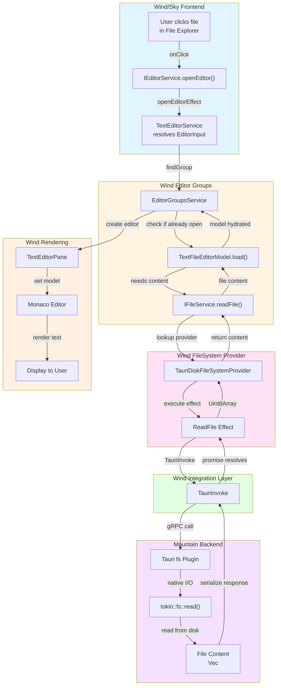

### **Workflow Example #2: Opening a File from the UI**

**Goal:** The user clicks on a file in the File Explorer
([`Wind/Sky`](https://github.com/CodeEditorLand/Wind/tree/Current) UI), and the
file's content is loaded into an editor.

This workflow demonstrates the interplay between the UI, the editor services,
the filesystem provider, and the backend.

---

#### **Phase 1: User Interaction ([`Wind/Sky`](https://github.com/CodeEditorLand/Wind/tree/Current))**

1.  **File Explorer UI (React/Vue/etc.)**
    - **Action:** The user clicks on a `
` representing `my-file.ts` in the
      File Explorer component.
    - The `onClick` handler for this `div` is triggered.
    - This handler knows the `URI` of the file it represents.
    - It calls a function to open the file, which ultimately invokes the
      `IEditorService`.

2.  **`IEditorService.openEditor()`**
    ([`Wind/Source/Application/Editor/Definition.ts`](https://github.com/CodeEditorLand/Wind/tree/Current/Source/Application/Editor/Definition.ts#L1))\*\*
    - **Action:** The UI calls
      [`editorService.openEditor({ resource: fileUri })`](https://github.com/CodeEditorLand/Wind/tree/Current/Source/Application/Editor/Definition.ts#L1).
    - The
      [`openEditorEffect`](https://github.com/CodeEditorLand/Wind/tree/Current/Source/Application/Editor/Definition.ts#L1)
      inside our `Definition.ts` is executed.
    - The input is an
      [`IUntypedEditorInput`](https://github.com/CodeEditorLand/Wind/tree/Current/Source/Application/Editor/Definition.ts#L1).
      The effect first calls the
      [`TextEditorService`](https://github.com/CodeEditorLand/Wind/tree/Current/Source/Application/Editor/Definition.ts#L1)
      to resolve it into a concrete
      [`EditorInput`](https://github.com/CodeEditorLand/Wind/tree/Current/Source/Application/Editor/Definition.ts#L1)
      instance.
    - Next, it calls `findGroup` to determine which editor group should handle
      the opening (e.g., the currently active group).

#### **Phase 2: Editor and Filesystem Logic ([`Wind`](https://github.com/CodeEditorLand/Wind/tree/Current) -> [`Mountain`](https://github.com/CodeEditorLand/Mountain/tree/Current))**

3.  **`EditorGroupsService`**
    ([`Wind/Source/Application/EditorGroups/Definition.ts`](https://github.com/CodeEditorLand/Wind/tree/Current/Source/Application/EditorGroups/Definition.ts#L1))\*\*
    - **Action:** The `openEditor` method is called on the target
      `EditorGroupModel`.
    - The group model checks if an editor for this `fileUri` is already open. If
      so, it just focuses it.
    - If not, it begins the process of opening a new editor. It uses the
      `EditorInput`'s `resolve()` method to get the editor model.

4.  **`EditorInput.resolve()` ->
    [`TextFileEditorModel.load()`](https://github.com/CodeEditorLand/Wind/tree/Current/Source/Application/Editor/Definition.ts#L1)**
    - **Action:** To display the content, the editor input needs to load its
      underlying model. The `TextFileEditorModel` is responsible for this.
    - Its
      [`load()`](https://github.com/CodeEditorLand/Wind/tree/Current/Source/Application/Editor/Definition.ts#L1)
      method needs to get the file's content. It achieves this by calling the
      [`IFileService`](https://github.com/CodeEditorLand/Wind/tree/Current/Source/Application/File/Live.ts#L1).

5.  **`IFileService.readFile()`
    ([`Wind/Source/Application/File/Live.ts`](https://github.com/CodeEditorLand/Wind/tree/Current/Source/Application/File/Live.ts#L1))**
    - **Action:** The file service's `readFile(fileUri)` method is called.
    - It looks up the registered provider for the URI's scheme (in this case,
      `file:`).
    - It finds our
      [`TauriDiskFileSystemProvider`](https://github.com/CodeEditorLand/Wind/tree/Current/Source/Application/FileSystem/Definition.ts#L1)
      (from
      [`FileSystem/Definition.ts`](https://github.com/CodeEditorLand/Wind/tree/Current/Source/Application/FileSystem/Definition.ts#L1)).

6.  **`TauriDiskFileSystemProvider.readFile()`**
    ([`Wind/Source/Application/FileSystem/Definition.ts`](https://github.com/CodeEditorLand/Wind/tree/Current/Source/Application/FileSystem/Definition.ts#L1))\*\*
    - **Action:** The provider's
      [`readFile`](https://github.com/CodeEditorLand/Wind/tree/Current/Source/Application/FileSystem/Definition.ts#L1)
      method is called.
    - This method immediately executes the
      [`ReadFile`](https://github.com/CodeEditorLand/Wind/tree/Current/Source/Application/FileSystem/Definition.ts#L1)
      effect from our Tauri `Integration` layer:
      [`Effect.runPromise(ReadFile(fileUri))`](https://github.com/CodeEditorLand/Wind/tree/Current/Source/Application/FileSystem/Definition.ts#L1).

7.  **`Integration/Tauri/Wrap/ReadFile.ts`**
    - **Action:** The
      [`ReadFile`](https://github.com/CodeEditorLand/Wind/tree/Current/Integration/Tauri/Wrap/ReadFile.ts#L1)
      effect executes.
    - It calls
      [`TauriInvoke('plugin:fs|read_file', { path: fileUri.fsPath })`](https://github.com/CodeEditorLand/Wind/tree/Current/Integration/Tauri/Wrap/ReadFile.ts#L1).
      This sends the request from the webview to the `Mountain` backend.

#### **Phase 3: Native File I/O and Response ([`Mountain`](https://github.com/CodeEditorLand/Mountain/tree/Current))**

8.  **[`Mountain/src/main.rs`](https://github.com/CodeEditorLand/Mountain/tree/Current/src/main.rs#L1)
    -> Tauri `fs` Plugin**
    - **Action:** Tauri receives the
      [`plugin:fs|read_file`](https://github.com/CodeEditorLand/Wind/tree/Current/Integration/Tauri/Wrap/ReadFile.ts#L1)
      command.
    - It routes this to the `tauri-plugin-fs`'s internal Rust handler.
    - The plugin performs the native filesystem operation:
      `tokio::fs::read(path)`.
    - The file content (as `Vec<u8>`) is read from disk.
    - The result is serialized and sent back to the `Wind` webview as the
      resolution of the `TauriInvoke` promise.

#### **Phase 4: Data Unwinds and UI Renders ([`Wind`](https://github.com/CodeEditorLand/Wind/tree/Current))**

9.  **`Integration/Tauri/Wrap/ReadFile.ts` (continued)**
    - **Action:** The `TauriInvoke` promise resolves with the file content.
    - The `ReadFile` Effect succeeds, yielding the `Uint8Array`.

10. **`TextFileEditorModel` (continued)**
    - **Action:** The `load()` method succeeds. The model is now hydrated with
      the file content.
    - The `EditorInput` is now fully resolved.

11. **`EditorGroupsService` (continued)**
    - **Action:** The `openEditor` method now has a resolved input and model.
    - It creates a new
      [`TextEditorPane`](https://github.com/CodeEditorLand/Wind/tree/Current/Source/Application/EditorGroups/Definition.ts#L1)
      (or similar UI component) within the editor group.
    - It sets the `TextFileEditorModel` on the underlying Monaco editor instance
      within that pane.

12. **Monaco Editor**
    - **Action:** Monaco receives the new text model.
    - It renders the text content to the screen.
    - **The user now sees their file open in the editor.**

This workflow clearly shows how a simple UI action is translated through layers
of abstraction (`EditorService` -> `FileService` -> `FileSystemProvider` ->
`Tauri Integration`) until it becomes a native OS call, with the result flowing
back up the same chain to update the UI.
