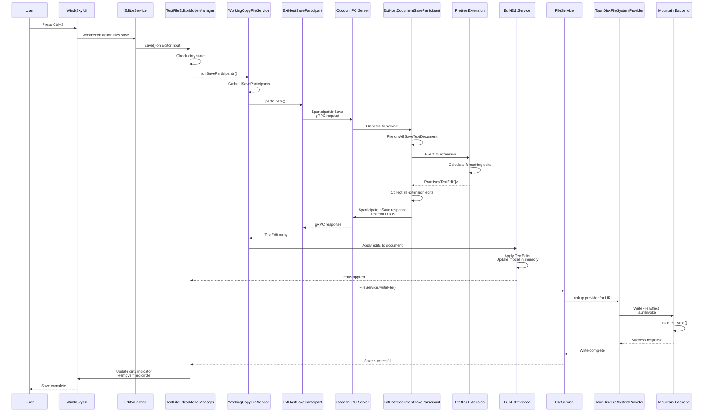

### **Workflow Example #4: Saving a File with Save Participants**&#x2001;💾

**Goal:** A user presses `Ctrl+S`. An extension (e.g., a "Prettier" formatter)
has registered a "Save Participant" to format the document before the save is
written to disk. The file is formatted, then saved.

---

#### **Phase 1: User Action and Initial Save Trigger (`Wind/Sky`)**

1.  **User Input**
    - **Action:** The user presses `Ctrl+S` in an editor that has unsaved
      changes (is "dirty").
    - The keybinding system dispatches the `workbench.action.files.save`
      command.

2.  **`IEditorService.save()`
    ([`Element/Wind/Source/Workbench/`](https://github.com/CodeEditorLand/Wind/tree/Current/Source/Workbench/))**
    - **Action:** The `save` method on our `EditorService` is called.
    - It identifies the active editor and its corresponding `EditorInput`.
    - It calls the `save` method on the `EditorInput` instance.

3.  **`TextFileEditorModelManager.save()`
    (`vs/workbench/services/textfile/common/textFileEditorModelManager.ts`)**
    - **Action:** The `EditorInput` delegates the save operation to its
      underlying model, which is managed by the `TextFileEditorModelManager`.
    - **Crucial Step:** Before writing to disk, this manager **does not**
      immediately call the file service. Instead, it enters the "Save
      Participants" phase.
    - It emits a `willSave` event and waits for all registered "Save
      Participants" to complete their work. This is orchestrated by the
      `IWorkingCopyFileService`.

#### **Phase 2: Orchestration via Save Participants (`Wind` -> `Cocoon` -> `Wind`)**

4.  **`WorkingCopyFileService.runSaveParticipants()`
    (`vs/workbench/services/workingcopy/common/workingCopyFileService.ts`)**
    - **Action:** This service is the central orchestrator for the save process.
    - It gathers all registered `ISaveParticipant`s. One of these participants
      is the **`ExtHostSaveParticipant`**, which is responsible for
      communicating with extensions in `Cocoon`.
    - It calls the `participate()` method on the `ExtHostSaveParticipant`.

5.  **`ExtHostSaveParticipant.participate()` (`Cocoon`'s RPC Bridge)**
    - **Action:** This object, running in `Wind`, acts as the bridge. Its
      `participate` method makes a **`$participateInSave` gRPC request** to
      `Cocoon`.
    - It sends the URI of the document being saved and the reason for the save
      (e.g., `explicit`).
    - It then `await`s the response from `Cocoon`.

#### **Phase 3: Extension Execution (`Cocoon`)**

6.  **`IpcProvider` (`Cocoon/src/Service/Ipc/Server.ts`)**
    - **Action:** `Cocoon`'s gRPC server receives the `$participateInSave`
      request.
    - It dispatches this request to the `ExtHostDocumentSaveParticipant` service
      (a new service we would synthesize).

7.  **`ExtHostDocumentSaveParticipant` (`Cocoon`)**
    - **Action:** This service manages the `onWillSaveTextDocument` event
      emitter.
    - It receives the `$participateInSave` call.
    - It creates a `WillSaveTextDocumentEvent` object, which includes the
      document and the reason.
    - **It fires the `onWillSaveTextDocument` event**, delivering it to all
      subscribed extensions.

8.  **"Prettier" Extension (`Cocoon`)**
    - **Action:** The Prettier extension's listener for `onWillSaveTextDocument`
      is executed.
    - The extension calculates the necessary formatting edits for the entire
      document.
    - It returns a `Promise` that resolves to an array of `TextEdit` objects.

9.  **`ExtHostDocumentSaveParticipant` (continued)**
    - **Action:** The service collects all the `Promise<TextEdit[]>` results
      from all participating extensions.
    - It waits for all promises to resolve.
    - It then serializes the collected `TextEdit` objects into DTOs using the
      `TypeConverter`.
    - **It sends the array of `TextEdit` DTOs back to `Wind` as the response to
      the `$participateInSave` gRPC request.**

#### **Phase 4: Applying Edits and Final Save (`Wind` -> `Mountain` -> Disk)**

10. **`ExtHostSaveParticipant.participate()` (`Wind`, continued)**
    - **Action:** The `gRPC` call resolves, returning the text edits from the
      extensions.
    - The `WorkingCopyFileService` receives these edits.

11. **`BulkEditService` (`Wind/Source/Application/BulkEdit/Live.ts`)**
    - **Action:** The `WorkingCopyFileService` does not apply the edits itself.
      It passes them to the `IBulkEditService`.
    - The `BulkEditService` takes the array of `TextEdit`s and applies them to
      the document model in memory. The editor content now reflects the
      formatted code.

12. **`TextFileEditorModelManager.save()` (`Wind`, continued)**
    - **Action:** Now that all participants have run and their edits have been
      applied, the `save` operation proceeds.
    - It calls the `IFileService.writeFile()`.

13. **`IFileService` -> `TauriDiskFileSystemProvider` -> `Integration` ->
    `Mountain`**
    - **Action:** The save operation now follows the exact same path as
      **Workflow #2 (Opening a File)**, but in reverse.
        - `IFileService` calls the `TauriDiskFileSystemProvider`.
        - The provider executes the `WriteFile` Effect from the `Integration`
          layer.
        - The effect makes a `TauriInvoke` call to the `Mountain` backend.
        - The `FsWriter` implementation in `Mountain` receives the call.

14. **[`FileSystem`](https://github.com/CodeEditorLand/Mountain/tree/Current/Source/FileSystem/)
    Providers (`Mountain`)**

- **Action:** The file write operation is executed through the FileSystem
  provider.
    - It performs the final native OS call:
      **`tokio::fs::write(path, content)`**.
    - The formatted document is now saved to disk.
    - The success result flows all the way back up the chain.

15. **Final State Update (`Wind`)**
    - **Action:** The `TextFileEditorModel` is no longer "dirty."
    - The UI updates to remove the dirty indicator (the filled circle) from the
      editor tab.
    - **The save operation is complete.**

---

#### **applyEdit round-trip**

`workspace.applyEdit(edit)` is a full awaitable round-trip via
`Call(Context, "applyEdit", [edit])` (Mountain `sendRequest`, not a
fire-and-forget notification). The extension's `await workspace.applyEdit(...)`
resolves only after Sky's `sky://workspace/applyEdit` handler finishes applying
the edit to the Monaco model and returns a success boolean. Mountain treats a
`null` response from Sky as `true` (matching VS Code's own `MainThreadBulkEdits`
behaviour).

The `WorkspaceEdit` payload is normalised inside the Sky bridge to handle
multiple wire shapes:

- `_edits` array with `_type: 2` entries (extHostTypes text edit) - `_range`
  uses `_start._line` / `_end._line` (0-based, converted to Monaco 1-based)
- `_edits` array with `_type: 1` entries (file operations: create, rename,
  delete)
- Serialised `vscode.Uri` objects (`_scheme` / `_path` fields)

`IBulkEditService` is tried first; if unavailable, the bridge falls back to
direct Monaco model operations.

#### **saveAll correction**

`workspace.saveAll()` previously called `Document.Save` with no arguments
(always an error). It now correctly calls `Workspace.SaveAll`, which routes to
`sky://workspace/saveAll` and dispatches `workbench.action.files.saveAll` in the
renderer.

`workspace.save(uri)` routes to `sky://workspace/save` (saves the specific
document via `ITextFileService.save` or the workbench save command as a
fallback). `workspace.saveAs(uri)` routes to `sky://workspace/saveAs` (opens the
save-as dialog). Both are round-trip request channels that resolve the
extension's awaited promise.
