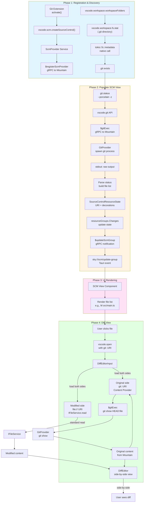

### **Workflow Example #8: Source Control Management (SCM)**

> **⚠️ Verification Status:** This workflow describes SCM provider registration
> and Git integration. Verify against
> [`Element/Cocoon/Source/Services/Extension.ts`](https://github.com/CodeEditorLand/Cocoon/tree/Current/Source/Services/Extension.ts)
> for extension activation and Mountain's Git provider implementation.

**Goal:** A user opens a project that is a Git repository. The SCM view in the
side bar populates with a list of changed files. The user can click a file to
see a diff view.

---

#### **Phase 1: Extension Registration and Repository Discovery**

1.  **Built-in Git Extension Activation (`Cocoon`)**
    - **Action:** On startup, `Cocoon` activates its built-in Git extension.
      This extension is responsible for providing all core Git functionality.
    - The extension's `activate()` function is called.

2.  **`vscode.scm.createSourceControl()` (`Cocoon`)**
    - **Action:** The Git extension calls
      `vscode.scm.createSourceControl('git', 'Git')` to register itself as the
      provider for the Git SCM.
    - This call is handled by a new **`ScmProvider`** service in `Cocoon`. This
      service manages the state of all registered SCM providers.
    - The `ScmProvider` sends a **`$registerScmProvider` gRPC request to
      `Mountain`**, informing it that a provider for 'git' now exists, managed
      by `Cocoon`.

3.  **Repository Detection (`Cocoon` -> `Mountain` -> `Cocoon`)**
    - **Action:** The Git extension needs to find out if the open workspace is a
      Git repository.
    - It uses the `vscode.workspace.workspaceFolders` API to get the root path.
    - It then needs to check for a `.git` directory. Since it cannot use
      `require('fs')`, it uses the `vscode.workspace.fs` API:
      `vscode.workspace.fs.stat(Uri.joinPath(root, '.git'))`.
    - This `stat` call travels through `Cocoon`'s `FileSystemProvider`, over
      gRPC to `Mountain`, which performs the native `tokio::fs::metadata` call
      and returns the result, confirming the directory exists.

#### **Phase 2: Populating the SCM View with Changes**

4.  **Running `git status` (`Cocoon` -> `Mountain`)**
    - **Action:** Now that the Git extension knows it's in a Git repository, it
      needs to get the status of the files.
    - It cannot spawn a `git` process directly. Instead, it relies on a custom
      `vscode.git` API (which would be provided by `Mountain`). This API exposes
      a function like `git.exec(repoPath, ['status', '--porcelain', '-z'])`.
    - This API call is translated into a **`$gitExec` gRPC request to
      `Mountain`**, sending the repository path and command arguments.

5.  **Native Git Execution (`Mountain`)**
    - **Action:** `Mountain`'s gRPC server receives the `$gitExec` request. It
      dispatches it to a new **`GitProvider`** implementation on the
      `MountainEnvironment`.
    - The `GitProvider`'s handler logic safely spawns a native `git` child
      process (`std::process::Command`) with the provided arguments in the
      specified directory.
    - It captures the `stdout` of the `git status` command.
    - **It sends the raw output string back to `Cocoon`** as the successful
      response to the gRPC request.

6.  **Parsing Status and Updating State (`Cocoon`)**
    - **Action:** The Git extension in `Cocoon` receives the raw output from
      `git status`.
    - It parses this output to build a list of changed files (e.g., "M
      src/main.ts", "A new-file.txt").
    - For each changed file, it creates a `SourceControlResourceState` object.
      This object includes the file's `URI` and `decorations` (like the "M" for
      modified).
    - **It updates the `SourceControl` object's `resourceGroups`.** For example,
      it sets the `resourceStates` property of the "Changes" group to the array
      of new `SourceControlResourceState` objects it just created.

#### **Phase 3: Rendering the SCM View (`Cocoon` -> `Mountain` -> `Wind/Sky`)**

7.  **`SourceControl.resourceStates` Setter (`Cocoon`)**
    - **Action:** When the extension updates the `resourceStates` property, the
      `ScmProvider` service in `Cocoon` detects this change.
    - It serializes the entire list of `SourceControlResourceState` objects into
      DTOs.
    - It sends a **`$updateScmGroup` gRPC notification to `Mountain`**,
      containing the provider ID, the group ID ("Changes"), and the list of
      resource state DTOs.

8.  **SCM State Update (`Mountain`)**
    - **Action:** `Mountain` receives the `$updateScmGroup` notification.
    - The `ScmProvider` handler updates its view of the SCM state in
      **`AppState.ActiveScmProviders`**.
    - It then emits a Tauri event to the UI:
      **`AppHandle.emit("sky://scm/update-group", { ProviderId: 'git', GroupId: 'Changes', Resources: [...] })`**.

9.  **SCM UI Component (`Wind/Sky`)**
    - **Action:** The SCM View component in `Wind` is listening for the
      `sky://scm/update-group` event.
    - It receives the list of resource DTOs.
    - **It updates its internal React/Vue/etc. state, causing the UI to
      re-render.** The File Explorer now shows a list of modified files.

#### **Phase 4: Viewing a Diff**

10. **User Clicks a Changed File (`Wind/Sky`)**
    - **Action:** The user clicks on `src/main.ts` in the SCM view.
    - The `onClick` handler for this UI element knows it's an SCM resource. It
      executes a command like `vscode.open`, but with a special URI that
      includes information about the original file from the `HEAD` revision
      (e.g., `git:/src/main.ts?{"ref":"HEAD"}`).

11. **Diff Editor Opening (`Wind` -> `Cocoon` -> `Mountain`)**
    - **Action:** The `vscode.open` command is handled by the `EditorService`.
    - The `EditorService` recognizes the `git:` scheme as a request for a diff
      view. It creates a `DiffEditorInput`.
    - The `DiffEditorInput` needs to resolve its two sides: the original and the
      modified.
        - **Modified:** It loads the content from the workspace file
          `file:///path/to/src/main.ts` using the `IFileService`. This is a
          standard file read.
        - **Original:** It needs the content from `HEAD`. It calls a "Content
          Provider" associated with the `git:` scheme. This request goes to
          `Cocoon`.
    - `Cocoon`'s Git extension receives the content request for the `git:` URI.
      It makes another **`$gitExec` gRPC call to `Mountain`**, this time with
      `git.exec(repoPath, ['show', 'HEAD:src/main.ts'])`.
    - `Mountain` runs the command, gets the original content, and sends it back.
    - `Cocoon` returns the content to `Wind`.

12. **Diff View Rendered (`Wind`)**
    - **Action:** The `DiffEditorInput` now has both the original and modified
      content. It resolves successfully.
    - The `EditorService` opens the `DiffEditor` and passes it the resolved
      input.
    - **The user now sees a side-by-side diff of their changes.**
