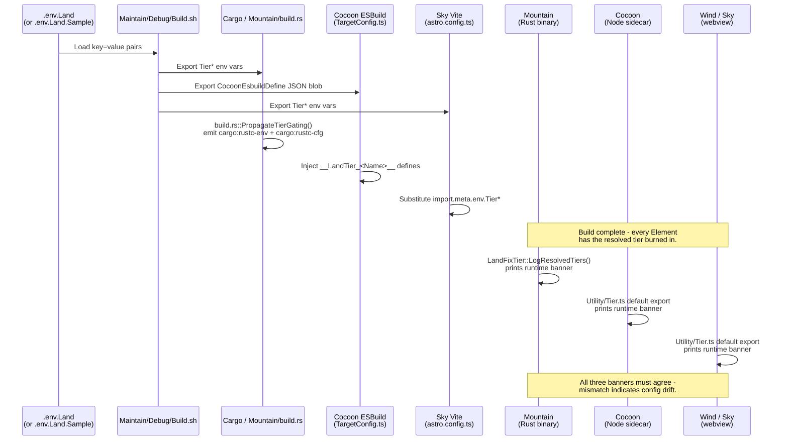

### **Workflow Example #11: Tier-Gated Implementation Selection** 🎚️

**Goal:** To let every capability that has more than one viable implementation
(e.g. "file-system access via gRPC vs native tokio", "glob compilation in
JavaScript vs via `globset` in Rust") live in the codebase simultaneously and
select the active path through a single configuration file, without duplicating
the call sites or regressing the default tier. This workflow covers how the
`.env.Land` file propagates through the build tools into `Mountain`, `Cocoon`,
`Wind` and `Sky`, and how each Element reads the resolved tier at run time.

This is the foundation the codebase uses to test upgrades, keep fallback paths
warm, and bisect regressions to a specific implementation tier.

---

#### **Phase 1: Authoring the Tier Set (`.env.Land`)**

1.  **Canonical source of truth
    ([`Land/.env.Land.Sample`](https://github.com/CodeEditorLand/Land/tree/Current/.env.Land.Sample))**
    - **Action:** Every capability that participates in tier gating has exactly
      one row in `.env.Land.Sample` in the form `Tier<Capability>=<Value>`.
    - The sample file is committed and represents the compiled-in defaults. A
      per-machine `.env.Land` (gitignored) may override any line.
    - Seventeen capabilities are currently gated, spanning transport
      (`TierRemoteProcedureCall`, `TierHTTPProxy`, `TierLogger`), file system
      (`TierFileSystem`, `TierFindFiles`, `TierGlob`, `TierFileWatcher`,
      `TierSchemeAssets`), VS Code API (`TierConfiguration`, `TierDiagnostics`,
      `TierClipboard`, `TierOpenExternal`, `TierDocumentMirror`), lifecycle
      (`TierExtensionActivation`, `TierExtensionScan`, `TierModuleCache`) and
      telemetry (`TierTelemetry`).

2.  **Naming convention**
    - **Action:** Variables use `PascalCase` with the `Tier` prefix. The values
      are free-form strings chosen per capability - typically `Layer2` /
      `Layer3` / `Layer4` / `Layer5` where L2 is a round-trip RPC, L3 a native
      in-language fallback, L4 a pure-Rust implementation, and L5 an OS-level
      integration. For non-layered capabilities the values are descriptive
      (`GRPC` / `SharedMemory` / `HandRolled` / `Hyper` / `Standard` / `Ring`).

---

#### **Phase 2: Build-Time Propagation (`Maintain/Debug/Build.sh`)**

1.  **Env file discovery
    ([`Land/Maintain/Debug/Build.sh`](https://github.com/CodeEditorLand/Land/tree/Current/Maintain/Debug/Build.sh))**
    - **Action:** The build script resolves `$Land_Env_File` (if exported) or
      the first of `.env.Land`, `../.env.Land`, `.env.Land.Sample`,
      `../.env.Land.Sample` that exists.
    - `set -a; . "$EnvFile"; set +a` exports every assignment into the current
      shell so every child tool inherits the same tier set.
    - The resolved tier table is echoed before the build starts so CI logs show
      the exact tier set for each run.

2.  **Cargo feature derivation**
    - **Action:** Non-default values activate Cargo features named
      `Tier<Capability><Value>` (e.g. `TierFileSystem=Layer4` →
      `--features TierFileSystemLayer4`).
    - Defaults do not activate a feature because the default is the
      always-compiled baseline; only upgrades add to the build.

3.  **Cocoon ESBuild define blob**
    - **Action:** Every `Tier*` env var becomes a `__LandTier_<Capability>__`
      replacement token serialised into `$CocoonEsbuildDefine` (a JSON string
      node serialises before export).
    - Cocoon's
      [`TargetConfig.ts`](https://github.com/CodeEditorLand/Land/tree/Current/Element/Cocoon/Source/Configuration/ESBuild/Config/TargetConfig.ts)
      merges this blob into esbuild's `define` map so every reference to
      `__LandTier_FileSystem__` (etc.) is substituted at bundle time.

4.  **Vite / Astro define**
    - **Action:** Sky's
      [`astro.config.ts`](https://github.com/CodeEditorLand/Land/tree/Current/Element/Sky/astro.config.ts)
      forwards every `Tier*` env var to the Vite `define` map so the webview
      bundle also carries the baked-in values as `import.meta.env.Tier*`
      substitutions.

---

#### **Phase 3: `Mountain` - Rust Compile-Time Propagation**

1.  **`build.rs` tier propagation
    ([`Land/Element/Mountain/build.rs`](https://github.com/CodeEditorLand/Land/tree/Current/Element/Mountain/build.rs))**
    - **Action:** Mountain's build script calls `PropagateTierGating()` once per
      compile.
    - It emits `cargo:rustc-env=Tier<Capability>=<Value>` for every row
      (defaults first, then the resolved file's overrides), guaranteeing
      `env!("Tier<Capability>")` resolves at compile time.
    - It emits `cargo:rustc-cfg=feature="Tier<Capability><Value>"` for every
      non-default pair that matches a declared feature.
    - It emits `cargo:rerun-if-changed=<envfile>` so touching `.env.Land`
      invalidates the compile.

2.  **Feature whitelist**
    - **Action:** `IsDeclaredTierFeature` mirrors Mountain's
      [`Cargo.toml` `[features]` block](https://github.com/CodeEditorLand/Land/tree/Current/Element/Mountain/Cargo.toml);
      `IsDefaultTierValue` lists the no-op default values.
    - Any `(Key, Value)` pair absent from both tables produces a
      `cargo:warning`, so typos in `.env.Land` fail loud at `cargo build`
      instead of silently no-op at runtime.

3.  **Runtime banner
    ([`Land/Element/Mountain/Source/LandFixTier.rs`](https://github.com/CodeEditorLand/Land/tree/Current/Element/Mountain/Source/LandFixTier.rs))**
    - **Action:** `LogResolvedTiers()` is called from
      [`Binary::Main::Entry::Fn`](https://github.com/CodeEditorLand/Land/tree/Current/Element/Mountain/Source/Binary/Main/Entry.rs)
      before the Tokio runtime spins up. It prints a single line naming every
      capability's compiled value - zero runtime cost, since every value is a
      literal produced by `env!(...)`.

---

#### **Phase 4: `Cocoon` - TypeScript Runtime Dispatch**

1.  **`CocoonMain.ts` prelude
    ([`Land/Element/Cocoon/Source/Bootstrap/Implementation/CocoonMain.ts`](https://github.com/CodeEditorLand/Land/tree/Current/Element/Cocoon/Source/Bootstrap/Implementation/CocoonMain.ts))**
    - **Action:** The very first statements of the bundled Cocoon main file
      populate `globalThis.__LandTiers` from the esbuild-substituted
      `__LandTier_<Capability>__` identifiers, falling through to
      `process.env.Tier<Capability>` (for dev runs launched outside the build
      script) and finally the hard-coded defaults.
    - The prelude runs before the `Tier` utility is first imported, so every
      downstream module reads resolved values.

2.  **`Utility/Tier.ts` default export
    ([`Land/Element/Cocoon/Source/Utility/Tier.ts`](https://github.com/CodeEditorLand/Land/tree/Current/Element/Cocoon/Source/Utility/Tier.ts))**
    - **Action:** The module exposes a single `const Tier = { … } as const`
      object whose keys match the capability names. Reads are synchronous and
      side-effect-free.
    - On first import it emits the Cocoon runtime banner via `LandFixLog.Info`
      so the boot log documents exactly which tier set this process is using.

3.  **Dispatch patterns**
    - **Static dispatch (preferred):**
      `export default Tier.Glob === "Native" ? CompileNative : CompileJavaScript;`
        - esbuild's `define` substitutions dead-code-eliminate the inactive arm
          in production bundles.
    - **Runtime branch:** `if (Tier.FileSystem === "Layer3") { … } else { … }` -
      used when two arms must coexist in the same bundle.
    - **Async memoisation:** when an upgraded tier needs one-time async setup
      (e.g. opening a shared-memory segment), wrap the setup in a memoised
      promise.

---

#### **Phase 5: `Wind` / `Sky` - Webview Dispatch**

1.  **`Wind/Source/Utility/Tier.ts`
    ([`Land/Element/Wind/Source/Utility/Tier.ts`](https://github.com/CodeEditorLand/Land/tree/Current/Element/Wind/Source/Utility/Tier.ts))**
    - **Action:** Mirrors Cocoon's module in shape but reads from
      `import.meta.env.Tier<Capability>` (Vite-substituted at build time),
      falling through to `globalThis.__LandTiers` (populated by Sky's polyfill
      layer) and finally hard-coded defaults.
    - Emits its own boot banner via `console.info` - visible in DevTools.

2.  **Cross-Element agreement**
    - **Action:** All three banners - Mountain, Cocoon, Wind - should report
      identical values for each capability. A mismatch means one build tool read
      a different env file or a polyfill failed to populate
      `globalThis.__LandTiers`; both paths are grep-able from the boot log.

---

#### **Phase 6: Adding a New Tier**

1.  **Declare the capability**
    - **Action:** Add a row to `.env.Land.Sample` with the default value.

2.  **Extend the type declarations**
    - **Action:** Add a `Tier<Capability>Value` union type and a `Pick<…>(…)`
      call in both `Utility/Tier.ts` files.

3.  **Wire the Rust side**
    - **Action:** Add the feature to `Mountain/Cargo.toml [features]` (empty
      array for codegen-only; dep list for a new crate).
    - Add the feature name to `IsDeclaredTierFeature` in `build.rs`.
    - Add every non-default value to `IsDefaultTierValue`.

4.  **Implement both arms**
    - **Action:** In the file owning the capability, guard each arm with a
      marker comment
      `// Tier:<Capability>:<Value> <ColourMark> <One-line justification>`.

5.  **Update the runtime banner**
    - **Action:** Extend `LogResolvedTiers()` in `LandFixTier.rs` and the banner
      lines in both TypeScript `Utility/Tier.ts` files so the new capability
      appears in the boot log alongside the existing seventeen.

---

#### **Failure Modes**

- **`.env.Land` missing:** `Build.sh` falls back to `.env.Land.Sample`;
  `build.rs` falls back to hard-coded defaults; `Utility/Tier.ts` falls back to
  the same defaults. All three paths converge on the same baseline.
- **Typo in `.env.Land`:** Rust build surfaces
  `cargo:warning=Tier<…>=<…> declared in <file> but has no matching Cargo feature`.
  TypeScript accepts the value as opaque string (types are union literals at the
  type level only); the banner shows the typo verbatim so it is visible at boot.
- **Banner disagreement:** Compare the three `[LandFix:Tier] …` lines in the
  boot log. If they disagree on a capability, one build tool did not see the
  override - usually because the shell that launched the build did not source
  `.env.Land`. Re-run under `./Maintain/Debug/Build.sh`, which is the sole
  supported entry point.

---

#### **Related Source Files**

| Element   | Path                                                                                                                                                                                           | Role                                    |
| --------- | ---------------------------------------------------------------------------------------------------------------------------------------------------------------------------------------------- | --------------------------------------- |
| Repo root | [`.env.Land.Sample`](https://github.com/CodeEditorLand/Land/tree/Current/.env.Land.Sample)                                                                                                     | Canonical default tier set              |
| Maintain  | [`Maintain/Debug/Build.sh`](https://github.com/CodeEditorLand/Land/tree/Current/Maintain/Debug/Build.sh)                                                                                       | Env fan-out for every downstream tool   |
| Mountain  | [`Element/Mountain/build.rs`](https://github.com/CodeEditorLand/Land/tree/Current/Element/Mountain/build.rs)                                                                                   | Cargo feature + `rustc-env` propagation |
| Mountain  | [`Element/Mountain/Source/LandFixTier.rs`](https://github.com/CodeEditorLand/Land/tree/Current/Element/Mountain/Source/LandFixTier.rs)                                                         | Runtime banner                          |
| Cocoon    | [`Element/Cocoon/Source/Utility/Tier.ts`](https://github.com/CodeEditorLand/Land/tree/Current/Element/Cocoon/Source/Utility/Tier.ts)                                                           | Node-side dispatcher                    |
| Cocoon    | [`Element/Cocoon/Source/Configuration/ESBuild/Config/TargetConfig.ts`](https://github.com/CodeEditorLand/Land/tree/Current/Element/Cocoon/Source/Configuration/ESBuild/Config/TargetConfig.ts) | ESBuild `define` integration            |
| Cocoon    | [`Element/Cocoon/Source/Bootstrap/Implementation/CocoonMain.ts`](https://github.com/CodeEditorLand/Land/tree/Current/Element/Cocoon/Source/Bootstrap/Implementation/CocoonMain.ts)             | `globalThis.__LandTiers` prelude        |
| Wind      | [`Element/Wind/Source/Utility/Tier.ts`](https://github.com/CodeEditorLand/Land/tree/Current/Element/Wind/Source/Utility/Tier.ts)                                                               | Webview-side dispatcher                 |
| Sky       | [`Element/Sky/astro.config.ts`](https://github.com/CodeEditorLand/Land/tree/Current/Element/Sky/astro.config.ts)                                                                               | Vite `define` forwarding                |
