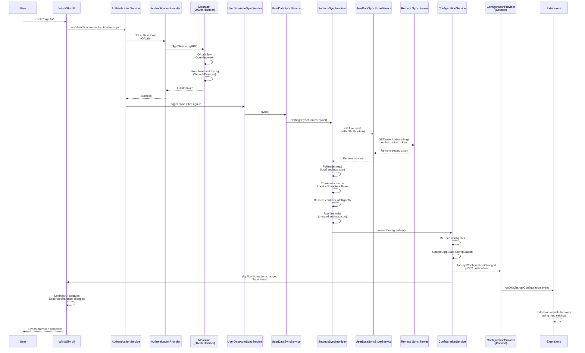

### **Workflow Example #9: User Data Synchronization**&#x2001;🔄

> **⚠️ Verification Status:** This workflow describes the user data
> synchronization architecture. Verify against
> [`Element/Mountain/Source/Environment/SynchronizationProvider.rs`](https://github.com/CodeEditorLand/Mountain/tree/Current/Source/Environment/SynchronizationProvider.rs)
> for the actual implementation.

**Goal:** A user logs into their account on a new machine. The application
automatically downloads their settings (`settings.json`), keybindings, and list
of installed extensions from a remote server and applies them to the new
installation.

---

#### **Phase 1: User Authentication**

1.  **User Action (`Wind/Sky`)**
    - **Action:** The user clicks the "Sign In" button in the Account menu.
    - This triggers the `workbench.action.authentication.signIn` command.

2.  **Authentication Flow (`Wind` -> `Cocoon` -> `Mountain`)**
    - **Action:** The `AuthenticationService` in `Wind` receives the command.
    - This triggers a request to `Cocoon`'s `AuthenticationProvider` to get an
      authentication session (e.g., using OAuth against GitHub or another
      service).
    - The `AuthenticationProvider` in `Cocoon` makes a `$getSession` gRPC call
      to `Mountain`.
    - `Mountain`'s `AuthenticationProvider` implementation handles the OAuth
      flow, likely by opening a browser window and listening for a callback URI.
    - **Result:** A successful authentication results in an OAuth token, which
      is stored securely (e.g., in the system keyring via `SecretsProvider`).
      The user is now signed in. The `UserDataSyncAccountService` now knows the
      user's identity and has a token to make authenticated API calls.

#### **Phase 2: Triggering the Synchronization**

3.  **`UserDataAutoSyncService` (`Mountain`)**
    - **Action:** After a successful sign-in, the `UserDataAutoSyncService` is
      triggered. Alternatively, it can be triggered manually by the user or on a
      regular interval.
    - This service is the central orchestrator for the entire sync process. It
      decides what to sync (settings, extensions, etc.) and in what order.
    - It begins by calling the `IUserDataSyncService.sync()`.

4.  **`UserDataSyncService.sync()` (`Mountain`)**
    - **Action:** The `sync()` method iterates through a list of registered
      "synchronizers" (e.g., `SettingsSynchronizer`, `ExtensionsSynchronizer`).
    - For each synchronizer, it calls its `sync()` method. Let's follow the
      `SettingsSynchronizer`.

#### **Phase 3: Synchronizing a Specific Resource (e.g., Settings)**

5.  **`SettingsSynchronizer.sync()` (`Mountain`)**
    - **Action:** The settings synchronizer needs to fetch the latest version of
      `settings.json` from the remote server.
    - It uses a `UserDataSyncStoreService` (which is an HTTP client under the
      hood) to make an authenticated `GET` request to a predefined cloud
      endpoint (e.g., `https://my-sync-service.com/user/data/settings`). It
      includes the user's OAuth token in the request headers.

6.  **Remote Sync Service (External Server)**
    - **Action:** The cloud service receives the request, validates the token,
      and fetches the user's stored `settings.json` content from its database.
    - It returns the content as the HTTP response.

7.  **Merging Changes (`Mountain`)**
    - **Action:** The `SettingsSynchronizer` in `Mountain` receives the remote
      `settings.json` content.
    - It also reads the user's _local_ `settings.json` file using the `FsReader`
      effect.
    - **Crucial Step:** It now performs a **three-way merge**. It compares the
      "local" version, the "remote" version, and a "base" version (the state
      from the last successful sync, which is stored locally).
    - This merge logic (defined in a file like
      `vs/platform/userDataSync/common/settingsMerge.ts`) intelligently combines
      the changes. For example, if the user added a setting locally and a
      different setting on another machine, the merge result will contain both.
      If there's a direct conflict on the same key, it might be flagged for the
      user to resolve.

#### **Phase 4: Applying the Merged State**

8.  **Applying Settings (`Mountain`)**
    - **Action:** The `SettingsSynchronizer` now has the final, merged
      `settings.json` content.
    - It uses the `FsWriter` effect to write this new content back to the local
      `settings.json` file, overwriting it.

9.  **Configuration Reload (`Mountain`)**
    - **Action:** After the file is written, the `SettingsSynchronizer` needs to
      tell the rest of the application to recognize the changes.
    - It calls a method on the `ConfigurationService` (e.g.,
      `reloadConfiguration()`).
    - The `ConfigurationService` re-reads all settings files from disk,
      reconstructs the effective configuration, and updates the `Configuration`
      object in `AppState`.

10. **Notifying `Cocoon` and `Wind/Sky`**
    - **Action:** The `ConfigurationService` in `Mountain` detects that the
      configuration has changed.
    - It sends a **`$acceptConfigurationChanged` gRPC notification to
      `Cocoon`**, including a summary of the keys that changed.
    - It also emits a **`sky://configuration/changed` Tauri event to the
      `Wind/Sky` frontend.**

#### **Phase 5: UI and Extension Host React to Changes**

11. **`ConfigurationProvider` (`Cocoon`)**
    - **Action:** The `ConfigurationProvider` in `Cocoon` receives the
      `$acceptConfigurationChanged` notification.
    - It updates its internal cache of the configuration.
    - It fires its `onDidChangeConfiguration` event, which is exposed to all
      extensions as `vscode.workspace.onDidChangeConfiguration`.

12. **UI Update (`Wind/Sky`)**
    - **Action:** Components in the UI listen for the
      `sky://configuration/changed` event.
    - The Settings UI, for example, re-renders to show the new values.
    - The editor re-reads settings like `editor.fontSize` and updates its
      appearance.

13. **Extension Reaction (`Cocoon`)**
    - **Action:** An extension that was listening for configuration changes
      receives the event.
    - It might call `vscode.workspace.getConfiguration('myExtension')` to get
      its new settings and adjust its behavior accordingly.
    - **The synchronization process for settings is now complete.** The same
      pattern is repeated for keybindings, snippets, and extensions.

---

#### **Extension storage via Mountain**

Extension `workspaceState` and `globalState` (`Memento`) are backed by Mountain
`storage:get` / `storage:set` IPC rather than a local file. The `Memento`
implementation in `Handler/Extension/Host/ActivateExtension.ts` reads initial
values via `storage:get` during activation and writes through `storage:set` on
every `update()` call. This means extension state persists across Cocoon
restarts without the extension needing to manage its own storage file.

#### **Extension secrets via Mountain encryption**

`context.secrets` uses Mountain's AES-256-GCM encryption layer rather than
plaintext storage:

- `secrets.store(key, value)` calls Mountain `encryption:encrypt` with the
  plaintext value, then `storage:set` with the ciphertext.
- `secrets.get(key)` calls `storage:get` for the ciphertext and then
  `encryption:decrypt` to recover the plaintext.
- `secrets.delete(key)` calls `storage:set` with an empty string.

The encryption key is derived from a SHA-256 hash of the machine UUID
(`Encryption/Key.rs`), making it machine-stable across sessions. Secrets are
never written to disk in plaintext. The `onDidChange` event fires after every
`store` or `delete` call.
