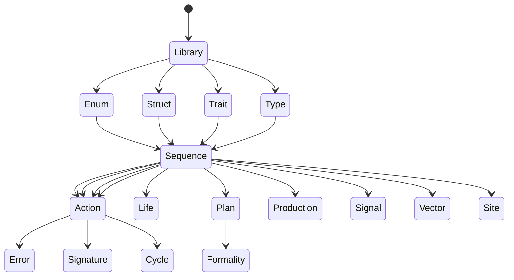
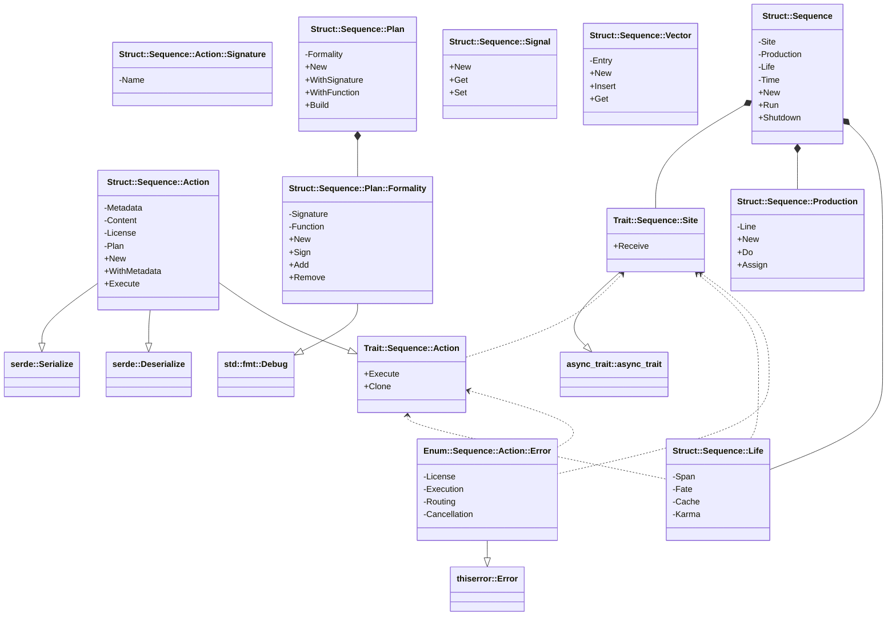
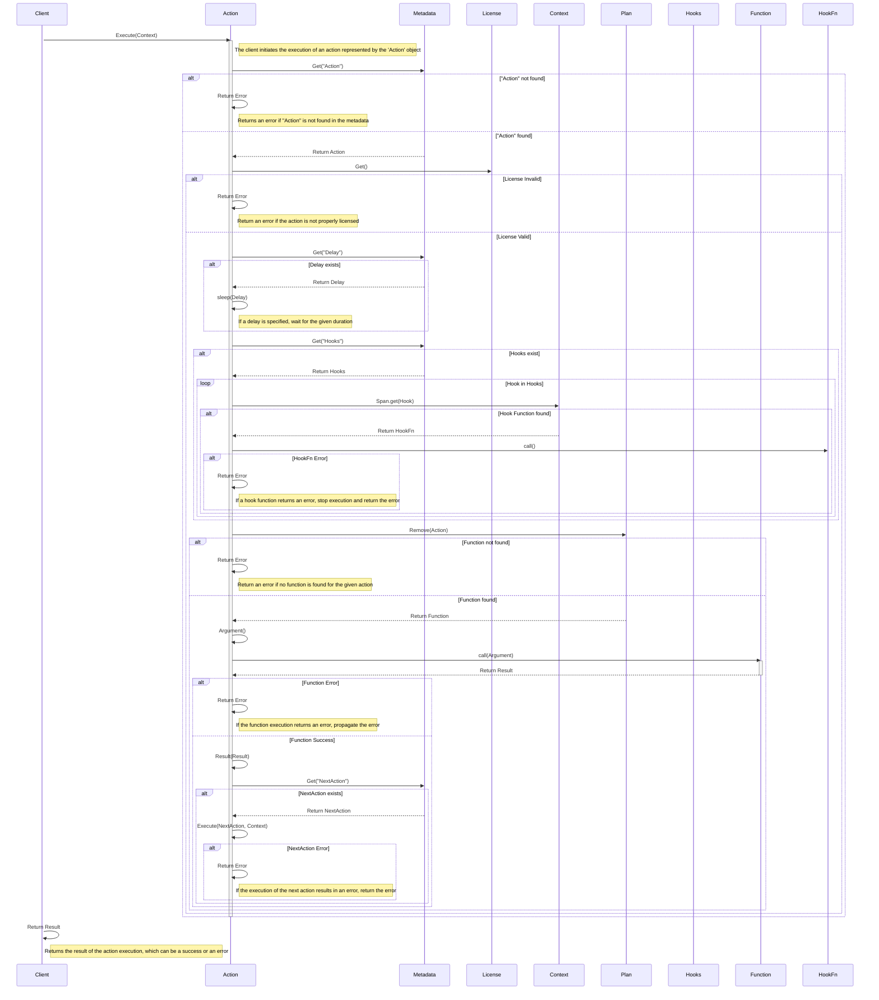

# 📣 [Echo] — Asynchronous Action Processing System

`Echo` is a Rust library designed for managing and executing asynchronous
actions efficiently. It leverages a worker-stealer pattern and asynchronous
queues to handle complex workflows with features like metadata management,
function planning, and robust error handling.

## Table of Contents

-   [Introduction](#Introduction)
-   [Features](#Features)
-   [Installation](#Installation)
-   [Usage](#Usage)
-   [Architecture](#Architecture)
-   [Contributing](CONTRIBUTING.md)
-   [License](LICENSE)

## Introduction

`Echo` provides a robust framework for defining, queuing, and executing actions
asynchronously. It's designed to handle complex workflows with features like
metadata management, function planning, and error handling.

## Features

-   **Asynchronous Operations:** Built with Rust's async/await syntax for
    non-blocking execution.
-   **Action Planning:** Define and execute actions with custom logic using a
    flexible Plan system.
-   **Metadata Management:** Attach metadata to actions for additional Life and
    control.
-   **Error Handling:** Comprehensive error management with custom `Error`
    types.
-   **Retry Mechanism:** Built-in retry logic for failed actions with
    exponential backoff.
-   **Hooks:** Supports pre and post-execution hooks for added flexibility.
-   **Serialization:** Actions can be serialized and deserialized for
    persistence or network transfer (in progress).

## 🚀 Installation

To get started with `Echo`, follow these steps:

1. **Add to your Cargo.toml**:

```toml
[dependencies]
Echo = { git = "HTTPS://GitHub.Com/CodeEditorLand/Echo.git" }
```

2. **Build the Project**:

```bash
cargo build
```

## 🛠️ Usage

Here's a basic example demonstrating how to define and execute an Action:

```rust
#[tokio::main]
async fn main() -> Result<(), Box<dyn std::error::Error>> {
	// Define the Action's logic
	let Read = |_Argument: Vec<serde_json::Value>| async move {
		// Access the provided path (replace with actual logic)
		let Path = "path/to/file.txt";

		// Simulate reading from the path
		let Content = format!("Content read from: {}", Path);

		Ok(json!(Content))
	};

	// Create an Action Plan
	let Plan = Plan::New()
		.WithSignature(Echo::Struct::Sequence::Action::Signature::Struct {
			Name: "Read".to_string(),
		})
		.WithFunction("Read", Read)?
		.Build();

	// Create a work queue
	let Production = Arc::new(Production::New());

	// Create a lifecycle Life (replace with your actual configuration)
	let Life = Life {
		Span: Arc::new(dashmap::DashMap::new()),
		Fate: Arc::new(config::Config::default()),
		Cache: Arc::new(Mutex::new(dashmap::DashMap::new())),
		Karma: Arc::new(dashmap::DashMap::new()),
	};

	// Define a Site to execute actions
	struct SimpleSite;

	#[async_trait::async_trait]
	impl Site for SimpleSite {
		async fn Receive(
			&self,
			Action: Box<dyn ActionTrait>,
			Life: &Life,
		) -> Result<(), Error> {
			Action.Execute(Life).await
		}
	}
	let Site = Arc::new(SimpleSite);

	// Create an Action Sequence
	let Sequence = Arc::new(Sequence::New(Site, Production.clone(), Life));

	// Create an Action and add it to the queue
	let Action = Action::New(
		"Read",
		json!("SomeData"),
		Arc::clone(&Plan),
	);

	Production.Assign(Box::new(Action)).await;

	// Run the Sequence
	Sequence.Run().await;

	Ok(())
}

use serde_json::json;
use std::sync::Arc;
use tokio::sync::Mutex;

use Echo::Sequence::{
	Action::{Error::Enum as Error, Struct as Action, Trait as ActionTrait},
	Life::Struct as Life,
	Plan::{Formality::Struct as Formality, Struct as Plan},
	Production::Struct as Production,
	Site::Trait as Site,
	Struct as Sequence,
};
```

## 🏛️ Architecture

### Core Components

-   **Action:** Represents a unit of Production with associated metadata,
    content, and execution logic.
-   **Plan:** Defines the structure and functions for different Action types.
-   **Production:** A thread-safe queue for managing pending actions.
-   **Site:** Implements the logic for receiving and executing actions from the
    queue.
-   **Sequence:** Orchestrates the execution of actions using workers and the
    work queue.
-   **Life:** Provides a shared Life and configuration for actions during
    execution.

### Diagrams

#### State Diagram



#### Class Diagram



#### Sequence Diagram



## 🤝 Contributing

Contributions are welcome! Please see [CONTRIBUTING.md](CONTRIBUTING.md) for
guidelines and feel free to submit a Pull Request.

## 📄 License

This project is licensed under the MIT [LICENSE](LICENSE).

## Changelog

See [CHANGELOG.md](CHANGELOG.md) for a history of changes to this component.

[Echo]: HTTPS://GitHub.Com/CodeEditorLand/Echo
