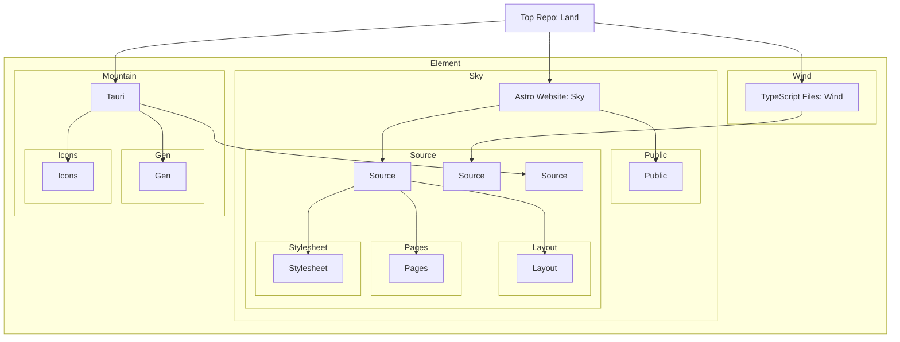
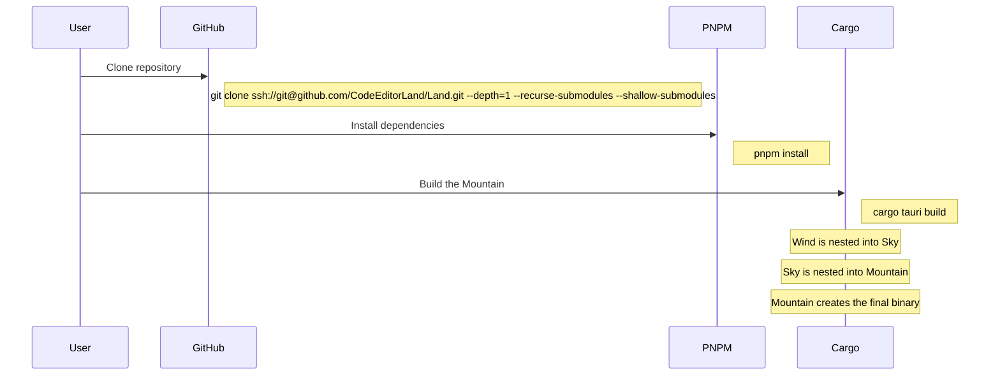

<table><tr> <td colspan="1"> <h3 align="center"> <picture>    </picture> 🏞️ </h3> </td> <td colspan="3" valign="top"> <h3 align="center"> Land </h3> </td> </tr><tr><td valign="top" colspan="1"><a href="HTTPS://GitHub.Com/CodeEditorLand/Echo" target="_blank"> <picture> <source media="(prefers-color-scheme: dark)" srcset="https://img.shields.io/github/last-commit/CodeEditorLand/Echo?label=Update&color=black&labelColor=black&logoColor=white&logoWidth=0"> <source media="(prefers-color-scheme: light)" srcset="https://img.shields.io/github/last-commit/CodeEditorLand/Echo?label=Update&color=white&labelColor=white&logoColor=black&logoWidth=0">  </picture> </a><br><a href="HTTPS://GitHub.Com/CodeEditorLand/Echo" target="_blank"> <picture> <source media="(prefers-color-scheme: dark)" srcset="https://img.shields.io/github/issues/CodeEditorLand/Echo?label=Issue&color=black&labelColor=black&logoColor=white&logoWidth=0"> <source media="(prefers-color-scheme: light)" srcset="https://img.shields.io/github/issues/CodeEditorLand/Echo?label=Issue&color=white&labelColor=white&logoColor=black&logoWidth=0">  </picture> </a><br></td><td valign="top" colspan="1"><a href="HTTPS://GitHub.Com/CodeEditorLand/Echo" target="_blank"><picture><source media="(prefers-color-scheme: dark)" srcset="https://img.shields.io/github/stars/CodeEditorLand/Echo?style=flat&label=Star&logo=github&color=black&labelColor=black&logoColor=white&logoWidth=0"><source media="(prefers-color-scheme: light)" srcset="https://img.shields.io/github/stars/CodeEditorLand/Echo?style=flat&label=Star&logo=github&color=white&labelColor=white&logoColor=black&logoWidth=0"></picture></a><br><a href="HTTPS://GitHub.Com/CodeEditorLand/Echo" target="_blank"> <picture> <source media="(prefers-color-scheme: dark)" srcset="https://img.shields.io/github/downloads/CodeEditorLand/Echo/total?label=Download&color=black&labelColor=black&logoColor=white&logoWidth=0"> <source media="(prefers-color-scheme: light)" srcset="https://img.shields.io/github/downloads/CodeEditorLand/Echo/total?label=Download&color=white&labelColor=white&logoColor=black&logoWidth=0">  </picture> </a><br><a href="HTTPS://GitHub.Com/CodeEditorLand/Echo" target="_blank"><b>Echo 📣</b></a></td><td valign="top" colspan="1"><a href="HTTPS://GitHub.Com/CodeEditorLand/Land" target="_blank"> <picture> <source media="(prefers-color-scheme: dark)" srcset="https://img.shields.io/github/last-commit/CodeEditorLand/Land?label=Update&color=black&labelColor=black&logoColor=white&logoWidth=0"> <source media="(prefers-color-scheme: light)" srcset="https://img.shields.io/github/last-commit/CodeEditorLand/Land?label=Update&color=white&labelColor=white&logoColor=black&logoWidth=0">  </picture> </a><br><a href="HTTPS://GitHub.Com/CodeEditorLand/Land" target="_blank"> <picture> <source media="(prefers-color-scheme: dark)" srcset="https://img.shields.io/github/issues/CodeEditorLand/Land?label=Issue&color=black&labelColor=black&logoColor=white&logoWidth=0"> <source media="(prefers-color-scheme: light)" srcset="https://img.shields.io/github/issues/CodeEditorLand/Land?label=Issue&color=white&labelColor=white&logoColor=black&logoWidth=0">  </picture> </a><br></td><td valign="top" colspan="1"><a href="HTTPS://GitHub.Com/CodeEditorLand/Land" target="_blank"><picture><source media="(prefers-color-scheme: dark)" srcset="https://img.shields.io/github/stars/CodeEditorLand/Land?style=flat&label=Star&logo=github&color=black&labelColor=black&logoColor=white&logoWidth=0"><source media="(prefers-color-scheme: light)" srcset="https://img.shields.io/github/stars/CodeEditorLand/Land?style=flat&label=Star&logo=github&color=white&labelColor=white&logoColor=black&logoWidth=0"></picture></a><br><a href="HTTPS://GitHub.Com/CodeEditorLand/Land" target="_blank"> <picture> <source media="(prefers-color-scheme: dark)" srcset="https://img.shields.io/github/downloads/CodeEditorLand/Land/total?label=Download&color=black&labelColor=black&logoColor=white&logoWidth=0"> <source media="(prefers-color-scheme: light)" srcset="https://img.shields.io/github/downloads/CodeEditorLand/Land/total?label=Download&color=white&labelColor=white&logoColor=black&logoWidth=0">  </picture> </a><br><a href="HTTPS://GitHub.Com/CodeEditorLand/Land" target="_blank"><b>Land 🏞️</b></a></td></tr><tr><td valign="top" colspan="1"><a href="HTTPS://GitHub.Com/CodeEditorLand/Element" target="_blank"> <picture> <source media="(prefers-color-scheme: dark)" srcset="https://img.shields.io/github/last-commit/CodeEditorLand/Element?label=Update&color=black&labelColor=black&logoColor=white&logoWidth=0"> <source media="(prefers-color-scheme: light)" srcset="https://img.shields.io/github/last-commit/CodeEditorLand/Element?label=Update&color=white&labelColor=white&logoColor=black&logoWidth=0">  </picture> </a><br><a href="HTTPS://GitHub.Com/CodeEditorLand/Element" target="_blank"> <picture> <source media="(prefers-color-scheme: dark)" srcset="https://img.shields.io/github/issues/CodeEditorLand/Element?label=Issue&color=black&labelColor=black&logoColor=white&logoWidth=0"> <source media="(prefers-color-scheme: light)" srcset="https://img.shields.io/github/issues/CodeEditorLand/Element?label=Issue&color=white&labelColor=white&logoColor=black&logoWidth=0">  </picture> </a><br></td><td valign="top" colspan="1"><a href="HTTPS://GitHub.Com/CodeEditorLand/Element" target="_blank"><picture><source media="(prefers-color-scheme: dark)" srcset="https://img.shields.io/github/stars/CodeEditorLand/Element?style=flat&label=Star&logo=github&color=black&labelColor=black&logoColor=white&logoWidth=0"><source media="(prefers-color-scheme: light)" srcset="https://img.shields.io/github/stars/CodeEditorLand/Element?style=flat&label=Star&logo=github&color=white&labelColor=white&logoColor=black&logoWidth=0"></picture></a><br><a href="HTTPS://GitHub.Com/CodeEditorLand/Element" target="_blank"> <picture> <source media="(prefers-color-scheme: dark)" srcset="https://img.shields.io/github/downloads/CodeEditorLand/Element/total?label=Download&color=black&labelColor=black&logoColor=white&logoWidth=0"> <source media="(prefers-color-scheme: light)" srcset="https://img.shields.io/github/downloads/CodeEditorLand/Element/total?label=Download&color=white&labelColor=white&logoColor=black&logoWidth=0">  </picture> </a><br><a href="HTTPS://GitHub.Com/CodeEditorLand/Element" target="_blank"><b>Element 🌱</b></a></td><td valign="top" colspan="1"><a href="HTTPS://GitHub.Com/CodeEditorLand/Mountain" target="_blank"> <picture> <source media="(prefers-color-scheme: dark)" srcset="https://img.shields.io/github/last-commit/CodeEditorLand/Mountain?label=Update&color=black&labelColor=black&logoColor=white&logoWidth=0"> <source media="(prefers-color-scheme: light)" srcset="https://img.shields.io/github/last-commit/CodeEditorLand/Mountain?label=Update&color=white&labelColor=white&logoColor=black&logoWidth=0">  </picture> </a><br><a href="HTTPS://GitHub.Com/CodeEditorLand/Mountain" target="_blank"> <picture> <source media="(prefers-color-scheme: dark)" srcset="https://img.shields.io/github/issues/CodeEditorLand/Mountain?label=Issue&color=black&labelColor=black&logoColor=white&logoWidth=0"> <source media="(prefers-color-scheme: light)" srcset="https://img.shields.io/github/issues/CodeEditorLand/Mountain?label=Issue&color=white&labelColor=white&logoColor=black&logoWidth=0">  </picture> </a><br></td><td valign="top" colspan="1"><a href="HTTPS://GitHub.Com/CodeEditorLand/Mountain" target="_blank"><picture><source media="(prefers-color-scheme: dark)" srcset="https://img.shields.io/github/stars/CodeEditorLand/Mountain?style=flat&label=Star&logo=github&color=black&labelColor=black&logoColor=white&logoWidth=0"><source media="(prefers-color-scheme: light)" srcset="https://img.shields.io/github/stars/CodeEditorLand/Mountain?style=flat&label=Star&logo=github&color=white&labelColor=white&logoColor=black&logoWidth=0"></picture></a><br><a href="HTTPS://GitHub.Com/CodeEditorLand/Mountain" target="_blank"> <picture> <source media="(prefers-color-scheme: dark)" srcset="https://img.shields.io/github/downloads/CodeEditorLand/Mountain/total?label=Download&color=black&labelColor=black&logoColor=white&logoWidth=0"> <source media="(prefers-color-scheme: light)" srcset="https://img.shields.io/github/downloads/CodeEditorLand/Mountain/total?label=Download&color=white&labelColor=white&logoColor=black&logoWidth=0">  </picture> </a><br><a href="HTTPS://GitHub.Com/CodeEditorLand/Mountain" target="_blank"><b>Mountain ⛰️</b></a></td></tr><tr><td valign="top" colspan="1"><a href="HTTPS://GitHub.Com/CodeEditorLand/River" target="_blank"> <picture> <source media="(prefers-color-scheme: dark)" srcset="https://img.shields.io/github/last-commit/CodeEditorLand/River?label=Update&color=black&labelColor=black&logoColor=white&logoWidth=0"> <source media="(prefers-color-scheme: light)" srcset="https://img.shields.io/github/last-commit/CodeEditorLand/River?label=Update&color=white&labelColor=white&logoColor=black&logoWidth=0">  </picture> </a><br><a href="HTTPS://GitHub.Com/CodeEditorLand/River" target="_blank"> <picture> <source media="(prefers-color-scheme: dark)" srcset="https://img.shields.io/github/issues/CodeEditorLand/River?label=Issue&color=black&labelColor=black&logoColor=white&logoWidth=0"> <source media="(prefers-color-scheme: light)" srcset="https://img.shields.io/github/issues/CodeEditorLand/River?label=Issue&color=white&labelColor=white&logoColor=black&logoWidth=0">  </picture> </a><br></td><td valign="top" colspan="1"><a href="HTTPS://GitHub.Com/CodeEditorLand/River" target="_blank"><picture><source media="(prefers-color-scheme: dark)" srcset="https://img.shields.io/github/stars/CodeEditorLand/River?style=flat&label=Star&logo=github&color=black&labelColor=black&logoColor=white&logoWidth=0"><source media="(prefers-color-scheme: light)" srcset="https://img.shields.io/github/stars/CodeEditorLand/River?style=flat&label=Star&logo=github&color=white&labelColor=white&logoColor=black&logoWidth=0"></picture></a><br><a href="HTTPS://GitHub.Com/CodeEditorLand/River" target="_blank"> <picture> <source media="(prefers-color-scheme: dark)" srcset="https://img.shields.io/github/downloads/CodeEditorLand/River/total?label=Download&color=black&labelColor=black&logoColor=white&logoWidth=0"> <source media="(prefers-color-scheme: light)" srcset="https://img.shields.io/github/downloads/CodeEditorLand/River/total?label=Download&color=white&labelColor=white&logoColor=black&logoWidth=0">  </picture> </a><br><a href="HTTPS://GitHub.Com/CodeEditorLand/River" target="_blank"><b>River 🌊</b></a></td><td valign="top" colspan="1"><a href="HTTPS://GitHub.Com/CodeEditorLand/Sky" target="_blank"> <picture> <source media="(prefers-color-scheme: dark)" srcset="https://img.shields.io/github/last-commit/CodeEditorLand/Sky?label=Update&color=black&labelColor=black&logoColor=white&logoWidth=0"> <source media="(prefers-color-scheme: light)" srcset="https://img.shields.io/github/last-commit/CodeEditorLand/Sky?label=Update&color=white&labelColor=white&logoColor=black&logoWidth=0">  </picture> </a><br><a href="HTTPS://GitHub.Com/CodeEditorLand/Sky" target="_blank"> <picture> <source media="(prefers-color-scheme: dark)" srcset="https://img.shields.io/github/issues/CodeEditorLand/Sky?label=Issue&color=black&labelColor=black&logoColor=white&logoWidth=0"> <source media="(prefers-color-scheme: light)" srcset="https://img.shields.io/github/issues/CodeEditorLand/Sky?label=Issue&color=white&labelColor=white&logoColor=black&logoWidth=0">  </picture> </a><br></td><td valign="top" colspan="1"><a href="HTTPS://GitHub.Com/CodeEditorLand/Sky" target="_blank"><picture><source media="(prefers-color-scheme: dark)" srcset="https://img.shields.io/github/stars/CodeEditorLand/Sky?style=flat&label=Star&logo=github&color=black&labelColor=black&logoColor=white&logoWidth=0"><source media="(prefers-color-scheme: light)" srcset="https://img.shields.io/github/stars/CodeEditorLand/Sky?style=flat&label=Star&logo=github&color=white&labelColor=white&logoColor=black&logoWidth=0"></picture></a><br><a href="HTTPS://GitHub.Com/CodeEditorLand/Sky" target="_blank"> <picture> <source media="(prefers-color-scheme: dark)" srcset="https://img.shields.io/github/downloads/CodeEditorLand/Sky/total?label=Download&color=black&labelColor=black&logoColor=white&logoWidth=0"> <source media="(prefers-color-scheme: light)" srcset="https://img.shields.io/github/downloads/CodeEditorLand/Sky/total?label=Download&color=white&labelColor=white&logoColor=black&logoWidth=0">  </picture> </a><br><a href="HTTPS://GitHub.Com/CodeEditorLand/Sky" target="_blank"><b>Sky 🌌</b></a></td></tr><tr><td valign="top" colspan="1"><a href="HTTPS://GitHub.Com/CodeEditorLand/Sun" target="_blank"> <picture> <source media="(prefers-color-scheme: dark)" srcset="https://img.shields.io/github/last-commit/CodeEditorLand/Sun?label=Update&color=black&labelColor=black&logoColor=white&logoWidth=0"> <source media="(prefers-color-scheme: light)" srcset="https://img.shields.io/github/last-commit/CodeEditorLand/Sun?label=Update&color=white&labelColor=white&logoColor=black&logoWidth=0">  </picture> </a><br><a href="HTTPS://GitHub.Com/CodeEditorLand/Sun" target="_blank"> <picture> <source media="(prefers-color-scheme: dark)" srcset="https://img.shields.io/github/issues/CodeEditorLand/Sun?label=Issue&color=black&labelColor=black&logoColor=white&logoWidth=0"> <source media="(prefers-color-scheme: light)" srcset="https://img.shields.io/github/issues/CodeEditorLand/Sun?label=Issue&color=white&labelColor=white&logoColor=black&logoWidth=0">  </picture> </a><br></td><td valign="top" colspan="1"><a href="HTTPS://GitHub.Com/CodeEditorLand/Sun" target="_blank"><picture><source media="(prefers-color-scheme: dark)" srcset="https://img.shields.io/github/stars/CodeEditorLand/Sun?style=flat&label=Star&logo=github&color=black&labelColor=black&logoColor=white&logoWidth=0"><source media="(prefers-color-scheme: light)" srcset="https://img.shields.io/github/stars/CodeEditorLand/Sun?style=flat&label=Star&logo=github&color=white&labelColor=white&logoColor=black&logoWidth=0"></picture></a><br><a href="HTTPS://GitHub.Com/CodeEditorLand/Sun" target="_blank"> <picture> <source media="(prefers-color-scheme: dark)" srcset="https://img.shields.io/github/downloads/CodeEditorLand/Sun/total?label=Download&color=black&labelColor=black&logoColor=white&logoWidth=0"> <source media="(prefers-color-scheme: light)" srcset="https://img.shields.io/github/downloads/CodeEditorLand/Sun/total?label=Download&color=white&labelColor=white&logoColor=black&logoWidth=0">  </picture> </a><br><a href="HTTPS://GitHub.Com/CodeEditorLand/Sun" target="_blank"><b>Sun ☀️</b></a></td><td valign="top" colspan="1"><a href="HTTPS://GitHub.Com/CodeEditorLand/Wind" target="_blank"> <picture> <source media="(prefers-color-scheme: dark)" srcset="https://img.shields.io/github/last-commit/CodeEditorLand/Wind?label=Update&color=black&labelColor=black&logoColor=white&logoWidth=0"> <source media="(prefers-color-scheme: light)" srcset="https://img.shields.io/github/last-commit/CodeEditorLand/Wind?label=Update&color=white&labelColor=white&logoColor=black&logoWidth=0">  </picture> </a><br><a href="HTTPS://GitHub.Com/CodeEditorLand/Wind" target="_blank"> <picture> <source media="(prefers-color-scheme: dark)" srcset="https://img.shields.io/github/issues/CodeEditorLand/Wind?label=Issue&color=black&labelColor=black&logoColor=white&logoWidth=0"> <source media="(prefers-color-scheme: light)" srcset="https://img.shields.io/github/issues/CodeEditorLand/Wind?label=Issue&color=white&labelColor=white&logoColor=black&logoWidth=0">  </picture> </a><br></td><td valign="top" colspan="1"><a href="HTTPS://GitHub.Com/CodeEditorLand/Wind" target="_blank"><picture><source media="(prefers-color-scheme: dark)" srcset="https://img.shields.io/github/stars/CodeEditorLand/Wind?style=flat&label=Star&logo=github&color=black&labelColor=black&logoColor=white&logoWidth=0"><source media="(prefers-color-scheme: light)" srcset="https://img.shields.io/github/stars/CodeEditorLand/Wind?style=flat&label=Star&logo=github&color=white&labelColor=white&logoColor=black&logoWidth=0"></picture></a><br><a href="HTTPS://GitHub.Com/CodeEditorLand/Wind" target="_blank"> <picture> <source media="(prefers-color-scheme: dark)" srcset="https://img.shields.io/github/downloads/CodeEditorLand/Wind/total?label=Download&color=black&labelColor=black&logoColor=white&logoWidth=0"> <source media="(prefers-color-scheme: light)" srcset="https://img.shields.io/github/downloads/CodeEditorLand/Wind/total?label=Download&color=white&labelColor=white&logoColor=black&logoWidth=0">  </picture> </a><br><a href="HTTPS://GitHub.Com/CodeEditorLand/Wind" target="_blank"><b>Wind 🌬️</b></a></td></tr></table>

# [Land] 🏞️

## Installation 🚀

Clone the repository:

```sh
git clone ssh://git@github.com/CodeEditorLand/Land.git --depth=1 --recurse-submodules --shallow-submodules
```

Install the necessary dependencies using `pnpm`:

```sh
pnpm install
```

Build the `Land`:

```sh
# Build TypeScript and workspace packages
pnpm run prepublishOnly

# Build Debug releases for cargo
cargo build

# Build Production releases for cargo
cargo build --release

# Build the Tauri application
pnpm run tauri build
```

Run the `Land`:

```sh
# Runs the development version of the application
pnpm run tauri dev
```

## 🛠️ Usage

First run the [`Sun`](./Target/release/Sun.exe) binary then the
[`River`](./Target/release/River.exe) to startup the necessary websockets. Then
run the Tauri app [`Mountain`](./Target/release/Mountain.exe)


## Graph


```mermaid
graph TD
    A[Top Repo: Land]

    subgraph Element
        subgraph Sky
            D[Astro Website: Sky]
            subgraph Public
                D3[Public]
            end
            subgraph Source
                D4[Source]
                subgraph Layout
                    D5[Layout]
                end
                subgraph Pages
                    D6[Pages]
                end
                subgraph Stylesheet
                    D7[Stylesheet]
                end
            end
        end

        subgraph Wind
            F[TypeScript Files: Wind]
            subgraph Source
                F3[Source]
            end
        end

        subgraph Mountain
            G[Tauri]
            subgraph Gen
                G3[Gen]
            end
            subgraph Icons
                G4[Icons]
            end
            subgraph Source
                G5[Source]
            end
        end
    end

    A --> D
    A --> F
    A --> G
    D --> D3
    D --> D4
    D4 --> D5
    D4 --> D6
    D4 --> D7
    F --> F3
    G --> G3
    G --> G4
    G --> G5
```


```mermaid
sequenceDiagram
    participant User
    participant GitHub
    participant PNPM
    participant Cargo

    User->>GitHub: Clone repository
    Note right of GitHub: git clone ssh://git@github.com/CodeEditorLand/Land.git --depth=1 --recurse-submodules --shallow-submodules

    User->>PNPM: Install dependencies
    Note right of PNPM: pnpm install

    User->>Cargo: Build the Mountain
    Note right of Cargo: cargo tauri build

    Note over Cargo: Wind is nested into Sky
    Note over Cargo: Sky is nested into Mountain
    Note over Cargo: Mountain creates the final binary
```

[Land]: HTTPS://github.com/CodeEditorLand/Land

## Changelog

See [`CHANGELOG.md`](CHANGELOG.md) for a history of changes to this ecosystem.

## Funding

This project is funded through
[NGI0 Commons Fund](https://nlnet.nl/commonsfund), a fund established by
[NLnet](https://nlnet.nl) with financial support from the European Commission's
[Next Generation Internet](https://ngi.eu) program. Learn more at the
[NLnet project page](https://nlnet.nl/project/Land).

| Land                                                                                                                                                   | PlayForm                                                                                                                                                    | NLnet                                                                                         | NGI0 Commons Fund                                                                                                                                    |
| ------------------------------------------------------------------------------------------------------------------------------------------------------ | ----------------------------------------------------------------------------------------------------------------------------------------------------------- | --------------------------------------------------------------------------------------------- | ---------------------------------------------------------------------------------------------------------------------------------------------------- |
| [](https://editor.land) | [](https://playform.cloud) | [](https://nlnet.nl) | [](https://nlnet.nl/commonsfund) |
