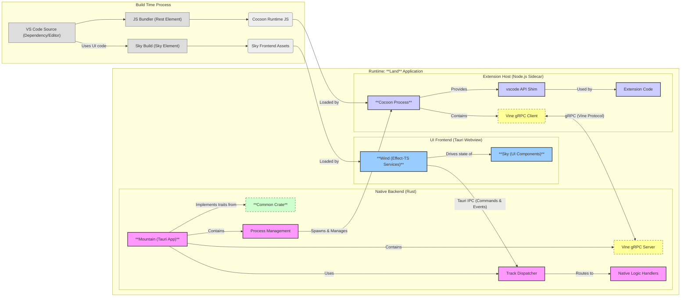

<table>
	<tr>
		<td colspan="1">
			<h3 align="center">
				<picture>
					<source media="(prefers-color-scheme: dark)" srcset="https://editor.land/Dark/Image/GitHub/Land.svg" />
					<source media="(prefers-color-scheme: light)" srcset="https://editor.land/Image/GitHub/Land.svg" />
					
				</picture>
			</h3>
		</td>
		<td colspan="3" valign="top">
			<h3 align="center">
				Land&#x2001;🏞️
			</h3>
		</td>
	</tr>
	<tr>
		<td valign="top" colspan="1">
			<a href="https://GitHub.Com/CodeEditorLand/Common" target="_blank">
				<picture>
					<source media="(prefers-color-scheme: dark)" srcset="https://img.shields.io/github/last-commit/CodeEditorLand/Common?label=Update&color=black&labelColor=black&logoColor=white&logoWidth=0" />
					<source media="(prefers-color-scheme: light)" srcset="https://img.shields.io/github/last-commit/CodeEditorLand/Common?label=Update&color=white&labelColor=white&logoColor=black&logoWidth=0" />
					
				</picture>
			</a>
			<br />
			<a href="https://GitHub.Com/CodeEditorLand/Common" target="_blank">
				<picture>
					<source media="(prefers-color-scheme: dark)" srcset="https://img.shields.io/github/issues/CodeEditorLand/Common?label=Issue&color=black&labelColor=black&logoColor=white&logoWidth=0" />
					<source media="(prefers-color-scheme: light)" srcset="https://img.shields.io/github/issues/CodeEditorLand/Common?label=Issue&color=white&labelColor=white&logoColor=black&logoWidth=0" />
					
				</picture>
			</a>
			<br />
		</td>
		<td valign="top" colspan="1">
			<a href="https://github.com/CodeEditorLand/Common" target="_blank">
				<picture>
					<source media="(prefers-color-scheme: dark)" srcset="https://img.shields.io/github/stars/CodeEditorLand/Common?style=flat&label=Star&logo=github&color=black&labelColor=black&logoColor=white&logoWidth=0" />
					<source media="(prefers-color-scheme: light)" srcset="https://img.shields.io/github/stars/CodeEditorLand/Common?style=flat&label=Star&logo=github&color=white&labelColor=white&logoColor=black&logoWidth=0" />
					
				</picture>
			</a>
			<br />
			<a href="https://GitHub.Com/CodeEditorLand/Common" target="_blank">
				<picture>
					<source media="(prefers-color-scheme: dark)" srcset="https://img.shields.io/github/downloads/CodeEditorLand/Common/total?label=Download&color=black&labelColor=black&logoColor=white&logoWidth=0" />
					<source media="(prefers-color-scheme: light)" srcset="https://img.shields.io/github/downloads/CodeEditorLand/Common/total?label=Download&color=white&labelColor=white&logoColor=black&logoWidth=0" />
					
				</picture>
			</a>
			<br />
			<a href="https://github.com/CodeEditorLand/Common" target="_blank">
				<b>
					Common&#x2001;🧑🏻‍🏭
				</b>
			</a>
		</td>
		<td valign="top" colspan="1">
			<a href="https://GitHub.Com/CodeEditorLand/Echo" target="_blank">
				<picture>
					<source media="(prefers-color-scheme: dark)" srcset="https://img.shields.io/github/last-commit/CodeEditorLand/Echo?label=Update&color=black&labelColor=black&logoColor=white&logoWidth=0" />
					<source media="(prefers-color-scheme: light)" srcset="https://img.shields.io/github/last-commit/CodeEditorLand/Echo?label=Update&color=white&labelColor=white&logoColor=black&logoWidth=0" />
					
				</picture>
			</a>
			<br />
			<a href="https://GitHub.Com/CodeEditorLand/Echo" target="_blank">
				<picture>
					<source media="(prefers-color-scheme: dark)" srcset="https://img.shields.io/github/issues/CodeEditorLand/Echo?label=Issue&color=black&labelColor=black&logoColor=white&logoWidth=0" />
					<source media="(prefers-color-scheme: light)" srcset="https://img.shields.io/github/issues/CodeEditorLand/Echo?label=Issue&color=white&labelColor=white&logoColor=black&logoWidth=0" />
					
				</picture>
			</a>
			<br />
		</td>
		<td valign="top" colspan="1">
			<a href="https://github.com/CodeEditorLand/Echo" target="_blank">
				<picture>
					<source media="(prefers-color-scheme: dark)" srcset="https://img.shields.io/github/stars/CodeEditorLand/Echo?style=flat&label=Star&logo=github&color=black&labelColor=black&logoColor=white&logoWidth=0" />
					<source media="(prefers-color-scheme: light)" srcset="https://img.shields.io/github/stars/CodeEditorLand/Echo?style=flat&label=Star&logo=github&color=white&labelColor=white&logoColor=black&logoWidth=0" />
					
				</picture>
			</a>
			<br />
			<a href="https://GitHub.Com/CodeEditorLand/Echo" target="_blank">
				<picture>
					<source media="(prefers-color-scheme: dark)" srcset="https://img.shields.io/github/downloads/CodeEditorLand/Echo/total?label=Download&color=black&labelColor=black&logoColor=white&logoWidth=0" />
					<source media="(prefers-color-scheme: light)" srcset="https://img.shields.io/github/downloads/CodeEditorLand/Echo/total?label=Download&color=white&labelColor=white&logoColor=black&logoWidth=0" />
					
				</picture>
			</a>
			<br />
			<a href="https://github.com/CodeEditorLand/Echo" target="_blank">
				<b>
					Echo&#x2001;📣
				</b>
			</a>
		</td>
	</tr>
	<tr>
		<td valign="top" colspan="1">
			<a href="https://GitHub.Com/CodeEditorLand/Vine" target="_blank">
				<picture>
					<source media="(prefers-color-scheme: dark)" srcset="https://img.shields.io/github/last-commit/CodeEditorLand/Vine?label=Update&color=black&labelColor=black&logoColor=white&logoWidth=0" />
					<source media="(prefers-color-scheme: light)" srcset="https://img.shields.io/github/last-commit/CodeEditorLand/Vine?label=Update&color=white&labelColor=white&logoColor=black&logoWidth=0" />
					
				</picture>
			</a>
			<br />
			<a href="https://GitHub.Com/CodeEditorLand/Vine" target="_blank">
				<picture>
					<source media="(prefers-color-scheme: dark)" srcset="https://img.shields.io/github/issues/CodeEditorLand/Vine?label=Issue&color=black&labelColor=black&logoColor=white&logoWidth=0" />
					<source media="(prefers-color-scheme: light)" srcset="https://img.shields.io/github/issues/CodeEditorLand/Vine?label=Issue&color=white&labelColor=white&logoColor=black&logoWidth=0" />
					
				</picture>
			</a>
			<br />
		</td>
		<td valign="top" colspan="1">
			<a href="https://github.com/CodeEditorLand/Vine" target="_blank">
				<picture>
					<source media="(prefers-color-scheme: dark)" srcset="https://img.shields.io/github/stars/CodeEditorLand/Vine?style=flat&label=Star&logo=github&color=black&labelColor=black&logoColor=white&logoWidth=0" />
					<source media="(prefers-color-scheme: light)" srcset="https://img.shields.io/github/stars/CodeEditorLand/Vine?style=flat&label=Star&logo=github&color=white&labelColor=white&logoColor=black&logoWidth=0" />
					
				</picture>
			</a>
			<br />
			<a href="https://GitHub.Com/CodeEditorLand/Vine" target="_blank">
				<picture>
					<source media="(prefers-color-scheme: dark)" srcset="https://img.shields.io/github/downloads/CodeEditorLand/Vine/total?label=Download&color=black&labelColor=black&logoColor=white&logoWidth=0" />
					<source media="(prefers-color-scheme: light)" srcset="https://img.shields.io/github/downloads/CodeEditorLand/Vine/total?label=Download&color=white&labelColor=white&logoColor=black&logoWidth=0" />
					
				</picture>
			</a>
			<br />
			<a href="https://github.com/CodeEditorLand/Vine" target="_blank">
				<b>
					Vine&#x2001;🌿
				</b>
			</a>
		</td>
		<td valign="top" colspan="1">
			<a href="https://GitHub.Com/CodeEditorLand/Mountain" target="_blank">
				<picture>
					<source media="(prefers-color-scheme: dark)" srcset="https://img.shields.io/github/last-commit/CodeEditorLand/Mountain?label=Update&color=black&labelColor=black&logoColor=white&logoWidth=0" />
					<source media="(prefers-color-scheme: light)" srcset="https://img.shields.io/github/last-commit/CodeEditorLand/Mountain?label=Update&color=white&labelColor=white&logoColor=black&logoWidth=0" />
					
				</picture>
			</a>
			<br />
			<a href="https://GitHub.Com/CodeEditorLand/Mountain" target="_blank">
				<picture>
					<source media="(prefers-color-scheme: dark)" srcset="https://img.shields.io/github/issues/CodeEditorLand/Mountain?label=Issue&color=black&labelColor=black&logoColor=white&logoWidth=0" />
					<source media="(prefers-color-scheme: light)" srcset="https://img.shields.io/github/issues/CodeEditorLand/Mountain?label=Issue&color=white&labelColor=white&logoColor=black&logoWidth=0" />
					
				</picture>
			</a>
			<br />
		</td>
		<td valign="top" colspan="1">
			<a href="https://github.com/CodeEditorLand/Mountain" target="_blank">
				<picture>
					<source media="(prefers-color-scheme: dark)" srcset="https://img.shields.io/github/stars/CodeEditorLand/Mountain?style=flat&label=Star&logo=github&color=black&labelColor=black&logoColor=white&logoWidth=0" />
					<source media="(prefers-color-scheme: light)" srcset="https://img.shields.io/github/stars/CodeEditorLand/Mountain?style=flat&label=Star&logo=github&color=white&labelColor=white&logoColor=black&logoWidth=0" />
					
				</picture>
			</a>
			<br />
			<a href="https://GitHub.Com/CodeEditorLand/Mountain" target="_blank">
				<picture>
					<source media="(prefers-color-scheme: dark)" srcset="https://img.shields.io/github/downloads/CodeEditorLand/Mountain/total?label=Download&color=black&labelColor=black&logoColor=white&logoWidth=0" />
					<source media="(prefers-color-scheme: light)" srcset="https://img.shields.io/github/downloads/CodeEditorLand/Mountain/total?label=Download&color=white&labelColor=white&logoColor=black&logoWidth=0" />
					
				</picture>
			</a>
			<br />
			<a href="https://github.com/CodeEditorLand/Mountain" target="_blank">
				<b>
					Mountain&#x2001;⛰️
				</b>
			</a>
		</td>
	</tr>
	<tr>
		<td valign="top" colspan="1">
			<a href="https://GitHub.Com/CodeEditorLand/Rest" target="_blank">
				<picture>
					<source media="(prefers-color-scheme: dark)" srcset="https://img.shields.io/github/last-commit/CodeEditorLand/Rest?label=Update&color=black&labelColor=black&logoColor=white&logoWidth=0" />
					<source media="(prefers-color-scheme: light)" srcset="https://img.shields.io/github/last-commit/CodeEditorLand/Rest?label=Update&color=white&labelColor=white&logoColor=black&logoWidth=0" />
					
				</picture>
			</a>
			<br />
			<a href="https://GitHub.Com/CodeEditorLand/Rest" target="_blank">
				<picture>
					<source media="(prefers-color-scheme: dark)" srcset="https://img.shields.io/github/issues/CodeEditorLand/Rest?label=Issue&color=black&labelColor=black&logoColor=white&logoWidth=0" />
					<source media="(prefers-color-scheme: light)" srcset="https://img.shields.io/github/issues/CodeEditorLand/Rest?label=Issue&color=white&labelColor=white&logoColor=black&logoWidth=0" />
					
				</picture>
			</a>
			<br />
		</td>
		<td valign="top" colspan="1">
			<a href="https://github.com/CodeEditorLand/Rest" target="_blank">
				<picture>
					<source media="(prefers-color-scheme: dark)" srcset="https://img.shields.io/github/stars/CodeEditorLand/Rest?style=flat&label=Star&logo=github&color=black&labelColor=black&logoColor=white&logoWidth=0" />
					<source media="(prefers-color-scheme: light)" srcset="https://img.shields.io/github/stars/CodeEditorLand/Rest?style=flat&label=Star&logo=github&color=white&labelColor=white&logoColor=black&logoWidth=0" />
					
				</picture>
			</a>
			<br />
			<a href="https://GitHub.Com/CodeEditorLand/Rest" target="_blank">
				<picture>
					<source media="(prefers-color-scheme: dark)" srcset="https://img.shields.io/github/downloads/CodeEditorLand/Rest/total?label=Download&color=black&labelColor=black&logoColor=white&logoWidth=0" />
					<source media="(prefers-color-scheme: light)" srcset="https://img.shields.io/github/downloads/CodeEditorLand/Rest/total?label=Download&color=white&labelColor=white&logoColor=black&logoWidth=0" />
					
				</picture>
			</a>
			<br />
			<a href="https://github.com/CodeEditorLand/Rest" target="_blank">
				<b>
					Rest&#x2001;⛱️
				</b>
			</a>
		</td>
		<td valign="top" colspan="1">
			<a href="https://GitHub.Com/CodeEditorLand/Output" target="_blank">
				<picture>
					<source media="(prefers-color-scheme: dark)" srcset="https://img.shields.io/github/last-commit/CodeEditorLand/Output?label=Update&color=black&labelColor=black&logoColor=white&logoWidth=0" />
					<source media="(prefers-color-scheme: light)" srcset="https://img.shields.io/github/last-commit/CodeEditorLand/Output?label=Update&color=white&labelColor=white&logoColor=black&logoWidth=0" />
					
				</picture>
			</a>
			<br />
			<a href="https://GitHub.Com/CodeEditorLand/Output" target="_blank">
				<picture>
					<source media="(prefers-color-scheme: dark)" srcset="https://img.shields.io/github/issues/CodeEditorLand/Output?label=Issue&color=black&labelColor=black&logoColor=white&logoWidth=0" />
					<source media="(prefers-color-scheme: light)" srcset="https://img.shields.io/github/issues/CodeEditorLand/Output?label=Issue&color=white&labelColor=white&logoColor=black&logoWidth=0" />
					
				</picture>
			</a>
			<br />
		</td>
		<td valign="top" colspan="1">
			<a href="https://github.com/CodeEditorLand/Output" target="_blank">
				<picture>
					<source media="(prefers-color-scheme: dark)" srcset="https://img.shields.io/github/stars/CodeEditorLand/Output?style=flat&label=Star&logo=github&color=black&labelColor=black&logoColor=white&logoWidth=0" />
					<source media="(prefers-color-scheme: light)" srcset="https://img.shields.io/github/stars/CodeEditorLand/Output?style=flat&label=Star&logo=github&color=white&labelColor=white&logoColor=black&logoWidth=0" />
					
				</picture>
			</a>
			<br />
			<a href="https://GitHub.Com/CodeEditorLand/Output" target="_blank">
				<picture>
					<source media="(prefers-color-scheme: dark)" srcset="https://img.shields.io/github/downloads/CodeEditorLand/Output/total?label=Download&color=black&labelColor=black&logoColor=white&logoWidth=0" />
					<source media="(prefers-color-scheme: light)" srcset="https://img.shields.io/github/downloads/CodeEditorLand/Output/total?label=Download&color=white&labelColor=white&logoColor=black&logoWidth=0" />
					
				</picture>
			</a>
			<br />
			<a href="https://github.com/CodeEditorLand/Output" target="_blank">
				<b>
					Output&#x2001;⚫
				</b>
			</a>
		</td>
	</tr>
	<tr>
		<td valign="top" colspan="1">
			<a href="https://GitHub.Com/CodeEditorLand/Cocoon" target="_blank">
				<picture>
					<source media="(prefers-color-scheme: dark)" srcset="https://img.shields.io/github/last-commit/CodeEditorLand/Cocoon?label=Update&color=black&labelColor=black&logoColor=white&logoWidth=0" />
					<source media="(prefers-color-scheme: light)" srcset="https://img.shields.io/github/last-commit/CodeEditorLand/Cocoon?label=Update&color=white&labelColor=white&logoColor=black&logoWidth=0" />
					
				</picture>
			</a>
			<br />
			<a href="https://GitHub.Com/CodeEditorLand/Cocoon" target="_blank">
				<picture>
					<source media="(prefers-color-scheme: dark)" srcset="https://img.shields.io/github/issues/CodeEditorLand/Cocoon?label=Issue&color=black&labelColor=black&logoColor=white&logoWidth=0" />
					<source media="(prefers-color-scheme: light)" srcset="https://img.shields.io/github/issues/CodeEditorLand/Cocoon?label=Issue&color=white&labelColor=white&logoColor=black&logoWidth=0" />
					
				</picture>
			</a>
			<br />
		</td>
		<td valign="top" colspan="1">
			<a href="https://github.com/CodeEditorLand/Cocoon" target="_blank">
				<picture>
					<source media="(prefers-color-scheme: dark)" srcset="https://img.shields.io/github/stars/CodeEditorLand/Cocoon?style=flat&label=Star&logo=github&color=black&labelColor=black&logoColor=white&logoWidth=0" />
					<source media="(prefers-color-scheme: light)" srcset="https://img.shields.io/github/stars/CodeEditorLand/Cocoon?style=flat&label=Star&logo=github&color=white&labelColor=white&logoColor=black&logoWidth=0" />
					
				</picture>
			</a>
			<br />
			<a href="https://GitHub.Com/CodeEditorLand/Cocoon" target="_blank">
				<picture>
					<source media="(prefers-color-scheme: dark)" srcset="https://img.shields.io/github/downloads/CodeEditorLand/Cocoon/total?label=Download&color=black&labelColor=black&logoColor=white&logoWidth=0" />
					<source media="(prefers-color-scheme: light)" srcset="https://img.shields.io/github/downloads/CodeEditorLand/Cocoon/total?label=Download&color=white&labelColor=white&logoColor=black&logoWidth=0" />
					
				</picture>
			</a>
			<br />
			<a href="https://github.com/CodeEditorLand/Cocoon" target="_blank">
				<b>
					Cocoon&#x2001;🦋
				</b>
			</a>
		</td>
		<td valign="top" colspan="1">
			<a href="https://GitHub.Com/CodeEditorLand/Wind" target="_blank">
				<picture>
					<source media="(prefers-color-scheme: dark)" srcset="https://img.shields.io/github/last-commit/CodeEditorLand/Wind?label=Update&color=black&labelColor=black&logoColor=white&logoWidth=0" />
					<source media="(prefers-color-scheme: light)" srcset="https://img.shields.io/github/last-commit/CodeEditorLand/Wind?label=Update&color=white&labelColor=white&logoColor=black&logoWidth=0" />
					
				</picture>
			</a>
			<br />
			<a href="https://GitHub.Com/CodeEditorLand/Wind" target="_blank">
				<picture>
					<source media="(prefers-color-scheme: dark)" srcset="https://img.shields.io/github/issues/CodeEditorLand/Wind?label=Issue&color=black&labelColor=black&logoColor=white&logoWidth=0" />
					<source media="(prefers-color-scheme: light)" srcset="https://img.shields.io/github/issues/CodeEditorLand/Wind?label=Issue&color=white&labelColor=white&logoColor=black&logoWidth=0" />
					
				</picture>
			</a>
			<br />
		</td>
		<td valign="top" colspan="1">
			<a href="https://github.com/CodeEditorLand/Wind" target="_blank">
				<picture>
					<source media="(prefers-color-scheme: dark)" srcset="https://img.shields.io/github/stars/CodeEditorLand/Wind?style=flat&label=Star&logo=github&color=black&labelColor=black&logoColor=white&logoWidth=0" />
					<source media="(prefers-color-scheme: light)" srcset="https://img.shields.io/github/stars/CodeEditorLand/Wind?style=flat&label=Star&logo=github&color=white&labelColor=white&logoColor=black&logoWidth=0" />
					
				</picture>
			</a>
			<br />
			<a href="https://GitHub.Com/CodeEditorLand/Wind" target="_blank">
				<picture>
					<source media="(prefers-color-scheme: dark)" srcset="https://img.shields.io/github/downloads/CodeEditorLand/Wind/total?label=Download&color=black&labelColor=black&logoColor=white&logoWidth=0" />
					<source media="(prefers-color-scheme: light)" srcset="https://img.shields.io/github/downloads/CodeEditorLand/Wind/total?label=Download&color=white&labelColor=white&logoColor=black&logoWidth=0" />
					
				</picture>
			</a>
			<br />
			<a href="https://github.com/CodeEditorLand/Wind" target="_blank">
				<b>
					Wind&#x2001;🍃
				</b>
			</a>
		</td>
	</tr>
	<tr>
		<td valign="top" colspan="1">
			<a href="https://GitHub.Com/CodeEditorLand/Worker" target="_blank">
				<picture>
					<source media="(prefers-color-scheme: dark)" srcset="https://img.shields.io/github/last-commit/CodeEditorLand/Worker?label=Update&color=black&labelColor=black&logoColor=white&logoWidth=0" />
					<source media="(prefers-color-scheme: light)" srcset="https://img.shields.io/github/last-commit/CodeEditorLand/Worker?label=Update&color=white&labelColor=white&logoColor=black&logoWidth=0" />
					
				</picture>
			</a>
			<br />
			<a href="https://GitHub.Com/CodeEditorLand/Worker" target="_blank">
				<picture>
					<source media="(prefers-color-scheme: dark)" srcset="https://img.shields.io/github/issues/CodeEditorLand/Worker?label=Issue&color=black&labelColor=black&logoColor=white&logoWidth=0" />
					<source media="(prefers-color-scheme: light)" srcset="https://img.shields.io/github/issues/CodeEditorLand/Worker?label=Issue&color=white&labelColor=white&logoColor=black&logoWidth=0" />
					
				</picture>
			</a>
			<br />
		</td>
		<td valign="top" colspan="1">
			<a href="https://github.com/CodeEditorLand/Worker" target="_blank">
				<picture>
					<source media="(prefers-color-scheme: dark)" srcset="https://img.shields.io/github/stars/CodeEditorLand/Worker?style=flat&label=Star&logo=github&color=black&labelColor=black&logoColor=white&logoWidth=0" />
					<source media="(prefers-color-scheme: light)" srcset="https://img.shields.io/github/stars/CodeEditorLand/Worker?style=flat&label=Star&logo=github&color=white&labelColor=white&logoColor=black&logoWidth=0" />
					
				</picture>
			</a>
			<br />
			<a href="https://GitHub.Com/CodeEditorLand/Worker" target="_blank">
				<picture>
					<source media="(prefers-color-scheme: dark)" srcset="https://img.shields.io/github/downloads/CodeEditorLand/Worker/total?label=Download&color=black&labelColor=black&logoColor=white&logoWidth=0" />
					<source media="(prefers-color-scheme: light)" srcset="https://img.shields.io/github/downloads/CodeEditorLand/Worker/total?label=Download&color=white&labelColor=white&logoColor=black&logoWidth=0" />
					
				</picture>
			</a>
			<br />
			<a href="https://github.com/CodeEditorLand/Worker" target="_blank">
				<b>
					Worker&#x2001;🍩
				</b>
			</a>
		</td>
		<td valign="top" colspan="1">
			<a href="https://GitHub.Com/CodeEditorLand/Sky" target="_blank">
				<picture>
					<source media="(prefers-color-scheme: dark)" srcset="https://img.shields.io/github/last-commit/CodeEditorLand/Sky?label=Update&color=black&labelColor=black&logoColor=white&logoWidth=0" />
					<source media="(prefers-color-scheme: light)" srcset="https://img.shields.io/github/last-commit/CodeEditorLand/Sky?label=Update&color=white&labelColor=white&logoColor=black&logoWidth=0" />
					
				</picture>
			</a>
			<br />
			<a href="https://GitHub.Com/CodeEditorLand/Sky" target="_blank">
				<picture>
					<source media="(prefers-color-scheme: dark)" srcset="https://img.shields.io/github/issues/CodeEditorLand/Sky?label=Issue&color=black&labelColor=black&logoColor=white&logoWidth=0" />
					<source media="(prefers-color-scheme: light)" srcset="https://img.shields.io/github/issues/CodeEditorLand/Sky?label=Issue&color=white&labelColor=white&logoColor=black&logoWidth=0" />
					
				</picture>
			</a>
			<br />
		</td>
		<td valign="top" colspan="1">
			<a href="https://github.com/CodeEditorLand/Sky" target="_blank">
				<picture>
					<source media="(prefers-color-scheme: dark)" srcset="https://img.shields.io/github/stars/CodeEditorLand/Sky?style=flat&label=Star&logo=github&color=black&labelColor=black&logoColor=white&logoWidth=0" />
					<source media="(prefers-color-scheme: light)" srcset="https://img.shields.io/github/stars/CodeEditorLand/Sky?style=flat&label=Star&logo=github&color=white&labelColor=white&logoColor=black&logoWidth=0" />
					
				</picture>
			</a>
			<br />
			<a href="https://GitHub.Com/CodeEditorLand/Sky" target="_blank">
				<picture>
					<source media="(prefers-color-scheme: dark)" srcset="https://img.shields.io/github/downloads/CodeEditorLand/Sky/total?label=Download&color=black&labelColor=black&logoColor=white&logoWidth=0" />
					<source media="(prefers-color-scheme: light)" srcset="https://img.shields.io/github/downloads/CodeEditorLand/Sky/total?label=Download&color=white&labelColor=white&logoColor=black&logoWidth=0" />
					
				</picture>
			</a>
			<br />
			<a href="https://github.com/CodeEditorLand/Sky" target="_blank">
				<b>
					Sky&#x2001;🌌
				</b>
			</a>
		</td>
	</tr>
	<tr>
		<td valign="top" colspan="1">
			<a href="https://GitHub.Com/CodeEditorLand/Mist" target="_blank">
				<picture>
					<source media="(prefers-color-scheme: dark)" srcset="https://img.shields.io/github/last-commit/CodeEditorLand/Mist?label=Update&color=black&labelColor=black&logoColor=white&logoWidth=0" />
					<source media="(prefers-color-scheme: light)" srcset="https://img.shields.io/github/last-commit/CodeEditorLand/Mist?label=Update&color=white&labelColor=white&logoColor=black&logoWidth=0" />
					
				</picture>
			</a>
			<br />
			<a href="https://GitHub.Com/CodeEditorLand/Mist" target="_blank">
				<picture>
					<source media="(prefers-color-scheme: dark)" srcset="https://img.shields.io/github/issues/CodeEditorLand/Mist?label=Issue&color=black&labelColor=black&logoColor=white&logoWidth=0" />
					<source media="(prefers-color-scheme: light)" srcset="https://img.shields.io/github/issues/CodeEditorLand/Mist?label=Issue&color=white&labelColor=white&logoColor=black&logoWidth=0" />
					
				</picture>
			</a>
			<br />
		</td>
		<td valign="top" colspan="1">
			<a href="https://github.com/CodeEditorLand/Mist" target="_blank">
				<picture>
					<source media="(prefers-color-scheme: dark)" srcset="https://img.shields.io/github/stars/CodeEditorLand/Mist?style=flat&label=Star&logo=github&color=black&labelColor=black&logoColor=white&logoWidth=0" />
					<source media="(prefers-color-scheme: light)" srcset="https://img.shields.io/github/stars/CodeEditorLand/Mist?style=flat&label=Star&logo=github&color=white&labelColor=white&logoColor=black&logoWidth=0" />
					
				</picture>
			</a>
			<br />
			<a href="https://GitHub.Com/CodeEditorLand/Mist" target="_blank">
				<picture>
					<source media="(prefers-color-scheme: dark)" srcset="https://img.shields.io/github/downloads/CodeEditorLand/Mist/total?label=Download&color=black&labelColor=black&logoColor=white&logoWidth=0" />
					<source media="(prefers-color-scheme: light)" srcset="https://img.shields.io/github/downloads/CodeEditorLand/Mist/total?label=Download&color=white&labelColor=white&logoColor=black&logoWidth=0" />
					
				</picture>
			</a>
			<br />
			<a href="https://github.com/CodeEditorLand/Mist" target="_blank">
				<b>
					Mist&#x2001;🌫️
				</b>
			</a>
		</td>
		<td valign="top" colspan="1">
			<a href="https://GitHub.Com/CodeEditorLand/Maintain" target="_blank">
				<picture>
					<source media="(prefers-color-scheme: dark)" srcset="https://img.shields.io/github/last-commit/CodeEditorLand/Maintain?label=Update&color=black&labelColor=black&logoColor=white&logoWidth=0" />
					<source media="(prefers-color-scheme: light)" srcset="https://img.shields.io/github/last-commit/CodeEditorLand/Maintain?label=Update&color=white&labelColor=white&logoColor=black&logoWidth=0" />
					
				</picture>
			</a>
			<br />
			<a href="https://GitHub.Com/CodeEditorLand/Maintain" target="_blank">
				<picture>
					<source media="(prefers-color-scheme: dark)" srcset="https://img.shields.io/github/issues/CodeEditorLand/Maintain?label=Issue&color=black&labelColor=black&logoColor=white&logoWidth=0" />
					<source media="(prefers-color-scheme: light)" srcset="https://img.shields.io/github/issues/CodeEditorLand/Maintain?label=Issue&color=white&labelColor=white&logoColor=black&logoWidth=0" />
					
				</picture>
			</a>
			<br />
		</td>
		<td valign="top" colspan="1">
			<a href="https://github.com/CodeEditorLand/Maintain" target="_blank">
				<picture>
					<source media="(prefers-color-scheme: dark)" srcset="https://img.shields.io/github/stars/CodeEditorLand/Maintain?style=flat&label=Star&logo=github&color=black&labelColor=black&logoColor=white&logoWidth=0" />
					<source media="(prefers-color-scheme: light)" srcset="https://img.shields.io/github/stars/CodeEditorLand/Maintain?style=flat&label=Star&logo=github&color=white&labelColor=white&logoColor=black&logoWidth=0" />
					
				</picture>
			</a>
			<br />
			<a href="https://GitHub.Com/CodeEditorLand/Maintain" target="_blank">
				<picture>
					<source media="(prefers-color-scheme: dark)" srcset="https://img.shields.io/github/downloads/CodeEditorLand/Maintain/total?label=Download&color=black&labelColor=black&logoColor=white&logoWidth=0" />
					<source media="(prefers-color-scheme: light)" srcset="https://img.shields.io/github/downloads/CodeEditorLand/Maintain/total?label=Download&color=white&labelColor=white&logoColor=black&logoWidth=0" />
					
				</picture>
			</a>
			<br />
			<a href="https://github.com/CodeEditorLand/Maintain" target="_blank">
				<b>
					Maintain&#x2001;💪🏻
				</b>
			</a>
		</td>
	</tr>
	<tr>
		<td valign="top" colspan="1">
			<a href="https://GitHub.Com/CodeEditorLand/Grove" target="_blank">
				<picture>
					<source media="(prefers-color-scheme: dark)" srcset="https://img.shields.io/github/last-commit/CodeEditorLand/Grove?label=Update&color=black&labelColor=black&logoColor=white&logoWidth=0" />
					<source media="(prefers-color-scheme: light)" srcset="https://img.shields.io/github/last-commit/CodeEditorLand/Grove?label=Update&color=white&labelColor=white&logoColor=black&logoWidth=0" />
					
				</picture>
			</a>
			<br />
			<a href="https://GitHub.Com/CodeEditorLand/Grove" target="_blank">
				<picture>
					<source media="(prefers-color-scheme: dark)" srcset="https://img.shields.io/github/issues/CodeEditorLand/Grove?label=Issue&color=black&labelColor=black&logoColor=white&logoWidth=0" />
					<source media="(prefers-color-scheme: light)" srcset="https://img.shields.io/github/issues/CodeEditorLand/Grove?label=Issue&color=white&labelColor=white&logoColor=black&logoWidth=0" />
					
				</picture>
			</a>
			<br />
		</td>
		<td valign="top" colspan="1">
			<a href="https://github.com/CodeEditorLand/Grove" target="_blank">
				<picture>
					<source media="(prefers-color-scheme: dark)" srcset="https://img.shields.io/github/stars/CodeEditorLand/Grove?style=flat&label=Star&logo=github&color=black&labelColor=black&logoColor=white&logoWidth=0" />
					<source media="(prefers-color-scheme: light)" srcset="https://img.shields.io/github/stars/CodeEditorLand/Grove?style=flat&label=Star&logo=github&color=white&labelColor=white&logoColor=black&logoWidth=0" />
					
				</picture>
			</a>
			<br />
			<a href="https://GitHub.Com/CodeEditorLand/Grove" target="_blank">
				<picture>
					<source media="(prefers-color-scheme: dark)" srcset="https://img.shields.io/github/downloads/CodeEditorLand/Grove/total?label=Download&color=black&labelColor=black&logoColor=white&logoWidth=0" />
					<source media="(prefers-color-scheme: light)" srcset="https://img.shields.io/github/downloads/CodeEditorLand/Grove/total?label=Download&color=white&labelColor=white&logoColor=black&logoWidth=0" />
					
				</picture>
			</a>
			<br />
			<a href="https://github.com/CodeEditorLand/Grove" target="_blank">
				<b>
					Grove&#x2001;🌳
				</b>
			</a>
		</td>
		<td valign="top" colspan="1">
			<a href="https://GitHub.Com/CodeEditorLand/Land" target="_blank">
				<picture>
					<source media="(prefers-color-scheme: dark)" srcset="https://img.shields.io/github/last-commit/CodeEditorLand/Land?label=Update&color=black&labelColor=black&logoColor=white&logoWidth=0" />
					<source media="(prefers-color-scheme: light)" srcset="https://img.shields.io/github/last-commit/CodeEditorLand/Land?label=Update&color=white&labelColor=white&logoColor=black&logoWidth=0" />
					
				</picture>
			</a>
			<br />
			<a href="https://GitHub.Com/CodeEditorLand/Land" target="_blank">
				<picture>
					<source media="(prefers-color-scheme: dark)" srcset="https://img.shields.io/github/issues/CodeEditorLand/Land?label=Issue&color=black&labelColor=black&logoColor=white&logoWidth=0" />
					<source media="(prefers-color-scheme: light)" srcset="https://img.shields.io/github/issues/CodeEditorLand/Land?label=Issue&color=white&labelColor=white&logoColor=black&logoWidth=0" />
					
				</picture>
			</a>
			<br />
		</td>
		<td valign="top" colspan="1">
			<a href="https://github.com/CodeEditorLand/Land" target="_blank">
				<picture>
					<source media="(prefers-color-scheme: dark)" srcset="https://img.shields.io/github/stars/CodeEditorLand/Land?style=flat&label=Star&logo=github&color=black&labelColor=black&logoColor=white&logoWidth=0" />
					<source media="(prefers-color-scheme: light)" srcset="https://img.shields.io/github/stars/CodeEditorLand/Land?style=flat&label=Star&logo=github&color=white&labelColor=white&logoColor=black&logoWidth=0" />
					
				</picture>
			</a>
			<br />
			<a href="https://GitHub.Com/CodeEditorLand/Land" target="_blank">
				<picture>
					<source media="(prefers-color-scheme: dark)" srcset="https://img.shields.io/github/downloads/CodeEditorLand/Land/total?label=Download&color=black&labelColor=black&logoColor=white&logoWidth=0" />
					<source media="(prefers-color-scheme: light)" srcset="https://img.shields.io/github/downloads/CodeEditorLand/Land/total?label=Download&color=white&labelColor=white&logoColor=black&logoWidth=0" />
					
				</picture>
			</a>
			<br />
			<a href="https://github.com/CodeEditorLand/Land" target="_blank">
				<b>
					Land&#x2001;🏞️
				</b>
			</a>
		</td>
	</tr>
	<tr>
		<td valign="top" colspan="1">
			<a href="https://GitHub.Com/CodeEditorLand/Editor" target="_blank">
				<picture>
					<source media="(prefers-color-scheme: dark)" srcset="https://img.shields.io/github/last-commit/CodeEditorLand/Editor?label=Update&color=black&labelColor=black&logoColor=white&logoWidth=0" />
					<source media="(prefers-color-scheme: light)" srcset="https://img.shields.io/github/last-commit/CodeEditorLand/Editor?label=Update&color=white&labelColor=white&logoColor=black&logoWidth=0" />
					
				</picture>
			</a>
			<br />
			<a href="https://GitHub.Com/CodeEditorLand/Editor" target="_blank">
				<picture>
					<source media="(prefers-color-scheme: dark)" srcset="https://img.shields.io/github/issues/CodeEditorLand/Editor?label=Issue&color=black&labelColor=black&logoColor=white&logoWidth=0" />
					<source media="(prefers-color-scheme: light)" srcset="https://img.shields.io/github/issues/CodeEditorLand/Editor?label=Issue&color=white&labelColor=white&logoColor=black&logoWidth=0" />
					
				</picture>
			</a>
			<br />
		</td>
		<td valign="top" colspan="1">
			<a href="https://github.com/CodeEditorLand/Editor" target="_blank">
				<picture>
					<source media="(prefers-color-scheme: dark)" srcset="https://img.shields.io/github/stars/CodeEditorLand/Editor?style=flat&label=Star&logo=github&color=black&labelColor=black&logoColor=white&logoWidth=0" />
					<source media="(prefers-color-scheme: light)" srcset="https://img.shields.io/github/stars/CodeEditorLand/Editor?style=flat&label=Star&logo=github&color=white&labelColor=white&logoColor=black&logoWidth=0" />
					
				</picture>
			</a>
			<br />
			<a href="https://GitHub.Com/CodeEditorLand/Editor" target="_blank">
				<picture>
					<source media="(prefers-color-scheme: dark)" srcset="https://img.shields.io/github/downloads/CodeEditorLand/Editor/total?label=Download&color=black&labelColor=black&logoColor=white&logoWidth=0" />
					<source media="(prefers-color-scheme: light)" srcset="https://img.shields.io/github/downloads/CodeEditorLand/Editor/total?label=Download&color=white&labelColor=white&logoColor=black&logoWidth=0" />
					
				</picture>
			</a>
			<br />
			<a href="https://github.com/CodeEditorLand/Editor" target="_blank">
				<b>
					Editor&#x2001;💻
				</b>
			</a>
		</td>
		<td valign="top" colspan="1">
			<a href="https://GitHub.Com/CodeEditorLand/Element" target="_blank">
				<picture>
					<source media="(prefers-color-scheme: dark)" srcset="https://img.shields.io/github/last-commit/CodeEditorLand/Element?label=Update&color=black&labelColor=black&logoColor=white&logoWidth=0" />
					<source media="(prefers-color-scheme: light)" srcset="https://img.shields.io/github/last-commit/CodeEditorLand/Element?label=Update&color=white&labelColor=white&logoColor=black&logoWidth=0" />
					
				</picture>
			</a>
			<br />
			<a href="https://GitHub.Com/CodeEditorLand/Element" target="_blank">
				<picture>
					<source media="(prefers-color-scheme: dark)" srcset="https://img.shields.io/github/issues/CodeEditorLand/Element?label=Issue&color=black&labelColor=black&logoColor=white&logoWidth=0" />
					<source media="(prefers-color-scheme: light)" srcset="https://img.shields.io/github/issues/CodeEditorLand/Element?label=Issue&color=white&labelColor=white&logoColor=black&logoWidth=0" />
					
				</picture>
			</a>
			<br />
		</td>
		<td valign="top" colspan="1">
			<a href="https://github.com/CodeEditorLand/Element" target="_blank">
				<picture>
					<source media="(prefers-color-scheme: dark)" srcset="https://img.shields.io/github/stars/CodeEditorLand/Element?style=flat&label=Star&logo=github&color=black&labelColor=black&logoColor=white&logoWidth=0" />
					<source media="(prefers-color-scheme: light)" srcset="https://img.shields.io/github/stars/CodeEditorLand/Element?style=flat&label=Star&logo=github&color=white&labelColor=white&logoColor=black&logoWidth=0" />
					
				</picture>
			</a>
			<br />
			<a href="https://GitHub.Com/CodeEditorLand/Element" target="_blank">
				<picture>
					<source media="(prefers-color-scheme: dark)" srcset="https://img.shields.io/github/downloads/CodeEditorLand/Element/total?label=Download&color=black&labelColor=black&logoColor=white&logoWidth=0" />
					<source media="(prefers-color-scheme: light)" srcset="https://img.shields.io/github/downloads/CodeEditorLand/Element/total?label=Download&color=white&labelColor=white&logoColor=black&logoWidth=0" />
					
				</picture>
			</a>
			<br />
			<a href="https://github.com/CodeEditorLand/Element" target="_blank">
				<b>
					Element&#x2001;🌱
				</b>
			</a>
		</td>
	</tr>
</table>

---

<table>
	<tr>
		<td align="left" valign="middle">
			<h3 align="left">
				<a href="https://editor.land" target="_blank">
					<picture>
						<source media="(prefers-color-scheme: dark)" srcset="https://editor.land/Dark/Image/GitHub/Land.svg" />
						<source media="(prefers-color-scheme: light)" srcset="https://editor.land/Image/GitHub/Land.svg" />
						
					</picture>
				</a>
			</h3>
		</td>
		<td align="left" valign="middle">
			<h3 align="left">
				<a href="https://editor.land" target="_blank">
					Land
				</a>
			</h3>
		</td>
		<td align="left" valign="middle">
			<h3 align="left">
				🏞️
			</h3>
		</td>
		<td align="left" valign="middle">
			<h3 align="left">
				+
			</h3>
		</td>
		<td align="left" valign="middle" width="190">
			<h3 align="left">
				<a href="https://Tauri.App" target="_blank">
					<picture>
						<source media="(prefers-color-scheme: dark)" srcset="https://editor.land/Dark/Image/GitHub/Made/Tauri.svg" />
						<source media="(prefers-color-scheme: light)" srcset="https://editor.land/Image/GitHub/Made/Tauri.svg" />
						
					</picture>
				</a>
			</h3>
		</td>
	</tr>
</table>

---

# **Land**&#x2001;🏞️&#x2001;The Next-Generation Code Editor

**Land** is a high-performance, resource-efficient, cross-platform code editor.
It keeps the shape of the VS Code workbench and the VS Code extension API, and
replaces the runtime underneath with **Rust**, **Tauri** and **Effect-TS**.

This repository - [`CodeEditorLand/Land`][Land] - is the umbrella project. It
carries no editor logic of its own. What it carries is the workspace that binds
the Elements together: the Cargo and pnpm workspace manifests, the build
scripts, the architecture documentation, and the submodule pointers that pin
every Element at a known revision.

## Orientation&#x2001;🧭

Each Element listed in the badge grid above is a separate GitHub repository
under the `CodeEditorLand` organisation. **Land** checks them out as submodules
and compiles them into one application.

### What This Repository Contains&#x2001;📦

| Path in `Land`                                                                                        | What lives there                                                          |
| :---------------------------------------------------------------------------------------------------- | :------------------------------------------------------------------------- |
| [`Element/`](https://github.com/CodeEditorLand/Element/tree/Current)                                  | Every Element, each one its own Git repository                            |
| [`Dependency/`](https://github.com/CodeEditorLand/Dependency/tree/Current)                            | Vendored upstreams: Microsoft, Tauri, SWC, OXC, Biome and Rolldown         |
| [`Documentation/`](https://github.com/CodeEditorLand/Land/tree/Current/Documentation)                 | Architecture notes, workflow walkthroughs and module deep dives            |
| [`Maintain/`](https://github.com/CodeEditorLand/Land/tree/Current/Maintain)                           | Build, debug, release and repository scripts                              |
| [`Cargo.toml`](https://github.com/CodeEditorLand/Land/tree/Current/Cargo.toml)                        | The Rust workspace that unifies every Rust Element                        |
| [`pnpm-workspace.yaml`](https://github.com/CodeEditorLand/Land/tree/Current/pnpm-workspace.yaml)      | The pnpm workspace that unifies every TypeScript Element                  |

### Where to Go Next&#x2001;📍

| If you want to                 | Read                                                                                                                              |
| :----------------------------- | :-------------------------------------------------------------------------------------------------------------------------------- |
| See the whole component map    | The **Core Architecture** table further down this page                                                                            |
| Follow a request end to end    | [`Documentation/GitHub/Workflow.md`](https://github.com/CodeEditorLand/Land/tree/Current/Documentation/GitHub/Workflow.md)         |
| Understand the layering        | [`Documentation/GitHub/Architecture.md`](https://github.com/CodeEditorLand/Land/tree/Current/Documentation/GitHub/Architecture.md) |
| Build it locally               | The **Getting Started** section further down this page                                                                            |
| Read one Element in depth      | That Element's own repository, linked from the Element table                                                                      |

---

## Overview&#x2001;📖

Welcome to **Land**! We are building a high-performance, resource-efficient, and
cross-platform code editor inspired by the architecture of VS Code, but
re-imagined with a modern, declarative, and type-safe stack. **Land** is
engineered with **Rust** and **Tauri** for the native backend (`Mountain`) and
**TypeScript** with **Effect-TS** for all application logic (`Wind` and
`Cocoon`).

Our vision is to deliver a lightning-fast and deeply reliable editing experience
by leveraging declarative, effects-based programming across the entire
application. This architecture ensures that all side effects from filesystem
operations to UI updates and network requests are handled in a structured,
testable, and composable way.

---

## Key Features & Architectural Highlights&#x2001;🔐

- **Declarative Effect System:** The entire application, from the Rust backend
  to the TypeScript frontend, is built on an effects-based architecture. We use
  a custom `ActionEffect` system in Rust and **Effect-TS** in TypeScript. This
  provides compile-time guarantees for error handling, resource management, and
  asynchronicity, leading to exceptional stability.
- **High-Performance Backend:** The `Mountain` backend is written in Rust,
  providing native speed for all core operations like file I/O, search, and
  process management.
- **High-Fidelity Extension Host:** The `Cocoon` sidecar is a Node.js process
  designed to run existing VS Code extensions with high compatibility. It
  provides a sandboxed `vscode` API, built with Effect-TS, that communicates
  with `Mountain` for all native operations.
- **Modern UI Services:** The `Wind` project is a from-scratch, Effect-TS native
  re-implementation of the VS Code workbench services, providing a clean,
  functional, and testable foundation for the UI.
- **Strongly-Typed IPC:** All communication between the `Mountain` backend and
  the `Cocoon` extension host is handled via **gRPC**, ensuring a robust,
  performant, and strongly-typed API contract defined in a `.proto` file.

### The Effect System in One Type&#x2001;⚙️

Every privileged operation in the Rust half of the editor is expressed as an
`ActionEffect`: a closure plus the capability it needs, held as a value until a
runtime chooses to run it.

**[`Element/Common/Source/Effect/ActionEffect.rs`](https://github.com/CodeEditorLand/Common/tree/Current/Source/Effect/ActionEffect.rs)**

```rs
pub struct ActionEffect<TCapability, TError, TOutput> {
	pub Function:
		Arc<dyn Fn(TCapability) -> Pin<Box<dyn Future<Output = Result<TOutput, TError>> + Send>> + Send + Sync>,
}
```

> [!NOTE]
>
> The capability parameter is what makes an effect testable - swap the
> capability and the same effect runs against a fake filesystem.

### The gRPC Contract&#x2001;🔌

`Vine` owns the wire format between `Mountain` and `Cocoon`. The service
definition is the single source of truth; both the Rust server and the
TypeScript client are generated from it.

**[`Element/Vine/Proto/Vine.proto`](https://github.com/CodeEditorLand/Vine/tree/Current/Proto/Vine.proto)**

```proto
service MountainService {
  rpc ProcessCocoonRequest(GenericRequest) returns (GenericResponse);
  rpc OpenChannelFromCocoon(stream Envelope) returns (stream Envelope);
}
```

> [!NOTE]
>
> The unary call remains for single round-trips; the bidirectional stream
> multiplexes concurrent traffic and routes frames by `correlation_id`.

---

## Core Architecture&#x2001;🏗️

**Land**'s architecture is composed of several key components that work in
concert to deliver a modern editing experience.

| Component                       | Role & Key Responsibilities                                                                                                                                                                                                           | Primary Technologies                 |
| :------------------------------ | :------------------------------------------------------------------------------------------------------------------------------------------------------------------------------------------------------------------------------------ | :----------------------------------- |
| **`Common` (Rust)**             | **The Abstract Core Library.** Defines the application's "language". It contains all abstract `trait` definitions, the `ActionEffect` system, and Data Transfer Objects (DTOs). It has no knowledge of the final implementation.      | Rust                                 |
| **`Mountain` (Rust)**           | **The Native Backend.** A Tauri application that **implements** the traits from `Common`. It manages native OS operations, hosts the gRPC server, manages the `Cocoon` process, and communicates with the `Wind` UI via Tauri events. | Rust, Tauri, Tokio, `tonic` (gRPC)   |
| **`Cocoon` (TypeScript)**       | **The Extension Host.** A Node.js process that provides a high-fidelity `vscode` API to extensions. It's built entirely with Effect-TS and communicates with `Mountain` via gRPC for all privileged operations.                       | TypeScript, Node.js, Effect-TS, gRPC |
| **`Wind` & `Sky` (TypeScript)** | **The UI Layer.** `Wind` is the Effect-TS native re-implementation of the VS Code workbench services. `Sky` is the UI component layer that renders the state managed by `Wind`. `Wind` communicates with `Mountain` via Tauri events. | TypeScript, Effect-TS                |

### The Request Dispatcher&#x2001;🚦

Requests arriving from either direction land in `Mountain`'s `Track` module,
which turns a method name into a typed effect and hands it to the runtime.

**[`Element/Mountain/Source/Track/mod.rs`](https://github.com/CodeEditorLand/Mountain/tree/Current/Source/Track/mod.rs)**

```rs
//! Central request dispatcher that routes commands from the Sky frontend and
//! Cocoon sidecar into strongly-typed ActionEffects executed by the runtime.
pub mod FrontendCommand;
pub mod SideCarRequest;
```

> [!NOTE]
>
> One dispatcher serves both callers, which is why a command behaves
> identically whether the UI or an extension issued it.

### The UI Bridge&#x2001;🌉

On the webview side, `Wind` substitutes its own transport for the Electron IPC
service VS Code expects, so unmodified workbench code reaches `Mountain`.

**[`Element/Wind/Source/Service/TauriMainProcessService.ts`](https://github.com/CodeEditorLand/Wind/tree/Current/Source/Service/TauriMainProcessService.ts)**

```ts
/**
 * Drop-in replacement for VS Code's ElectronIPCMainProcessService.
 * Routes channel.call() through Tauri invoke to Mountain's WindServiceHandlers.
 */
```

> [!NOTE]
>
> Because the seam is the channel interface, the workbench above it needs no
> Tauri-specific changes.

---

## Architectural Workflows&#x2001;📄

To understand how these components interact, please refer to the detailed
workflow descriptions in
[`Documentation/GitHub/Workflow.md`](https://github.com/CodeEditorLand/Land/tree/Current/Documentation/GitHub/Workflow.md).
The following provides a table of contents for these essential processes.

### Table of Contents

1.  **Application Startup & Handshake**
    - _Describes the complete end-to-end process of launching `Mountain`,
      spawning `Cocoon`, and establishing a stable, initialized state for both
      the UI and the extension host._

2.  **Opening a File from the UI**
    - _Details the flow from a user clicking a file in the explorer to the
      content being read from disk by `Mountain` and rendered in an editor by
      `Wind`._

3.  **Invoking a Language Feature (Hover Provider)**
    - _A key example of bi-directional communication, showing how an extension
      in `Cocoon` registers a feature, `Mountain` orchestrates the request, and
      the result is displayed in the `Wind` UI._

4.  **Saving a File with Save Participants**
    - _Explains the advanced process of intercepting a save event, allowing an
      extension in `Cocoon` to modify a file (e.g., for formatting) before
      `Mountain` writes it to disk._

5.  **Executing a Command from the Command Palette**
    - _Illustrates the unified command system, showing how `Mountain`'s command
      registry can seamlessly dispatch execution to either a native Rust handler
      or a proxied command in `Cocoon`._

6.  **Creating and Interacting with a Webview Panel**
    - _Details the full lifecycle of extension-contributed UI, from `Cocoon`
      requesting a panel to `Mountain` managing the native webview window and
      proxying messages back and forth._

7.  **Creating and Interacting with an Integrated Terminal**
    - _A deep dive into native process management, showing how `Mountain` spawns
      a PTY process and streams its I/O to both the `Wind` frontend and the
      `Cocoon` extension host._

8.  **Source Control Management (SCM)**
    - _Outlines how the built-in Git extension in `Cocoon` uses `Mountain` as a
      service to run native `git` commands and then populates the SCM view in
      the UI with the results._

9.  **User Data Synchronization**
    - _Describes the end-to-end process of syncing user settings. It covers user
      authentication, fetching data from a remote store, performing a three-way
      merge, applying changes locally, and notifying all parts of the
      application._

10. **Running Extension Tests**
    - _Explains the "Extension Development Host" model, where a second, isolated
      instance of the application is launched to run tests, with the test
      `Cocoon` instance remote-controlling the main UI._

### Work in Progress (Documentation)

The following workflows are implemented in the codebase but are pending detailed
documentation.

- **Tree View Data Flow**
- **Custom Editor Lifecycle**
- **Debugging Session Lifecycle**
- **Task Execution**

---

## Future Vision: The `Grove` Native Extension Host&#x2001;🌳

While `Cocoon` provides high compatibility with the existing VS Code ecosystem,
our long-term vision includes **`Grove`**, a native Rust extension host. `Grove`
aims to provide a highly optimized, secure, and performant environment for
extensions written in Rust or compiled to WASM, drastically reducing the
overhead of a Node.js runtime and enabling deeper integration with `Mountain`.

Work has started: the repository already carries a host, a WASM runtime layer,
a transport layer and its own protocol definition.

**[`Element/Grove/Source/Library.rs`](https://github.com/CodeEditorLand/Grove/tree/Current/Source/Library.rs)**

```rs
//! Grove provides a secure, sandboxed environment for running VS Code
//! extensions compiled to WebAssembly or native Rust. It complements the
//! Node.js-based extension host (Cocoon) by offering a native extension
//! host with full WASM support via WASMtime.
```

> [!NOTE]
>
> `Grove` complements `Cocoon` rather than replacing it - the Node.js host
> stays for extensions that need the npm ecosystem.

---

## Project Structure Overview (`Land/Element/*`)&#x2001;🗺️

Our codebase is organized into "Elements", each representing a distinct
component or library with a clear purpose. Most Elements are managed as Git
submodules within the main **Land** repository, allowing for independent
development and versioning.

|             | Path                                                            | Component / Purpose                                                                                                                                                                                                                                                                  |
| :---------- | :-------------------------------------------------------------- | :----------------------------------------------------------------------------------------------------------------------------------------------------------------------------------------------------------------------------------------------------------------------------------- |
| <h3>🧑🏻‍🏭</h3> | [`Land/Element/Common`][Common]                                 | **The Abstract Core Library (Rust).** This is the architectural heart of the native backend. It contains no concrete logic, only `trait` definitions, the `ActionEffect` system, and shared Data Transfer Objects (DTOs). All other Rust components depend on it.                    |
| <h3>📣</h3> | [`Land/Element/Echo`][Echo]                                     | **The High-Performance Task Scheduler (Rust).** A complete Rust library that provides a structured concurrency runtime. It features a high-performance, work-stealing queue and is designed to be the core execution engine for all asynchronous tasks within `Mountain`.            |
| <h3>🌿</h3> | [`Land/Element/Vine`][Vine]                                     | **The gRPC Protocol & Implementation.** This element contains the **`.proto`** file defining the gRPC contract between `Mountain` and `Cocoon`. It also includes the generated code and the concrete Rust server/client implementations within the `Mountain` and `Cocoon` projects. |
| <h3>⛰️</h3> | [`Land/Element/Mountain`][Mountain]                             | **The Native Backend Application (Rust).** This is the main Tauri application. It **implements** the traits from `Common`, manages the application window, orchestrates native OS operations, hosts the gRPC server, and manages the lifecycle of all sidecar processes.             |
| <h3>💻</h3> | [`Editor`][Editor] | **The VS Code Source Submodule.** Contains a specific version of the Microsoft VS Code source code. This is a critical dependency used by `Rest` to build `Cocoon`'s runtime and by `Wind` to leverage VS Code's core UI components and services.                                    |
| <h3>⛱️</h3> | [`Land/Element/Rest`][Rest]                                     | **The JS Bundler Configuration.** This element contains the build scripts and configurations (e.g., for `esbuild`) used to bundle the necessary VS Code platform code from the `Dependency` submodule for `Cocoon` to consume.                                                       |
| <h3>⚫</h3> | [`Land/Element/Output`][Output]                                 | **The Bundled JS Output.** This directory is the destination for the bundled JavaScript artifacts created by the `Rest` build process. It is the code that `Cocoon` actually loads at runtime.                                                                                       |
| <h3>🦋</h3> | [`Land/Element/Cocoon`][Cocoon]                                 | **The Node.js Extension Host (TypeScript).** A sidecar process that runs standard VS Code extensions. It is built entirely with `Effect-TS` and provides a high-fidelity `vscode` API, proxying privileged calls to `Mountain` via gRPC.                                             |
| <h3>🍃</h3> | [`Land/Element/Wind`][Wind]                                     | **The UI Service Layer (TypeScript).** A complete, `Effect-TS` native re-implementation of the VS Code workbench services. It runs in the Tauri webview and manages the entire state and logic of the user interface.                                                                |
| <h3>🍩</h3> | [`Land/Element/Worker`][Worker]                                 | **Web Worker Implementations.** This element holds the source code for any dedicated web workers used by the `Wind`/`Sky` frontend for computationally intensive tasks.                                                                                                              |
| <h3>🌌</h3> | [`Land/Element/Sky`][Sky]                                       | **The UI Component Layer (Astro).** This project contains the actual UI components that render the editor, side bar, status bar, etc. It is driven by the state managed in the `Wind` service layer.                                                                                 |
| <h3>🌫️</h3> | [`Land/Element/Mist`][Mist]                                     | **WebSocket Communication Logic.** This component handles WebSocket communication. It can be implemented either as a native module within `Mountain` or as a separate sidecar.                                                                                                       |
| <h3>💪🏻</h3> | [`Land/Element/Maintain`][Maintain]                             | **Project Maintenance & CI/CD.** Contains development utilities, `GritQL` queries for automated refactoring, CI/CD pipeline configurations, and other maintenance scripts.                                                                                                           |
| <h3>🌳</h3> | [`Land/Element/Grove`][Grove]                                   | **(Future Vision) The Native Rust Extension Host.** A planned project to build a high-performance, secure extension host in Rust, capable of running extensions compiled to WASM or statically linked as a Rust library.                                                             |

### Elements Not Yet in the Table Above&#x2001;➕

Three further Elements are checked out as submodules and compiled into the
application. They are recorded here so the list matches the tree.

| Element                        | Purpose                                                                                                                     |
| :----------------------------- | :-------------------------------------------------------------------------------------------------------------------------- |
| [`Land/Element/Air`][Air]&#x2001;🪁     | **The Background Daemon (Rust).** Handles updates, downloads, crypto signing and file indexing off the editor's critical path. |
| [`Land/Element/Cache`][Cache]&#x2001;📦 | **Process-Wide Caching Primitives (Rust).** An mmap cache for bundled static assets and a canonical-path cache for security gates. |
| [`Land/Element/SideCar`][SideCar]&#x2001;🚃 | **The Prebuilt Node.js Sidecar (Rust).** Ships the exact `Node.js` binary per target triple so `Cocoon` never depends on a system install. |

**[`Element/Cache/Source/Library.rs`](https://github.com/CodeEditorLand/Cache/tree/Current/Source/Library.rs)**

```rs
//! - [`AssetMemoryMap`] - file-backed mmap cache for bundled static assets.
//! - [`PathCanon`] - process-wide canonical-path cache. Collapses repeated
//!   `dunce::canonicalize` calls used by fs-scope security gates.
```

> [!NOTE]
>
> Both caches are optional; disabling them costs speed, not correctness.

### A Correction to the `Mist` Row&#x2001;📝

The table above describes `Mist` as WebSocket communication logic. That is only
half of it. `Mist` also serves a private DNS catalog so Land's components can
find each other on `*.editor.land` without touching the public internet.

**[`Element/Mist/Source/Server.rs`](https://github.com/CodeEditorLand/Mist/tree/Current/Source/Server.rs)**

```rs
//! Builds and serves the private DNS catalog for CodeEditorLand.
//! Binds exclusively to loopback (`127.0.0.1`) to prevent LAN exposure.
```

> [!NOTE]
>
> Loopback-only binding is deliberate: the catalog is never reachable from
> the local network.

[Air]: https://github.com/CodeEditorLand/Air
[Cache]: https://github.com/CodeEditorLand/Cache
[Cocoon]: https://github.com/CodeEditorLand/Cocoon
[Common]: https://github.com/CodeEditorLand/Common
[Echo]: https://github.com/CodeEditorLand/Echo
[Editor]: https://github.com/CodeEditorLand/Editor
[Grove]: https://github.com/CodeEditorLand/Grove
[Land]: https://github.com/CodeEditorLand/Land
[Maintain]: https://github.com/CodeEditorLand/Maintain
[Mist]: https://github.com/CodeEditorLand/Mist
[Mountain]: https://github.com/CodeEditorLand/Mountain
[Output]: https://github.com/CodeEditorLand/Output
[Rest]: https://github.com/CodeEditorLand/Rest
[Sky]: https://github.com/CodeEditorLand/Sky
[SideCar]: https://github.com/CodeEditorLand/SideCar
[Track]: https://github.com/CodeEditorLand/Track
[Vine]: https://github.com/CodeEditorLand/Vine
[Wind]: https://github.com/CodeEditorLand/Wind
[Worker]: https://github.com/CodeEditorLand/Worker

---

## System Architecture Diagram&#x2001;📐

This diagram illustrates the build-time and runtime interactions between the
primary components of the Land application.


```mermaid
graph LR
    classDef mountain fill:#f9f,stroke:#333,stroke-width:2px;
    classDef cocoon fill:#ccf,stroke:#333,stroke-width:2px;
    classDef wind fill:#9cf,stroke:#333,stroke-width:2px;
    classDef common fill:#cfc,stroke:#333,stroke-width:1px,stroke-dasharray: 5 5;
    classDef ipc fill:#ff9,stroke:#333,stroke-width:1px,stroke-dasharray: 5 5;
    classDef build fill:#ddd,stroke:#666;
    classDef data fill:#eee,stroke:#666;

    subgraph "Build Time Process"
        direction LR
        VSCodeSource["VS Code Source (Dependency/Editor)"]:::build
        RestBuild["JS Bundler (Rest Element)"]:::build
        CocoonBundleJS(Cocoon Runtime JS):::data
        SkyBuildProcess["Sky Build (Sky Element)"]:::build
        SkyAssets(Sky Frontend Assets):::data

        VSCodeSource --> RestBuild;
        VSCodeSource -- Uses UI code --> SkyBuildProcess;
        RestBuild --> CocoonBundleJS;
        SkyBuildProcess --> SkyAssets;
    end

    subgraph "Runtime: **Land** Application"
        subgraph "Native Backend (Rust)"
            Mountain["**Mountain (Tauri App)**"]:::mountain
            CommonCrate[**Common Crate**]:::common
            TrackDispatcher[Track Dispatcher]:::mountain
            VineGRPCServer[Vine gRPC Server]:::mountain
            NativeHandlers["Native Logic Handlers"]:::mountain
            ProcessMgmt["Process Management"]:::mountain

            Mountain -- Uses --> TrackDispatcher
            TrackDispatcher -- Routes to --> NativeHandlers
            Mountain -- Implements traits from --> CommonCrate
            Mountain -- Contains --> VineGRPCServer
            Mountain -- Contains --> ProcessMgmt
        end

        subgraph "UI Frontend (Tauri Webview)"
            WindServices["**Wind (Effect-TS Services)**"]:::wind
            SkyUI["**Sky (UI Components)**"]:::wind
            WindServices -- Drives state of --> SkyUI
        end

        subgraph "Extension Host (Node.js Sidecar)"
            Cocoon[**Cocoon Process**]:::cocoon
            VineGRPCClient[Vine gRPC Client]:::cocoon
            VSCodeAPI[vscode API Shim]:::cocoon
            Extension["Extension Code"]:::cocoon

            Cocoon -- Contains --> VineGRPCClient
            Cocoon -- Provides --> VSCodeAPI
            VSCodeAPI -- Used by --> Extension
        end

        ProcessMgmt -- Spawns & Manages --> Cocoon

        WindServices -- Tauri IPC (Commands & Events) --> TrackDispatcher
        VineGRPCClient -- gRPC (Vine Protocol) <--> VineGRPCServer; class VineGRPCClient,VineGRPCServer ipc;

    end

    CocoonBundleJS -- Loaded by --> Cocoon;
    SkyAssets -- Loaded by --> WindServices;
```

---

## Getting Started&#x2001;🚀

> [!IMPORTANT]
>
> The build is a two-step linear flow. Do NOT pull submodules recursively --
> each submodule is managed independently on its own branch.
>
> **Step 1: Compile VS Code Source** _(mandatory - do this before Step 2)_
>
> Node 24 is required for this step. The exact version is pinned in
> `Dependency/Microsoft/Dependency/Editor/.nvmrc`.
>
> ```sh
> cd Dependency/Microsoft/Dependency/Editor
> nvm use 24
> git fetch --all
> git reset --hard Parent/main
> git clean -dfx
> pnpm install
> pnpm run compile
> pnpm run compile-extensions-build
> ```
>
> **Step 2: Build Land Application**
>
> ```sh
> cd Land # back to repository root
> export Trace=all Record=1 Disable=false
> ./Maintain/Debug/Build.sh --profile debug-electron-bundled
> ```

### Submodule Structure

| Element      | Submodule Repository                                 |
| :----------- | :--------------------------------------------------- |
| `Common`     | github.com/CodeEditorLand/Common                     |
| `Mountain`   | github.com/CodeEditorLand/Mountain                   |
| `Sky`        | github.com/CodeEditorLand/Sky                        |
| `Wind`       | github.com/CodeEditorLand/Wind                       |
| `Cocoon`     | github.com/CodeEditorLand/Cocoon                     |
| `Rest`       | github.com/CodeEditorLand/Rest                       |
| `Output`     | github.com/CodeEditorLand/Output                     |
| `Dependency` | github.com/CodeEditorLand/Dependency                 |
| `Editor`     | github.com/CodeEditorLand/Editor (inside Dependency) |

Clone each submodule individually on its target branch. Do NOT use
`git clone --recurse-submodules`.

#### Two Corrections to the Table Above&#x2001;🔍

The submodule wiring on disk differs from the table in two places, both
recorded here rather than silently rewritten.

| Claim in the table                     | What the tree records                                                                                              |
| :------------------------------------- | :------------------------------------------------------------------------------------------------------------------ |
| `Rest` points at `CodeEditorLand/Rest` | `Element/.gitmodules` sets its URL to `github.com/BinaryRest/Rest`; the `[Rest]` reference link is unchanged        |
| Elements are direct submodules of Land | `Land/.gitmodules` registers only `Dependency`, `Element` and `Documentation/Rust`; the Elements nest inside `Element` |

> [!IMPORTANT]
>
> `Element` is itself a repository. The remaining Elements - `Air`, `Cache`,
> `Echo`, `Grove`, `Maintain`, `Mist`, `SideCar`, `Vine` and `Worker` - are
> registered in
> [`Element/.gitmodules`](https://github.com/CodeEditorLand/Element/tree/Current/.gitmodules),
> not in the root manifest.

### Build Profiles

| Profile                    | Use Case                          |
| :------------------------- | :-------------------------------- |
| `debug-electron-bundled`   | Full bundled Electron debug build |
| `debug-electron-unbundled` | Electron debug without bundling   |

Run the build from the Land repository root after completing Step 1.

> [!WARNING]
>
> [`Maintain/Debug/Build.sh`](https://github.com/CodeEditorLand/Land/tree/Current/Maintain/Debug/Build.sh)
> accepts fifteen profile names and `debug-electron-unbundled` is not among
> them. The unbundled Electron build is spelled `debug-electron`.

**`Terminal`**

```sh
sh Maintain/Debug/Build.sh --help
```

> [!NOTE]
>
> The script prints the full profile list, from `debug` through
> `debug-bundled-all`, so the accepted names never have to be guessed.

---

## License&#x2001;⚖️

This project is released into the public domain under the **Creative Commons CC0
Universal** license. You are free to use, modify, distribute, and build upon
this work for any purpose, without any restrictions. For the full legal text,
see the [`LICENSE`](https://github.com/CodeEditorLand/Land/tree/Current/LICENSE)
file.

---

## Changelog&#x2001;📜

Stay updated with our progress! See
[`CHANGELOG.md`](https://github.com/CodeEditorLand/Land/tree/Current/CHANGELOG.md)
for a history of changes.

---

## Funding & Acknowledgements&#x2001;🙏🏻

**Land**&#x2001;🏞️ is proud to be an open-source endeavor. Our journey is
significantly supported by the organizations and projects that believe in the
future of open-source software.

This project is funded through
[NGI0 Commons Fund](https://NLnet.NL/commonsfund), a fund established by
[NLnet](https://NLnet.NL) with financial support from the European Commission's
[Next Generation Internet](https://ngi.eu) program. Learn more at the
[NLnet project page](https://NLnet.NL/project/Land).

<table>
	<thead>
		<tr>
			<th align="left">
				<strong>
					Land
				</strong>
			</th>
			<th align="left">
				<strong>
					PlayForm
				</strong>
			</th>
			<th align="left">
				<strong>
					NLnet
				</strong>
			</th>
			<th align="left">
				<strong>
					NGI0 Commons Fund
				</strong>
			</th>
		</tr>
	</thead>
	<tbody>
		<tr>
			<td align="left" valign="middle">
				<a href="https://editor.land">
					
				</a>
			</td>
			<td align="left" valign="middle">
				<a href="https://PlayForm.Cloud">
					
				</a>
			</td>
			<td align="left" valign="middle">
				<a href="https://NLnet.NL">
					
				</a>
			</td>
			<td align="left" valign="middle">
				<a href="https://NLnet.NL/commonsfund">
					
				</a>
			</td>
		</tr>
	</tbody>
</table>

### Technology Acknowledgements&#x2001;🙌🏻

This project would not be possible without the incredible work of the
open-source community. We are especially grateful for the following foundational
technologies and projects:

- [**Tauri**](https://tauri.app/): For providing a secure, performant, and
  resource-efficient framework for building our native desktop application with
  a web frontend.
- [**Microsoft Visual Studio Code**](https://github.com/microsoft/vscode): For
  open-sourcing their workbench UI and platform code, which provides the
  foundation for our user interface and extension host compatibility.
- [**Effect-TS**](https://www.effect.website/): For enabling us to build a
  robust, type-safe, and declarative application with a powerful structured
  concurrency and dependency management system in TypeScript.
- [**Rust**](https://www.rust-lang.org/): For the performance, safety, and
  modern tooling that powers our entire native backend.
- [**Tokio**](https://tokio.rs/) &
  [**Tonic**](https://github.com/hyperium/tonic): For providing the asynchronous
  runtime and gRPC framework that are the backbone of our high-performance IPC.
- [**Astro**](https://astro.build/): For its content-driven approach that allows
  us to build a fast and modern user interface for the `Sky` component.
- [**PNPM**](https://pnpm.io/): For efficient and reliable management of our
  JavaScript dependencies.
- and many many more... <!-- TODO: Add a full list -->

We extend our sincere gratitude to the maintainers and contributors of these and
all the other dependencies we use.&#x2001;❤️

---

**Project Maintainers**: Source Open
([Source/Open@Editor.Land](mailto:Source/Open@Editor.Land)) |
[GitHub Repository](https://github.com/CodeEditorLand/Land) |
[Report an Issue](https://github.com/CodeEditorLand/Land/issues) |
[Security Policy](https://github.com/CodeEditorLand/Land/security/policy)
