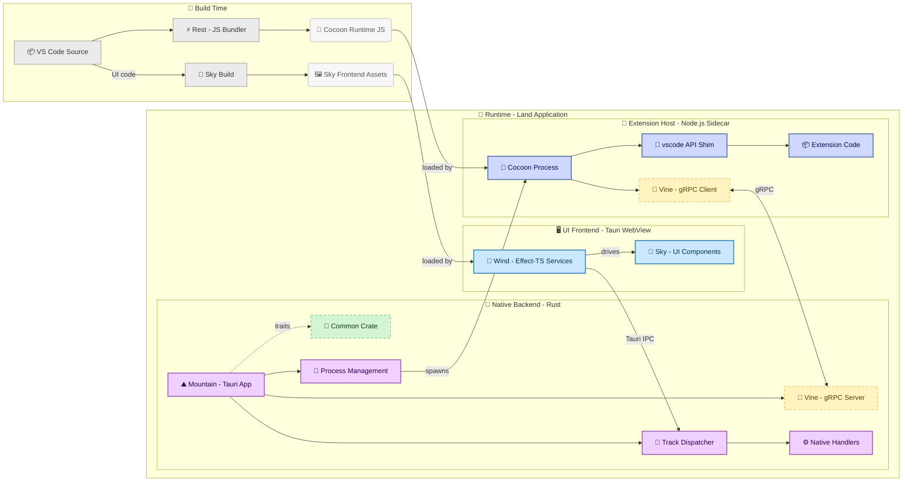

<table>
	<tr>
		<td align="left" valign="middle">
			<h3 align="left">
				<a href="https://Editor.Land" target="_blank">
					<picture>
						<source media="(prefers-color-scheme: dark)" srcset="https://PlayForm.Cloud/Dark/Image/GitHub/Land.svg">
						<source media="(prefers-color-scheme: light)" srcset="https://PlayForm.Cloud/Image/GitHub/Land.svg">
						
					</picture>
				</a>
			</h3>
		</td>
		<td align="left" valign="middle">
			<h3 align="left">
				<a href="https://Editor.Land" target="_blank">Land&#x2001;🏞️</a>
			</h3>
		</td>
		<td align="left" valign="middle">
			<h3 align="left">&#x2001;+&#x2001;</h3>
		</td>
		<td align="left" valign="middle" width="190">
			<h3 align="left">
				<a href="https://Tauri.App" target="_blank">
					<picture>
						<source media="(prefers-color-scheme: dark)" srcset="https://PlayForm.Cloud/Dark/Image/GitHub/Made/Tauri.svg">
						<source media="(prefers-color-scheme: light)" srcset="https://PlayForm.Cloud/Image/GitHub/Made/Tauri.svg">
						
					</picture>
				</a>
			</h3>
		</td>
	</tr>
</table>

---

# **Land**&#x2001;🏞️

The Code Editor built on `Tauri` + `Rust` + `Effect-TS` - replacing Electron piece by piece.

> **`VS Code` runs on `Electron`.** That means a bundled `Chromium` browser, a `Node.js`
> runtime, and a single-threaded extension host. Open a medium project: 500 MB
> to 1.5 GB of RAM. Extensions compete on one thread. Updates kill your
> terminals. The RAM is never returned.

[](https://github.com/CodeEditorLand/Land/tree/Current/LICENSE)

`Land` replaces `VS Code`'s `Electron` stack piece by piece with fifteen independent
elements. `Rust` and `Tauri` replace `Chromium` and `Node.js`. `Effect-TS` fibers replace
`Promise` chains. Typed `Tauri` IPC replaces `Node`'s untyped JSON pipe. The result:
the same `VS Code` extension API surface on a leaner native substrate - less RAM,
faster cold start, and structured concurrency that `VS Code`'s single-threaded
extension host cannot offer.

📖&#x2001;[Documentation](https://editor.land/Doc)&#x2001;📦&#x2001;[Download](https://editor.land/Download)&#x2001;🔧&#x2001;[Rust API](https://editor.land/Doc/Rust)

---

## Why Land Exists&#x2001;📊

| Pain                  | `VS Code` (Electron)               | `Land` (Tauri + Effect-TS)                                        |
| :-------------------- | :--------------------------------- | :---------------------------------------------------------------- |
| RAM per window        | 300-400 MB idle                    | Substantially less - no bundled `Chromium`, uses OS `WebView`     |
| Cold start            | 2-4 s                              | Faster - no `Chromium` init; target <200 ms, not yet benchmarked  |
| Extension blocking    | One hung `Promise` freezes all     | Each fiber is independently interruptible                         |
| IPC                   | Untyped JSON pipe                  | Typed `Tauri` IPC → `Rust` handlers; `gRPC` (`Vine`) for `Cocoon` |
| Extension isolation   | Shared process, no boundary        | Supervised fiber scopes (`Grove`: WASM sandbox, in progress)      |
| Updates               | Full restart, kills terminals      | Pre-staged by `Air` between sessions                              |
| Telemetry             | Config toggle, code paths remain   | Compile flag: code paths do not exist when off                    |
| Distributable size    | 90-150 MB                          | ~3-8 MB - no bundled browser                                      |
| License               | MIT (with restrictions)            | CC0 public domain, no restrictions                                |

---

## What It Does&#x2001;🔐

- **`VS Code` extension API compatibility.** `Cocoon` intercepts `require`/`import`
  and routes `VS Code` API calls through `Effect-TS` fibers. Core APIs are
  implemented; the full surface is an ongoing target as the extension host matures.
- **No bundled browser.** `Mountain` replaces `Chromium` with the OS's own `WebView`
  (`WebView2` on Windows, `WKWebView` on macOS, `WebKitGTK` on Linux). No 300 MB base
  footprint.
- **Structured concurrency, not just async.** `Effect-TS` fibers can be
  interrupted, raced, and supervised. Extensions that block in `VS Code` can run
  concurrently in `Land`.
- **Typed at the wire.** `Wind` uses `Tauri` IPC to communicate with `Mountain`'s `Rust`
  handlers. `Vine` starts every `gRPC` interface as a `.proto` file - change a
  message field and every consumer breaks at compile time, not in production.
- **Always up to date, never interrupted.** `Air` pre-downloads and PGP-verifies
  the next version between sessions. No "Restart to Update" prompt.
- **CC0, no restrictions.** Fork it. Ship it. Build commercial products on it.
  No attribution required.

---

## Architecture&#x2001;🏗️

| Element                  | Role                                                         | Technology                   |
| :----------------------- | :----------------------------------------------------------- | :--------------------------- |
| [`Common`][Common]       | Abstract traits, `ActionEffect` system, DTOs                 | `Rust`                       |
| [`Mountain`][Mountain]   | Native backend: windows, files, processes, `gRPC` server     | `Rust`, `Tauri` 2.0          |
| [`Cocoon`][Cocoon]       | Extension host: `VS Code` API on `Effect-TS` fibers          | `TypeScript`, `Node.js`      |
| [`Wind`][Wind]           | Workbench services: `Effect-TS` Layers over `Tauri` IPC      | `TypeScript`, `Effect-TS`    |
| [`Sky`][Sky]             | UI components: `Astro`, instant hot-reload in `Tauri`        | `TypeScript`, `Astro`        |
| [`Air`][Air]             | Background daemon: pre-staged updates, PGP verification      | `Rust`                       |
| [`Echo`][Echo]           | Work-stealing scheduler across all CPU cores                 | `Rust`                       |
| [`Vine`][Vine]           | `gRPC` protocol: typed contracts from `.proto` files         | `Protobuf`, `Rust`           |
| [`Grove`][Grove]         | WASM sandbox: capability-based extension isolation           | `Rust`, `WASMtime`           |
| [`Mist`][Mist]           | DNS sandbox: local `*.editor.land` resolution                | `Rust`                       |
| [`Rest`][Rest]           | OXC-powered `TypeScript` compiler, 2-3× faster than `esbuild`| `Rust`, `OXC`                |
| [`Output`][Output]       | Deterministic build artifacts with checksum verification     | `JavaScript`                 |
| [`SideCar`][SideCar]     | `Node.js` binary distribution per target triple              | `Rust`                       |
| [`Worker`][Worker]       | Service Worker: auth encryption, offline support             | `TypeScript`                 |
| [`Maintain`][Maintain]   | Build orchestrator: `Rhai` scripting, deterministic output   | `Rust`, `Rhai`               |

---

## System Architecture&#x2001;🗺️


```mermaid
graph LR
    classDef mountain fill:#f0d0ff,stroke:#9b59b6,stroke-width:2px,color:#2c0050;
    classDef cocoon   fill:#d0d8ff,stroke:#4a6fa5,stroke-width:2px,color:#001050;
    classDef wind     fill:#cce8ff,stroke:#2980b9,stroke-width:2px,color:#00304a;
    classDef common   fill:#d4f5d4,stroke:#27ae60,stroke-width:1px,stroke-dasharray:5 5,color:#0a3a0a;
    classDef ipc      fill:#fff3c0,stroke:#f39c12,stroke-width:1px,stroke-dasharray:5 5,color:#5a3e00;
    classDef build    fill:#ebebeb,stroke:#888,color:#333;
    classDef data     fill:#f7f7f7,stroke:#aaa,color:#555;

    subgraph "🔨 Build Time"
        direction LR
        VSCodeSource["📦 VS Code Source"]:::build
        RestBuild["⚡ Rest - JS Bundler"]:::build
        CocoonBundleJS("📄 Cocoon Runtime JS"):::data
        SkyBuildProcess["🌌 Sky Build"]:::build
        SkyAssets("🖼️ Sky Frontend Assets"):::data

        VSCodeSource --> RestBuild
        VSCodeSource -- UI code --> SkyBuildProcess
        RestBuild --> CocoonBundleJS
        SkyBuildProcess --> SkyAssets
    end

    subgraph "🚀 Runtime - Land Application"
        subgraph "🦀 Native Backend - Rust"
            Mountain["⛰️ Mountain - Tauri App"]:::mountain
            CommonCrate["📐 Common Crate"]:::common
            TrackDispatcher["🔀 Track Dispatcher"]:::mountain
            VineGRPCServer["🌿 Vine - gRPC Server"]:::ipc
            NativeHandlers["⚙️ Native Handlers"]:::mountain
            ProcessMgmt["🔧 Process Management"]:::mountain

            Mountain --> TrackDispatcher
            TrackDispatcher --> NativeHandlers
            Mountain -. traits .-> CommonCrate
            Mountain --> VineGRPCServer
            Mountain --> ProcessMgmt
        end

        subgraph "🖥️ UI Frontend - Tauri WebView"
            WindServices["🍃 Wind - Effect-TS Services"]:::wind
            SkyUI["🌌 Sky - UI Components"]:::wind
            WindServices -- drives --> SkyUI
        end

        subgraph "🧩 Extension Host - Node.js Sidecar"
            Cocoon["🦋 Cocoon Process"]:::cocoon
            VineGRPCClient["🌿 Vine - gRPC Client"]:::ipc
            VSCodeAPI["🔌 vscode API Shim"]:::cocoon
            Extension["📦 Extension Code"]:::cocoon

            Cocoon --> VineGRPCClient
            Cocoon --> VSCodeAPI
            VSCodeAPI --> Extension
        end

        ProcessMgmt -- spawns --> Cocoon
        WindServices -- Tauri IPC --> TrackDispatcher
        VineGRPCClient <-- gRPC --> VineGRPCServer
    end

    CocoonBundleJS -- loaded by --> Cocoon
    SkyAssets -- loaded by --> WindServices
```

---

## Architectural Workflows&#x2001;📄

Detailed `Mermaid`-diagrammed workflows live in
[`Documentation/GitHub/Workflow.md`](https://github.com/CodeEditorLand/Land/tree/Current/Documentation/GitHub/Workflow.md):

1. **Application Startup & Handshake** - `Mountain` launches, spawns `Cocoon`, establishes `gRPC` connection
2. **Opening a File** - UI click through `Wind` → `Mountain` → disk and back
3. **Language Features** - Bidirectional: `Cocoon` registers provider, `Mountain` proxies requests
4. **Save Participants** - Extensions modify files via `gRPC` before `Mountain` writes to disk
5. **Command Palette** - Unified dispatch to native `Rust` handlers or proxied extension commands
6. **Webview Panels** - Full lifecycle of extension-contributed UI
7. **Integrated Terminal** - Native PTY via `portable-pty`, `xterm.js` wired and working
8. **SCM / Git** - `Cocoon`'s Git extension uses `Mountain` to spawn native `git` processes
9. **User Data Sync** - Auth, fetch, three-way merge, apply, notify
10. **Extension Tests** - Isolated "Extension Development Host" for test execution

---

## Getting Started&#x2001;🚀

```sh
# Clone with submodules
git clone --depth 2 ssh://git@github.com/CodeEditorLand/Land.git

# 1. In ./Land/ - initialize Element submodule
git submodule update --init Element

# 2. In ./Land/Element - initialize all Element submodules
git submodule update --init

# 3. In ./Land/ - initialize Dependency submodule
git submodule update --init Dependency

# 4. In ./Land/Dependency/ - initialize Microsoft dependencies
git submodule update --init Microsoft

# 5. In ./Land/Dependency/Microsoft - initialize Dependency
git submodule update --init Dependency

# 6. In ./Land/Dependency/Microsoft/Dependency - initialize VS Code source
git submodule update --init --depth 2 Editor
```

### Build & Run&#x2001;🔨

```sh
# Install JavaScript dependencies
pnpm install

# Build all TypeScript/JS packages
pnpm run prepublishOnly

# Build Rust workspace
cargo build

# Run the application
pnpm run Run
```

---

## Live Deployments&#x2001;🌐

| Service                  | URL                                                                                                       |
| :----------------------- | :-------------------------------------------------------------------------------------------------------- |
| Website                  | [editor.land](https://editor.land)                                                                        |
| Status                   | [Status.Editor.Land](https://Status.Editor.Land)                                                          |
| Rust API: `Mountain`     | [Rust.Documentation.Mountain.Editor.Land](https://Rust.Documentation.Mountain.Editor.Land)                |
| Rust API: `Common`       | [Rust.Documentation.Common.Editor.Land](https://Rust.Documentation.Common.Editor.Land)                    |
| Rust API: `Echo`         | [Rust.Documentation.Echo.Editor.Land](https://Rust.Documentation.Echo.Editor.Land)                        |
| Rust API: `Air`          | [Rust.Documentation.Air.Editor.Land](https://Rust.Documentation.Air.Editor.Land)                          |
| Rust API: `SideCar`      | [Rust.Documentation.SideCar.Editor.Land](https://Rust.Documentation.SideCar.Editor.Land)                  |
| Rust API: `Rest`         | [Rust.Documentation.Rest.Editor.Land](https://Rust.Documentation.Rest.Editor.Land)                        |
| Rust API: `Maintain`     | [Rust.Documentation.Maintain.Editor.Land](https://Rust.Documentation.Maintain.Editor.Land)                |
| Rust API: Workspace      | [Rust.Documentation.Land.Editor.Land](https://Rust.Documentation.Land.Editor.Land)                        |
| Knowledge Base           | [Knowledge.Editor.Land](https://Knowledge.Editor.Land)                                                    |
| Auth Worker              | [codeeditorland-auth.playform.workers.dev](https://codeeditorland-auth.playform.workers.dev)              |
| Download Worker          | [codeeditorland-download.playform.workers.dev](https://codeeditorland-download.playform.workers.dev)      |
| Status Worker            | [codeeditorland-status.playform.workers.dev](https://codeeditorland-status.playform.workers.dev)          |
| Analytics Worker         | [codeeditorland-analytics.playform.workers.dev](https://codeeditorland-analytics.playform.workers.dev)    |

---

## License&#x2001;⚖️

CC0 1.0 Universal. Public domain. No restrictions.
[`LICENSE`](https://github.com/CodeEditorLand/Land/tree/Current/LICENSE)

---

## Changelog&#x2001;📜

See [`CHANGELOG.md`](https://github.com/CodeEditorLand/Land/tree/Current/CHANGELOG.md)
for a history of changes.

---

[Air]: https://github.com/CodeEditorLand/Air
[Cocoon]: https://github.com/CodeEditorLand/Cocoon
[Common]: https://github.com/CodeEditorLand/Common
[Echo]: https://github.com/CodeEditorLand/Echo
[Editor]: https://github.com/CodeEditorLand/Editor
[Grove]: https://github.com/CodeEditorLand/Grove
[Maintain]: https://github.com/CodeEditorLand/Maintain
[Mist]: https://github.com/CodeEditorLand/Mist
[Mountain]: https://github.com/CodeEditorLand/Mountain
[Output]: https://github.com/CodeEditorLand/Output
[Rest]: https://github.com/CodeEditorLand/Rest
[SideCar]: https://github.com/CodeEditorLand/SideCar
[Sky]: https://github.com/CodeEditorLand/Sky
[Vine]: https://github.com/CodeEditorLand/Vine
[Wind]: https://github.com/CodeEditorLand/Wind
[Worker]: https://github.com/CodeEditorLand/Worker

## Funding \& Acknowledgements&#x2001;🙏🏻

**Land**&#x2001;🏞️ is proud to be an open-source endeavor, significantly
supported by organizations that believe in the future of open-source software.

This project is funded through
[NGI0 Commons Fund](https://NLnet.NL/commonsfund), a fund established by
[NLnet](https://NLnet.NL) with financial support from the European Commission's
[Next Generation Internet](https://ngi.eu) program. Learn more at the
[NLnet project page](https://NLnet.NL/project/Land).

<table>
	<thead>
		<tr>
			<th align="left"><strong>Land</strong></th>
			<th align="left"><strong>PlayForm</strong></th>
			<th align="left"><strong>NLnet</strong></th>
			<th align="left"><strong>NGI0 Commons Fund</strong></th>
		</tr>
	</thead>
	<tbody>
		<tr>
			<td align="left" valign="middle">
				<a href="https://Editor.Land">
					
				</a>
			</td>
			<td align="left" valign="middle">
				<a href="https://PlayForm.Cloud">
					
				</a>
			</td>
			<td align="left" valign="middle">
				<a href="https://NLnet.NL">
					
				</a>
			</td>
			<td align="left" valign="middle">
				<a href="https://NLnet.NL/commonsfund">
					
				</a>
			</td>
		</tr>
	</tbody>
</table>

### Technology Acknowledgements&#x2001;🙌🏻

This project would not be possible without the incredible work of the
open-source community. We are especially grateful for:

- [**Tauri**](https://tauri.app/) - secure, performant, resource-efficient framework for native desktop apps with a web frontend.
- [**Microsoft Visual Studio Code**](https://github.com/microsoft/vscode) - open-sourced workbench UI and platform code that provides the foundation for our UI and extension host compatibility.
- [**Effect-TS**](https://www.effect.website/) - robust, type-safe structured concurrency and dependency management in `TypeScript`.
- [**Rust**](https://www.rust-lang.org/) - performance, safety, and modern tooling powering the entire native backend.
- [**Tokio**](https://tokio.rs/) & [**Tonic**](https://github.com/hyperium/tonic) - async runtime and `gRPC` framework backbone of high-performance IPC.
- [**Astro**](https://astro.build/) - content-driven approach for the fast, modern `Sky` UI.
- [**xterm.js**](https://xtermjs.org/) - terminal emulator powering the integrated terminal, with fixes contributed upstream from `Land`.
- [**portable-pty**](https://github.com/wez/wezterm/tree/main/pty) - cross-platform PTY backend driving the integrated terminal in `Mountain`.
- [**PNPM**](https://pnpm.io/) - efficient, reliable `JavaScript` dependency management.
- and many more… <!-- TODO: full list -->

We extend our sincere gratitude to all maintainers and contributors. ❤️

---

**Project Maintainers**: Source Open
([Source/Open@Editor.Land](mailto:Source/Open@Editor.Land)) |
[GitHub Repository](https://github.com/CodeEditorLand/Land) |
[Report an Issue](https://github.com/CodeEditorLand/Land/issues) |
[Security Policy](https://github.com/CodeEditorLand/Land/security/policy)
