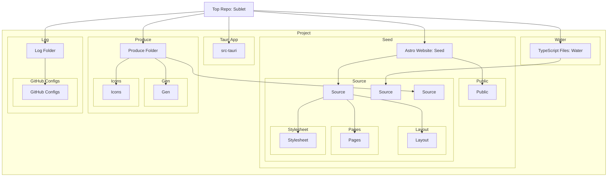

# 🏙️ [Sublet] —

## Installation

Clone the repository:

```sh
git clone ssh://git@github.com/CodeEditorLand/Sublet.git --depth=1 --recurse-submodules --shallow-submodules
```

Install the necessary dependencies using `PNPM`:

```sh
pnpm install
```

Build the Editor:

```sh
cargo tauri build
```



[Sublet]: https://github.com/CodeEditorLand/Sublet
